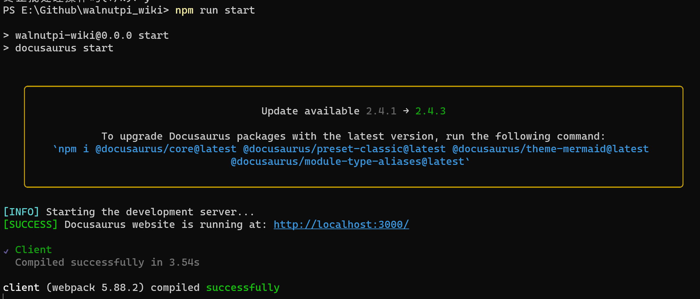
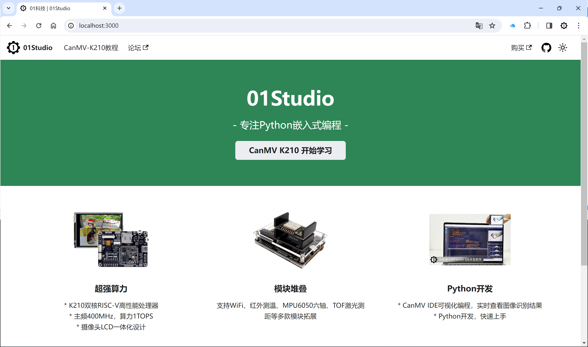

# 01Studio教程文档

## 官方网站

[https://wiki.01studio.cc](https://wiki.01studio.cc)

## 贡献说明

本项目使用 [Docusaurus](https://docusaurus.io/) 构建。主要内容放在 `01studio_wiki/docs` 目录下，大家可以遵循我们的文档格式提交教程贡献。

### 安装Node.js

* [Node.js](https://nodejs.org/en/download/)版本 16.14 或更高版本：
  * 安装 Node.js 时，建议您选中所有与依赖项相关的复选框。

### 下载项目

```
git clone https://github.com/01studio-lab/01studio_wiki.git
```

### 运行

```
cd 01studio_wiki
npm run start
```

`npm run start` 命令在本地构建您的网站并通过开发服务器提供服务，供您在 http://localhost:3000/ 上查看。





详细教程请看官方文档：[https://tutorial.docusaurus.io/docs/intro/](https://tutorial.docusaurus.io/docs/intro/)