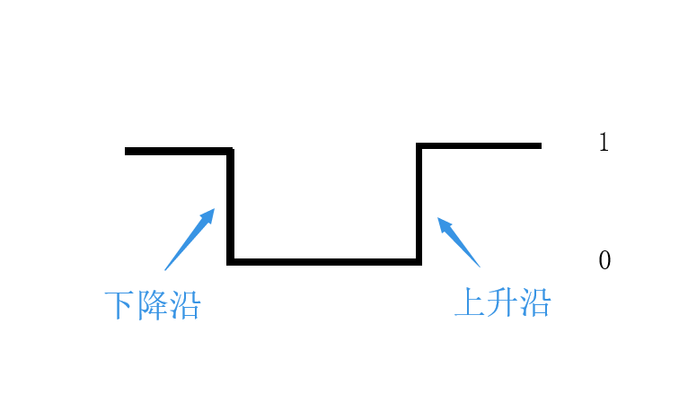
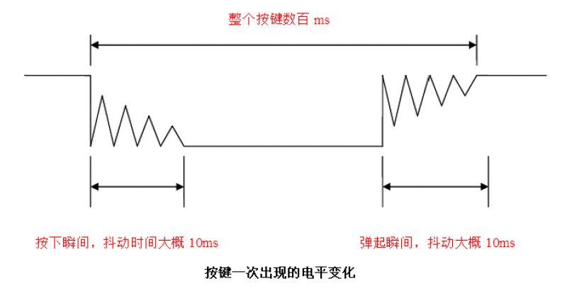
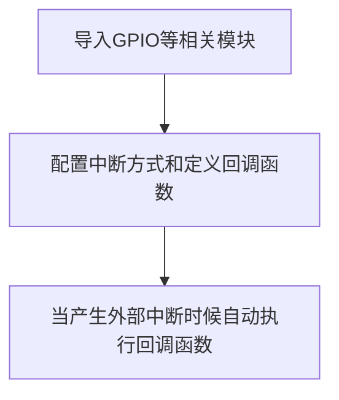
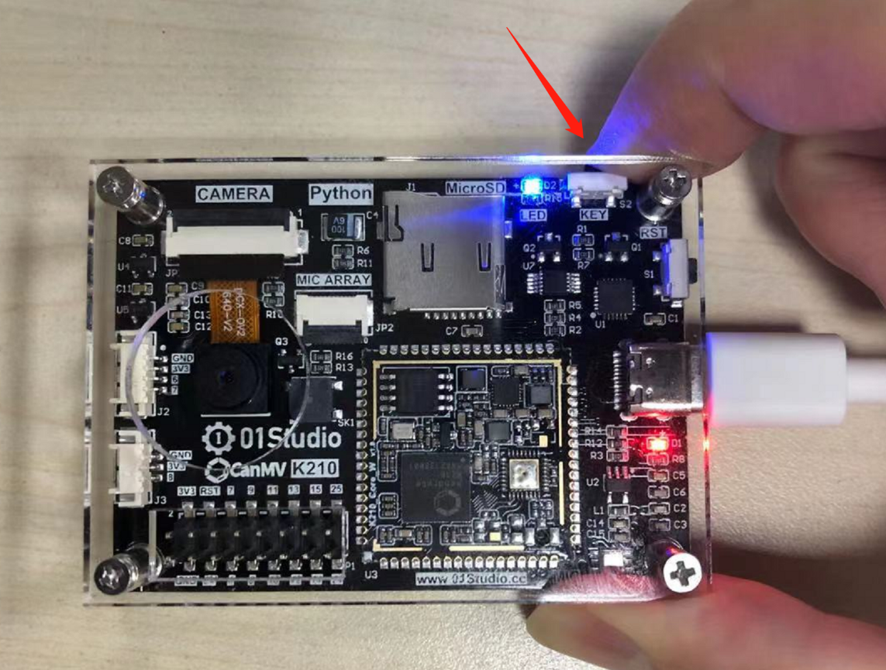

# 外部中断

## 前言

前面我们在做普通的按键（GPIO）时候，虽然能实现IO口输入输出功能，但代码是一直在检测IO输入口的变化，因此效率不高，特别是在一些特定的场合，比如某个按键，可能1天才按下一次去执行相关功能，这样我们就浪费大量时间来实时检测按键的情况。

为了解决这样的问题，我们引入外部中断概念，顾名思义，就是当按键被按下(产生中断)时，我们才去执行相关功能。这大大节省了CPU的资源，因此中断的在实际项目的应用非常普遍。


## 实验目的
利用中断方式来检查按键KEY状态，按键被按下（产生外部中断）后使LED蓝灯的亮灭状态反转。

## 实验讲解
按键对应K210的IO在上一节已经讲过，为IO16。


外部中断也是通过GPIO模块来配置，我们先来看看其配构造函数和使用方法：

## GPIO对象

注册成功后我们就可以通过GPIO对象模块来控制外部IO，从而控制LED。GPIO对象说明如下：

### 构造函数
```python
GPIO(ID, MODE, PULL, VALUE)
```
GPIO对象。

- `ID` ：内部GPIO编号。
- `MODE`: GPIO模式：
    - `GPIO.IN` : 输入模式；
    - `GPIO.OUT` : 输出模式。
- `PULL`: GPIO模式：
    - `GPIO.PULL_UP` : 上拉；
    - `GPIO.PULL_DOWN` : 下拉。
    - `GPIO.PULL_NONE` : 无。
- `VALUE`: GPIO初始电平：
    - `1` : 高电平；
    - `0` : 低电平。


### 使用方法
```python
GPIO.value([value])
```
设置GPIO输出电平。**当IO被配置为输入模式且时候参数为空时，表示获取当前IO输入电平值。**
- `value`: 
    - `1` : 高电平；
    - `0` : 低电平。

<br></br>

```python
GPIO.irq(CALLBACK_FUNC,TRIGGER_CONDITION)
```
中断配置。
- `CALLBACK_FUNC`: 中断后执行的回调函数；
- `TRIGGER_CONDITION`: 中断触发方式：
    - `GPIO.IRQ_RISING` : 高电平；
    - `GPIO.IRQ_FALLING` : 低电平。
    - `GPIO.IRQ_BOTH` : 都触发。

<br></br>

```python
GPIO.disirq()
```
关闭中断。

更多用法请阅读官方文档：<br></br>
https://developer.canaan-creative.com/canmv/main/canmv/library/canmv/maix/maix.GPIO.html

<br></br>

我们先来了解一下上升沿和下降沿的概念，由于按键KEY引脚是通过按键接到GND，也就是我们所说的低电平“0”，所以当按键被按下再松开时，引脚先获得下降沿，再获得上升沿，如下图所示：


按键被按下时候可能会发生抖动，抖动如下图，有可能造成误判，因此我们需要使用延时函数来进行消抖：


我们可以选择下降沿方式触发外部中断，也就是当按键被按下的时候立即产生中断。需要注意的是K210只有高速GPIO才有外部中断，GPIO常量表如下：
- 普通GPIO: GPIO0 - GPIO7
- 高速GPIO: GPIOHS0 - GPIOHS31

中断编程思路跟GPIO按键章节类似，在初始化中断后，当系统检测到外部中断时候，执行LED状态反转的代码即可。流程图如下：



## 参考代码

```python
'''
实验名称：外部中断
版本： v1.0
日期： 2022.9
作者： 01Studio
说明：通过按键改变 LED 的亮灭状态（外部中断方式）
'''

from maix import GPIO
from fpioa_manager import fm
import utime

#注册IO，注意高速GPIO口才有中断
fm.register(35, fm.fpioa.GPIO0)
fm.register(16, fm.fpioa.GPIOHS0)

#构建lED和KEY对象
LED_B=GPIO(GPIO.GPIO0,GPIO.OUT,value=1)
KEY=GPIO(GPIO.GPIOHS0, GPIO.IN, GPIO.PULL_UP)

#LED状态表示
state = 1

#中断回调函数
def fun(KEY):
    global state
    utime.sleep_ms(10) #消除抖动
    if KEY.value()==0: #确认按键被按下
        state = not state
        LED_B.value(state)

#开启中断，下降沿触发
KEY.irq(fun, GPIO.IRQ_FALLING)

while True:

    pass

```

## 实验结果

可以看到每次按下按键KEY时候，LED蓝灯的亮灭状态翻转。



从参考代码来看，只是用了几行代码就实现了实验功能，而且相对于使用while True实时检测函数来看，代码的效率大大增强。外部中断的应用非常广，除了普通的按键输入和电平检测外，很大一部分输入设备，比如传感器也是通过外部中断方式来实时检测，从而提供CPU的利用率。