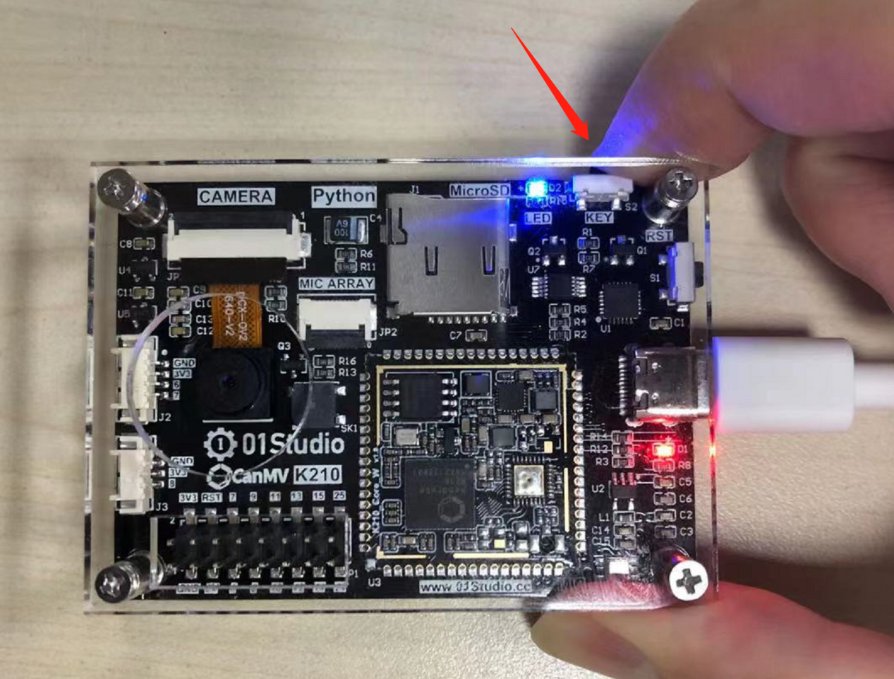
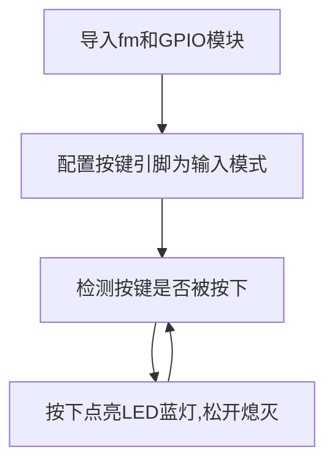

# 按键

## 前言
按键是最简单也最常见的输入设备，很多产品都离不开按键，包括早期的iphone，今天我们就来学习一下如何使用MicroPython来编写按键程序。有了按键输入功能，我们就可以做很多好玩的东西了。

## 实验目的
学习MicroPython编程实现按键输入检测。

## 实验讲解

功能按键KEY位于开发板下图所示位置：



我们先来看看CanMV K210的原理图，找到按键对应的外部IO引脚。


从原理图可以看到，按键KEY的一端连接到K210的外部IO16，另一端连接到GND。所以按键在没按下时候输入高电平（1），按下时候输入低电平（0）。

和前面LED一样，按键的输入检测也是用到fm和GPIO对象模块，具体如下：

## fm对象

使用fm对象绑定GPIO：

### 构造函数
```python
from fpioa_manager import fm
```

- fm位于fpioa_manager下，直接import使用。

### 使用方法
```python
fm.register(pin,func,force=False)
```
注册IO：
- `pin` ：芯片外部IO。
- `func` ：芯片功能。
- `force`: 强制分配。
    - `True` : 强制注册，清除之前注册记录；
    - `False` : 不允许引脚多次注册。

例：**fm.register(12, fm.fpioa.GPIO0,force=True) ** 表示将外部IO12注册到内部GPIO0


更多用法请阅读官方文档：<br></br>
https://www.kendryte.com/canmv/main/canmv/library/canmv/built-in/fpioa_manager.html#fm

## GPIO对象

注册成功后我们就可以通过GPIO对象模块来控制外部IO，从而控制LED。GPIO对象说明如下：

### 构造函数
```python
GPIO(ID, MODE, PULL, VALUE)
```
GPIO对象。

- `ID` ：内部GPIO编号。
- `MODE`: GPIO模式：
    - `GPIO.IN` : 输入模式；
    - `GPIO.OUT` : 输出模式。
- `PULL`: GPIO模式：
    - `GPIO.PULL_UP` : 上拉；
    - `GPIO.PULL_DOWN` : 下拉。
    - `GPIO.PULL_NONE` : 无。
- `VALUE`: GPIO初始电平：
    - `1` : 高电平；
    - `0` : 低电平。


### 使用方法
```python
GPIO.value([value])
```
设置GPIO输出电平。
- `value`: 
    - `1` : 高电平；
    - `0` : 低电平。

**当IO被配置为输入模式且时候参数为空时，表示获取当前IO输入电平值。**

更多用法请阅读官方文档：<br></br>
https://www.kendryte.com/canmv/main/canmv/library/canmv/maix/maix.GPIO.html

<br></br>

GPIO对象使用非常简单，我们将按键即外部“IO16”引脚配置成输入，实现当检测到按键被按下时候点亮LED蓝灯，松开时关闭LED蓝灯来做指示。代码编写流程如下：



## 参考代码

```python
'''
实验名称： 按键
版本： v1.0
日期： 2019.12
作者： 01Studio
社区： www.01studio.cc
'''
from maix import GPIO
from fpioa_manager import fm

#注册IO，蓝灯-->IO35,KEY-->IO16
fm.register(35, fm.fpioa.GPIO0)
fm.register(16, fm.fpioa.GPIO1)

#初始化IO
LED_B = GPIO(GPIO.GPIO0, GPIO.OUT)
KEY = GPIO(GPIO.GPIO1, GPIO.IN)

while True:

    if KEY.value()==0: #按键被按下接地
        LED_B.value(0) #点亮LED_B,蓝灯
    else:
        LED_B.value(1) #熄灭LED
```

## 实验结果

运行代码，可以看到当按键KEY被按下时候，LED蓝灯点亮，松开时熄灭。


GPIO是非常通用的功能，学会了GPIO，就可以把开发板所有的引脚为自己所用，灵活性很强。