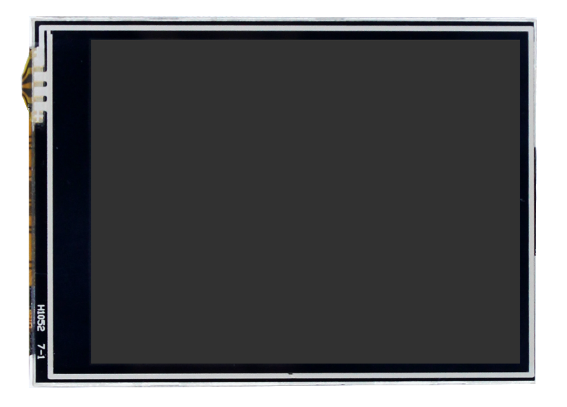
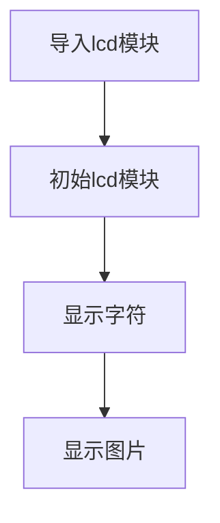
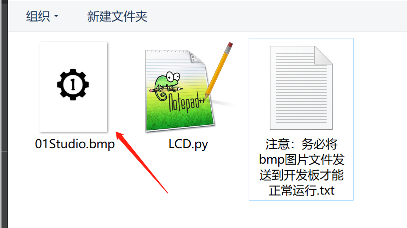
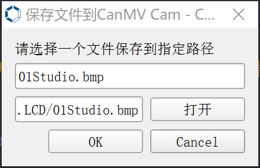
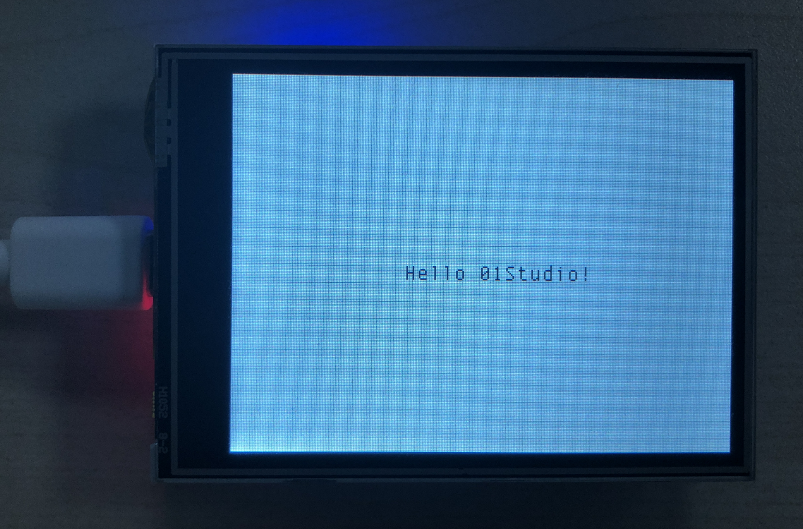
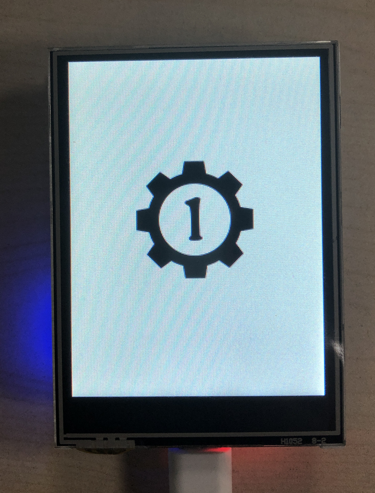

# LCD显示屏

## 前言
LCD液晶显示屏是非常常见的一个外接显示设备，我们看到的手持设备、小型电器，很多都用到LCD，部分配合触摸屏应用，能实现非常多的功能。
除此之外，LCD还是CanMV K210机器视觉应用中显示的重要工具。


## 实验目的
通过MicorPython编程了解LCD的使用方法。

## 实验讲解

我们先来看看实验所使用LCD的参数介绍：



|  参数说明 |
|  :---:  | :---:  |
| 供电电压  | 3.3V |
| 屏幕尺寸  | 2.8寸|
| 颜色参数  | TFT彩色 |
| 液晶驱动  | ST7789V |
| 触摸方式  | 电阻触摸(NS2009) |
| 通讯方式  | 8位并口总线 |


本实验用的LCD是2.8寸，驱动是常见的ST7789V，使用8位接口跟CanMV K210通信，按以往嵌入式C语言开发，我们需要对ST7789进行编程实现驱动，然后再建立各种字符显示及显示图片等函数。

使用MicroPython其实也需要做以上工作，但由于可读性和移植性强的特点，我们只需要搞清各个对象函数使如何使用即可。总的来说和之前一样，有构造函数和功能函数。构造函数解决的是初始化问题，告诉CanMV K210外设是怎么接线，是什么样的；而功能函数解决的则是使用问题，我们基于自己的需求直接调用相关功能函数，实现自己的功能即可！

我们管这些函数的集合叫驱动，MicroPytho驱动写好了，我们学会如何使用即可。其构造函数和使用方法如下：


## lcd对象

### 构造函数
```python
import lcd
```
使用import导入lcd模块。

### 使用方法

```python
lcd.init(type=1,freq=15000000,color=lcd.BLACK)
```
初始化LCD。
- `type`: LCD类型；
- `freq`: 通信频率;
- `color`: LCD初始化的颜色。

<br></br>

```python
lcd.clear(color)
```
填充指定颜色。默认是黑色

<br></br>

```python
lcd.draw_string(x,y,str,color,bg_color)
```
写字符。
- `x,y`: 起始坐标；
- `str`: 字符内容；
- `color`: 字体颜色；
- `bg_color`: 字体背景颜色；

<br></br>

```python
lcd.display(image,roi=Auto)
```
显示图片。
- `image`: RGB565或GRAYSCALE图片。
- `ROI`: 显示的感兴趣区域，未指定则为图像大小。

<br></br>

```python
lcd.rotation(dir)
```
LCD屏幕方向设定。
- `dir`: 取值范围[0-3]，从0到3依顺时钟旋转。

<br></br>

```python
lcd.mirror(invert)
```
镜像显示。
- `invert`:参数说明：
    - `True`: 镜像显示：
    - `False`: 非镜像显示：

<br></br>

```python
lcd.deinit()
```
注销LCD驱动，释放IO引脚。

<br></br>

更多用法请阅读官方文档：<br></br>
https://www.kendryte.com/canmv/main/canmv/library/canmv/lcd.html

我们来跑一下其主要功能显示字符和图像，代码编写流程如下：



## 参考代码

```python
'''
实验名称：LCD
版本： v1.0
日期： 2022.12
作者： 01Studio
说明：编程实现LCD显示信息。需要将01Studio.bmp文件发送到开发板
'''

import lcd,image,utime

lcd.init() #初始化LCD
lcd.clear(lcd.WHITE) #清屏白色

#显示字符
lcd.draw_string(110, 120, "Hello 01Studio!",lcd.BLACK, lcd.WHITE) #显示字符

utime.sleep(3) #延时2秒

lcd.rotation(1) #由于图像默认是240*320，因此顺时钟旋转90°。

#显示图像，必须先将01Studio.bmp文件发送到开发板才能正常运行,否则会报错。
#发送方法：IDE菜单栏 -- 工具 --保存文件到开发板
lcd.display(image.Image("01Studio.bmp"))
```

## 实验结果

将示例程序文件夹中的“01Studio.bmp”文件通过发送到开发板。



通过 CanMV – 工具 –保存文件方式将图片发送到开发板。



运行程序，可以看到CanMV K210开发套件上的LCD先显示指定字符，再显示图片。



