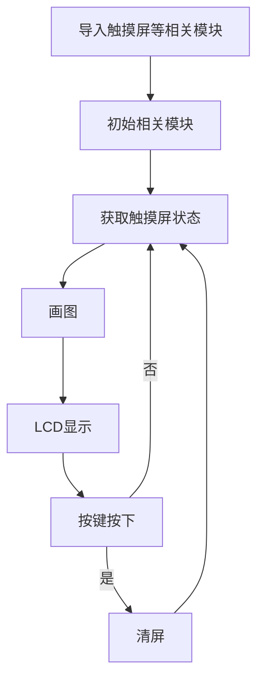
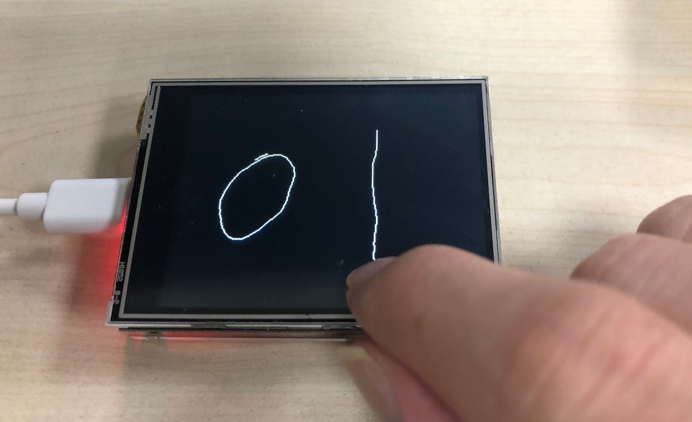

# 电阻触摸屏

## 前言
触摸屏是非常棒的人机交互方式。看早期的按键手机到现在已经全面被触摸屏取代。前面我们学习过来LCD的应用，但这是缺乏直接交互的，触摸屏很好地解决了人跟屏直接交互的问题。今天我们就来学习一下触摸屏的应用。

## 实验目的
编程实现触摸屏应用。画图并通过LCD显示。

## 实验讲解

配套的LCD触摸屏是电阻触摸屏，与电容屏不一样，电阻触摸屏是不支持多点触控的。还有部分场合需要校准。但由于其高性价比和使用简单，还是不少嵌入式系统选择使用电电阻屏。
本实验LCD触摸屏上使用NS2009芯片，将电阻触摸屏信号转化为I2C信号跟K210通信，而CanMV已经集成了触摸屏应用的相关函数模块，具体介绍如下：


## touchscreen对象

### 构造函数
```python
import touchscreen as ts
```
使用import导入touchscreen模块。

### 使用方法

```python
ts.init(i2c=None,cal=None)
```
初始化触摸屏。
- `i2c`: I2C总线；
- `cal`: 一个7个整型值的元组，触摸校准数据。

<br></br>

```python
ts.calibrate()
```
触摸校准。返回一个7个整型值的元组。

<br></br>

```python
ts.read()
```
读取屏幕状态和坐标信息。返回（status,x,y）。
- `status`: 触摸状态，首次运行返回0，开始触摸后返回下面取值：
    - `touchscreen.STATUS_RELEASE`: 值为1，松开；
    - `touchscreen.STATUS_PRESS`: 值为2，长按；
    - `touchscreen.STATUS_MOVE`: 值为3，滑动；
- `x`: x轴坐标
- `y`: y轴坐标

<br></br>

更多用法请阅读官方文档：<br></br>
https://developer.canaan-creative.com/canmv/main/canmv/library/canmv/touchscreen.html#touchscreen

从上表可以看到，通过MicroPython封装后的电阻触摸屏使用变得非常容易，另外加入一个按键KEY作为清屏功能，本节代码编程流程如下：



## 参考代码

```python
'''
实验名称：触摸屏应用
版本： v1.0
日期： 2022.9
翻译和注释： 01Studio
'''

#导入相关模块
from machine import I2C
from fpioa_manager import fm
from maix import GPIO
import lcd, image
import touchscreen as ts

#按键KEY用于清屏
fm.register(16, fm.fpioa.GPIO1, force=True)
btn_clear = GPIO(GPIO.GPIO1, GPIO.IN)

#触摸使用I2C控制（NS2009）
i2c = I2C(I2C.I2C0, freq=400000, scl=30, sda=31)

#触摸屏初始化
ts.init(i2c)
#ts.calibrate() #触摸校准

#LCD初始化
lcd.init()
lcd.clear()

#新建图像和触摸屏相关参数变量
img = image.Image()
status_last = ts.STATUS_IDLE
x_last = 0
y_last = 0
draw = False

while True:

    #获取触摸屏状态
    (status,x,y) = ts.read()
    print(status, x, y)

    #画图
    if draw:
        img.draw_line((x_last, y_last, x, y))

    #更新最后坐标
    x_last = x
    y_last = y

    #根据触摸屏状态判断是否继续执行画图功能
    if status_last!=status:
        if (status==ts.STATUS_PRESS or status == ts.STATUS_MOVE):
            draw = True
        else: #松开
            draw = False
        status_last = status

    #LCD显示
    lcd.display(img)

    #按键KEY按下清屏
    if btn_clear.value() == 0:
        img.clear()
```

## 实验结果

运行程序，在触摸屏上滑动，可以看到LCD画线显示。按下按键KEY后可以实现清屏。



有了触摸屏的应用，让开发板的人机交互变得更简单而有趣。