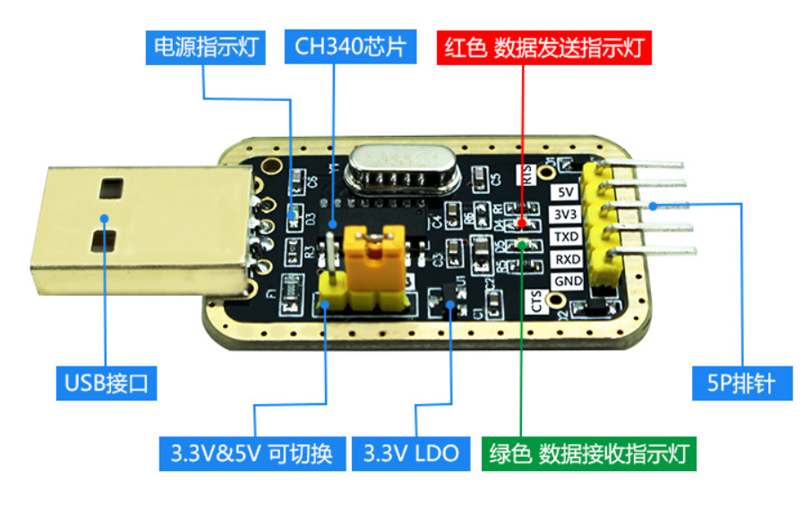
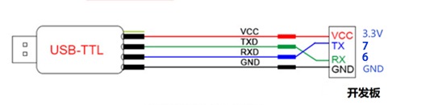
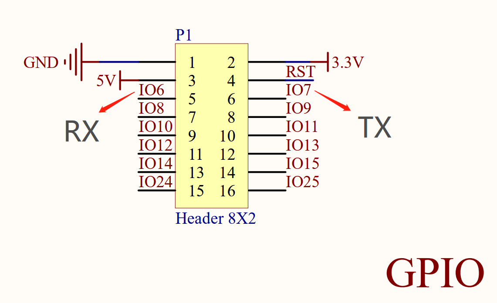
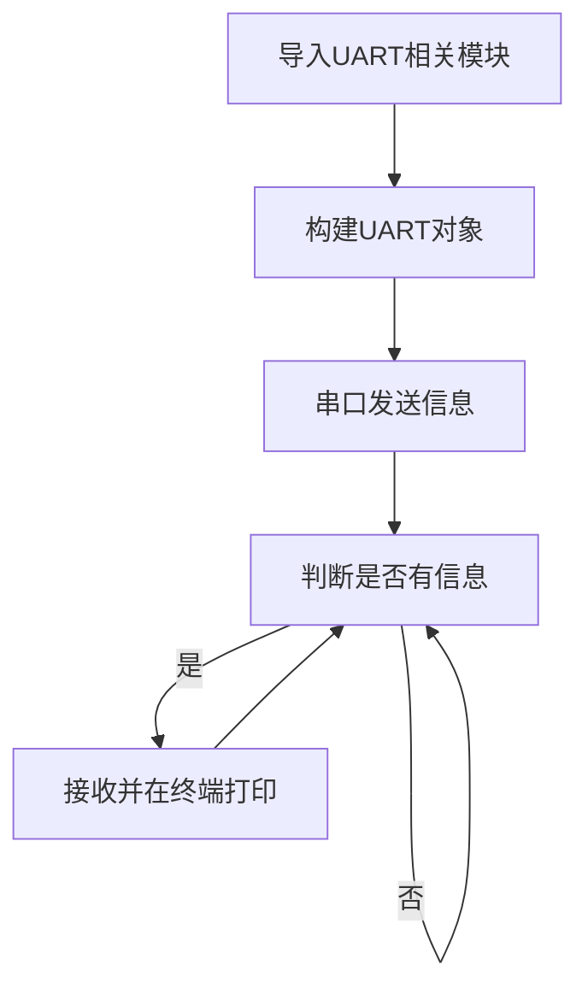
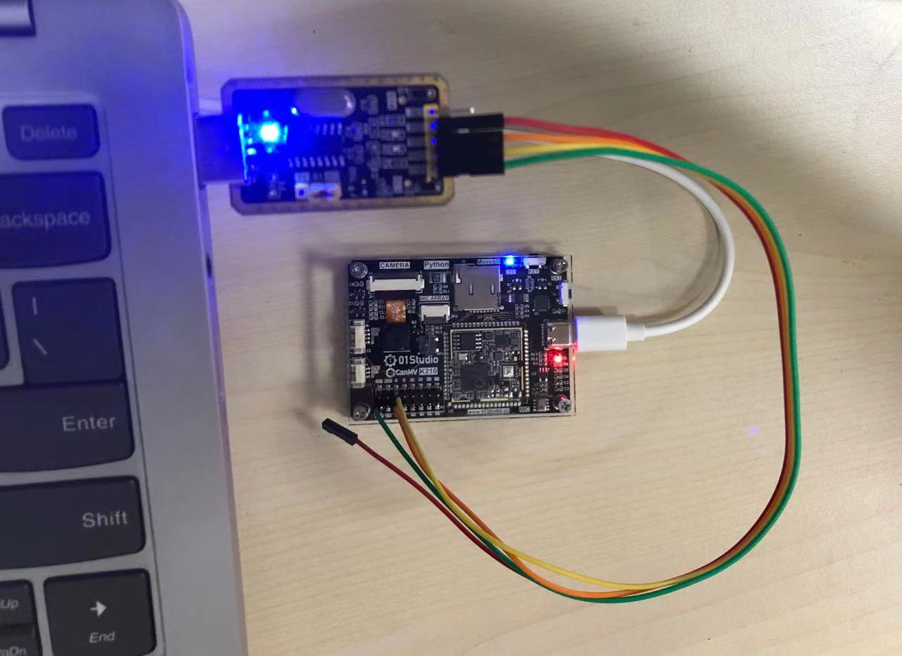
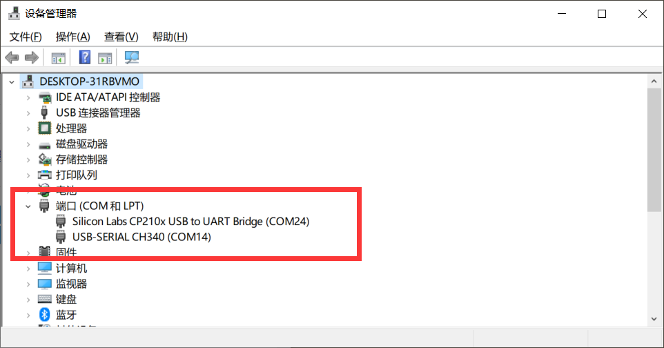
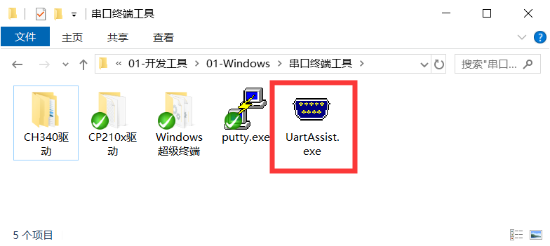
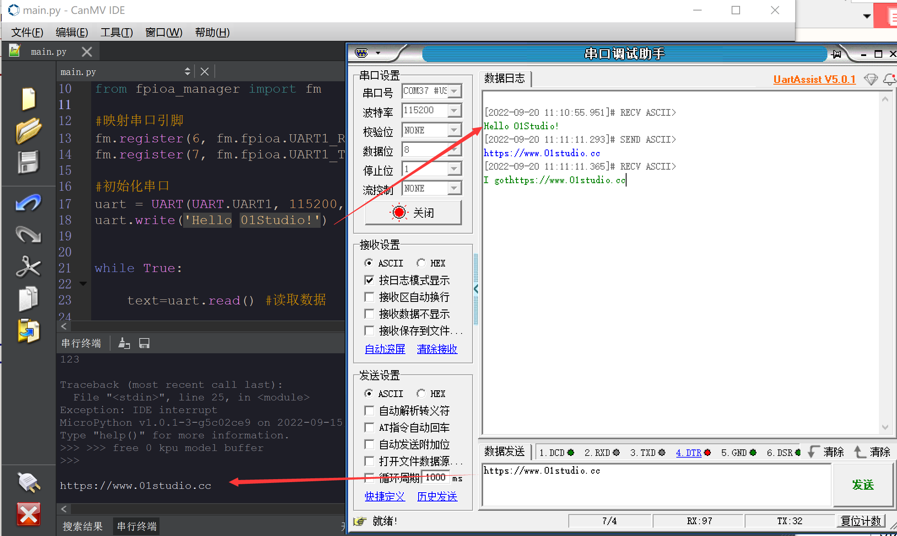

# UART（串口通讯）

## 前言
串口是非常常用的通信接口，有很多工控产品、无线透传模块都是使用串口来收发指令和传输数据，以及和其它开发板如STM32, ESP32, Arduio等带串口的开发板通讯，这样用户就可以在无须考虑底层实现原理的前提下将各类串口功能模块灵活应用起来。

## 实验目的
编程实现串口收发数据。

## 实验讲解

K210一共有3个串口，每个串口可以自由映射引脚。 例：
```python
# IO6--RX1，IO7--TX1
fm.register(6, fm.fpioa.UART1_RX, force=True)
fm.register(7, fm.fpioa.UART1_TX, force=True)
```

我们来了解一下CanMV串口对象的构造函数和使用方法：

## UART对象

### 构造函数
```python
machine.UART(uart,baudrate,bits,parity,stop,timeout, read_buf_len)
```
创建UART对象。

- `uart` ：串口编号，共3个可用：
    - `UART.UART1`: 串口1；
    - `UART.UART2`: 串口2；
    - `UART.UART3`: 串口3；

- `baudrate`：波特率，常用115200、9600;

- `bits` ：数据位，默认8;

- `parity` ：奇偶校验，默认None;
    - `UART.PARITY_EVEN`: 偶校验；
    - `UART.PARITY_ODD`: 奇校验；

- `stop`: 停止位，支持 1， 1.5, 2， 默认 1 。

- `timeout`: 串口接收超时时间。

- `read_buf_len`: 串口接收缓冲大小。

### 使用方法

```python
UART.read(num)
```
读取串口缓冲数据。
- `num`: 读取字节数量。

<br></br>

```python
UART.readline(num)
```
整行读取。
- `num`: 行数。

<br></br>

```python
UART.write(buf)
```
发送数据。
- `buf`: 需要发送的数据。

<br></br>

```python
UART.deinit()
```
注销串口。

更多用法请阅读官方文档：<br></br>
https://developer.canaan-creative.com/canmv/main/canmv/library/micropython/spec/machine.UART.html

<br></br>

我们可以用一个USB转TTL工具，配合电脑上位机串口助手来跟CanMV K210开发板进行通信测试。



注意要使用3.3V电平的USB转串口TTL工具，本实验我们使用CanMV的拓展引脚，引出的排针。接线示意图如下（交叉接线）：



从CanMV K210原理图可以看到外部IO6--RX ，IO7--TX。



在本实验中我们可以先初始化串口，然后给串口发去一条信息，这样PC机的串口助手就会在接收区显示出来，然后进入循环，当检测到有数据可以接收时候就将数据接收并打印，并通过REPL打印显示。代码编写流程图如下：




## 参考代码

```python
'''
实验名称：串口通信
版本： v1.0
日期： 2022.9
作者： 01Studio
说明：通过编程实现串口通信，跟电脑串口助手实现数据收发。
'''

from machine import UART,Timer
from fpioa_manager import fm

#映射串口引脚
fm.register(6, fm.fpioa.UART1_RX, force=True)
fm.register(7, fm.fpioa.UART1_TX, force=True)

#初始化串口
uart = UART(UART.UART1, 115200, read_buf_len=4096)
uart.write('Hello 01Studio!')


while True:

    text=uart.read() #读取数据

    if text: #如果读取到了数据
        print(text.decode('utf-8')) #REPL打印
        uart.write('I got'+text.decode('utf-8')) #数据回传
```

## 实验结果

我们按照上述方式将USB转TTL的TX接到IO6，RX接到IO7。GND接一起，3.3V可以选择接或不接。



这时候打开电脑的设备管理器，能看到2个COM。写着CH340的是串口工具，另外一个则是CanMV K210的REPL。如果CH340驱动没安装，则需要手动安装，驱动在：<u>配套资料包\开发工具\windows\串口终端\CH340文件夹</u> 下。



本实验要用到串口助手，打开配套资料包\开发工具\windows\串口终端工具下的【UartAssist.exe】软件。



将串口工具配置成COM14（根据自己的串口号调整）。波特率115200。运行程序，可以看到一开始串口助手收到CanMV K210上电发来的信息“Hello 01Studio!”。我们在串口助手的发送端输入“http://www.01studio.cc”， 点击发送，可以看到CanMV K210在接收到该信息后在REPL里面打印了出来。如下图所示：



通过本节我们学会了串口收发应用，CanMV K210拥有3个串口，因此可以接多个串口外设。从而实现更多的功能。
