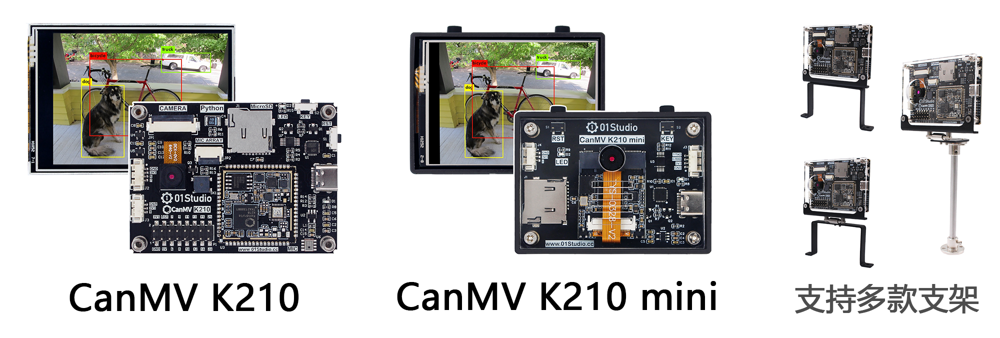

# 目录

- **CanMV K210开发套件**

    - [CanMV K210](./intro/canmv_k210.md)
    - [支架安装](./intro/bracket.md)
    - [资料下载](./intro/download.md)

- [**Python3基础知识**](./python_learn.md)

- **开发环境搭建**

    - [CanMV IDE开发软件安装](./getting_start/canmv_ide.md)
    - [串口驱动安装](./getting_start/driver.md)
    - [例程测试](./getting_start/demo.md)
    - [REPL串口交互](./getting_start/repl.md)
    - [文件系统](./getting_start/file_system.md)
    - [SD卡使用](./getting_start/sd.md)
    - [固件更新](./getting_start/firmware_update.md)

- **基础实验**

    - [点亮第一个LED](./basic_examples/led.md) 
    - [按键](./basic_examples/key.md) 
    - [外部中断](./basic_examples/exti.md) 
    - [定时器](./basic_examples/timer.md) 
    - [PWM(蜂鸣器)](./basic_examples/pwm_beep.md) 
    - [UART(串口通讯)](./basic_examples/uart.md) 
    - [thread(线程)](./basic_examples/thread.md) 
    - [LCD显示屏](./basic_examples/lcd.md) 
    - [电阻触摸屏](./basic_examples/touchscreen.md) 

- **机器视觉**

    - [摄像头](./machine_vision/camera.md) 
    - [画图](./machine_vision/draw.md) 
    - [颜色识别](./machine_vision/color.md) 
    - [物体计数（相同颜色）](./machine_vision/count.md) 
    - [巡线](./machine_vision/line_follow.md)
    - [条形码识别](./machine_vision/barcode.md)
    - [二维码识别](./machine_vision/qr_code.md)
    - [AprilTag标签识别](./machine_vision/apriltag.md) 
    - [KPU简介](./machine_vision/kpu.md) 
    - [物体识别](./machine_vision/object_recognition.md) 
    - [人手识别](./machine_vision/hand_recognition.md) 
    - [口罩识别](./machine_vision/mask_recognition.md) 
    - [人脸检测](./machine_vision/face_detection.md) 
    - [人脸特征](./machine_vision/face_features.md) 
    - [人脸轮廓](./machine_vision/face_outline.md) 

- **机器听觉**

    - [声音频率识别（FFT）](./machine_hearing/fft.md) 
    - [声源定位（麦克风阵列）](./machine_hearing/mic_array.md) 

- **网络应用**

    - [WiFi模块](./network/wifi_module.md) 
    - [连接无线路由器](./network/connect.md) 
    - [Socket通讯](./network/socket.md) 
    - [MQTT通讯](./network/mqtt.md) 

- **传感器和拓展模块**

    - [继电器](./sensor_module/relay.md) 
    - [舵机](./sensor_module/servo.md) 
    - [Neopixel彩灯](./sensor_module/neopixel.md) 

- [**更新说明**](./update.md)

