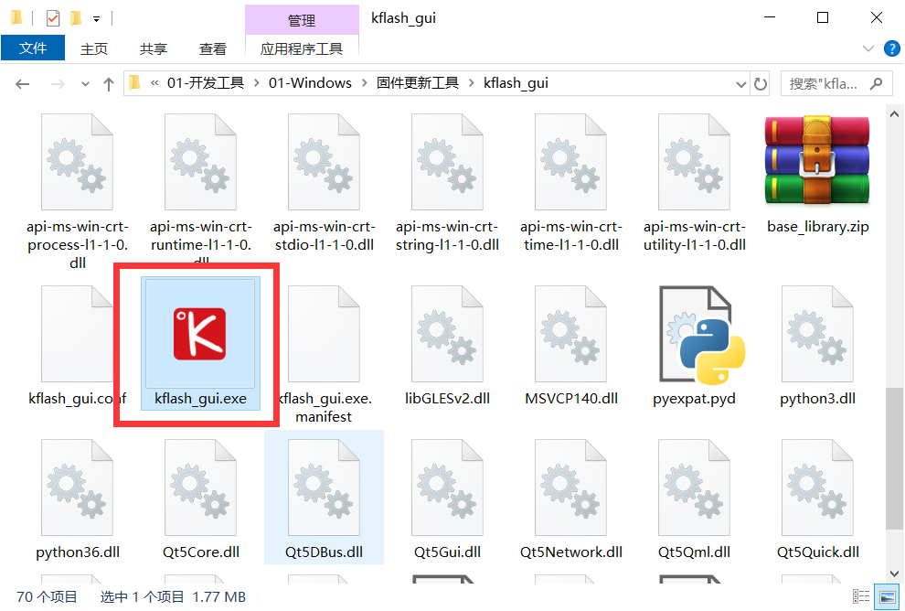
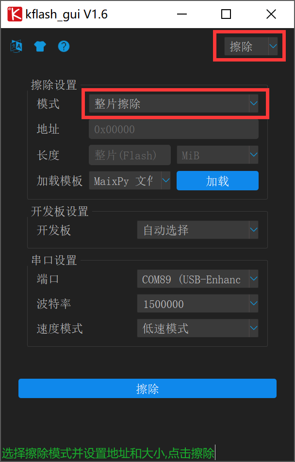
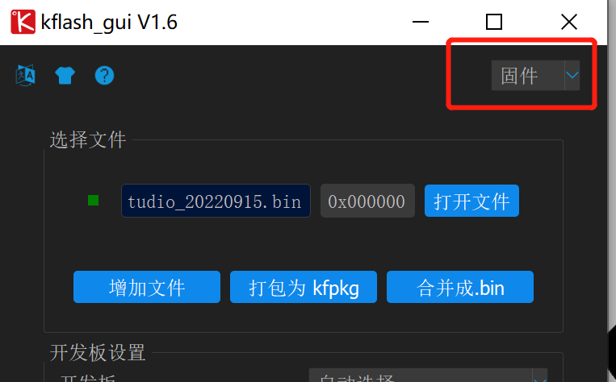
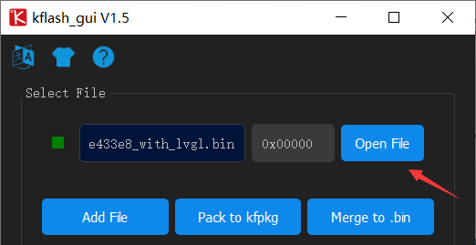
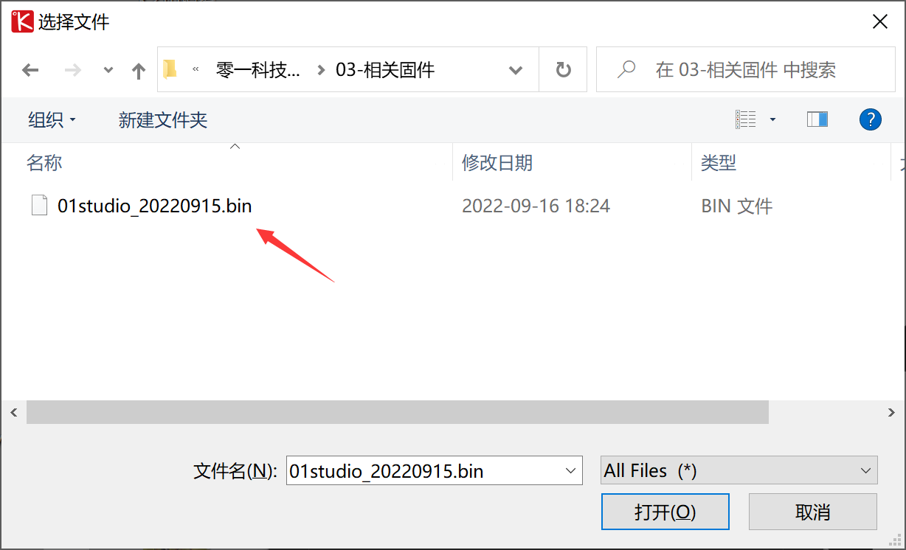
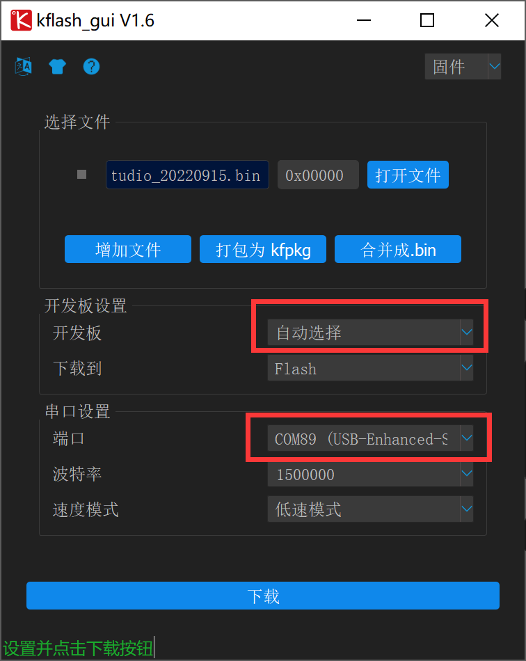
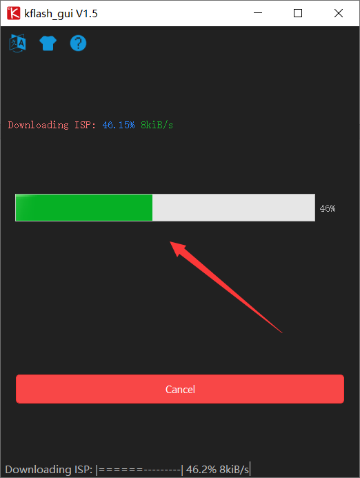
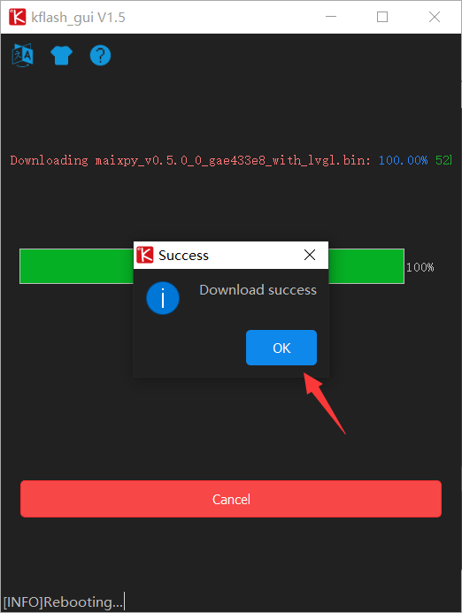

# 固件更新

当CanMV K210上的固件意外丢失或者我们希望升级到较新版本固件时候，就需重新烧录固件。CanMV K210上面是一个K210单片机，所以这个操作相当于给K210 MCU重新烧录MicroPython固件。

官方提供了免安装的烧录工具，通过板载USB转串口烧录的。我们打开 <u>MicroPython开发套件配套资料\开发工具\Windows\固件更新工具\ kflash_gui</u> 目录下的kflash_gui.exe烧录软件。

固件存放在核心板的Flash上，重烧固件前建议先将flash整片擦除一下，在右上角选择擦除，然后模式为整片擦除。选择开发板的串口后点击擦除即可，如下图。一般擦除时间为十几秒到几十秒。

擦除后右上角重新选择“固件”模式：

然后点击open file:

选择配套资料包路径 <u>零一科技（01Studio）MicroPython开发套件配套资料\03-相关固件\05-CanMV K210</u> 下的固件：

烧录地址默认为0x00000即可。选择开发板和串口COM，开发板可以选择**自动选择** ，而串口则选择自己开发板对应的串口。

点击Download下载。**（如出现一直等待情况说明无法自动下载，在等待过程按一下开发板的RST复位键即可。）**

下载成功后弹出success对话框:

