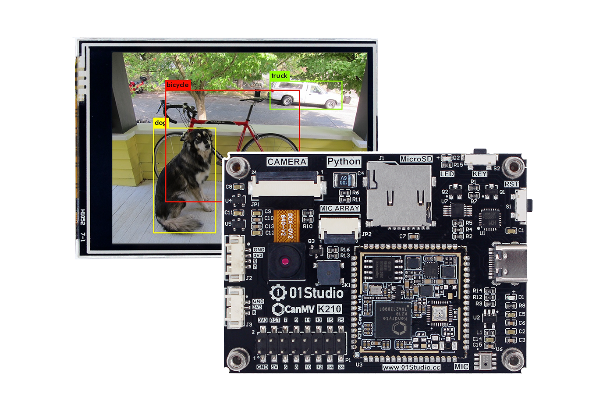
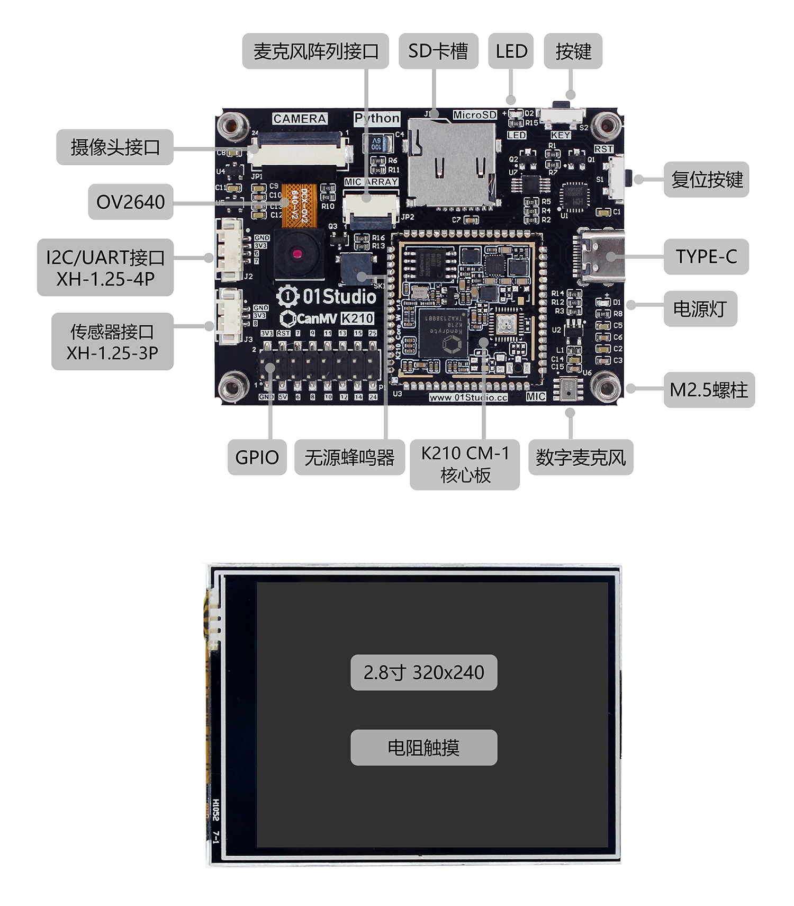

# CanMV-K210

## CanMV是什么

CanMV开源项目由嘉楠科技（Canaan）官方创建和维护。是将MicroPython移植到嘉楠科技边缘计算AI芯片K210（一款64位双核带硬件FPU和卷积加速器的 RISC-V）的开源项目，该项目旨在创建低成本，可扩展， 使用 Python 驱动的AI人工智能模块。

也就是说如果你熟悉Micropython或Python,那么你可以在非常短的时间内通过CanMV项目完成大量机器视觉、机器听觉和深度学习应用。

## CanMV-K210开发板

CanMV K210由01Studio设计，是基于嘉楠科技边缘计算芯片K210（RSIC-V架构，64位双核）和CanMV开源项目的一款开发板，硬件采用了一体化设计（K210核心板、摄像头、LCD和其它外设集成在一个PCB上），外观精美，即拿即用。

### 硬件资源

- 主控：CM-1 K210核心板。RAM: 8MBytes，Flash: 16MBytes。
- 2.8寸显示屏（分辨率320 x 240，带电阻触摸）
- 新标配GC0328摄像头（成像效果比原来OV2640摄像头要清晰）
- 1 x LED（蓝灯）
- 2 x 按键（功能键和复位键）
- 1 x 无源蜂鸣器
- 1 x 数字麦克风
- 1 x MicroSD卡槽 
- 1 x 麦克风阵列接口
- 1 x 传感器接口（XH-1.25mm-3P）
- 1 x UART/I2C接口（XH-1.25mm-4P）
- 1 x Type-C（下载/调试/供电）
- 部分GPIO口引出
