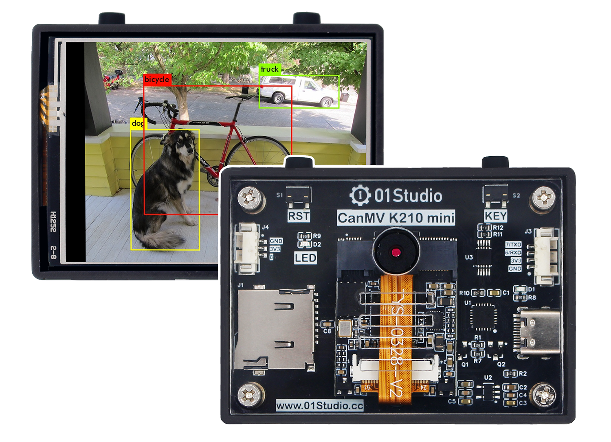
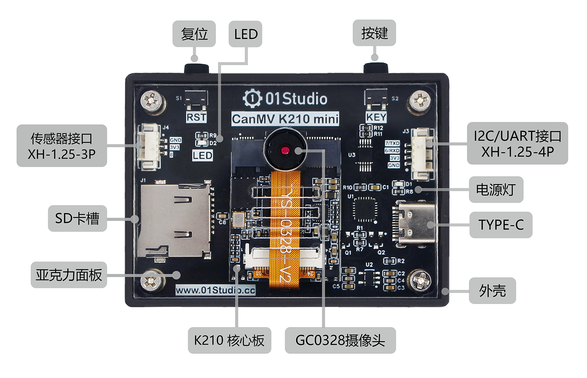
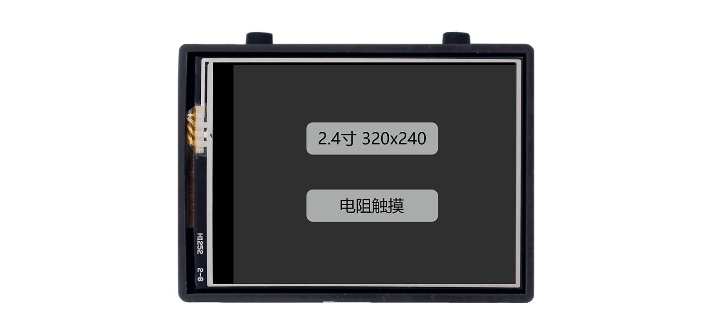
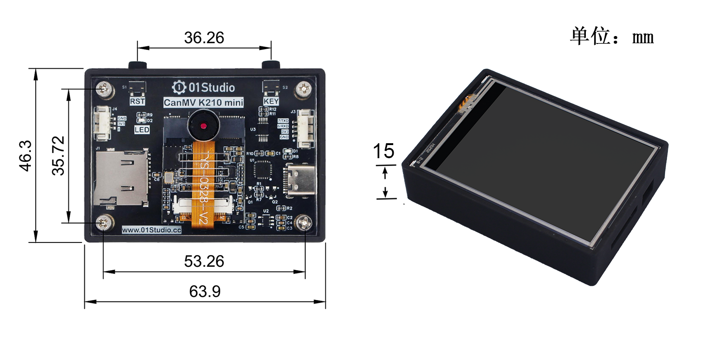
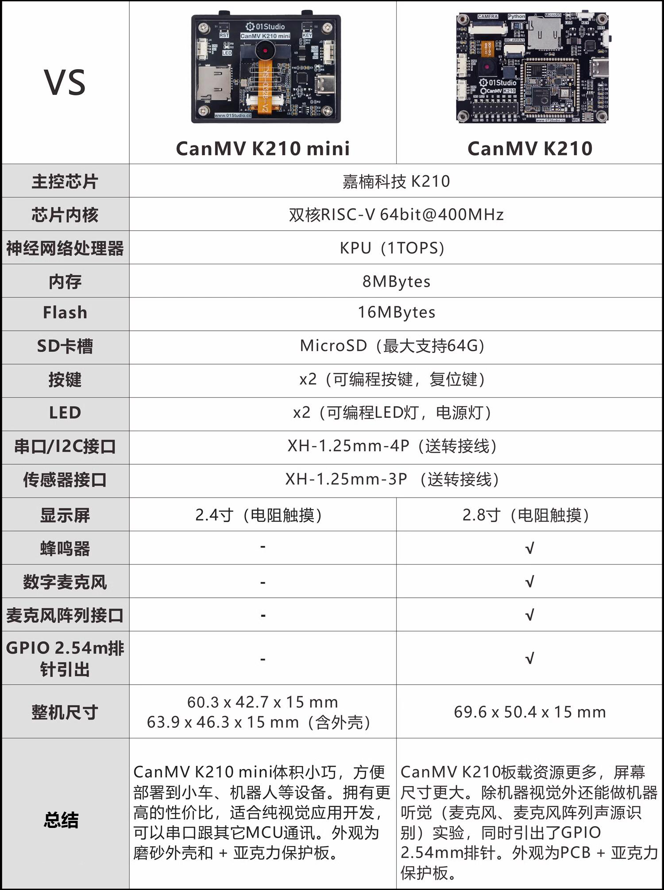

# CanMV K210

## CanMV是什么

CanMV开源项目由嘉楠科技（Canaan）官方创建和维护。是将MicroPython移植到嘉楠科技边缘计算AI芯片K210（一款64位双核带硬件FPU和卷积加速器的 RISC-V）的开源项目，该项目旨在创建低成本，可扩展， 使用 Python 驱动的AI人工智能模块。

也就是说如果你熟悉Micropython或Python,那么你可以在非常短的时间内通过CanMV项目完成大量机器视觉、机器听觉和深度学习应用。

## CanMV K210开发板

CanMV K210由01Studio设计，是基于嘉楠科技边缘计算芯片K210（RSIC-V架构，64位双核）和CanMV开源项目的一款开发板，硬件采用了一体化设计（K210核心板、摄像头、LCD和其它外设集成在一个PCB上），外观精美，即拿即用。

### 硬件资源

- 主控：CM-1 K210核心板。RAM: 8MBytes，Flash: 16MBytes。
- 2.8寸显示屏（分辨率320 x 240，带电阻触摸）
- 新标配GC0328摄像头（成像效果比原来OV2640摄像头要清晰）
- 1 x LED（蓝灯）
- 2 x 按键（功能键和复位键）
- 1 x 无源蜂鸣器
- 1 x 数字麦克风
- 1 x MicroSD卡槽 
- 1 x 麦克风阵列接口
- 1 x 传感器接口（XH-1.25mm-3P）
- 1 x UART/I2C接口（XH-1.25mm-4P）
- 1 x Type-C（下载/调试/供电）
- 部分GPIO口引出

## CanMV K210 mini 开发板

CanMV K210 mini相对于CanMV K210硬件资源做了精简，专用于纯视觉应用。更小的尺寸，更高性价比。带磨砂外壳。

### 硬件资源

|  产品参数 |
|  :---:  | ---  |
| 主控  | K210（RISC-V双核64位处理器） |
| 神经网络处理器  | KPU（1TOPS）|
| 内存  | 8 Mbytes | 
| Flash  | 16 Mbytes |
| MicroSD卡座  | 最大支持64G |
| 摄像头  | GC0328（清晰度高） |
| 屏幕  | 2.4寸320x240分辨率（电阻触摸） |
| 按键  | x2（可编程按键，复位键） |
| LED  | x2（可编程LED灯，电源灯） |
| 串口/I2C接口  | XH-1.25mm-4P（送转接线） |
| 传感器接口  | XH-1.25mm-3P（送转接线） |
| Type-C接口 | 下载、调试、供电多合一 |
| 功耗  | 5V @ 200mA |

|  外观规格 |
|  :---:  | ---  |
| 尺寸  | 60.3 x 42.7 x 15 mm    63.9 x 46.3 x 15 mm（含外壳） |
| 重量  | 35克    47克（含外壳）|

### 尺寸图

## 2款开发板参数对比

## 支持实验对比

CanMV K210 和 CanMV K210 mini 两款开发板固件、教程完全兼容，主要区别是摄像头的的位置区别，通过初始化设置两行代码转置即可，01科技提供已经编辑好的两套不同代码供用户下载。位于**开发板资料包--例程源码中**。[开发板资料下载](../download.md)

|  实验名称 | CanMV K210 | CanMV K210 mini |
|  :---:  | :---:  | :---:  |
| 开发环境搭建  | √ | √ |
| 基础实验  | √ | √ |
| 机器视觉  | √ | √ |
| 机器听觉  | √ | - |
| 网络应用  | √ | - |
| 传感器和模块  | √ | √ |