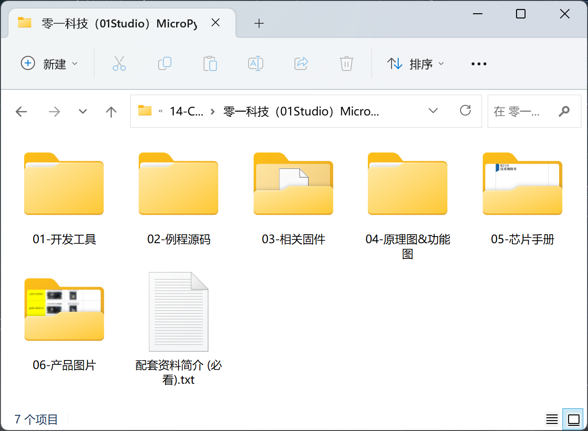
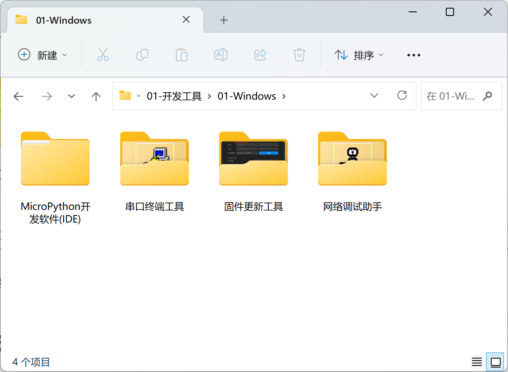
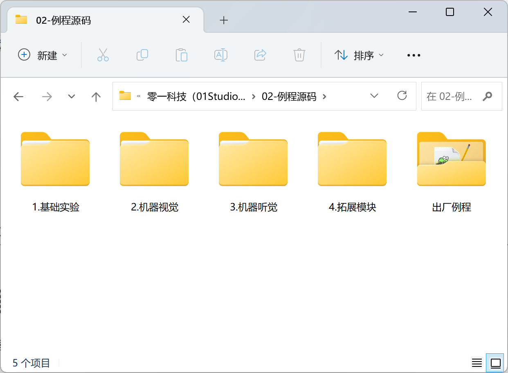
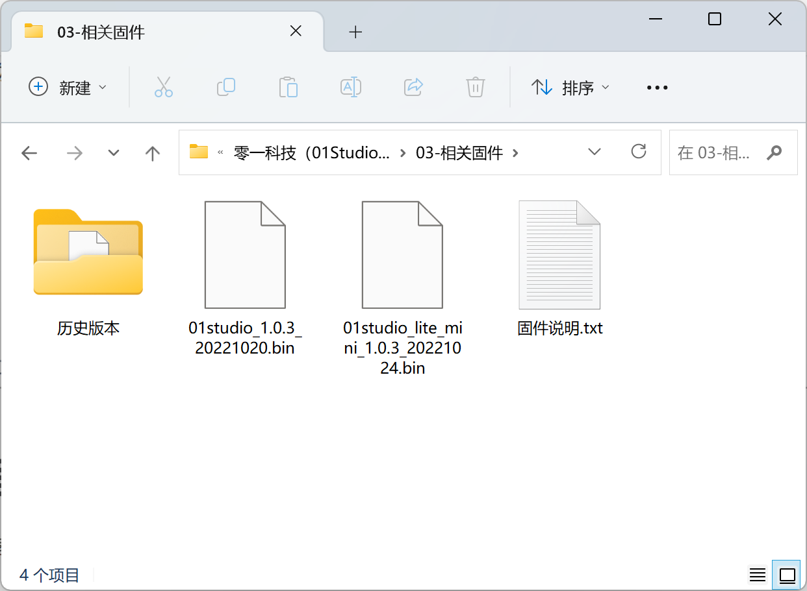
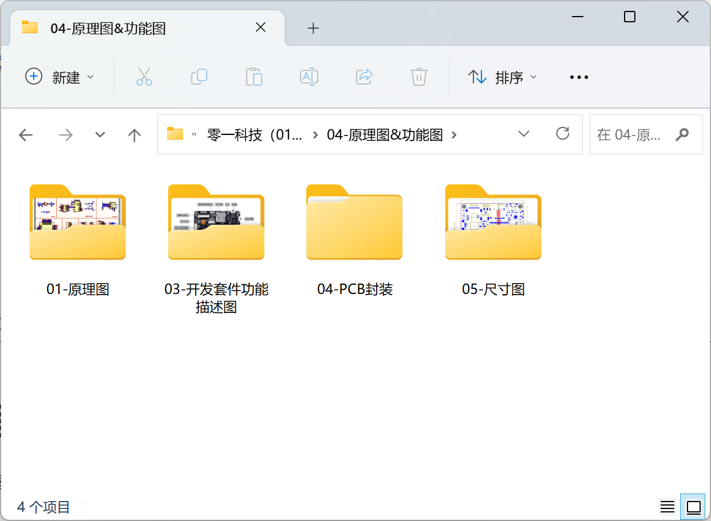
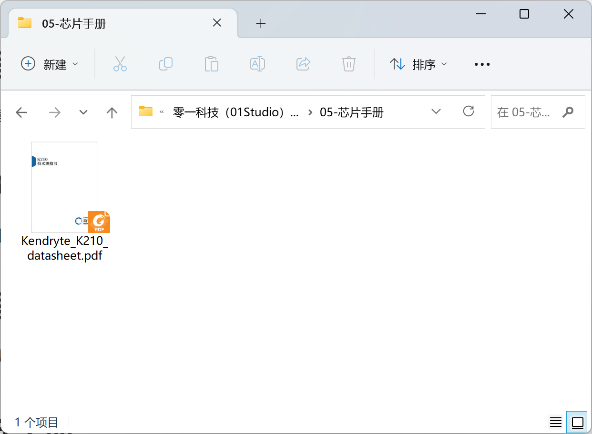
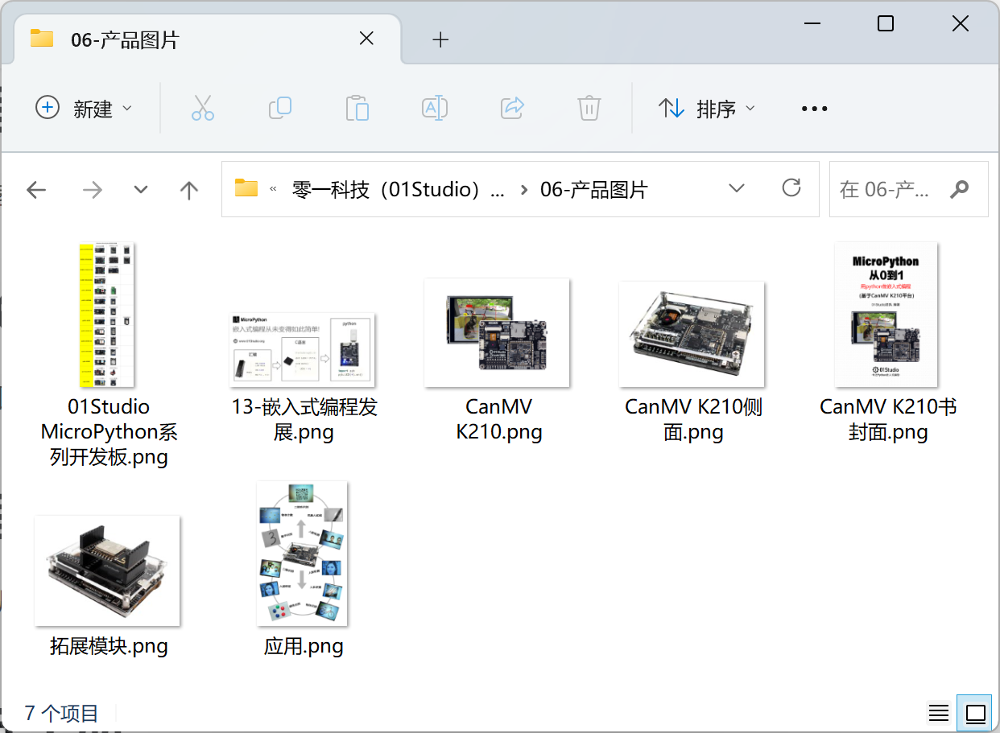

# 资料下载

CanMV K210教程配套软件、源代码、原理图、芯片手册等。

- 百度网盘链接：https://pan.baidu.com/s/1P-lju8EH-fd4Rfy67Ge-Gg
- 提取码：**01KJ**

**资料介绍如下：**

## 开发工具

开发软件、相关驱动。

## 例程源码

本在线教程所有源代码。

## 相关固件

开发板固件，用于升级和重烧。

## 原理图和功能图

开发板原理图和接口说明图片。

## 芯片手册

主要IC手册。

## 产品图片

产品的一些拍摄图，纯粹欣赏用。

