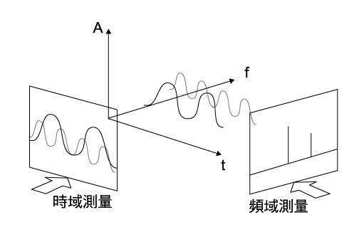
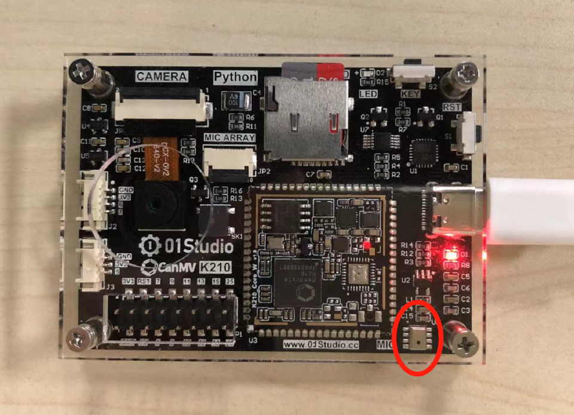
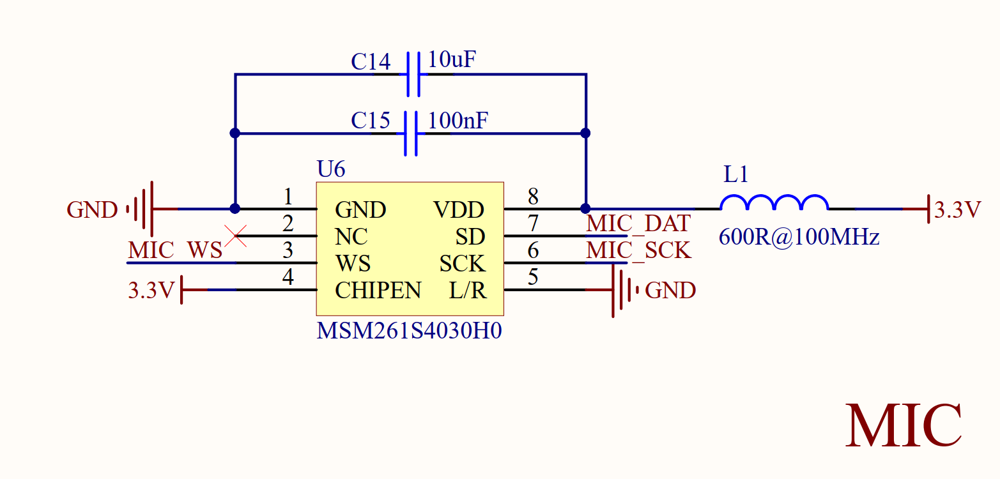
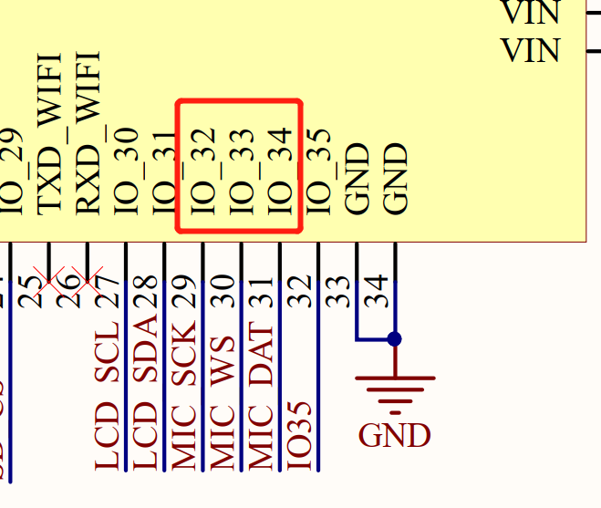
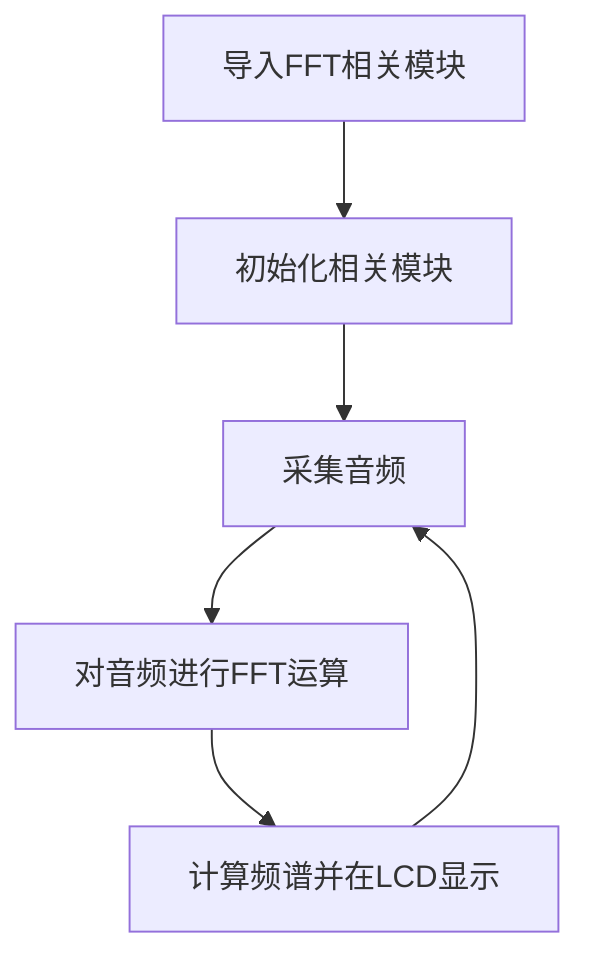
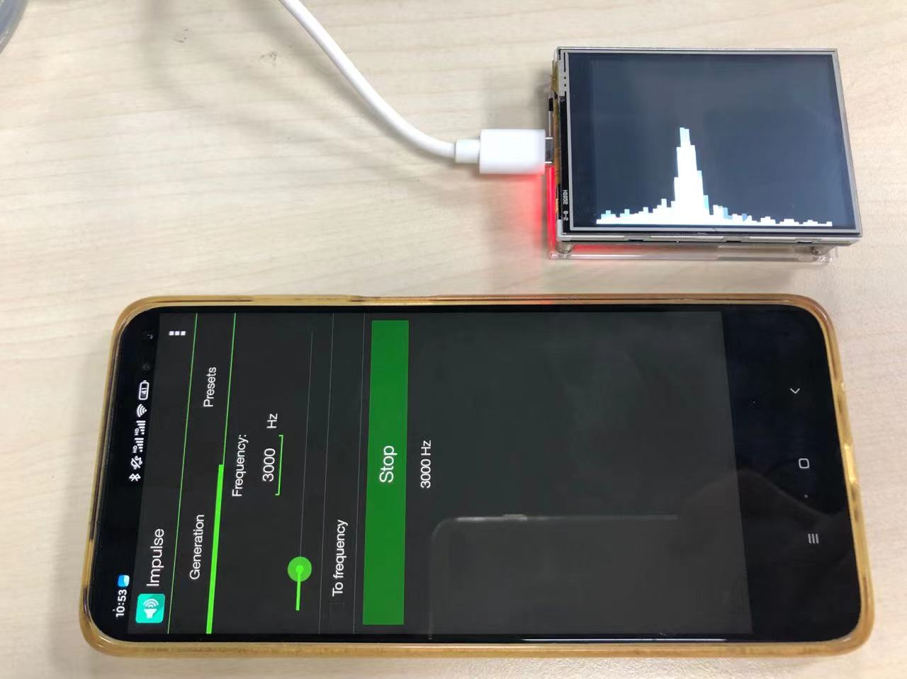

# 声音频率识别（FFT）

## 前言
生活中我们经常会遇到以下场景，当一群人在说话的时候我们能听到多个声音，甚至嘈杂，但我们大脑却可以快速分辨出不同声音，如男声、女声或者是某人的声音，这些声音是同时发生的，因此我们大脑对声音进行分析，区别出声音不同的特点。一个重要的识别特征就是频率，比如男声通常频率低，女声频率高。本节就通过CanMV K210板载麦克风进行声音频率识别。


## 实验目的
通过麦克风模块实现声音获取，计算其频率，并在LCD上显示。

## 实验讲解

本节用到的一个知识是数学中常用的公式，快速傅里叶变换（FFT），傅里叶的一个基础理论就是认为每一个信号都可以分解成N个不同的周期信号叠加而成。

一般情况下我们在一段时间内听到一段声音，声音中夹杂着不同频率，我们可以建立坐标，横坐标为时间t，纵坐标为不同频率的叠加，这便是时域。

而以频率f为横坐标，幅值为纵坐标建立的坐标，便展示了频域。具体如下图所示：（有关FFT更详细内容，可以自行科普。）



CanMV集成了FFT运算的MicroPython库，对用户来说我们使用CanMV K210开发套件和数字麦克风模块即可编程实现该功能。

先来看一下本实验使用的是01Studio配套的数字麦克风模块，数字麦克风模块使用I2S总线通信，I2S(Inter—IC Sound)总线, 又称集成电路内置音频总线，是飞利浦公司为数字音频设备之间的音频数据传输而制定的一种总线标准，该总线专门用于音频设备之间的数据传输，广泛应用于各种多媒体系统。它采用了沿独立的导线传输时钟与数据信号的设计，通过将数据和时钟信号分离，避免了因时差诱发的失真，为用户节省了购买抵抗音频抖动的专业设备的费用。

麦克风位于CanMV K210开发板右下方。



结合CanMV原理图可以看到K210跟麦克风通过3个引脚连接（I2S）。

- SCK -- > IO32
- WS -- > IO33
- DAT -- > IO34





I2S模块主要用于驱动I2S设备，k210一共有3个I2S设备，每个设备一共有4个通道，在使用前需要对引脚进行映射管理，模块说明如下.

## I2S对象

### 构造函数
```python
i2s = maix.I2S(device_num)
```
I2S模块位于maix下。
- `device_num` : 共3个设备。
    - `DEVICE_0` : 设备0 ；
    - `DEVICE_1` : 设备1 ；
    - `DEVICE_2` : 设备2 ；

### 使用方法

```python
i2s.channel_config(channel,mode,resolution,cycles,align_mode)
```
通道配置；
- `channel` : 共4个：CHANNEL_0-CHANNEL_3;
    - `CHANNEL_0` : 通道0 ；
    - `DEVICE_1` : 设备1 ；
    - `DEVICE_2` : 设备2 ；

- `mode` : 通道传输模式：
    - `RECEIVER` : 接收模式 ，录音时候使用；
    - `TRANSMITTER` : 发送模式 ，音频播放时候使用；

- `resolution` : 通道分辨率；
- `cycles` : 单个数据时钟数；
- `align_mode` : 通道对齐模式

<br></br>

```python
i2s.set_sample_rate(sample_rate)
```
设置采样率。
- `pixformat`: 格式。
    - `sensor.RGB565` : 每像素为16位（2字节），5位用于红色，6位用于绿色，5位用于蓝色，处理速度比灰度图像要慢。
    - `sensor.GRAYSCAL` : 灰度图像，每像素8位（1字节），处理速度快。

<br></br>

```python
audio = i2s.record(points)
```
返回采集的音频。
- `points`: 一次采集音频点数；

<br></br>

```python
i2s.play(audio)
```
播放音频；
- `audio`: 播放音频音频文件；


更多用法请阅读官方文档：<br></br>
https://www.kendryte.com/canmv/main/canmv/library/canmv/audio.html#audio

## FFT对象

FFT运行模块说明如下。

### 构造函数
```python
from maix import FFT
fft = FFT.run(data, points, shift)
```
构建FFT运算模块。
- `data`: 输入的时域数据，bytearray类型;
- `points`: FFT运算点数，仅支持64,128,256和512点；
- `shift`: 偏移，默认为0。

返回值fft: 返回计算后的频域数据，以list类型呈现，该列表有points个元组，每个元组有 2 个元素，第一个元素为实部，第二个为虚部.

### 使用方法
```python
res = fft.freq(points, sample_rate)
```
频率计算；
- `points`: 计算点数;
- `sample_rate`: 采样率;
返回值res : 返回一个列表，该列表存放的进行运算后后所有频率点的频率值；

<br></br>

```python
amp = FFT.amplitude(FFT_res)
```
计算各个频率点的幅值；
返回值amp: 返回一个列表，该列表存放了各个频率点的幅值

更多用法请阅读官方文档：<br></br>
https://www.kendryte.com/canmv/main/canmv/library/canmv/maix/maix.FFT.html#maix-fft

<br></br>

由此可以看到，利用现成的库模块可以轻松地通过MicroPython编程实现麦克风音频采集和FFT运算，代码编写流程如下：



## 参考代码

```python
'''
实验名称：FFT（快速傅里叶）运算
版本： v1.0
日期： 2022.9
实验说明：通过FFT运算，将输入的音频从时域信号转换成频域信号。通过LCD条形柱显示。
翻译和注释： 01Studio
'''
from maix import GPIO, I2S, FFT
import image, lcd, math
from fpioa_manager import fm

#FFT参数配置
sample_rate = 38640  #采样率
sample_points = 1024 #音频采样点数
fft_points = 512  #FFT运算点数
hist_x_num = 50 #条形柱数量
x_shift = 0    #频率

#lcd初始化
lcd.init()

#麦克风初始化
fm.register(34,fm.fpioa.I2S0_IN_D0, force=True)
fm.register(33,fm.fpioa.I2S0_WS, force=True)
fm.register(32,fm.fpioa.I2S0_SCLK, force=True)

rx = I2S(I2S.DEVICE_0)
rx.channel_config(rx.CHANNEL_0, rx.RECEIVER, align_mode = I2S.STANDARD_MODE)
rx.set_sample_rate(sample_rate)

#设置LCD条形柱显示宽度
if hist_x_num > 320:
    hist_x_num = 320
hist_width = int(320 / hist_x_num) #changeable

#新建一张图片
img = image.Image()

while True:

    audio = rx.record(sample_points)   #采集音频
    fft_res = FFT.run(audio.to_bytes(),fft_points) #FFT运算
    fft_amp = FFT.amplitude(fft_res) #计算频谱幅值
    img = img.clear()
    x_shift = 0

    #计算幅值，最大为240（LCD高为240像素）
    for i in range(hist_x_num):
        if fft_amp[i] > 240:
            hist_height = 240
        else:
            hist_height = fft_amp[i]

        #计算要显示的图像，矩形实心显示。
        img = img.draw_rectangle((x_shift,240-hist_height,hist_width,hist_height),[255,255,255],2,True)
        x_shift = x_shift + hist_width

    lcd.display(img) #LCD显示
    fft_amp.clear()  #幅度值清0

```

## 实验结果

在手机安装一个音频发生器（频率发生器）APP用于播放不同频率的声源，然后在开发板上运行上述程序，可以看到LCD实时显示当前频谱图。



通过本实验学习我们了解了FFT原理，同时学会了I2S数字麦克风音频设备和FFT运算通过使用micropython的编程方法。该实验支持多个音频输入，有兴趣用户可以使用多个手机（声源）进行测试。