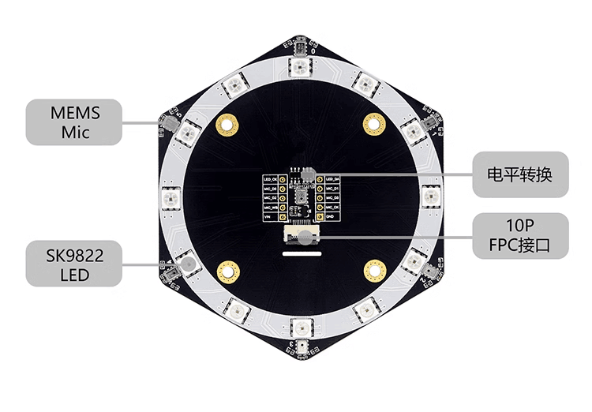
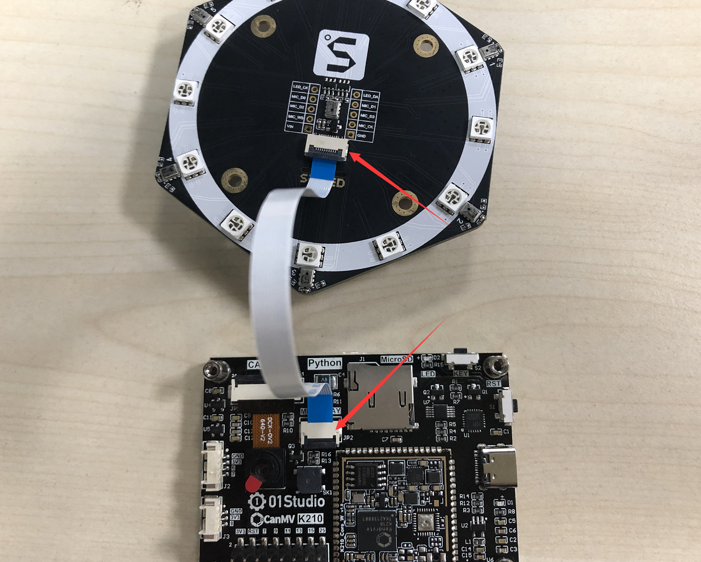
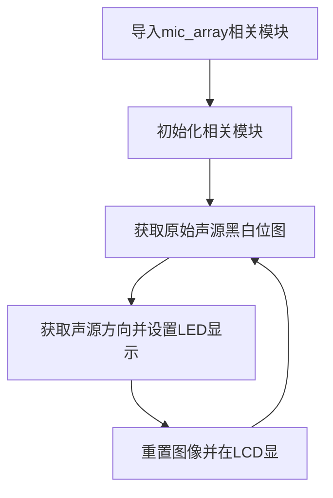
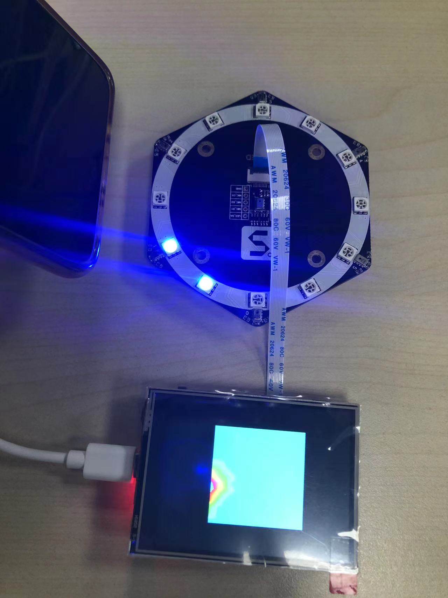

# 声音定位（麦克风阵列）

## 前言
从亚马逊的Alexa、google智能音箱到国内的天猫精灵、小爱同学等智能音箱都有一个共同的功能，那就是声源定位，其原理是利用多个分布在不同方向的麦克风阵列采集声音，进而定位声源的位置。今天我们就来编程实现声源定位。


## 实验目的
通过麦克风阵列编程实现声源定位，并在LCD上显示。

## 实验讲解

我们先来看一下开发板与麦克风阵列模块的连接方式。



将麦克风阵列模块与CanMV K210使用FPC-10P-0.5mm **同面** 排线进行连接。
:::danger 警告
务必使用同向排线（金手指在同一侧）。01Studo官方店麦克风阵列模块发货默认配同向排线。
:::



麦克风阵列扩展模块由7个数字麦克风组成，其中6个分布在四周不同方向，1个在模块正中央，便于识别各个方向声源。另外12个LED指示灯，方便指示声源位置。

本实验目的是编程实现麦克风阵列声源定位，在LCD上显示声源位置。而 CanMV内置了MIC_MARRY模块,位于maix大模块下。使用该模块可以轻松实现声源定位。模块说明如下：


## mic_array对象

### 构造函数
```python
from maix import mic_array as mic
```
导入麦克风阵列模块。

### 使用方法

```python
mic.init(i2s_d0=12, i2s_d1=13, i2s_d2=14, i2s_d3=15, i2s_ws=24, i2s_sclk=25, sk9822_dat=11,  sk9822_clk=10)
```
麦克风阵列初始化，可自定义IO。

<br></br>

```python
mic.getmap()
```
返回声源黑白位图；尺寸16*16。

<br></br>

```python
mic.get_dir(img)
```
从声源位图计算声源方向。返回12个强度值。对应12个LED指示灯。

<br></br>

```python
mic.set_led(direction,color)
```
从计算的声源方向设置点亮对应的LED。

<br></br>

```python
mic.deinit()
```
注销麦克风阵列对象。


更多用法请阅读官方文档：<br></br>
https://developer.canaan-creative.com/canmv/main/canmv/library/canmv/maix/maix.mic_array.html#maix-mic-array

声源定位代码编写流程如下：




## 参考代码

```python
'''
实验名称：声源定位
版本： v1.0
日期： 2022.9
翻译和注释： 01Studio
实验目的：通过麦克风阵列编程实现声源定位，并在LCD上显示。
'''

#导入MIC_ARRAY和LCD模块
from maix import mic_array as mic
import lcd

#初始化模块
lcd.init()

#麦克风阵列初始化，可自定义配置 IO
mic.init(i2s_d0=12, i2s_d1=13, i2s_d2=14, i2s_d3=15, i2s_ws=24,
         i2s_sclk=25, sk9822_dat=11, sk9822_clk=10)

while True:

    #获取原始的声源黑白位图，尺寸 16*16
    imga = mic.get_map()

    #获取声源方向并设置LED显示
    b = mic.get_dir(imga)
    a = mic.set_led(b,(0,0,255))

    #将声源地图重置成正方形，彩虹色
    imgb = imga.resize(160,160)
    imgc = imgb.to_rainbow(1)

    #显示声源图
    lcd.display(imgc)

mic.deinit()
```

## 实验结果

运行代码，打开手机播放音乐，将手机扬声器放置不同的位置，可以看LED和LCD声源图均指示声源方向。



声源定位是机器听觉中非常实用的功能，特别是应用在智能音箱和一些需要定位声源的应用。通过MicroPython编程快速实现了声源定位，再次体验了python嵌入式编程的强大。