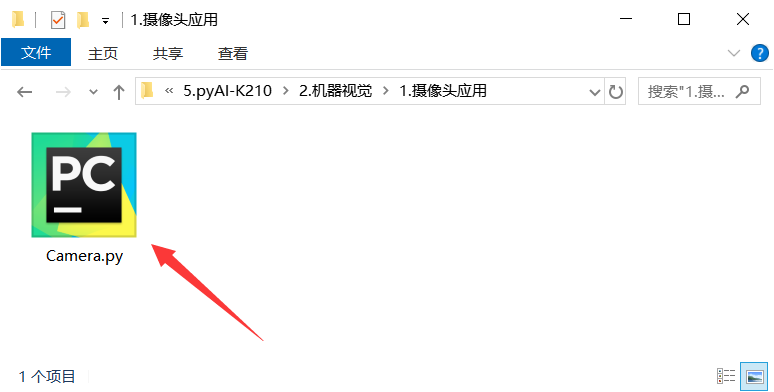
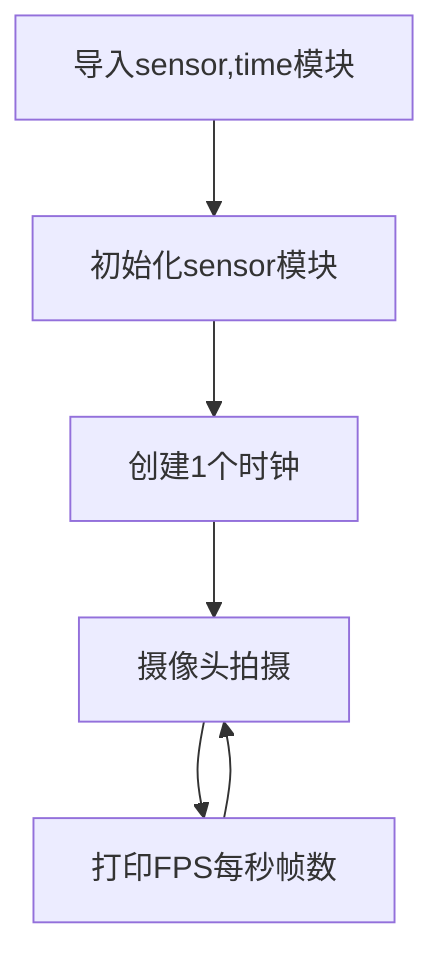
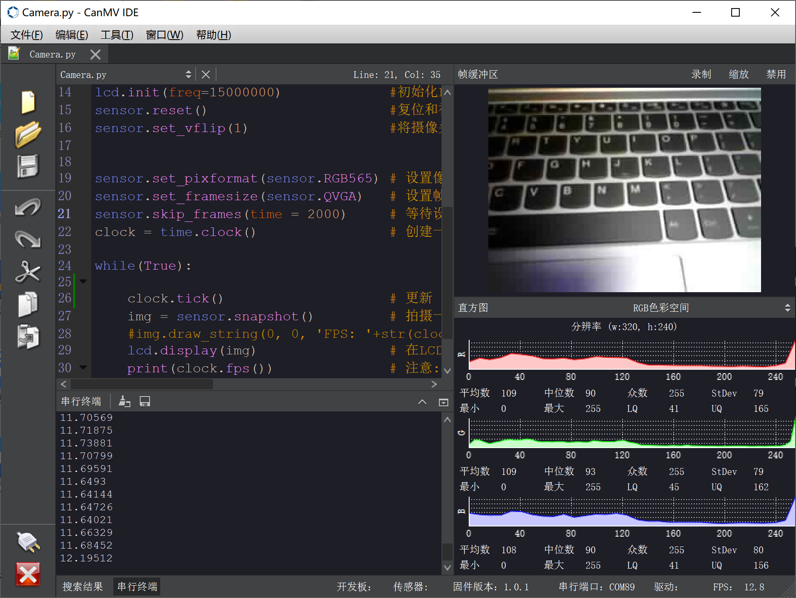
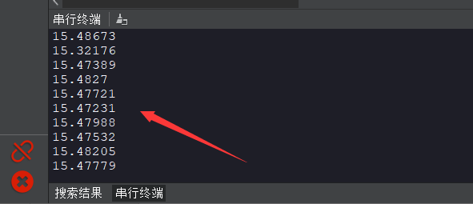
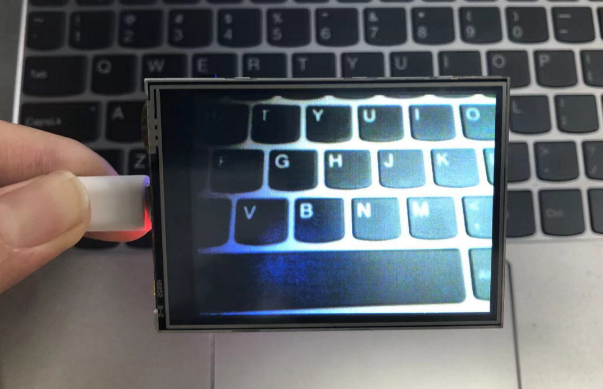
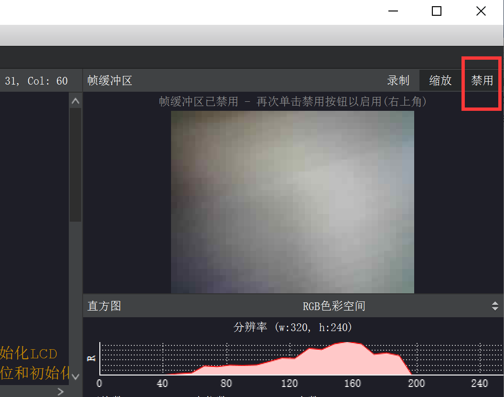
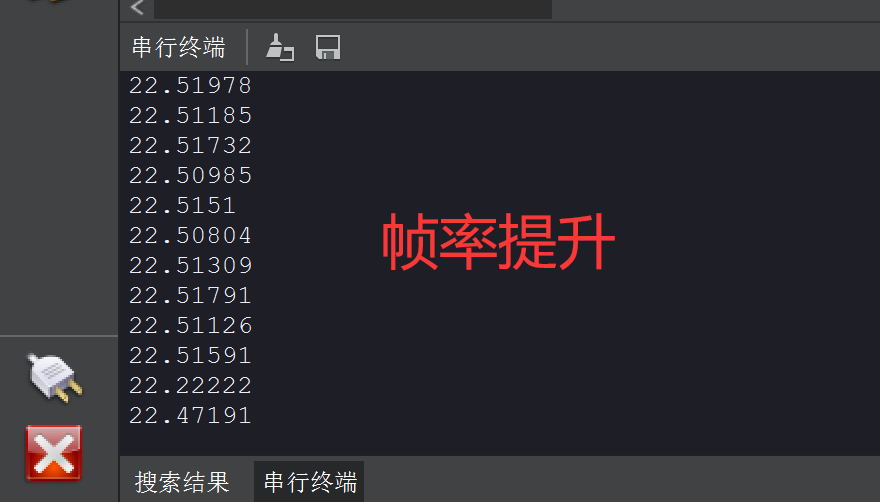

# 摄像头

## 前言
从前面的基础实验我们熟悉了K210基于MicroPython的编程方法，但那可以说是只发挥了K210冰山一角的性能应用，摄像头是整个机器视觉应用的基础。今天我们就通过示例代码来看看CanMV K210是如何使用摄像头的。

## 实验目的
学习官方自带的hello wrold例程，理解K210摄像头基本编程和配置原理。

## 实验讲解

在CanMV IDE中打开 <u>零一科技（01Studio）MicroPython开发套件配套资料\02-示例程序\5.CanMV K210\2.机器视觉\1.摄像头应用</u> 目录下的camera.py文件。



打开后发现编辑框出现了相关代码，我们可以先直接跑一下代码看看实验现象，连接CanMV K210，点击运行，可以发右图上方出现了摄像头实时采集的图像。**(由于K210通过串口方式跟IDE交互，官方降低IDE缓冲区显示图像质量，推荐通过LCD显示会更清晰。)**


CanMV机器视觉库代码大部分都是参考OpenMV移植过来，已经将所有的摄像头功能封装到sersor模块中，用户可以通过调用函数轻松使用。这也是使用MicroPython编程的魅力所在。


## sensor对象

### 构造函数
```python
import sensor
```
摄像头对象，通过import直接调用。

### 使用方法

```python
sensor.reset()
```
初始化摄像头。

<br></br>

```python
sensor.set_pixformat(pixformat)
```
设置像素格式。
- `pixformat`: 格式。
    - `sensor.RGB565` : 每像素为16位（2字节），5位用于红色，6位用于绿色，5位用于蓝色，处理速度比灰度图像要慢。
    - `sensor.GRAYSCAL` : 灰度图像，每像素8位（1字节），处理速度快。

<br></br>

```python
sensor.set_framesize(framesize)
```
设置每帧大小（即图像尺寸）。
- `framesize`: 帧尺寸。
    - `sensor.QQVGA` : 160x120;
    - `sensor.QVGA` : 320x240(一般建议使用这个，跟LCD尺寸一样)；
    - `sensor.VGA` : 640x480;

<br></br>

```python
sensor.skip_frames([n, time])
```
摄像头配置后跳过n帧或者等待时间time让其变稳定。n:跳过帧数；time：等待时间,单位ms。（如果n和time均没指定，则默认跳过300毫秒的帧。）

<br></br>

```python
sensor.snapshot()
```
使用相机拍摄一张照片，并返回 image 对象。


更多用法请阅读官方文档：<br></br>
https://developer.canaan-creative.com/canmv/main/canmv/library/canmv/sensor.html

## clock对象

我们再来看看本例程用于计算FPS（每秒帧数）的clock模块。

### 构造函数
```python
clock=time.clock()
```
构建一个时钟对象。

### 使用方法
```python
clock.tick()
```
开始追踪运行时间。

<br></br>

```python
clock.fps()
```
停止追踪运行时间，并返回当前FPS（每秒帧数）。**在调用该函数前始终首先调用 clock.tick() 。**

更多用法请阅读官方文档：<br></br>
https://developer.canaan-creative.com/canmv/main/canmv/library/micropython/utime.html#clock

<br></br>

我们来看看代码的编写流程图：




## 参考代码

```python
# Hello World 例程

# 欢迎使用 CanMV IDE!
#
# 1. 将开发板连接到电脑；
# 2. 在工具->选择开发板下选择合适的开发板；
# 3. 点击连接并选择串口；
# 4. 连接成功后点击绿色按钮开始运行!
#
#翻译和注释：01Studio

import sensor, image, time, lcd

lcd.init(freq=15000000)             #初始化LCD
sensor.reset()                      #复位和初始化摄像头，执行sensor.run(0)停止。
sensor.set_vflip(1)                 #将摄像头设置成后置方式（所见即所得）


sensor.set_pixformat(sensor.RGB565) # 设置像素格式为彩色 RGB565 (或灰色)
sensor.set_framesize(sensor.QVGA)   # 设置帧大小为 QVGA (320x240)
sensor.skip_frames(time = 2000)     # 等待设置生效.
clock = time.clock()                # 创建一个时钟来追踪 FPS（每秒拍摄帧数）

while(True):

    clock.tick()                    # 更新 FPS 时钟.
    img = sensor.snapshot()         # 拍摄一个图片并保存.
    #img.draw_string(0, 0, 'FPS: '+str(clock.fps()), color = (255, 255,255), scale = 3,mono_space = False)
    lcd.display(img)                # 在LCD上显示
    print(clock.fps())              # 注意: 当 K210 连接到 IDE 时候，运行速度减半，因此当断开 IDE 时 FPS 会提升。

```

## 实验结果

点击运行代码，可以看到在右边显示摄像头实时拍摄情况，下方则显示RGB颜色直方图。



点击左下角串口终端，可以看到软件弹出串口打印串口，实时显示当前的FPS(每秒帧数)值约为15帧。



同样可以看到LCD实时显示摄像头采集的图像.



通过禁用CanMV IDE缓冲区图像显示可以提高开发板的FPS（每秒帧率）。





通过本实验，我们了解了摄像头sensor模块以及时间time模块的原理和应用，可以看到CanMV将摄像头功能封装成sensor模块，用户不必关注底层代码编可以轻松使用。