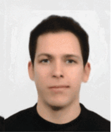
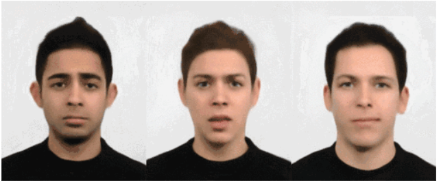

# 人脸检测

## 前言
人脸检测，简单来说就是告诉你将一幅图片中哪些是人脸，支持单个和多个人脸。今天我们来学习一下如何通过MicroPython编程快速实现人脸检测。

## 实验目的
将摄像头拍摄到的画面中的人脸用矩形框标识出来。

## 实验讲解

通过KPU模块直接加载YOLO2网络，再结合人脸检测模型来实现人脸检测。KPU对象说明参考[KPU简介](./kpu)章节内容，这里不再重复。

具体编程思路如下：


## 参考代码

```python
#实验名称：人脸检测
#翻译和注释：01Studio

#导入相关模块
import sensor, image, time, lcd, gc
from maix import KPU

#lcd初始化
lcd.init()

#摄像头初始化
sensor.reset()
sensor.set_pixformat(sensor.RGB565)
sensor.set_framesize(sensor.QVGA)
sensor.set_vflip(True) #摄像头后置
sensor.skip_frames(time = 1000)
clock = time.clock()

od_img = image.Image(size=(320,256))

#构建KPU对象
kpu = KPU()
kpu.load_kmodel("/sd/yolo_face_detect.kmodel") #加载KPU模型，放在SD卡根目录
#kpu.load_kmodel(0x300000, 278440) #需要将kmdel通过固件下载工具下载到0x300000的位置（3M偏移）

anchor = (0.893, 1.463, 0.245, 0.389, 1.55, 2.58, 0.375, 0.594, 3.099, 5.038, 0.057, 0.090, 0.567, 0.904, 0.101, 0.160, 0.159, 0.255)
kpu.init_yolo2(anchor, anchor_num=9, img_w=320, img_h=240, net_w=320 , net_h=256 ,layer_w=10 ,layer_h=8, threshold=0.7, nms_value=0.3, classes=1)

while True:

    #print("mem free:",gc.mem_free()) #查询内存余量
    clock.tick()
    img = sensor.snapshot()
    a = od_img.draw_image(img, 0,0)
    od_img.pix_to_ai()

    #将摄像头采集图片输送到KPU和yolo模型运算。
    kpu.run_with_output(od_img)
    dect = kpu.regionlayer_yolo2()

    fps = clock.fps()

    if len(dect) > 0: #识别到人脸
        print("dect:",dect)
        for l in dect : #画矩形
            a = img.draw_rectangle(l[0],l[1],l[2],l[3], color=(0, 255, 0))

    a = img.draw_string(0, 0, "%2.1ffps" %(fps), color=(0, 60, 128), scale=2.0) #显示屏显示FPS
    lcd.display(img)
    gc.collect()#内存回收

kpu.deinit()

```

## 实验结果

在资料包教程代码文件夹路径中找到本节代码，将里面的yolo_face_detect.kmodel文件通过读卡器拷贝到SD卡，然后将SD卡插入开发板，在IDE运行上述代码即可。


运行代码，将摄像头正对下方人脸图检测。

**单个人脸检测：**

原图：



识别结果：


**多个人脸检测：**

原图：



识别结果：


本节学习了人脸检测，可以看到CanMV K210通过KPU+YOLO2+face模型轻松实现人脸检测，而且检测的准确率非常高，也就是结合MicroPython编程我们轻松完成了实验。而且本实验支持单个和多个人脸同时检测，是机器视觉中非常有代表性的实验。