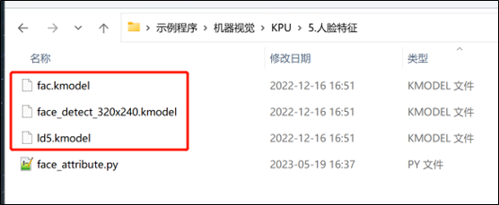
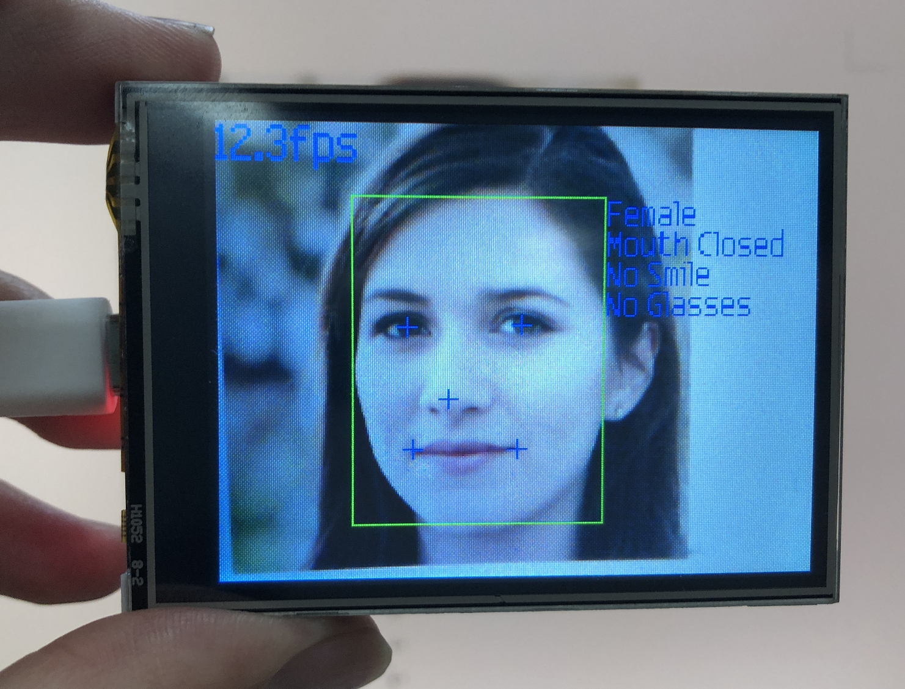

# 人脸特征

## 前言
本节人脸特征检测用于检测人脸的一些基本特征，分别是**性别、嘴巴是否张开、是否笑、是否戴眼镜**4个特征。本节我们来学习一下如何通过MicroPython编程快速实现这些特征识别。

## 实验目的
人脸特征检测。

## 实验讲解

本实验还是使用到KPU + YOLO2网络，与前面的区别是这次实验共使用了3个模型来识别。分别是人脸检测模型、5点人脸识别（确认人脸完整性）和人脸具体特征模型,层层递进。KPU对象说明可参考[KPU简介](./kpu)章节内容。

具体编程思路如下：

```mermaid
graph TD
    导入KPU等相关模块 --> 初始化和配置相关模块  --> 加载3个模型和初始化YOLO2网络 --> 摄像头采集图像后按顺序进入人脸检测,5点人脸完整性,具体特征判断 --> 画矩形和字符指示 --> 摄像头采集图像后按顺序进入人脸检测,5点人脸完整性,具体特征判断;
```

## 参考代码

```python
#实验名称：人脸特征
#翻译和注释：01Studio

#导入相关模块

import sensor, image, time, lcd
from maix import KPU
import gc

lcd.init()
sensor.reset()                      # Reset and initialize the sensor. It will
                                    # run automatically, call sensor.run(0) to stop
sensor.set_pixformat(sensor.RGB565) # Set pixel format to RGB565 (or GRAYSCALE)
sensor.set_framesize(sensor.QVGA)   # Set frame size to QVGA (320x240)
sensor.skip_frames(time = 1000)     # Wait for settings take effect.
sensor.set_vflip(1) #摄像头后置模式

clock = time.clock()                # Create a clock object to track the FPS.


#构建KPU对象和配置模型参数信息
#导入3个模型，放在SD卡根目录
anchor = (0.1075, 0.126875, 0.126875, 0.175, 0.1465625, 0.2246875, 0.1953125, 0.25375, 0.2440625, 0.351875, 0.341875, 0.4721875, 0.5078125, 0.6696875, 0.8984375, 1.099687, 2.129062, 2.425937)
kpu = KPU()
kpu.load_kmodel("/sd/face_detect_320x240.kmodel")
kpu.init_yolo2(anchor, anchor_num=9, img_w=320, img_h=240, net_w=320 , net_h=240 ,layer_w=10 ,layer_h=8, threshold=0.5, nms_value=0.2, classes=1)

ld5_kpu = KPU()
print("ready load model")
ld5_kpu.load_kmodel("/sd/ld5.kmodel")

fac_kpu = KPU()
print("ready load model")
fac_kpu.load_kmodel("/sd/fac.kmodel")

#人脸特征：性别、嘴巴是否张开、是否笑、是否戴眼镜 4个特征
pos_face_attr = ["Male ", "Mouth Open ", "Smiling ", "Glasses"]
neg_face_attr = ["Female ", "Mouth Closed", "No Smile", "No Glasses"]

# standard face key point position
FACE_PIC_SIZE = 128
dst_point =[(int(38.2946 * FACE_PIC_SIZE / 112), int(51.6963 * FACE_PIC_SIZE / 112)),
            (int(73.5318 * FACE_PIC_SIZE / 112), int(51.5014 * FACE_PIC_SIZE / 112)),
            (int(56.0252 * FACE_PIC_SIZE / 112), int(71.7366 * FACE_PIC_SIZE / 112)),
            (int(41.5493 * FACE_PIC_SIZE / 112), int(92.3655 * FACE_PIC_SIZE / 112)),
            (int(70.7299 * FACE_PIC_SIZE / 112), int(92.2041 * FACE_PIC_SIZE / 112)) ]

RATIO = 0.08
def extend_box(x, y, w, h, scale):
    x1_t = x - scale*w
    x2_t = x + w + scale*w
    y1_t = y - scale*h
    y2_t = y + h + scale*h
    x1 = int(x1_t) if x1_t>1 else 1
    x2 = int(x2_t) if x2_t<320 else 319
    y1 = int(y1_t) if y1_t>1 else 1
    y2 = int(y2_t) if y2_t<240 else 239
    cut_img_w = x2-x1+1
    cut_img_h = y2-y1+1
    return x1, y1, cut_img_w, cut_img_h

while 1:
    gc.collect()
    #print("mem free:",gc.mem_free())
    clock.tick()                    # Update the FPS clock.
    img = sensor.snapshot()
    kpu.run_with_output(img)
    dect = kpu.regionlayer_yolo2()
    fps = clock.fps()

    #识别出人脸
    if len(dect) > 0:
        print("dect:",dect)
        for l in dect :
            x1, y1, cut_img_w, cut_img_h = extend_box(l[0], l[1], l[2], l[3], scale=RATIO) # 扩大人脸框
            face_cut = img.cut(x1, y1, cut_img_w, cut_img_h)
            a = img.draw_rectangle(l[0],l[1],l[2],l[3], color=(0, 255, 0))
            face_cut_128 = face_cut.resize(128, 128)
            face_cut_128.pix_to_ai()

            #五点人脸识别确认人脸完整
            out = ld5_kpu.run_with_output(face_cut_128, getlist=True)
            #print("out:",len(out))
            face_key_point = []
            for j in range(5):
                x = int(KPU.sigmoid(out[2 * j])*cut_img_w + x1)
                y = int(KPU.sigmoid(out[2 * j + 1])*cut_img_h + y1)
                a = img.draw_cross(x, y, size=5, color=(0, 0, 255))
                face_key_point.append((x,y))
            T = image.get_affine_transform(face_key_point, dst_point)
            a = image.warp_affine_ai(img, face_cut_128, T)
            # face_cut_128.ai_to_pix()
            # img.draw_image(face_cut_128, 0,0)
            out2 = fac_kpu.run_with_output(face_cut_128, getlist=True)
            del face_key_point

            #判断特征数据
            if out2 is not None:
                for i in range(4):
                    th = KPU.sigmoid(out2[i])
                    if th >= 0.7:
                        a = img.draw_string(l[0]+l[2], l[1]+i*16, "%s" %(pos_face_attr[i]), color=(255, 0, 0), scale=1.5)
                    else:
                        a = img.draw_string(l[0]+l[2], l[1]+i*16, "%s" %(neg_face_attr[i]), color=(0, 0, 255), scale=1.5)
        del (face_cut_128)
        del (face_cut)

    a = img.draw_string(0, 0, "%2.1ffps" %(fps), color=(0, 60, 255), scale=2.0)
    lcd.display(img)

kpu.deinit()
ld5_kpu.deinit()
fac_kpu.deinit()
```

## 实验结果

将示例程序中的3个模型文件都拷贝到SD卡根目录中。



运行代码，将摄像头对人脸，可以看到成功特征识别结果**（女性，闭着嘴，无笑容，没戴眼镜）**，如下图：

原图：


识别结果：

