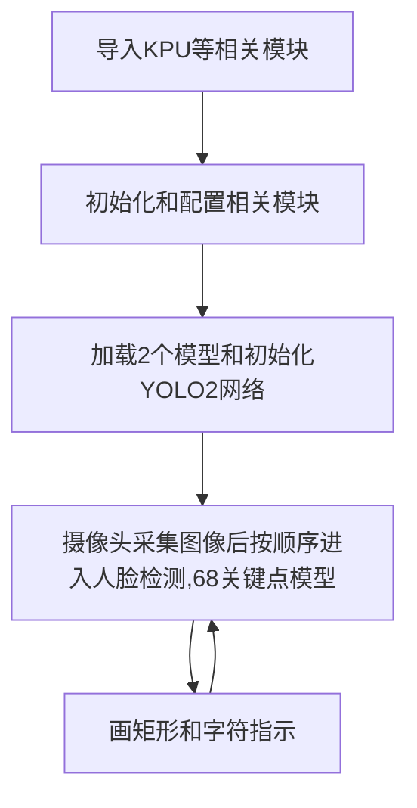
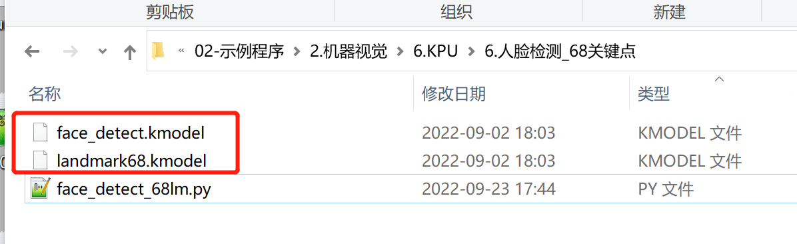
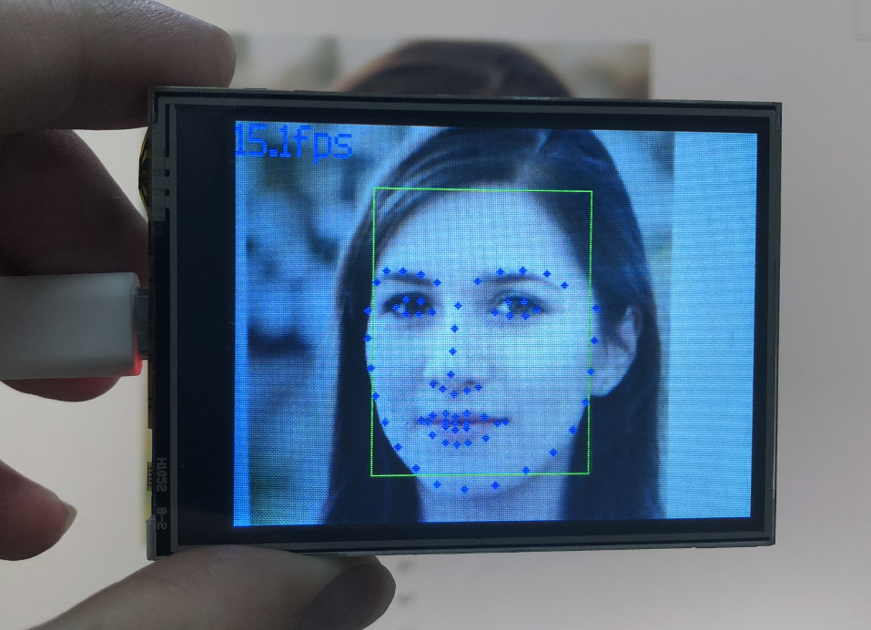

# 人脸轮廓（68关键点）

## 前言
人脸检测前面有学习过，但只检测到是否人脸。本节学习的检测人脸后描绘出68个关键点，相当于人脸轮廓。通过MicroPython编程快速实现这些特征识别。

## 实验目的
编程实现人脸轮廓检测（68个关键点）。

## 实验讲解

本实验还是使用到KPU + YOLO2网络，与前面的区别是这次实验共使用了2个模型来识别。分别是人脸检测模型和人脸68个关键点模型,层层递进。KPU对象说明可参考[KPU简介](./kpu)章节内容。

具体编程思路如下：



## 参考代码

```python
#实验名称：人脸轮廓（68关键点）
#翻译和注释：01Studio

#导入相关模块
import sensor, image, time, lcd
from maix import KPU
import gc

lcd.init()
sensor.reset()

sensor.set_pixformat(sensor.RGB565)
sensor.set_framesize(sensor.QVGA)
sensor.set_vflip(True) #摄像头后置

sensor.skip_frames(time = 500)
clock = time.clock()

od_img = image.Image(size=(320,256), copy_to_fb=False)

#构建KPU对象
#需要导入2个模型，分别是人脸检测模型和68关键点检测模型
anchor = (0.893, 1.463, 0.245, 0.389, 1.55, 2.58, 0.375, 0.594, 3.099, 5.038, 0.057, 0.090, 0.567, 0.904, 0.101, 0.160, 0.159, 0.255)
kpu = KPU()
print("ready load model")
kpu.load_kmodel("/sd/face_detect.kmodel")
kpu.init_yolo2(anchor, anchor_num=9, img_w=320, img_h=240, net_w=320 , net_h=256 ,layer_w=10 ,layer_h=8, threshold=0.7, nms_value=0.2, classes=1)

lm68_kpu = KPU()
print("ready load model")
lm68_kpu.load_kmodel("/sd/landmark68.kmodel")
RATIO = 0.08

while 1:
    gc.collect()
    #print("mem free:",gc.mem_free())
    clock.tick()                    # Update the FPS clock.
    img = sensor.snapshot()
    a =  od_img.draw_image(img, 0,0)
    od_img.pix_to_ai()
    kpu.run_with_output(od_img)
    dect = kpu.regionlayer_yolo2()
    fps = clock.fps()

    #识别到人脸
    if len(dect) > 0:
        print("dect:",dect)
        for l in dect :
            a = img.draw_rectangle(l[0],l[1],l[2],l[3], color=(0, 255, 0))
            x1_t = l[0] - RATIO*l[2]
            x2_t = l[0]+l[2] + RATIO*l[2]
            y1_t = l[1] - RATIO*l[3]
            y2_t = l[1]+l[3] + RATIO*l[3]
            x1 = int(x1_t) if x1_t>1 else 1
            x2 = int(x2_t) if x2_t<320 else 319
            y1 = int(y1_t) if y1_t>1 else 1
            y2 = int(y2_t) if y2_t<256 else 255
            cut_img_w = x2-x1+1
            cut_img_h = y2-y1+1
            #print("cut img ",x1, y1, cut_img_w, cut_img_h)
            face_cut = img.cut(x1,y1,cut_img_w,cut_img_h)
            face_cut_128 = face_cut.resize(128, 128)
            face_cut_128.pix_to_ai()

            #识别68个关键点
            out = lm68_kpu.run_with_output(face_cut_128, getlist=True)
            if out is not None:
                #print("out:",len(out))
                for j in range(68):
                    x = int(KPU.sigmoid(out[2 * j])*cut_img_w + x1)
                    y = int(KPU.sigmoid(out[2 * j + 1])*cut_img_h + y1)
                    #a = img.draw_cross(x, y, size=1, color=(0, 0, 255))
                    a = img.draw_circle(x, y, 2, color=(0, 0, 255), fill=True)
            del (face_cut_128)
            del (face_cut)

    a = img.draw_string(0, 0, "%2.1ffps" %(fps), color=(0, 60, 255), scale=2.0)
    lcd.display(img)
    gc.collect()

kpu.deinit()
lm68_kpu.deinit()
```

## 实验结果

将示例程序中的2个模型文件都拷贝到SD卡根目录中。



运行代码，将摄像头对人脸，可以看到成功特征识别结果**68点人脸轮廓**，如下图：

原图：


识别结果：

