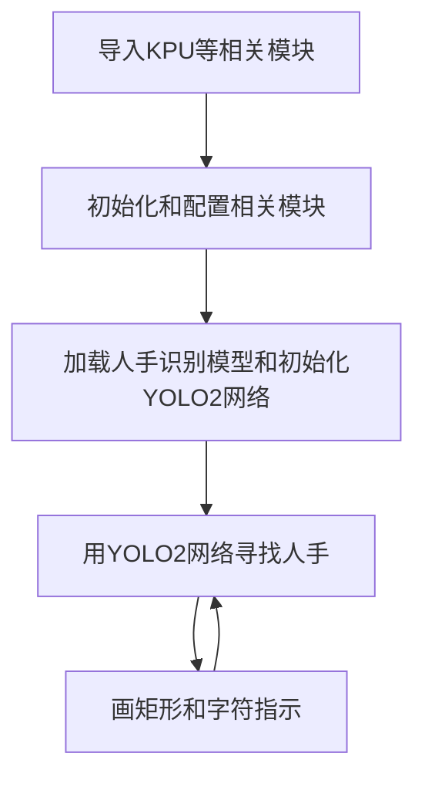

# 人手识别

## 前言
人手识别是判断摄像头画面中有无出现人的手部。本节我们来学习一下如何通过MicroPython编程快速实现人手识别。

## 实验目的
人手识别并通过画框提示。

## 实验讲解

本实验还是使用到YOLO2网络，，结合人手检测模型来识别人手。KPU对象说明可参考[KPU简介](./kpu)章节内容。

具体编程思路如下：



## 参考代码

```python
#实验名称：人手检测
#翻译和注释：01Studio

#导入相关模块

import sensor, image, time, lcd
from maix import KPU
import gc

lcd.init()
sensor.reset()                      # Reset and initialize the sensor. It will
                                    # run automatically, call sensor.run(0) to stop
sensor.set_pixformat(sensor.RGB565) # Set pixel format to RGB565 (or GRAYSCALE)
sensor.set_framesize(sensor.QVGA)   # Set frame size to QVGA (320x240)
sensor.set_vflip(True) #摄像头后置
sensor.skip_frames(time = 1000)     # Wait for settings take effect.
clock = time.clock()                # Create a clock object to track the FPS.

od_img = image.Image(size=(320,256))

#构建KPU对象
anchor = (0.8125, 0.4556, 1.1328, 1.2667, 1.8594, 1.4889, 1.4844, 2.2000, 2.6484, 2.9333)
kpu = KPU()
print("ready load model")

#加载KPU模型，放在SD卡根目录
kpu.load_kmodel("/sd/hand_detect.kmodel")

#需要将kmdel通过固件下载工具下载到0x300000的位置（3M偏移）
#kpu.load_kmodel(0x300000, 1438888)

kpu.init_yolo2(anchor, anchor_num=5, img_w=320, img_h=240, net_w=320 , net_h=256 ,layer_w=10 ,layer_h=8, 
               threshold=0.7, nms_value=0.3, classes=1)

while True:
    gc.collect()
    clock.tick()                    # Update the FPS clock.
    img = sensor.snapshot()
    a = od_img.draw_image(img, 0,0)
    od_img.pix_to_ai()

    #将摄像头采集图片输送到KPU和yolo模型运算。
    kpu.run_with_output(od_img)
    dect = kpu.regionlayer_yolo2()
    fps = clock.fps()

    if len(dect) > 0: #识别到人手
        print("dect:",dect)
        for l in dect :#画矩形
            a = img.draw_rectangle(l[0],l[1],l[2],l[3], color=(0, 255, 0))

    a = img.draw_string(0, 0, "%2.1ffps" %(fps), color=(0, 60, 128), scale=2.0)
    lcd.display(img)

kpu.deinit()
```

## 实验结果

将示例程序中的hand_detect.kmodel模型文件拷贝到SD卡中。

在CanMV IDE中运行上述代码，将摄像头对准手部，可以看到被正确的识别出来：

原图：


识别结果：


本节学习了物体识别，可以看到CanMV K210通过KPU+YOLO2+20class模型轻松实现特定物体识别，而且检测的准确率非常高，也就是结合MicroPython编程我们轻松完成了实验。