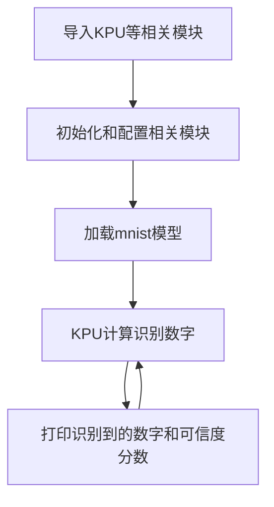
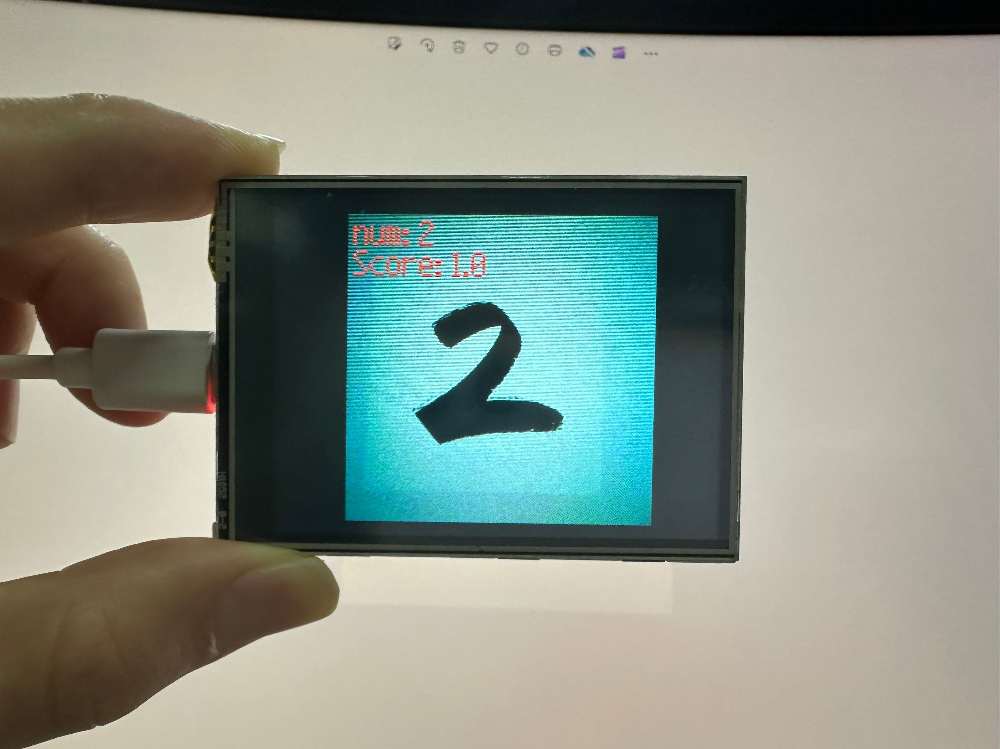

# 数字识别

## 前言
本实验基于MNIST数据集模型实现数字识别。MNIST数据集（Modified National Institute of Standards and Technology database）是一个大型数据库的手写数字图片数据集，广泛应用于机器学习的训练和测试。

## 实验目的
实现数字识别。

## 实验讲解

基于CanMV K210的mnist模型已经制作封装好，用户直接使用KPU来计算即可。KPU对象说明可参考[KPU简介](./kpu)章节内容。

具体编程思路如下：



## 参考代码

```python
#实验名称：数字识别
#实验平台：01Studio CanMV K210

#导入相关模块
import sensor, image, time, lcd
from maix import KPU
import gc

lcd.init(freq=15000000)
sensor.reset()                      # Reset and initialize the sensor. It will
                                    # run automatically, call sensor.run(0) to stop

sensor.set_vflip(1)                 #将摄像头设置成后置方式（所见即所得）
sensor.set_hmirror(1)               #GC0328摄像头（如果使用ov2640摄像头，注释此行。）

sensor.set_pixformat(sensor.RGB565) # Set pixel format to RGB565 (or GRAYSCALE)
sensor.set_framesize(sensor.QVGA)   # Set frame size to QVGA (320x240)
sensor.set_windowing((224, 224))
sensor.skip_frames(time = 1000)     # Wait for settings take effect.
clock = time.clock()                # Create a clock object to track the FPS.

#构建KPU对象
kpu = KPU()

#加载KPU模型，放在SD卡根目录
kpu.load_kmodel("/sd/uint8_mnist_cnn_model.kmodel")

while True:

    gc.collect()
    img = sensor.snapshot()
    img_mnist1=img.to_grayscale(1)        #convert to gray
    img_mnist2=img_mnist1.resize(112,112)
    img_mnist2.invert()                 #invert picture as mnist need
    img_mnist2.strech_char(1)           #preprocessing pictures, eliminate dark corner
    img_mnist2.pix_to_ai()

    #将摄像头采集图片输送到KPU运算。
    out = kpu.run_with_output(img_mnist2, getlist=True)
    max_mnist = max(out)
    index_mnist = out.index(max_mnist) #计算识别的数字
    score = KPU.sigmoid(max_mnist)    #可信度分数，最大值为1
    display_str = "num: %d" % index_mnist

    #打印识别的数字和可信度分数
    print(display_str)
    print(score)

    #LCD显示识别的数字和可信度分数
    img.draw_string(4,3,display_str,color=(255,0,0),scale=2)
    img.draw_string(4,25,'Score: '+ str(score),color=(255,0,0),scale=2)

    lcd.display(img)

kpu.deinit()

```

## 实验结果

将资料包例程源码中的 `uint8_mnist_cnn_model.kmodel` 模型文件拷贝到SD卡中。

在CanMV IDE中运行上述代码，将摄像头对准下方图片，可以看到数字被正确的识别出来：

原图：


识别结果：


