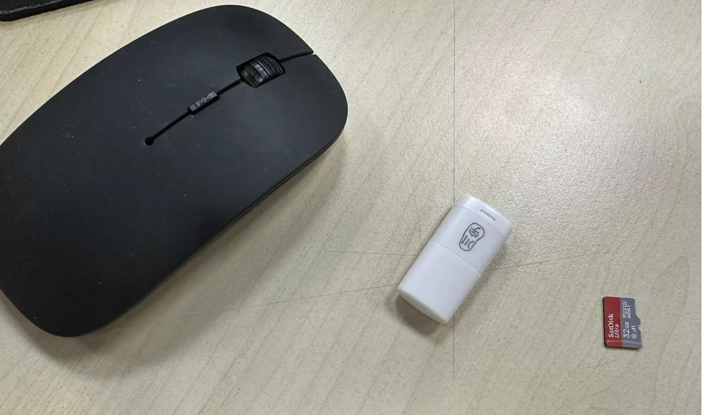
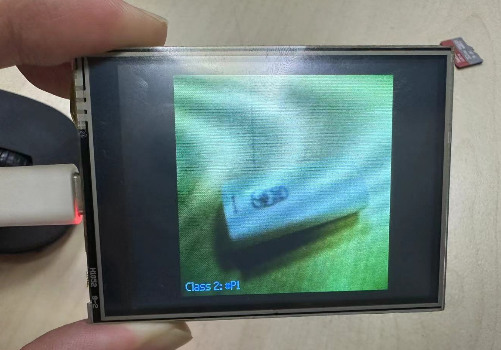

# 自分类学习

## 前言
前面视觉实验都是基于现成模型来进行识别，当我们想识别几个自定义不同物体时，可以使用自分类学习来实现拍照--训练--识别过程。

## 实验目的
自分类学习识别3种物体。本实验通过自分类学习识别鼠标、读卡器和SD卡。




## 实验讲解

CanMV K210提供自分类学习用到的模型以及代码，用户直接使用KPU来计算即可。KPU对象说明可参考[KPU简介](./kpu)章节内容。

具体编程思路如下：

```mermaid
graph TD
    导入KPU等相关模块 --> 初始化和配置相关模块  --> 加载自分类学习模型 --> 分别对3种物品拍照采集 --> 对3种物体照片进行训练 --> 识别物体;
```

## 参考代码

```python
'''
#实验名称：自分类学习
#实验平台：01Studio CanMV K210

此示例展示利用KPU神经网络,进行自分类学习的功能。
它共有三种模式：初始化、训练、分类。
操作指南：
1. 初始化模式：按下boot键，进入初始化模式，此时屏幕显示“Init”。
2. 训练模式：按下boot键，进入训练模式，此时屏幕显示“Train object 1”。
    按下boot键，拍摄一张图片，屏幕显示“Train object 1\r\n\r\nBoot key to take #P2”。
    按下boot键，拍摄一张图片，屏幕显示“Train object 1\r\n\r\nBoot key to take #P3”。
3. 分类模式：按下boot键，进入分类模式，此时屏幕显示“Classification”。
'''

import gc
import lcd
import sensor
import time
from maix import GPIO
from maix import KPU
from board import board_info
from fpioa_manager import fm
from image import Image


####################################################################################################################
class STATE(object):
    IDLE = 0
    INIT = 1
    TRAIN_CLASS_1 = 2
    TRAIN_CLASS_2 = 3
    TRAIN_CLASS_3 = 4
    CLASSIFY = 5
    STATE_MAX = 6


class EVENT(object):
    POWER_ON = 0            # virtual event, 用于上电初始化
    BOOT_KEY = 1            # boot键按下
    BOOT_KEY_LONG_PRESS = 2 # boot键长按约3秒
    EVENT_NEXT_MODE = 3     # virtual event, 用于切换到下一个模式
    EVENT_MAX = 4


class StateMachine(object):
    def __init__(self, state_handlers, event_handlers, transitions):
        self.previous_state = STATE.IDLE
        self.current_state = STATE.IDLE
        self.state_handlers = state_handlers
        self.event_handlers = event_handlers
        self.transitions = transitions

    def reset(self):
        '''
        重置状态机
        :return:
        '''
        self.previous_state = STATE.IDLE
        self.current_state = STATE.IDLE

    def get_next_state(self, cur_state, cur_event):
        '''
        根据当着状态和event, 从transitions表里查找出下一个状态
        :param cur_state:
        :param cur_event:
        :return:
            next_state: 下一状态
            None: 找不到对应状态
        '''
        for cur, next, event in self.transitions:
            if cur == cur_state and event == cur_event:
                return next
        return None

    # execute action before enter current state
    def enter_state_action(self, state, event):
        '''
        执行当前状态对应的进入action
        :param state: 当前状态
        :param event: 当前event
        :return:
        '''
        try:
            if self.state_handlers[state][0]:
                self.state_handlers[state][0](self, state, event)
        except Exception as e:
            print(e)

    # execute action of current state
    def execute_state_action(self, state, event):
        '''
        执行当前状态action函数
        :param state:   当前状态
        :param event:   当前event
        :return:
        '''
        try:
            if self.state_handlers[state][1]:
                self.state_handlers[state][1](self, state, event)
        except Exception as e:
            print(e)

    # execute action when exit state
    def exit_state_action(self, state, event):
        '''
        执行当前状态的退出action
        :param state: 当前状态
        :param event: 当前event
        :return:
        '''
        try:
            if self.state_handlers[state][2]:
                self.state_handlers[state][2](self, state, event)
        except Exception as e:
            print(e)

    def emit_event(self, event):
        '''
        发送event。根据当前状态和event，查找下一个状态，然后执行对应的action。
        :param event: 要发送的event
        :return:
        '''
        next_state = self.get_next_state(self.current_state, event)

        # execute enter function and exit function when state changed
        if next_state != None and next_state != self.current_state:
            self.exit_state_action(self.previous_state, event)
            self.previous_state = self.current_state
            self.current_state = next_state
            self.enter_state_action(self.current_state, event)
            print("event valid: {}, cur: {}, next: {}".format(event, self.current_state, next_state))

        # call state action for each event
        self.execute_state_action(self.current_state, event)

    def engine(self):
        '''
        状态机引擎，用于执行状态机
        :return:
        '''
        pass

def restart(self):
    '''
    重新启动状态机程序
    :return:
    '''
    global features
    self.reset()
    features.clear()
    self.emit_event(EVENT.POWER_ON)


def enter_state_idle(self, state, event):
    print("enter state: idle")


def exit_state_idle(self, state, event):
    print("exit state: idle")


def state_idle(self, state, event):
    global central_msg
    print("current state: idle")
    central_msg = None


def enter_state_init(self, state, event):
    global img_init
    print("enter state: init")
    img_init = Image(size=(lcd.width(), lcd.height()))


def exit_state_init(self, state, event):
    print("exit state: init")
    del img_init


def state_init(self, state, event):
    print("current state: init, event: {}".format(event))

    # switch to next state when boot key is pressed
    if event == EVENT.BOOT_KEY:
        self.emit_event(EVENT.EVENT_NEXT_MODE)
    elif event == EVENT.BOOT_KEY_LONG_PRESS:
        restart(self)
        return


def enter_state_train_class_1(self, state, event):
    print("enter state: train class 1")
    global train_pic_cnt, central_msg, bottom_msg
    train_pic_cnt = 0
    central_msg = "Train class 1"
    bottom_msg = "Take pictures of 1st class"


def exit_state_train_class_1(self, state, event):
    print("exit state: train class 1")


def state_train_class_1(self, state, event):
    global kpu, central_msg, bottom_msg, features, train_pic_cnt
    global state_machine
    print("current state: class 1")

    if event == EVENT.BOOT_KEY_LONG_PRESS:
        restart(self)
        return

    if train_pic_cnt == 0:  # 0 is used for prompt only
        features.append([])
        train_pic_cnt += 1
    elif train_pic_cnt <= max_train_pic:
        central_msg = None
        img = sensor.snapshot()
        feature = kpu.run_with_output(img, get_feature=True)
        features[0].append(feature)
        bottom_msg = "Class 1: #P{}".format(train_pic_cnt)
        train_pic_cnt += 1
    else:
        state_machine.emit_event(EVENT.EVENT_NEXT_MODE)


def enter_state_train_class_2(self, state, event):
    print("enter state: train class 2")
    global train_pic_cnt, central_msg, bottom_msg
    train_pic_cnt = 0
    central_msg = "Train class 2"
    bottom_msg = "Change to 2nd class please"


def exit_state_train_class_2(self, state, event):
    print("exit state: train class 2")


def state_train_class_2(self, state, event):
    global kpu, central_msg, bottom_msg, features, train_pic_cnt
    global state_machine
    print("current state: class 2")

    if event == EVENT.BOOT_KEY_LONG_PRESS:
        restart(self)
        return

    if train_pic_cnt == 0:
        features.append([])
        train_pic_cnt += 1
    elif train_pic_cnt <= max_train_pic:
        central_msg = None
        img = sensor.snapshot()
        feature = kpu.run_with_output(img, get_feature=True)
        features[1].append(feature)
        bottom_msg = "Class 2: #P{}".format(train_pic_cnt)
        train_pic_cnt += 1
    else:
        state_machine.emit_event(EVENT.EVENT_NEXT_MODE)


def enter_state_train_class_3(self, state, event):
    print("enter state: train class 3")
    global train_pic_cnt, central_msg, bottom_msg
    train_pic_cnt = 0
    central_msg = "Train class 3"
    bottom_msg = "Change to 3rd class please"


def exit_state_train_class_3(self, state, event):
    print("exit state: train class 3")


def state_train_class_3(self, state, event):
    global kpu, central_msg, bottom_msg, features, train_pic_cnt
    global state_machine
    print("current state: class 3")

    if event == EVENT.BOOT_KEY_LONG_PRESS:
        restart(self)
        return

    if train_pic_cnt == 0:
        features.append([])
        train_pic_cnt += 1
    elif train_pic_cnt <= max_train_pic:
        central_msg = None
        img = sensor.snapshot()
        feature = kpu.run_with_output(img, get_feature=True)
        features[2].append(feature)
        bottom_msg = "Class 3: #P{}".format(train_pic_cnt)
        train_pic_cnt += 1
    else:
        state_machine.emit_event(EVENT.EVENT_NEXT_MODE)


def enter_state_classify(self, state, event):
    global central_msg, bottom_msg
    print("enter state: classify")
    central_msg = "Classification"
    bottom_msg = "Training complete! Start classification"


def exit_state_classify(self, state, event):
    print("exit state: classify")


def state_classify(self, state, event):
    global central_msg, bottom_msg
    print("current state: classify, {}, {}".format(state, event))
    if event == EVENT.BOOT_KEY:
        central_msg = None
    if event == EVENT.BOOT_KEY_LONG_PRESS:
        restart(self)
        return


def event_power_on(self, value=None):
    print("emit event: power_on")


def event_press_boot_key(self, value=None):
    global state_machine
    print("emit event: boot_key")


def event_long_press_boot_key(self, value=None):
    global state_machine
    print("emit event: boot_key_long_press")


# state action table format:
#   state: [enter_state_handler, execute_state_handler, exit_state_handler]
state_handlers = {
    STATE.IDLE: [enter_state_idle, state_idle, exit_state_idle],
    STATE.INIT: [enter_state_init, state_init, exit_state_init],
    STATE.TRAIN_CLASS_1: [enter_state_train_class_1, state_train_class_1, exit_state_train_class_1],
    STATE.TRAIN_CLASS_2: [enter_state_train_class_2, state_train_class_2, exit_state_train_class_2],
    STATE.TRAIN_CLASS_3: [enter_state_train_class_3, state_train_class_3, exit_state_train_class_3],
    STATE.CLASSIFY: [enter_state_classify, state_classify, exit_state_classify]
}

# event action table, can be enabled while needed
event_handlers = {
    EVENT.POWER_ON: event_power_on,
    EVENT.BOOT_KEY: event_press_boot_key,
    EVENT.BOOT_KEY_LONG_PRESS: event_long_press_boot_key
}

# Transition table
transitions = [
    [STATE.IDLE, STATE.INIT, EVENT.POWER_ON],
    [STATE.INIT, STATE.TRAIN_CLASS_1, EVENT.EVENT_NEXT_MODE],
    [STATE.TRAIN_CLASS_1, STATE.TRAIN_CLASS_2, EVENT.EVENT_NEXT_MODE],
    [STATE.TRAIN_CLASS_2, STATE.TRAIN_CLASS_3, EVENT.EVENT_NEXT_MODE],
    [STATE.TRAIN_CLASS_3, STATE.CLASSIFY, EVENT.EVENT_NEXT_MODE]
]


####################################################################################################################
class Button(object):
    DEBOUNCE_THRESHOLD = 30  # 消抖阈值
    LONG_PRESS_THRESHOLD = 1000  # 长按阈值
    # Internal  key states
    IDLE = 0
    DEBOUNCE = 1
    SHORT_PRESS = 2
    LONG_PRESS = 3

    def __init__(self, state_machine):
        self._state = Button.IDLE
        self._key_ticks = 0
        self._pre_key_state = 1
        self.SHORT_PRESS_BUF = None
        self.st = state_machine

    def reset(self):
        self._state = Button.IDLE
        self._key_ticks = 0
        self._pre_key_state = 1
        self.SHORT_PRESS_BUF = None

    def key_up(self, delta):
        # print("up:{}".format(delta))
        # key up时，有缓存的key信息就发出去，没有的话直接复位状态
        if self.SHORT_PRESS_BUF:
            self.st.emit_event(self.SHORT_PRESS_BUF)
        self.reset()

    def key_down(self, delta):
        # print("dn:{},t:{}".format(delta, self._key_ticks))
        if self._state == Button.IDLE:
            self._key_ticks += delta
            if self._key_ticks > Button.DEBOUNCE_THRESHOLD:
                # main loop period过大时，会直接跳过去抖阶段
                self._state = Button.SHORT_PRESS
                self.SHORT_PRESS_BUF = EVENT.BOOT_KEY  # key_up 时发送
            else:
                self._state = Button.DEBOUNCE
        elif self._state == Button.DEBOUNCE:
            self._key_ticks += delta
            if self._key_ticks > Button.DEBOUNCE_THRESHOLD:
                self._state = Button.SHORT_PRESS
                self.SHORT_PRESS_BUF = EVENT.BOOT_KEY  # key_up 时发送
        elif self._state == Button.SHORT_PRESS:
            self._key_ticks += delta
            if self._key_ticks > Button.LONG_PRESS_THRESHOLD:
                self._state = Button.LONG_PRESS
                self.SHORT_PRESS_BUF = None  # 检测到长按，将之前可能存在的短按buffer清除，以防发两个key event出去
                self.st.emit_event(EVENT.BOOT_KEY_LONG_PRESS)
        elif self._state == Button.LONG_PRESS:
            self._key_ticks += delta
            # 最迟 LONG_PRESS 发出信号，再以后就忽略，不需要处理。key_up时再退出状态机。
            pass
        else:
            pass


####################################################################################################################
# 未启用 state machine 的主循环，所以这里将需要循环执行的函数放在while True里
def loop_init():
    global lcd, img_init
    if state_machine.current_state != STATE.INIT:
        return

    img_init.draw_rectangle(0, 0, lcd.width(), lcd.height(), color=(0, 0, 255), fill=True, thickness=2)
    img_init.draw_string(65, 90, "Self Learning Demo", color=(255, 255, 255), scale=2)
    img_init.draw_string(5, 210, "short press:   next", color=(255, 255, 255), scale=1)
    img_init.draw_string(5, 225, "long press:      restart", color=(255, 255, 255), scale=1)
    lcd.display(img_init)


def loop_capture():
    global central_msg, bottom_msg
    img = sensor.snapshot()
    if central_msg:
        img.draw_rectangle(0, 90, lcd.width(), 22, color=(0, 0, 255), fill=True, thickness=2)
        img.draw_string(55, 90, central_msg, color=(255, 255, 255), scale=2)
    if bottom_msg:
        img.draw_string(5, 208, bottom_msg, color=(0, 0, 255), scale=1)
    lcd.display(img)


def loop_classify():
    global central_msg, bottom_msg
    img = sensor.snapshot()

    scores = []
    feature = kpu.run_with_output(img, get_feature=True)
    high = 0
    index = 0
    for j in range(len(features)):
        for f in features[j]:
            score = kpu.feature_compare(f, feature)
            if score > high:
                high = score
                index = j
    if high > THRESHOLD:
        bottom_msg = "class:{},score:{:2.1f}".format(index + 1, high)
    else:
        bottom_msg = None

    # display info
    if central_msg:
        print("central_msg:{}".format(central_msg))
        img.draw_rectangle(0, 90, lcd.width(), 22, color=(0, 255, 0), fill=True, thickness=2)
        img.draw_string(55, 90, central_msg, color=(255, 255, 255), scale=2)
    if bottom_msg:
        print("bottom_msg:{}".format(bottom_msg))
        img.draw_string(5, 208, bottom_msg, color=(0, 255, 0), scale=1)
    lcd.display(img)

####################################################################################################################
# main loop
features = []
THRESHOLD = 98.5    # 比对阈值，越大越严格
train_pic_cnt = 0   # 当前分类已训练图片数量
max_train_pic = 5   # 每个类别最多训练图片数量

central_msg = None  # 屏幕中间显示的信息
bottom_msg = None   # 屏幕底部显示的信息

fm.register(board_info.BOOT_KEY, fm.fpioa.GPIOHS0)
boot_gpio = GPIO(GPIO.GPIOHS0, GPIO.IN)

lcd.init()
sensor.reset()  # Reset and initialize the sensor. It will

sensor.set_vflip(1)                 #将摄像头设置成后置方式（所见即所得）
sensor.set_hmirror(1)               #GC0328摄像头（如果使用ov2640摄像头，注释此行。）

# run automatically, call sensor.run(0) to stop
sensor.set_pixformat(sensor.RGB565)  # Set pixel format to RGB565 (or GRAYSCALE)
sensor.set_framesize(sensor.QVGA)  # Set frame size to QVGA (320x240)
sensor.set_windowing((224, 224))
sensor.skip_frames(time=500)  # Wait for settings take effect.

kpu = KPU()
print("ready load model")
kpu.load_kmodel("/sd/mb-0.25.kmodel")

state_machine = StateMachine(state_handlers, event_handlers, transitions)
state_machine.emit_event(EVENT.POWER_ON)

btn_ticks_prev = time.ticks_ms()
boot_btn = Button(state_machine)
while True:
    gc.collect()

    # 计算boot key被压下或弹起的时间，用于消抖和长按检测, 并且向state machine发送事件
    btn_ticks_cur = time.ticks_ms()
    delta = time.ticks_diff(btn_ticks_cur, btn_ticks_prev)
    btn_ticks_prev = btn_ticks_cur
    if boot_gpio.value() == 0:
        boot_btn.key_down(delta)
    else:
        boot_btn.key_up(delta)

    # 未启用 state machine 的主循环，所以这里将需要循环执行的函数放在while True里
    if state_machine.current_state == STATE.INIT:
        loop_init()

    elif state_machine.current_state == STATE.CLASSIFY:
        loop_classify()

    elif state_machine.current_state == STATE.TRAIN_CLASS_1 or state_machine.current_state == STATE.TRAIN_CLASS_2 \
            or state_machine.current_state == STATE.TRAIN_CLASS_3:
        loop_capture()


```

## 实验结果

将资料包例程源码中的 `mb-0.25.kmodel` 模型文件拷贝到SD卡中。

在CanMV IDE中运行上述代码，按LCD提示进行操作,分别对鼠标、读卡器、SD卡 3个物体进行拍摄5张照片操作录入。




完成后将摄像头正对物体，可以看到物体被成功识别出来（按编号区分）：


