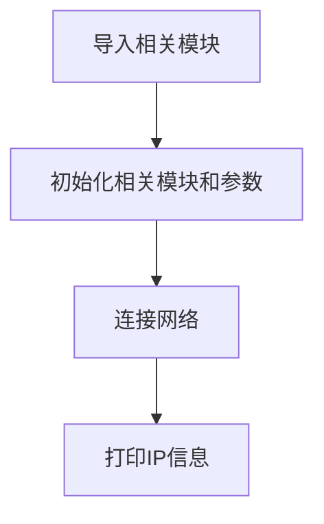
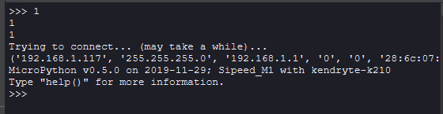

# 连接无线路由器

## 前言
WIFI是物联网中非常重要的角色，现在基本上家家户户都有WIFI网络了，通过WIFI接入到互联网，成了智能家居产品普遍的选择。而要想上网，首先需要连接上无线路由器。这一节我们就来学习如何通过WiFi扩展模块让K210通过MicroPython编程实现连上路由器。

## 实验目的
编程实现连接路由器，将IP地址等相关信息通过串口终端打印（只支持2.4G网络）。

## 实验讲解

连接路由器上网是我们每天都做的事情，日常生活中我们只需要知道路由器的账号和密码，就能使用电脑或者手机连接到无线路由器，然后上网冲浪。

CanMV已经集成了network模块，开发者使用内置的network模块函数可以非常方便地连接上路由器。

我们先来看看network基于WiFi（WLAN模块）的构造函数和使用方法。

## network对象

### 构造函数
```python
wlan = network.ESP8285(uart)
```
构建WIFI模块连接对象。ESP8285表示模块型号 (ESP8285和ESP8266兼容)。 
- `uart`: 串口对象


### 使用方法
```python
wlan.scan()
```
扫描允许访问的SSID。

<br></br>

```python
wlan.isconnected()
```
检查设备是否已经连接上。返回 `Ture`:已连接；`False`:未连接。

<br></br>

```python
wlan.connect(ssid,passwork)
```
WIFI连接。
- `ssid`: 账号；
- `passwork` : 密码；

<br></br>

```python
wlan.ifconfig()
```
查看WiFi连接信息。

<br></br>

```python
wlan.disconnected()
```
断开连接。

<br></br>

```python
wlan.enable_ap(ssid,key,chl=5,ecn=3)
```
AP热点使能；
- `ssid`: 热点名称；
- `key`: 密码；
- `chl`: wifi信号的信道；
- `ecn`: 加密方法

<br></br>

```python
wlan.disable_ap()
```
关闭热点

<br></br>

可以看到MicroPython通过模块封装，让WIFI联网变得非常简单。模块包含热点AP模块和客户端STA模式，热点AP是指电脑端直接连接K210发出的热点实现连接，但这样你的电脑就不能上网了，因此我们一般情况下都是使用STA模式。也就是电脑和设备同时连接到相同网段的路由器上。

代码编写流程如下：




## 参考代码

```python
# 实验名称：WiFi无线连接实验（串口WiFi模块）
#
# 说明：CanMV K210通过WiFi拓展模块连接无线路由器
#
# 作者：01Studio

import network, time
from machine import UART
from maix import GPIO
from fpioa_manager import fm

SSID='01Studio' # WiFi 账号
KEY='88888888'  # WiFi 密码

###### WiFi模块初始化 ######
#使能引脚初始化
fm.register(25, fm.fpioa.GPIOHS0, force=True)
wifi_en=GPIO(GPIO.GPIOHS0, GPIO.OUT)

#串口初始化
fm.register(13, fm.fpioa.UART2_TX, force=True)
fm.register(15, fm.fpioa.UART2_RX, force=True)
uart = UART(UART.UART2,115200, read_buf_len=4096)

#使能函数
def wifi_enable(en):
    global wifi_en
    wifi_en.value(en)

#使能wifi模块
wifi_enable(1)
time.sleep(1)

#构建WiFi对象
wlan = network.ESP8285(uart)

#正在连接印提示
print("Trying to connect... (may take a while)...")

#连接网络
wlan.connect(SSID,KEY)

#打印IP相关信息
print(wlan.ifconfig())
```

## 实验结果

运行程序，可以观察到连接成功后串口终端打印IP等信息。



本节是WIFI应用的基础，成功连接到无线路由器的实验后，后面就可以做socket和MQTT等相关网络通信的应用了。