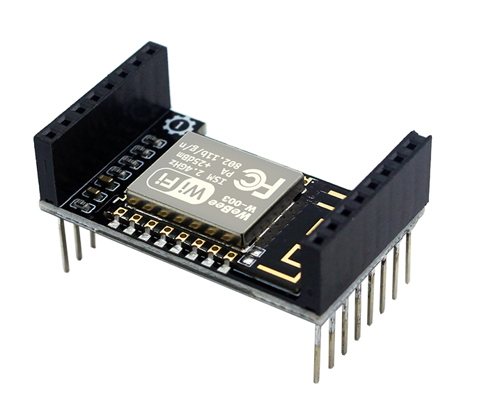
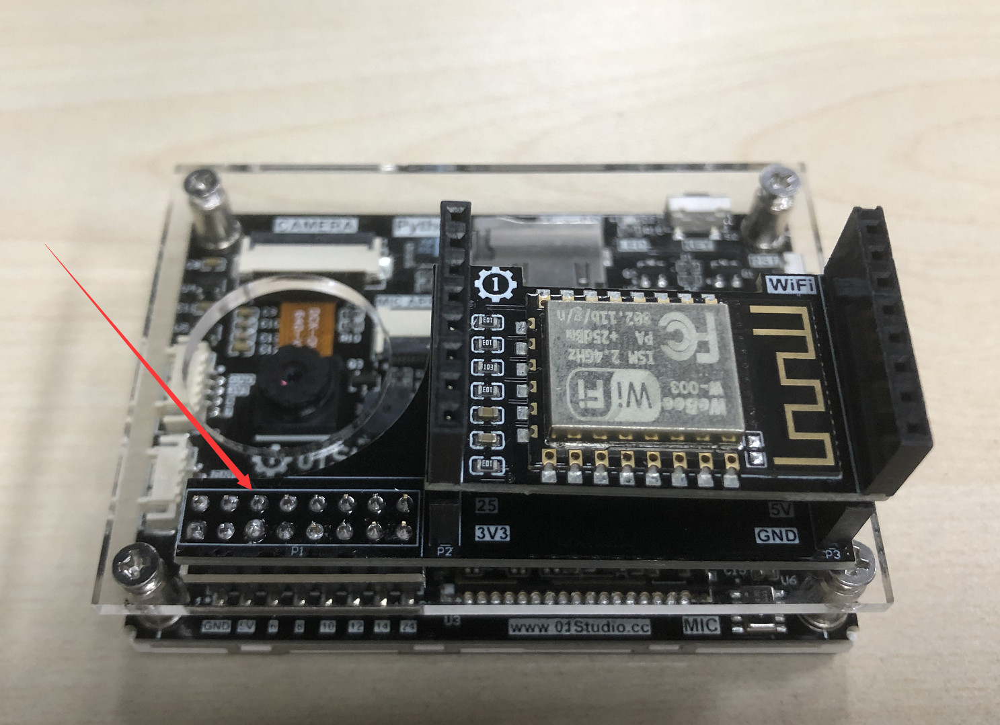

# WiFi模块

CanMV K210可以通过排针转接板 + WiFi模块连接无线路由器，从而实现Socket、MQTT、等相关无线和物联网应用。模块的接口和功能参数介绍如下：

|  参数说明 |
|  :---:  | :---:  |
| 主控  | ESP8266 |
| 控制方式  | UART（串口）|
| WiFi协议  | 802.11 b/g/n |
| 加密类型  | WPA/WPA2 |
| 频段  | 2.4G |
| 工作电流  | 80mA (3.3V)|
| 模块尺寸  | 3.0*2.5cm |
| 适用平台  | CanMV K210 |

WiFi模块需要通过转接板跟CanMV K210引脚连接。

