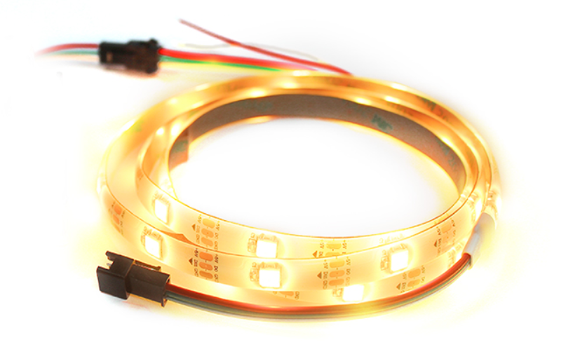
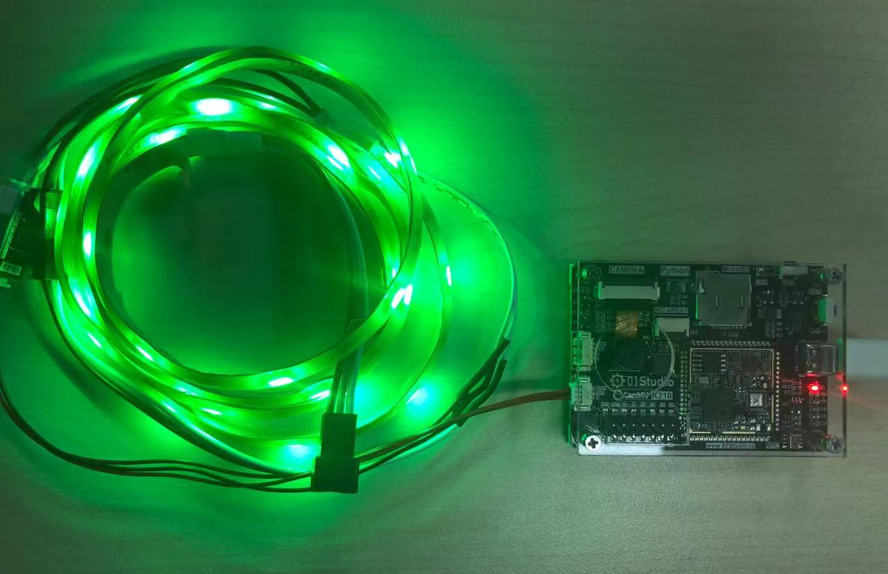

# Neopixel彩灯

## 前言
RGB灯带是彩灯的一种，我们看到长长的灯带以及LED彩色显示屏，都是采用一个个灯珠组合而成。在本章节我们将通过编程实现RGB灯带的控制，可以应用到家居布置、节日气氛的场景中去。

## 实验目的
通过编程实现灯带循环显示红色（RED）、绿色（GREEN）和蓝色（BLUE）。

## 实验讲解

先来介绍一下本实验用到的RGB灯带。



该灯带为3线接口，长1米，有30颗灯珠，每个灯珠里面都有一个驱动IC，型号是WS2812B，单总线驱动。每个灯珠首尾相连。灯带末端预留了接口可以串联更多的灯带。也就是说在电源充足情况下只需要通过1个GPIO口就可以控制了数十上百的灯珠了。


在了解了接线方式后，我们知道颜色是由最基本的三种颜色的不同亮度混合出新颜色。这3个最基本的颜色顺序分别是红，绿，蓝（RGB）。这里每个颜色的亮度级别从0-255,0表示没有，255表示最亮。如（255,0,0）则表示红色最亮。GPIO口就是将这些数据逐一发送给灯带。

K210的MicroPython固件集成了彩灯驱动模块，适用于WS2812B驱动的灯珠。因此我们可以直接使用。说明如下：


## ws2812对象

### 构造函数
```python
np=ws2812(pin, num)
```
构建灯带对象。

- `pin`: 控制引脚；
- `num`: 灯珠数量。

### 使用方法
```python
np.set_led=(i, color)
```
设置第i个灯珠参数。
- `i`: 第i个灯珠；
- `color`: 灯珠颜色，RGB表示。

<br></br>

```python
np.display()
```
往灯带写入设置的数据。

更多用法请阅读官方文档：<br></br>
https://developer.canaan-creative.com/canmv/main/canmv/library/canmv/maix/maix.GPIO.html

代码编程流程图如下：


```mermaid
graph TD
    导入ws2812模块 --> 初始化相关模块 --> 显示指定颜色 --> 延时 --> 显示指定颜色;
```

## 参考代码

```python
'''
实验名称：RGB彩灯控制
版本：v1.0
日期：2022.9
作者：01Studio 【www.01Studio.cc】
说明：通过编程实现灯带红、绿、蓝不同颜色的变化。
'''

from modules import ws2812
import utime

#定义红、绿、蓝三种颜色
RED=(255,0,0)
GREEN=(0,255,0)
BLUE=(0,0,255)

#定义RGB灯带对象,引脚8连接，灯珠数量：30。
np = ws2812(8,30)

while True:

    #显示红色
    for i in range(30):
        np.set_led(i,RED)
    np.display()
    utime.sleep(1)

    #显示绿色
    for i in range(30):
        np.set_led(i,GREEN)
    np.display()
    utime.sleep(1)

    #显示蓝色
    for i in range(30):
        np.set_led(i,BLUE)
    np.display()
    utime.sleep(1)
```

## 实验结果

将灯带通过3P转接线连接到CanMV K210开发板。运行代码，可以看到灯带的颜色在红、绿、蓝三色中循环变化。



RGB灯带的单总线特点使得我们可以轻易的增加和减少灯带的数量而无需过多的修改程序。但需要注意的是如果灯带数量过多，那么需要外接电源供电，否则会因为电流不足而影响使用。
