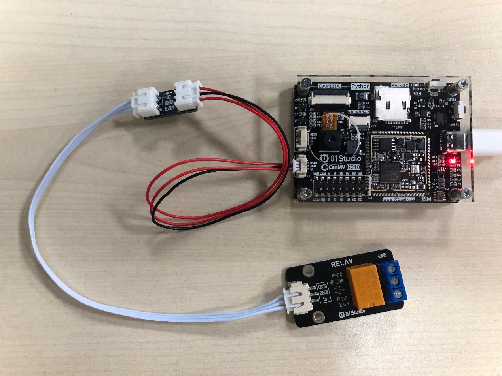
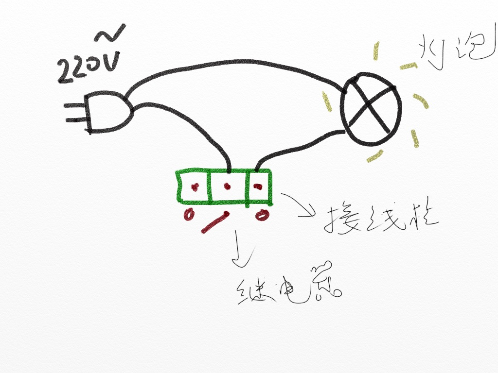
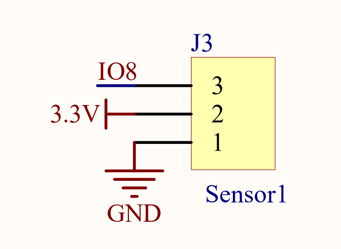
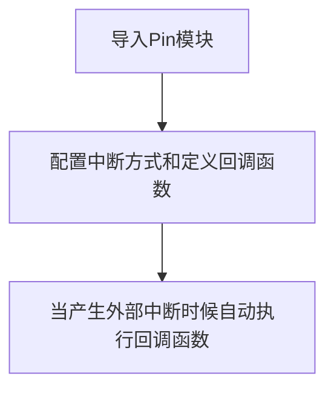
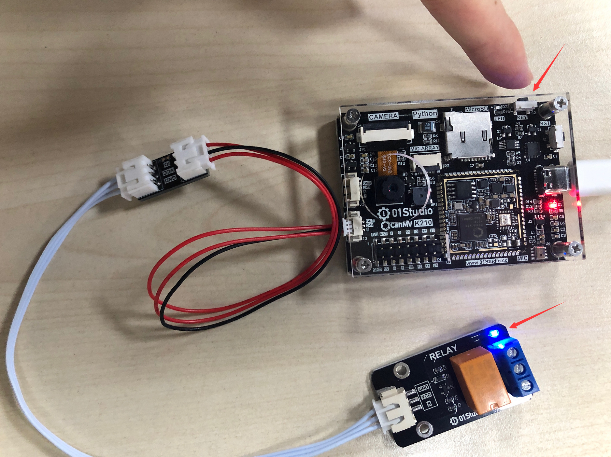

# 继电器

## 前言
我们知道我们的开发板GPIO输出的电平是3.3V的，这是不能直接控制一些高电压的设备，比如电灯（220V）。这时候就可以使用我们常用的低压控制高压元件—继电器。

## 实验目的
使用按键控制继电器通断。

## 实验讲解

下图是01Studio的继电器模块，可以使用3.3V供电，CanMV K210引出IO可以直接连接控制端。，左侧低压控制接口主要有供电引脚和信号控制引脚（供电电压一般为3.3V，具体以厂家参数为准）。右侧蓝色为高压部分，可连接220V电器。

:::tip 提示

务必使用3.3V电平控制的继电器，因为核桃派GPIO输出为3.3V，使用5V控制的继电器操作不当可能会烧坏核桃派开发板。

:::


CanMV K210开发套件和继电器模块可以通过下面方式连接：



继电器可以理解成是一个开关，相当于我们平时家里面的电灯开关面板一样，只是现在使用单片机的GPIO来控制。继电器低压控制高压电器一个比较典型的接线图如下图所示：




01Studio的继电器模块的控制原理非常简单，跟LED控制方式一样，只是使用低电平‘0’表示继电器开，高电平‘1’表示继电器关。

我们可以参考基础实验—按键外部中断实验例程来使用继电器，请参考 [外部中断](../basic_examples/exti.md) 章节内容，这里不再重复！

继电器连接到CanMV 的3P传感器引脚，相当于连接到K210的引脚IO8。



代码编写流程如下：




## 参考代码

```python
'''
实验名称：继电器
版本： v1.0
日期： 2022.9
作者： 01Studio
说明：通过按键改变继电器状态（外部中断方式）
'''

from maix import GPIO
from fpioa_manager import fm
import utime

#注册IO，注意高速GPIO口才有中断
fm.register(8, fm.fpioa.GPIO0)
fm.register(16, fm.fpioa.GPIOHS0)

#构建lED和KEY对象
relay=GPIO(GPIO.GPIO0,GPIO.OUT,value=1)
KEY=GPIO(GPIO.GPIOHS0, GPIO.IN, GPIO.PULL_UP)

#LED状态表示
state = 1

#中断回调函数
def fun(KEY):
    global state
    utime.sleep_ms(10) #消除抖动
    if KEY.value()==0: #确认按键被按下
        state = not state
        relay.value(state)

#开启中断，下降沿触发
KEY.irq(fun, GPIO.IRQ_FALLING)
```

## 实验结果

由于继电器模块是2.54mm排针间距接口，而CanMV K210是1.25mm排针间距接口，因此需要使用01Studio的1.25mm转2.54mm 3P转接线+转接板来连接。


运行代码，可以通过按键来控制继电器通断：



继电器的控制方式非常简单，用途非常广。只需要一个简单的GPIO高低电平即可实现控制。