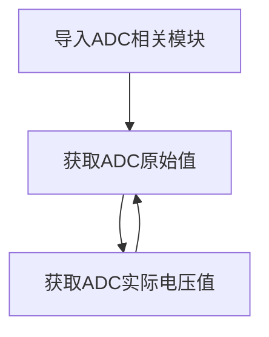
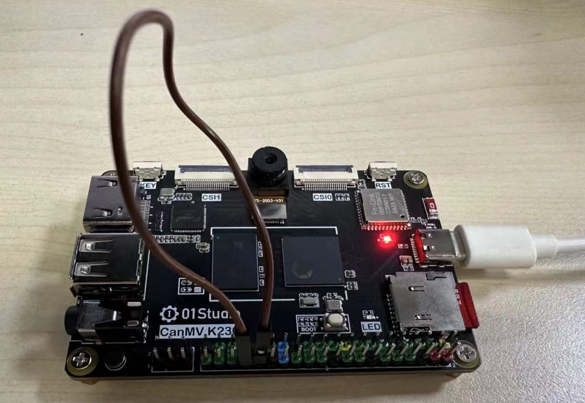
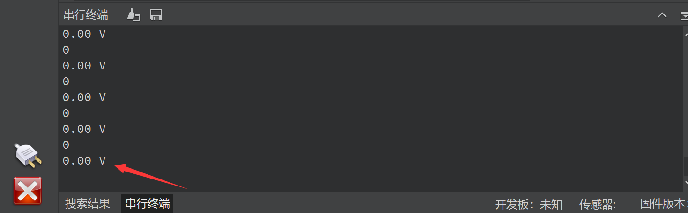

# ADC（电压测量）

## 前言
ADC(analog to digital conversion) 模拟数字转换。意思就是将模拟信号转化成数字信号，由于单片机只能识别二级制数字，所以外界模拟信号常常会通过ADC转换成其可以识别的数字信息。常见的应用就是将变化的电压转成数字信号实现对电压值测量。


## 实验目的
学习ADC编程。

## 实验讲解

K230内部包含一个ADC硬件模块，有6个通道，采样分辨率为12bit(0-4095)，采样速率为1M。01Studio CanMV K230开发板引出0~3共4个通道。其中通道0、1量程为0-3.6V，通道2、3量程为0-1.8V。** 请勿超出测量量程, 可能导致主控芯片烧坏!**

我们来看看ADC模块的构造函数和使用方法。

## ADC对象

### 构造函数
```python
adc = machine.ADC(channel)
```
构建ADC对象，ADC通道如下：

- `channel` ：通道选择1-3，如：ADC(0)。 

    - `0`: ADC0（排针32引脚，量程0-3.6V）
    - `1`: ADC1（排针36引脚，量程0-3.6V）
    - `2`: ADC2（排针38引脚，量程0-1.8V）
    - `3`: ADC3（排针40引脚，量程0-1.8V）

### 使用方法
```python
adc.read_u16()
```
获取ADC值，测量精度是12位，返回0-4095。其中通道0、1量程为0-3.6V，通道2、3量程为0-1.8V。

<br></br>

```python
adc.read_uv()
```
获取ADC电压值，返回0-1.8,单位V。其中通道0、1实际量程为0-3.6V，通道2、3量程为0-1.8V。

<br></br>

熟悉ADC使用方法后，我们通过代码实现周期性测量指定通道引脚电压，代码编程流程图如下：



## 参考代码

```python
'''
实验名称：ADC（电压测量）
版本：v1.0
作者：01Studio
实验平台：01Studio CanMV K230
说明：ADC共4个通道，其中通道0、1实际量程为0-3.6V，通道2、3量程为0-1.8V。
    （请勿超出测量量程, 可能导致主控芯片烧坏！）
'''

from machine import ADC
import time

'''
构建ADC对象:
ADC0（排针32引脚，量程0-3.6V）, ADC1（排针36引脚，量程0-3.6V）,
ADC2（排针38引脚，量程0-1.8V）, ADC3（排针40引脚，量程0-1.8V）。
'''
adc = ADC(0) #通道0

while True:

    print(adc.read_u16()) # 获取ADC通道采样值

    # 获取ADC通道电压值，保留2为小数。通道0、1实际量程为0-3.6V，返回值x2。
    print('%.2f'%(adc.read_uv()/1000000*2), "V")

    time.sleep(1) #延时1秒
```

## 实验结果

运行代码，为了方便测试可以通过杜邦线将CanMV K230 ADC通道0引脚和旁边GND引脚（黑色排针）短接，可以看到串口终端显示测量到的电压为0V：





通过杜邦线将CanMV K230 ADC通道0和3.3V引脚（黄色排针）短接，可以看到串口终端显示测量到的电压为3.3V：


:::danger 警告
ADC测量输入电压请勿超出最大量程，有可能烧坏主控芯片。
:::

大家可以用ADC功能接符合量程的ADC类型传感器或者测量相关设备电压值。