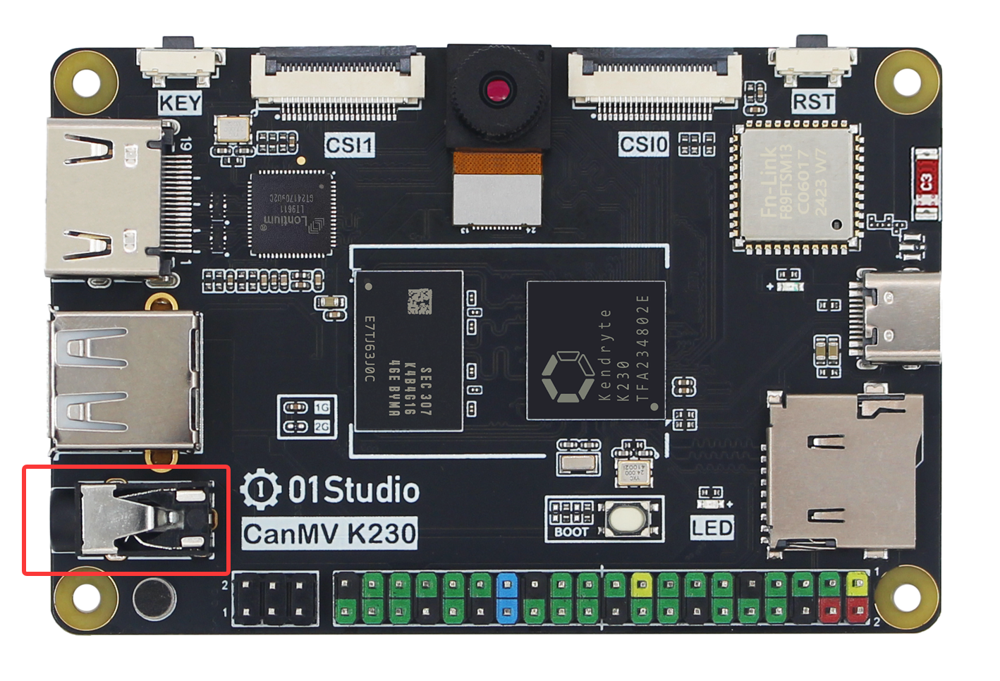
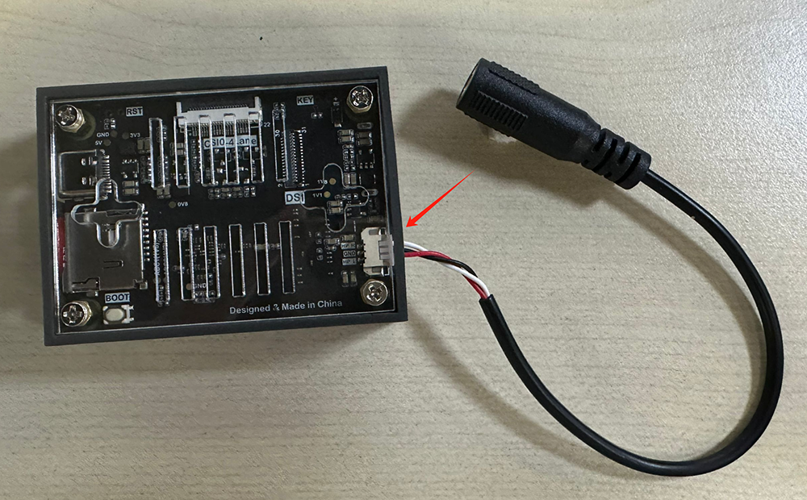
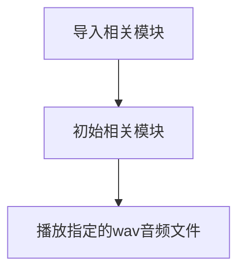
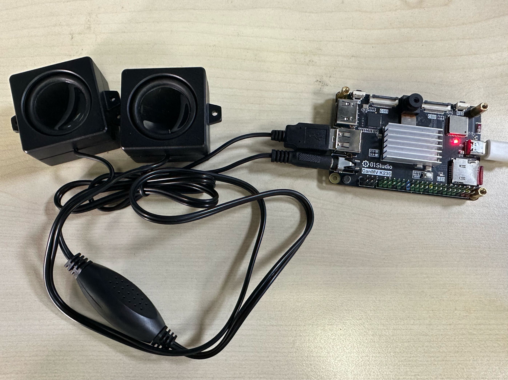
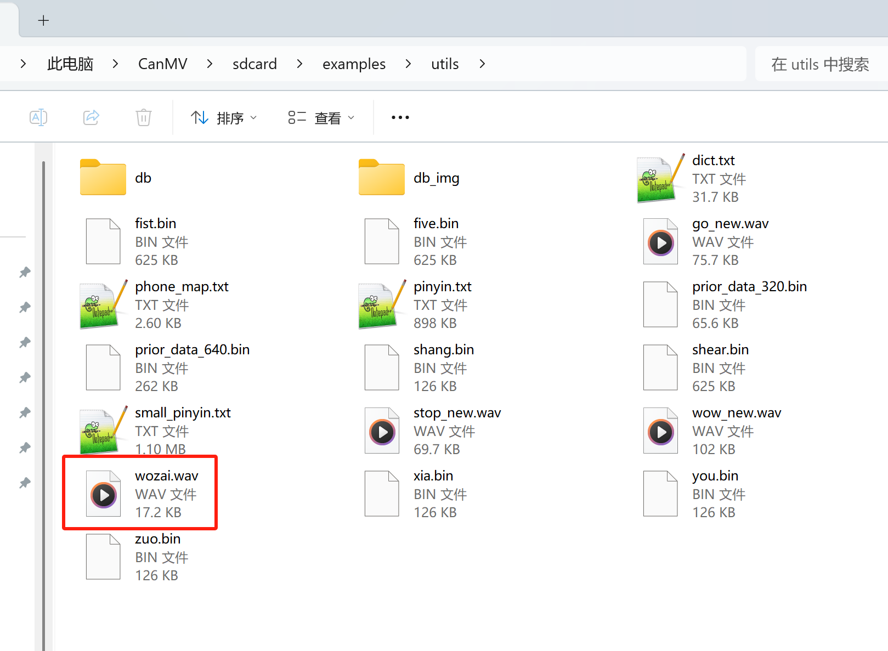

# 音频播放

## 前言

上一节讲解了录音，这节接着来讲解一下使用CanMV K230播放音频。

## 实验目的

播放wav音频文件。

## 实验讲解

01Studio CanMV K230开发板带有双声道3.5mm音频座，可以外接扬声器。

- CanMV K230



- CanMV K230 mini

CanMV K230 mini需要搭配音频转接线使用。




CanMV K230 MicroPython库集成了PyAudio（音频流处理）和wave（wav文件处理）模块。可以使用python编程实现播放wav音频文件。具体介绍如下：

## pyAudio对象

### 构造函数

```python
from media.pyaudio import * #导入pyaudio模块，用于采集和播放音频

p = PyAudio()
```
构建PyAudio对象。

### 使用方法

```python
stream = p.open(format=FORMAT,
                channels=CHANNELS,
                rate=RATE,
                output=True,
                frames_per_buffer=CHUNK)
```
初始化音频流。

- `format`: 采样点字节数。
- `channels`: 声道数。
    - `1`: 单声道；
    - `2`: 双声道立体声。
- `rate`: 采样率。
- `output`: 是否为音频输出。
    - `True`: 是；
    - `False`: 否；
- `frames_per_buffe`: 每块音频时长。

<br></br>

```python
stream.volume(vol)
```
设置音量。
- `vol`: 范围[0-100]，表示播放音量大小。

<br></br>

```python
stream.read(frames)
```
读取音频数据。
- `frames`: 帧数。

<br></br>

```python
stream.write(data)
```
写入音频数据。
- `data`: 音频数据（ bytes 字节序列）

<br></br>

```python
stream.start_stream(data)
```
启动音频流。

<br></br>

```python
stream.stop_stream(data)
```
停止音频流。

<br></br>

```python
stream.close(data)
```
关闭音频流。

## wave对象

### 构造函数

```python
import media.wave as wave   #导入wav模块，用于保存和加载wav音频文件

wf = wave.open(filename, mode)
```
使用wave对象打开一个音频文件。
- `filename`: 文件名称。
- `mode`: 打开模式。
    - `r`: 只读模式
    - `rb`: 只读二进制模式
    - `w`: 只写模式
    - `rb`: 只写二进制模式

### 使用方法

```python
wf.read_frames(nframes)
```
写入音频数据。

- `nframes`:读取的帧长度（声道数 × 每个采样点的采样精度 / 8 ）

更多用法请阅读[官方文档](https://www.kendryte.com/k230_canmv/zh/main/zh/api/mpp/K230_CanMV_Audio%E6%A8%A1%E5%9D%97API%E6%89%8B%E5%86%8C.html#)。

本节代码编程流程如下：



## 参考代码

```python
'''
实验名称：音频播放
实验平台：01Studio CanMV K230
教程：wiki.01studio.cc
'''

import os
from media.media import *   #导入media模块，用于初始化vb buffer
from media.pyaudio import * #导入pyaudio模块，用于采集和播放音频
import media.wave as wave   #导入wav模块，用于保存和加载wav音频文件

#IDE中断检测
def exit_check():
    try:
        os.exitpoint()
    except KeyboardInterrupt as e:
        print("user stop: ", e)
        return True
    return False

def play_audio(filename):
    try:
        wf = wave.open(filename, 'rb')#打开wav文件
        CHUNK = int(wf.get_framerate()/25)#设置音频chunk值

        p = PyAudio()
        p.initialize(CHUNK) #初始化PyAudio对象
        MediaManager.init()    #vb buffer初始化

        #创建音频输出流，设置的音频参数均为wave中获取到的参数
        stream = p.open(format=p.get_format_from_width(wf.get_sampwidth()),
                    channels=wf.get_channels(),
                    rate=wf.get_framerate(),
                    output=True,
                    frames_per_buffer=CHUNK)

        #设置音频输出流的音量
        stream.volume(vol=85)

        data = wf.read_frames(CHUNK)#从wav文件中读取数一帧数据

        while data:
            stream.write(data)  #将帧数据写入到音频输出流中
            data = wf.read_frames(CHUNK) #从wav文件中读取数一帧数据
            if exit_check():
                break
    except BaseException as e:
            print(f"Exception {e}")
    finally:
        stream.stop_stream() #停止音频输出流
        stream.close()#关闭音频输出流
        p.terminate()#释放音频对象
        wf.close()#关闭wav文件

        MediaManager.deinit() #释放vb buffer

###########################
##     主函数代码
###########################

os.exitpoint(os.EXITPOINT_ENABLE) #用于检测IDE中断

print("audio play start")

play_audio('/sdcard/examples/utils/wozai.wav') #播放wav文件

print("audio play done")

```

## 实验结果

将扬声器接入CanMV音频座，下面这款扬声器USB为供电，音频头为音频输出。



运行代码，可以听到喇叭播放出声音。

代码实际播放的是 `/sdcard/examples/utils/wozai.wav` 文件，用户可以替换成自己的wav文件测试。


