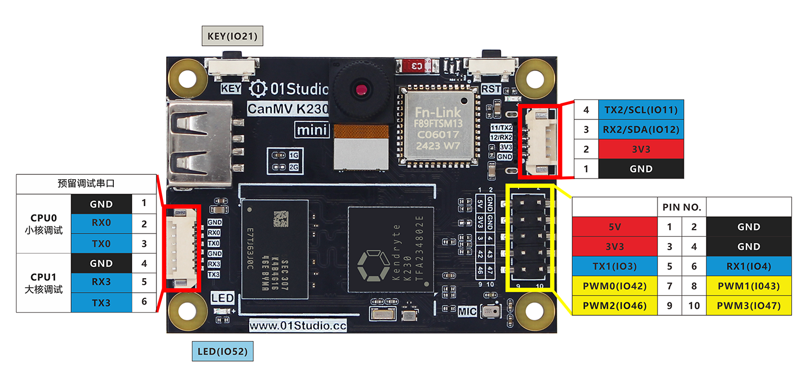

# GPIO介绍

我们先来介绍一下01科技CanMV K230的GPIO，也就是常用的I/O（输入输出引脚）、UART(串口)、I2C、SPI、PWM、ADC等功能。CanMV K230不仅是一款强大的AI视觉开发板，也能实现各类单片机的GPIO功能，熟悉GPIO相关功能说明对关于本章基础实验的学习有很大帮助。

## CanMV K230

下面是01科技CanMV K230开发板的GPIO的引脚图：

从上面表格和图例可以看到，GPIO和传统的单片机开发相似，除了普通IO口外，也有I2C、串口（UART）、SPI等总线接口，以及电源输出供电引脚（3.3V和5V）。可以外接各类传感器和模块，相关内容在后面教程都会涉及。

### 电源引脚

CanMV K230 40Pin GPIO中有两路5V和两路3.3V输出引脚，以及8个GND引脚，可对外供电。也可以接入电源（5V）到5V引脚给开发板供电。

:::danger 警告
请勿使用超过5V的电源给开发板供电，可能导致烧坏。
:::

### 普通IO

除了电源引脚和4个ADC引脚外，所有IO口都可以配置为输入/输出引脚使用。IO电平为3.3V。

**部分引脚有其它复用功能，具体如下：**

:::tip 提示
部分功能还没有micropython API，具体以01科技教程和CanMV官方文档说明为准。
:::

### PWM

- PWM0（GPIO42）
- PWM1（GPIO43）
- PWM2（GPIO46）
- PWM3（GPIO47）

### UART 

- UART1
    - TX1（GPIO3）
    - RX1（GPIO4）

- UART2
    - TX2（GPIO11）
    - RX2（GPIO12）

### I2C

- I2C2
    - SDA2(GPIO12)
    - SCL2(GPIO11)

### SPI 
- SPI0
    - MOSI (GPIO16)
    - MISO (GPIO17)
    - SCLK (GPIO15)
    - CS0 (GPIO14)
    - CS1 (GPIO61)

### I2S

- I2S-CLK (GPIO32)
- I2S-WS (GPIO33)
- I2S-DIN (GPIO34)
- I2S-DOUT (GPIO35)

### ADC

请勿超出测量量程!

- ADC0（排针32引脚，量程0-3.6V）
- ADC1（排针36引脚，量程0-3.6V）
- ADC2（排针38引脚，量程0-1.8V）
- ADC3（排针40引脚，量程0-1.8V）

## CanMV K230 mini

下面是01科技CanMV K230 mini开发板的GPIO的引脚图：

从上面表格和图例可以看到，GPIO和传统的单片机开发相似，除了普通IO口外，也有I2C、串口（UART）等总线接口，以及电源输出供电引脚（3.3V和5V）。可以外接各类传感器和模块，相关内容在后面教程都会涉及。

### 电源引脚

CanMV K230 40Pin GPIO中有两路5V和两路3.3V输出引脚，以及8个GND引脚，可对外供电。也可以接入电源（5V）到5V引脚给开发板供电。

:::danger 警告
请勿使用超过5V的电源给开发板供电，可能导致烧坏。
:::

### 普通IO

除了电源引脚和4个ADC引脚外，所有IO口都可以配置为输入/输出引脚使用。IO电平为3.3V。

**部分引脚有其它复用功能，具体如下：**

:::tip 提示
部分功能还没有micropython API，具体以01科技教程和CanMV官方文档说明为准。
:::

### PWM

- PWM0（GPIO42）
- PWM1（GPIO43）
- PWM2（GPIO46）
- PWM3（GPIO47）

### UART 

- UART1
    - TX1（GPIO3）
    - RX1（GPIO4）

- UART2
    - TX2（GPIO11）
    - RX2（GPIO12）

### I2C

- I2C2
    - SDA2(GPIO12)
    - SCL2(GPIO11)

### ADC

请勿超出测量量程!

- ADC0（背面预留焊盘，量程0-1.8V）
- ADC1（背面预留焊盘，量程0-1.8V）

