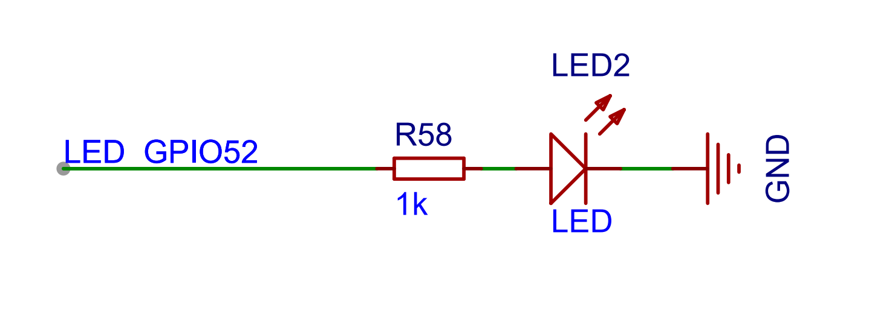
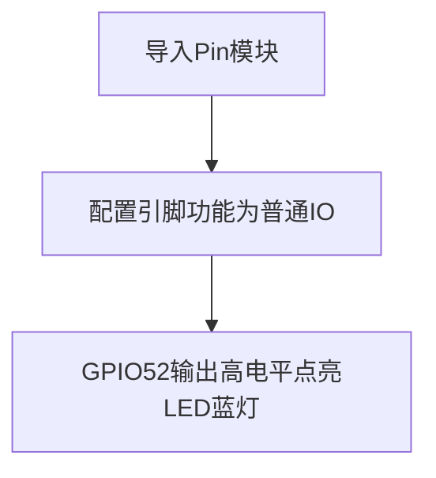
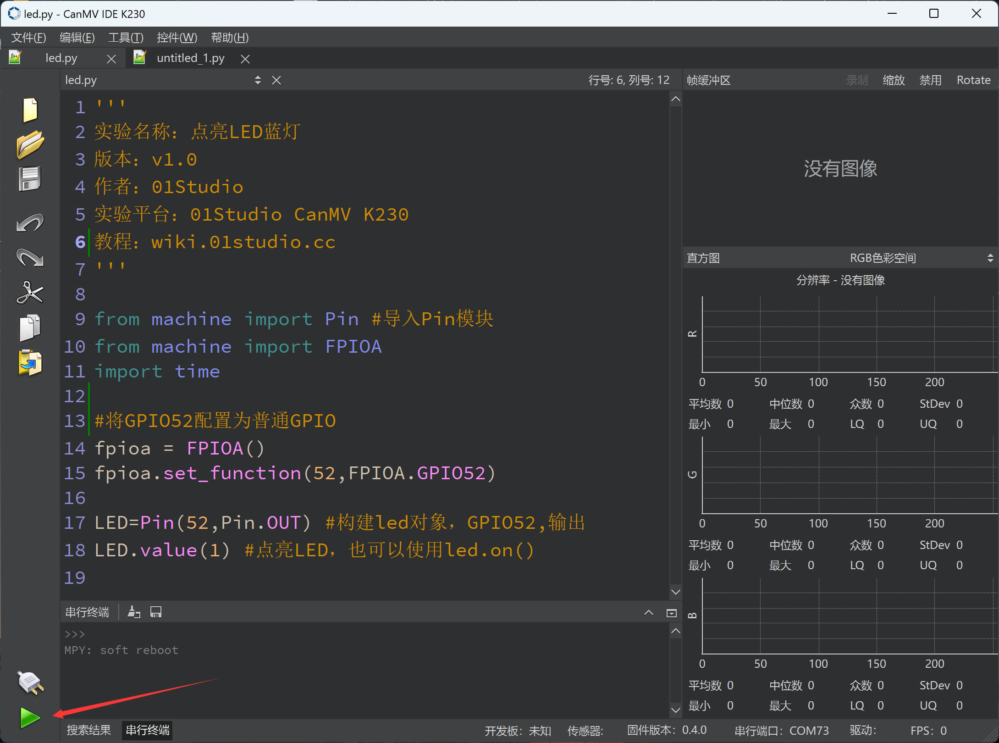

# 点亮第1个LED

## 前言
相信大部分人开始学习嵌入式单片机编程都会从点亮LED开始，基于K230平台的MicroPython的学习也不例外，通过点亮第一个LED能让你对编译环境和程序架构有一定的认识，为以后的学习和更大型的程序打下基础，增加信心。

## 实验目的
学习LED的点亮，点亮LED（蓝灯）。

## 实验讲解

CanMV K230有一个跟GPIO连接可控制的LED灯。


其连接到CanMV K230的IO引脚如下（可以看开发板原理图），LED蓝灯对应的GPIO为IO35，从电路可以看到当IO35为高电平时，蓝灯被点亮。



由于K230功能多，所以大部分GPIO引脚会复用多个功能，因此CanMV K230 提供FPIOA库（Field Programmable Input and Output Array **现场可编程IO阵列**)，以便实现不同引脚功能选择。详情请参考：[FPIOA 说明](https://developer.canaan-creative.com/k230_canmv/main/zh/api/machine/K230_CanMV_FPIOA%E6%A8%A1%E5%9D%97API%E6%89%8B%E5%86%8C.html#)。

控制LED使用machine模块中的Pin对象，使用说明如下：

## Pin对象

Pin引脚对象。

### 构造函数

```python
from machine import Pin

LED = Pin(id, mode, pull)
```

Pin位于machine模块下，直接import使用:

- `id` ：芯片引脚编号。如：1、2、52。
- `mode` ：输入/输出模式。
    - `Pin.IN` : 输入模式；
    - `Pin.OUT` : 输出模式；   
- `pull`: 上下拉电阻配置。
    - `None` : 无上下拉电阻；
    - `Pin.PULL_UP` : 上拉电阻启用；
    - `Pin.PULL_DOWN` : 下拉电阻启用。


### 使用方法
```python
LED.value([X])
```
配置引脚电平值：
- `输出模式` ：输出电平值。
    - `0` : 输出低电平；
    - `1` : 输出高电平。
- `输入模式` ：无需参数，获取当前引脚输入电平值。

<br></br>

```python
LED.on()
```
引出输出高电平“1”，3.3V。

<br></br>

```python
LED.off()
```

引出输出低电平“0”，0V。

<br></br>

更多用法请阅读官方文档：<br></br>
https://docs.micropython.org/en/latest/library/machine.Pin.html#machine-pin


<br></br>

上面对MicroPython的machine中Pin对象做了详细的说明，machine是大模块，Pin是machine下面的其中一个小模块，在Python编程里有两种方式引用相关模块:

- 方式1是：import machine，然后通过machine.Pin来操作；

- 方式2是：from machine import Pin,意思是直接从machine中引入Pin模块，然后直接通过构建led对象来操作。显然方式2会显得更直观和方便，本实验也是使用方式2来编程。

代码编写流程如下：




## 参考代码

```python
'''
实验名称：点亮LED蓝灯
版本：v1.0
作者：01Studio
实验平台：01Studio CanMV K230
教程：wiki.01studio.cc
'''

from machine import Pin #导入Pin模块
from machine import FPIOA
import time

#将GPIO52配置为普通GPIO
fpioa = FPIOA()
fpioa.set_function(52,FPIOA.GPIO52)

LED=Pin(52,Pin.OUT) #构建led对象，GPIO52,输出
LED.value(1) #点亮LED，也可以使用led.on()
```

## 实验结果

连接开发板后在CanMV K230 IDE中运行上述代码:



可以看到LED蓝灯被点亮。


从第一个实验我们可以看到，使用MicroPython来开发关键是要学会构造函数和其使用方法，便可完成对相关对象的操作，在强大的模块函数支持下，实验只用了简单的两行代码便实现了点亮LED灯。