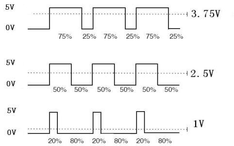
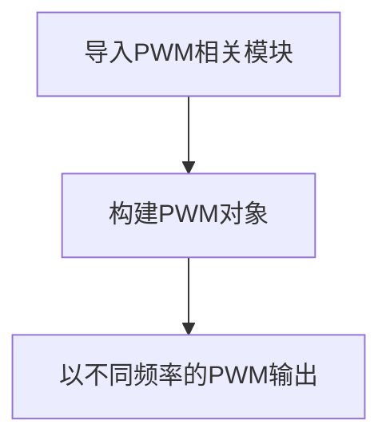
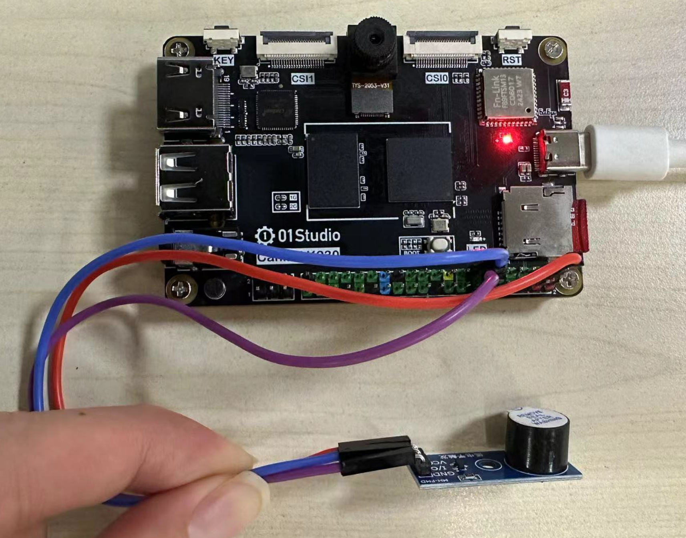

# PWM（蜂鸣器）

## 前言
PWM（脉冲宽度调制）就是一个特定信号输出，主要用于输出不同频率、占空比（一个周期内高电平出现时间占总时间比例）的方波。以实现固定频率或平均电压输出。




## 实验目的
通过不同频率的PWM信号输出，驱动无源蜂鸣器发出不同频率的声音。

## 实验讲解

蜂鸣器分有源蜂鸣器和无源蜂鸣器，有源蜂鸣器的使用方式非常简单，只需要接上电源，蜂鸣器就发声，断开电源就停止发声。而本实验用到的无源蜂鸣器，是需要给定指定的频率，才能发声的，好处可以通过改变频率来改变蜂鸣器的发声音色，以此来判定CanMV K230的PWM输出频率是在变化的。

我们来看看PWM对象说明。

## PWM对象

### 构造函数
```python
pwm = machine.PWM(channel, freq, duty)
```
构建PWM对象，PWM对象位于machine模块下。

- `channel` ：通道编号，取值0~5；01Studio CanMV K230开发板只引出了0~3共4个通道引脚。

    - `0`: PWM0（GPIO42）
    - `1`: PWM1（GPIO43）
    - `2`: PWM2（GPIO46）
    - `3`: PWM3（GPIO47）
    
- `freq` ：PWM频率，单位：Hz, 
- `duty` ：PWM占空比，即高电平占正个周期的百分比，取值范围：0-100, 默认50;

### 使用方法
```python
pwm.freq([value])
```
设置频率。不传参数返回当前频率。

<br></br>

```python
pwm.duty([value])
```
设置占空比。不传参数返回当前占空比。

<br></br>

```python
pwn.deinit()
```
注销PWM。

<br></br>


更多用法请阅读官方文档：<br></br>
https://docs.micropython.org/en/latest/library/machine.PWM.html#machine-pwm

<br></br>


无源蜂鸣器我们可以用特定频率的方波来驱动，方波的原理很简单，就是一定频率的高低电平转换，可以简单理解成占空比为50%的PWM输出。


结合上述讲解，总结出代码编写流程图如下：



## 参考代码

```python
'''
实验名称：PWM
版本：v1.1
作者：01Studio
实验平台：01Studio CanMV K230
说明：通过不同频率的PWM信号输出，驱动无源蜂鸣器发出不同频率的声音。
'''

from machine import Pin, PWM
from machine import FPIOA
import time

#配置引脚42为PWM0功能
#通道0：GPIO42,通道1：GPIO43,通道2：GPIO46,通道3：GPIO47,
fpioa = FPIOA()
fpioa.set_function(42,FPIOA.PWM0)

#构建蜂鸣器PWM对象，通道0，频率为200Hz，占空比为50%，默认使能输出
Beep = PWM(0, freq=200, duty=50) # 在同一语句下创建和配置PWM,占空比50%

#蜂鸣器发出频率200Hz响声
Beep.freq(200)
time.sleep(1)

#蜂鸣器发出频率400Hz响声
Beep.freq(400)
time.sleep(1)

#蜂鸣器发出频率600Hz响声
Beep.freq(600)
time.sleep(1)

#蜂鸣器发出频率800Hz响声
Beep.freq(800)
time.sleep(1)

#蜂鸣器发出频率1000Hz响声
Beep.freq(1000)
time.sleep(1)

#停止
Beep.enable(False)

```

## 实验结果

本实验使用引脚42连接无源蜂鸣器。

运行代码，可以听到蜂鸣器依次发出不同频率的响声。

- CanMV K230



- CanMV K230 mini


有条件的朋友可以使用示波器测量CanMV K230的IO42引脚。观察PWM波形变化。


到了这一节，我们发现实验中对象函数使用方法非常简单，这是好事，让我们可以将更多精力放在应用上，做出更多好玩的创意。而不需要过多的关注复杂的底层代码开发。而随着要实现功能的复杂化让编程的代码数量变多，逻辑也将略显复杂。
