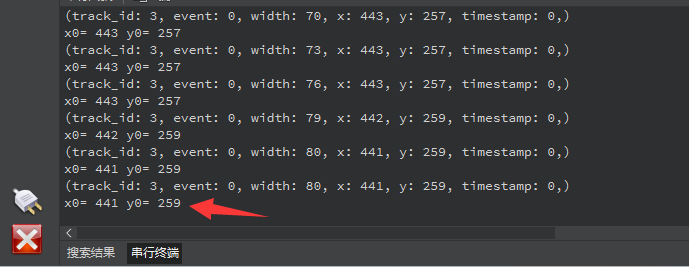

# 电容触摸屏

## 前言

触摸屏是非常棒的人机交互方式。看早期的按键手机到现在已经全面被触摸屏取代。触摸屏很好地解决了人跟屏直接交互的问题。今天我们就来学习一下触摸屏的应用。

## 实验目的

编程实现读取电容触摸屏数据。

## 实验讲解

01Studio配套的3.5寸mipi LCD分无触摸版本和带触摸版本，带触摸版本配的是电容触摸，支持单点和多点触控。CanMV K230已经将电容触摸相关库封装成了python API，我们直接使用即可。

## touchscreen对象

### 构造函数
```python
from machine import TOUCH

touch = TOUCH(index, rotation)
```
构建一个电容触摸对象。
- `index`: TOUCH的设备号，01Studio 3.5寸mipi屏设备号为`0`；
- `rotation`: 面板输出坐标旋转，取值[0-3]。
    - `0`: 坐标不旋转。
    - `1`: 坐标旋转90°。
    - `2`: 坐标旋转180°。
    - `3`: 坐标旋转270°。

### 使用方法

```python
touch.read([count])
```
获取触摸数据。
- `count`: 触摸点数。取值[0:10]，默认0，读取全部触摸点。

结果返回 TOUCH_INFO 类。类里面的x,y表示坐标。

使用例：

p= touch.read() #读取TOUCH数据

print(p) #原始信息

print(len(p)) #表示触摸点数量，最大5个

print(p[0].x, p[0].y) #打印第1个点的x,y坐标

更多用法请阅读[官方文档](https://developer.canaan-creative.com/k230_canmv/main/zh/api/machine/K230_CanMV_TOUCH%E6%A8%A1%E5%9D%97API%E6%89%8B%E5%86%8C.html#)。

从上表可以看到，通过MicroPython封装后的电容触摸屏使用变得非常容易，本节代码编程流程如下：

```mermaid
graph TD
    导入触摸屏等相关模块 --> 初始相关模块 --> 读取触摸信息 --> 打印相关信息 --> 读取触摸信息;

```

## 参考代码

```python
'''
实验名称：电容触摸屏
实验平台：01Studio CanMV K230
教程：wiki.01studio.cc
'''

from machine import TOUCH
import time

# 实例化TOUCH设备0
tp = TOUCH(0)

while True:

    # 获取TOUCH数据
    p = tp.read()

    if p != (): #发生触摸事件

        print(p) #打印原始触摸数据

        #打印每个点坐标信息，最大5点。
        for i in range(len(p)):

            print('x'+str(i)+'=',p[i].x, 'y'+str(i)+'=',p[i].y)

    time.sleep_ms(50)
```

## 实验结果

运行程序，用手指触摸电容屏，可以看到终端打印出坐标信息。

- 单点触摸：


IDE串口终端打印触摸信息（单点）：



- 多点触摸：


IDE串口终端打印触摸信息（多点）：


有了触摸屏的应用，让开发板的人机交互变得更简单而有趣。