# UART（串口通讯）

## 前言
串口是非常常用的通信接口，有很多工控产品、无线透传模块都是使用串口来收发指令和传输数据，以及和其它开发板如STM32, ESP32, Arduio,树莓派等带串口的开发板通讯，这样用户就可以在无须考虑底层实现原理的前提下将各类串口功能模块灵活应用起来。

## 实验目的
编程实现串口收发数据。

## 实验讲解

K230内部包含五个UART硬件模块，其中UART0被小核终端占用，UART3被大核终端占用，剩余UART1，UART2，UART4。 01Studio CanMV K230开发板通过排针引出了UART1和UART2共2个UART供用户使用。

我们来了解一下CanMV K230串口对象的构造函数和使用方法：

## UART对象

### 构造函数
```python
machine.UART(id, baudrate=115200, bits=UART.EIGHTBITS, parity=UART.PARITY_NONE, stop=UART.STOPBITS_ONE)
```
创建UART对象。

- `id` ：串口编号，共2个可用：
    - `UART.UART1`: 串口1；TX1（GPIO3）, RX1（GPIO4）;
    - `UART.UART2`: 串口2；TX2（GPIO11）, RX2（GPIO12）;

- `baudrate`：波特率，常用115200、9600;

- `bits` ：数据位，默认8;

- `parity` ：奇偶校验，默认None;
    - `UART.PARITY_EVEN`: 偶校验；
    - `UART.PARITY_ODD`: 奇校验；

- `stop`: 停止位，支持 1， 1.5, 2， 默认 1 。

### 使用方法

```python
UART.read(num)
```
读取串口缓冲数据。
- `num`: 读取字节数量。

<br></br>

```python
UART.readline(num)
```
整行读取。
- `num`: 行数。

<br></br>

```python
UART.write(buf)
```
发送数据。
- `buf`: 需要发送的数据。

<br></br>

```python
UART.deinit()
```
注销串口。

更多用法请阅读官方文档：<br></br>
https://www.kendryte.com/k230_canmv/main/zh/api/machine/K230_CanMV_UART%E6%A8%A1%E5%9D%97API%E6%89%8B%E5%86%8C.html

<br></br>

我们可以用一个USB转TTL工具，配合电脑上位机串口助手来跟CanMV K230开发板进行通信测试。


本实验我们使用CanMV K230的UART1引脚，引出的排针。从CanMV K230原理图可以看到外部引脚为：IO3--TX1 ，IO4--RX1。

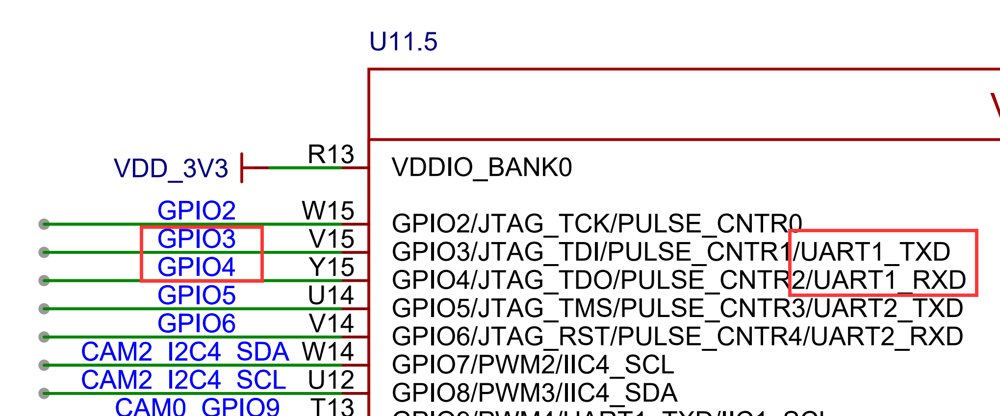

注意要使用3.3V电平的USB转串口TTL工具，接线示意图如下（交叉接线）：

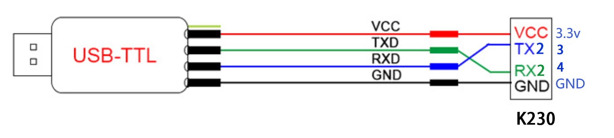


在本实验中我们可以先初始化串口，然后给串口发去一条信息，这样PC机的串口助手就会在接收区显示出来，然后进入循环，当检测到有数据可以接收时候就将数据接收并打印，并通过REPL打印显示。代码编写流程图如下：


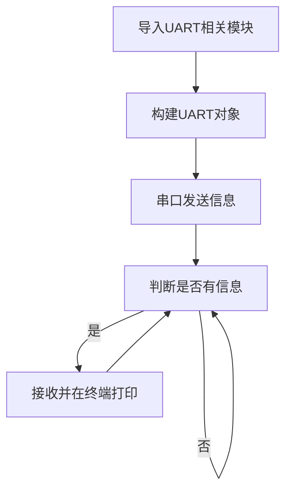

## 参考代码

```python
'''
实验名称：UART（串口通信）
作者：01Studio
实验平台：01Studio CanMV K230
说明：通过编程实现串口通信，跟电脑串口助手实现数据收发。
'''

#导入串口模块
from machine import UART
from machine import FPIOA
import time

fpioa = FPIOA()

# UART1代码
fpioa.set_function(3,FPIOA.UART1_TXD)
fpioa.set_function(4,FPIOA.UART1_RXD)

uart=UART(UART.UART1,115200) #设置串口号1和波特率

'''

# UART2代码
fpioa.set_function(11,FPIOA.UART2_TXD)
fpioa.set_function(12,FPIOA.UART2_RXD)

uart=UART(UART.UART2,115200) #设置串口号2和波特率
'''

uart.write('Hello 01Studio!')#发送一条数据

while True:

    text=uart.read(128) #接收128个字符
    if text != None:
        print(text) #通过REPL打印串口3接收的数据

    time.sleep(0.1) #100ms

```

## 实验结果

我们按照上述方式将USB转TTL的TX接到IO4，RX接到IO3。GND接一起，3.3V可以选择接或不接。

- CanMV K230

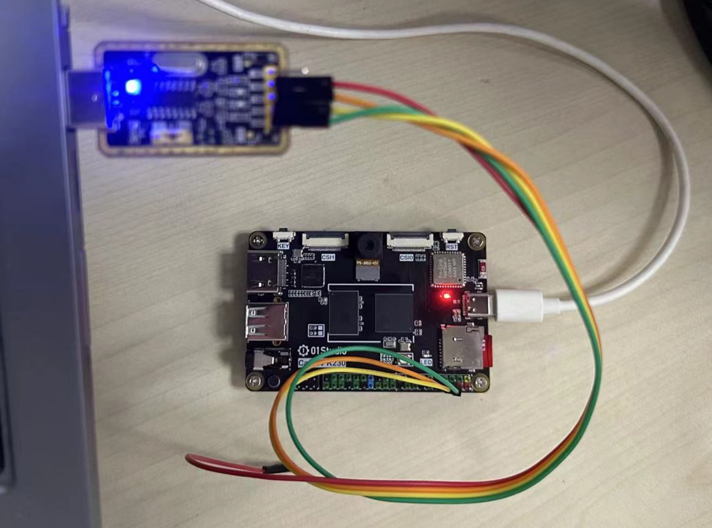

- CanMV K230 mini

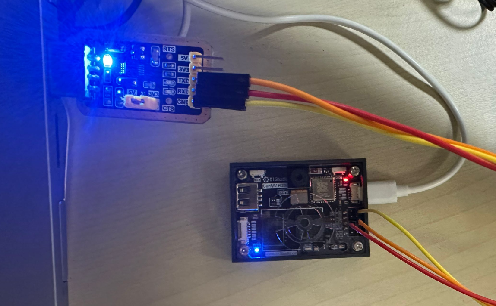

这时候打开电脑的设备管理器，能看到2个COM。写着CH340的是串口工具，另外一个则是CanMV K230的REPL。如果CH340驱动没安装，则需要手动安装，驱动在：<u>配套资料包\开发工具\windows\串口终端\CH340文件夹</u> 下。

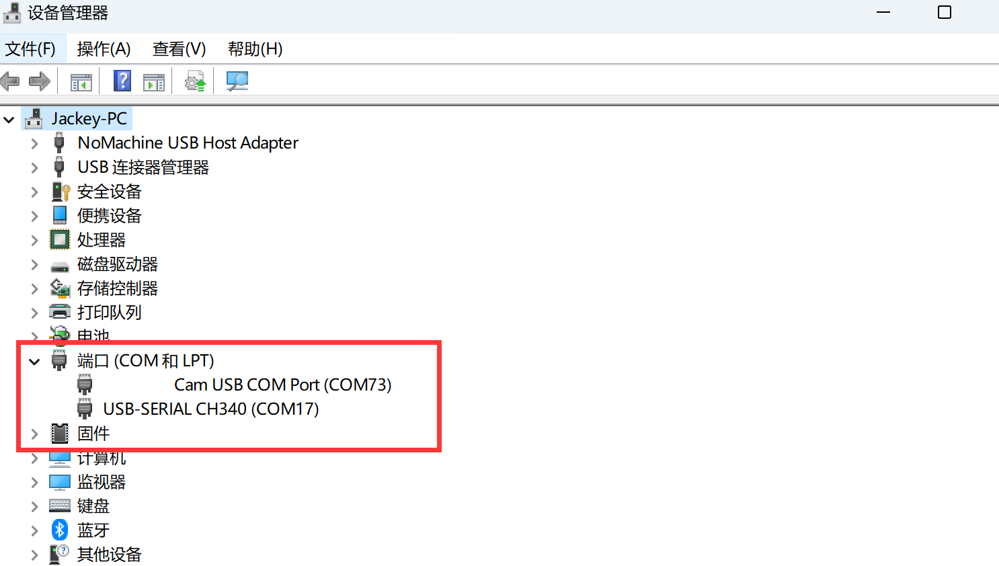

本实验要用到串口助手，打开配套资料包\开发工具\windows\串口终端工具下的【UartAssist.exe】软件。

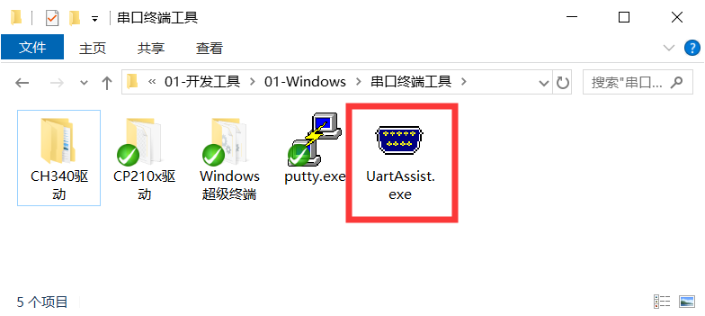

将串口工具配置成COM14（根据自己的串口号调整）。波特率115200。运行程序，可以看到一开始串口助手收到CanMV K230上电发来的信息“Hello 01Studio!”。我们在串口助手的发送端输入“http://www.01studio.cc”， 点击发送，可以看到CanMV K230在接收到该信息后在REPL里面打印了出来。如下图所示：

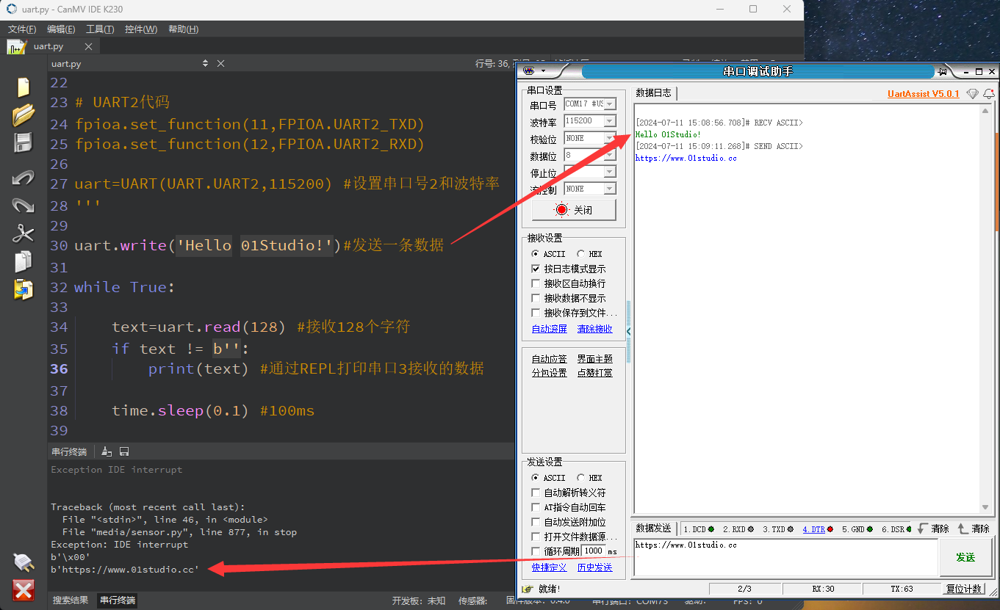

通过本节我们学会了串口收发应用，CanMV K230引出2个串口，因此可以接多个串口外设。从而实现更多的功能。

## 使用UART2

将上面代码的串口1部分注释，去除串口2代码注释，即可使用串口2。

```python
# UART2代码
fpioa.set_function(11,FPIOA.UART2_TXD)
fpioa.set_function(12,FPIOA.UART2_RXD)

uart=UART(UART.UART2,115200) #设置串口号2和波特率
```

### 参考代码

```python
'''
实验名称：UART（串口通信）
作者：01Studio
实验平台：01Studio CanMV K230
说明：通过编程实现串口通信，跟电脑串口助手实现数据收发。
'''

#导入串口模块
from machine import UART
from machine import FPIOA
import time

fpioa = FPIOA()

'''
# UART1代码
fpioa.set_function(3,FPIOA.UART1_TXD)
fpioa.set_function(4,FPIOA.UART1_RXD)

uart=UART(UART.UART1,115200) #设置串口号1和波特率
'''

# UART2代码
fpioa.set_function(11,FPIOA.UART2_TXD)
fpioa.set_function(12,FPIOA.UART2_RXD)

uart=UART(UART.UART2,115200) #设置串口号2和波特率

uart.write('Hello 01Studio!')#发送一条数据

while True:

    text=uart.read(128) #接收128个字符
    if text != None:
        print(text) #通过REPL打印串口3接收的数据

    time.sleep(0.1) #100ms

```

### 接线

串口2可以使用40Pin GPIO11（TX2）、GPIO12(RX2)引脚或者背面的4P座子（使用搭配的1.25mm转2.54mm杜邦线）连接其它外设串口设备模块，实现串口通讯。 

- CanMV K230

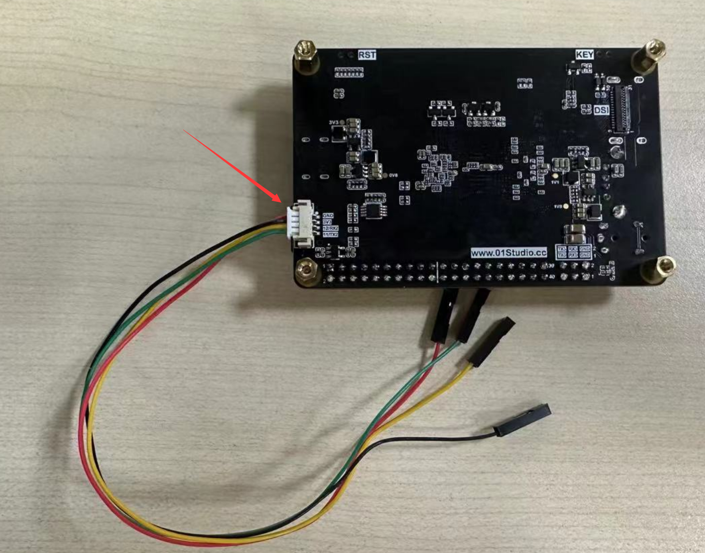

- CanMV K230 mini

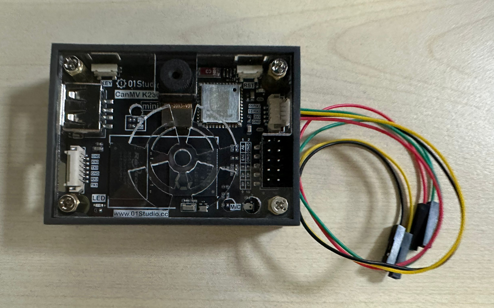

## 跟其它单片机开发板串口接线

先保证其它单片机开发板的串口电平是3.3V。常见的STM32、ESP32、Arduino和树莓派等都是3.3V IO电平。接线需要共地（GND连接在一起）。RX和TX交叉接线。**3.3V引脚可以不接。**

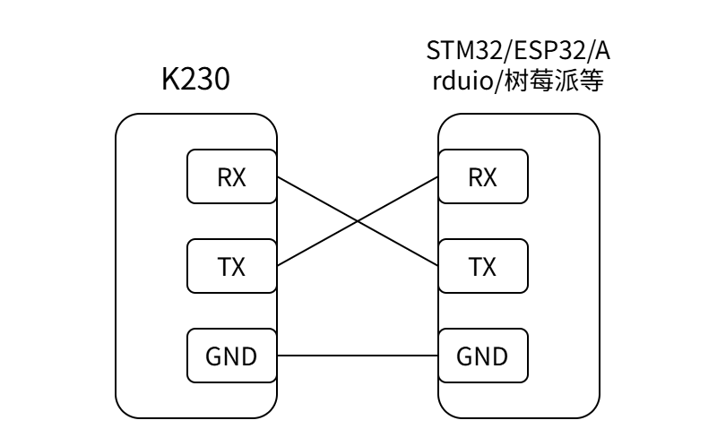


