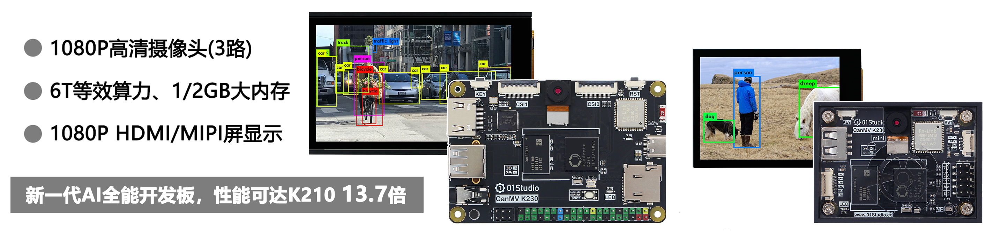

# 目录

- **CanMV K230套件介绍**

    - [CanMV K230](./intro/canmv_k230.md)
    - [配件安装使用](./intro/module.md)
    - [支架安装](./intro/bracket.md)

- [**开发板资料下载**](./download.md)

- [**Python3基础知识**](./python_learn.md)

- **开发环境搭建**

    - [CanMV K230 IDE开发软件安装](./getting_start/canmv_ide.md)
    - [镜像烧录和开机](./getting_start/image.md)
    - [第1个代码测试](./getting_start/demo.md)
    - [REPL串口交互调试](./getting_start/repl.md)
    - [文件系统](./getting_start/file_system.md)
    - [代码离线运行](./getting_start/run_offline.md)
    - [供电方式](./getting_start/power_supply.md)

- **基础实验**

    - [GPIO介绍](./basic_examples/gpio_intro.md) 
    - [点亮第1个LED](./basic_examples/led.md) 
    - [按键](./basic_examples/key.md) 
    - [定时器](./basic_examples/timer.md) 
    - [RTC（实时时钟）](./basic_examples/rtc.md) 
    - [ADC（电压测量）](./basic_examples/adc.md) 
    - [PWM（蜂鸣器）](./basic_examples/pwm_beep.md) 
    - [UART（串口通讯）](./basic_examples/uart.md) 
    - [thread（线程）](./basic_examples/thread.md) 
    - [看门狗](./basic_examples/watchdog.md) 
    - [文件读写](./basic_examples/file.md) 
    - [电容触摸屏](./basic_examples/touchscreen.md) 
    - [录音](./basic_examples/record.md) 
    - [音频播放](./basic_examples/audio_play.md) 
    - [主控温度](./basic_examples/chip_temp.md) 
    - [主控ID号](./basic_examples/chipid.md) 

- **机器视觉**

    - [摄像头](./machine_vision/camera.md) 
    - [图像3种显示方式](./machine_vision/display.md) 
    - [画图](./machine_vision/draw.md) 
    - **图像检测**
        - [边缘检测](./machine_vision/image_detection/find_edges.md) 
        - [线段检测](./machine_vision/image_detection/find_segments.md) 
        - [圆形检测](./machine_vision/image_detection/find_circles.md) 
        - [矩形检测](./machine_vision/image_detection/find_rects.md) 
        - [快速线性回归（巡线）](./machine_vision/image_detection/linear_regression_fast.md) 
    - **颜色识别**
        - [单一颜色识别](./machine_vision/color_recognition/single_color.md) 
        - [多种颜色识别](./machine_vision/color_recognition/mutli_color.md) 
        - [物体计数（相同颜色）](./machine_vision/color_recognition/count.md) 
        - [机器人巡线（实线）](./machine_vision/color_recognition/line_follow.md) 
    - **码类识别**
        - [条形码识别](./machine_vision/code/barcode.md) 
        - [二维码识别](./machine_vision/code/qr_code.md )
        - [AprilTag标签识别](./machine_vision/code/apriltag.md) 
    - **AI视觉（KPU）**
        - [AI视觉开发框架](./machine_vision/ai_vision/ai_frame.md) 
        - **人脸相关**
            - [人脸检测](./machine_vision/ai_vision/face/face_detection.md) 
            - [人脸关键部位](./machine_vision/ai_vision/face/face_landmark.md) 
            - [人脸3D网络](./machine_vision/ai_vision/face/face_mesh.md) 
            - [人脸姿态](./machine_vision/ai_vision/face/face_pose.md) 
            - [人脸识别](./machine_vision/ai_vision/face/face_recognition.md) 
        - **人体相关**
            - [人体检测](./machine_vision/ai_vision/body/person_detection.md) 
            - [人体关键点检测](./machine_vision/ai_vision/body/person_keypoint.md) 
            - [跌倒检测](./machine_vision/ai_vision/body/falldown_detection.md) 
        - **手部相关**
            - [手掌检测](./machine_vision/ai_vision/hand/hand_detection.md) 
            - [手掌关键点检测](./machine_vision/ai_vision/hand/hand_keypoint_det.md) 
            - [手掌关键点分类](./machine_vision/ai_vision/hand/hand_keypoint_class.md) 
        - **车牌相关**
            - [车牌检测](./machine_vision/ai_vision/license/license_det.md) 
            - [车牌识别](./machine_vision/ai_vision/license/license_det_rec.md) 
        - [字符识别（OCR）](./machine_vision/ai_vision/ocr_rec.md) 
        - [物体检测（YOLOv8n）](./machine_vision/ai_vision/object_detection.md) 
        - [目标跟踪](./machine_vision/ai_vision/tracker.md) 
        - [自分类学习](./machine_vision/ai_vision/self_learning.md) 
        - [模型训练](./machine_vision/train.md)

- **网络应用**

    - [连接无线路由器](./network/wifi_connect.md) 
    - [Socket通讯](./network/socket.md) 
    - [MQTT通讯](./network/mqtt.md) 
    - [以太网有线连接](./network/ethernet.md) 

- **传感器和拓展模块**

    - [继电器](./sensor_module/relay.md) 
    - [舵机](./sensor_module/servo.md) 
    - [多路舵机/电机模块](./sensor_module/pyMotors.md) 
    - **二维舵机云台**
        - [云台介绍和安装](./sensor_module/gimbal/intro.md) 
        - [云台舵机控制](./sensor_module/gimbal/servo.md)
        - [PID控制原理](./sensor_module/gimbal/pid.md)   
        - [人脸追踪](./sensor_module/gimbal/face_tracking.md)      
        - [色块追踪](./sensor_module/gimbal/color_tracking.md)  

- [**社区用户开源项目分享**](./diy.md)

- [**更新说明**](./update.md)