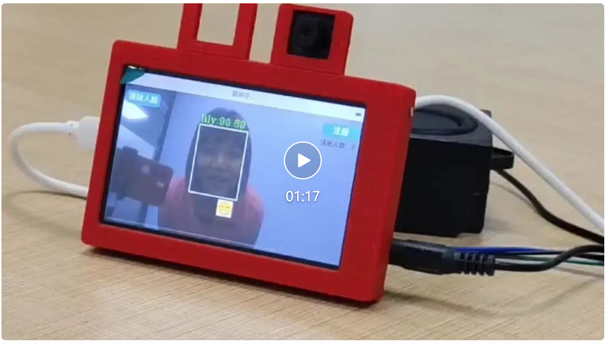
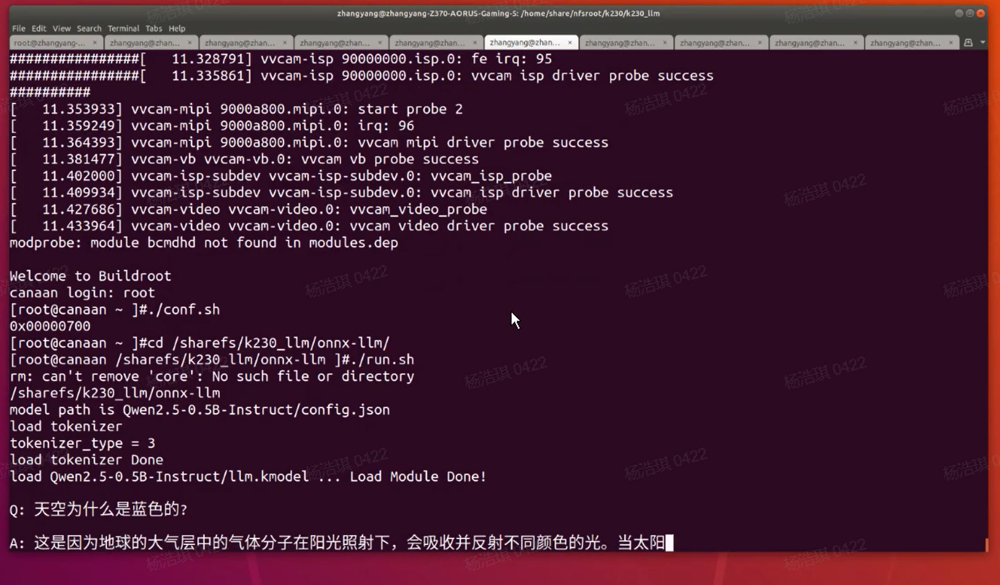

# 社区用户开源项目分享

感谢以下用户为01Studio CanMV K230开源生态贡献项目，如果你也有相关开源项目可以QQ群或者邮件（support@01studio.cc）联系我们，我们将不定期为贡献项目用户赠送01Studio相关产品。

## CanMV K230 小智AI语音助手 (融合视觉)

- `用户`：小楠

[K230×小智：大模型的 “视觉觉醒”（适配01Studio开发板）](https://mp.weixin.qq.com/s/C3Yi3eDz72wEbNVM4bkp_g)

## CanMV K230 部署Qwen2.5-0.5B大模型

- `用户`：小楠

[小设备也能玩大模型！K230 可以运行 Qwen2.5-0.5B 啦！](https://mp.weixin.qq.com/s/HCuQEqD2UzBD65I3eIbCow)

