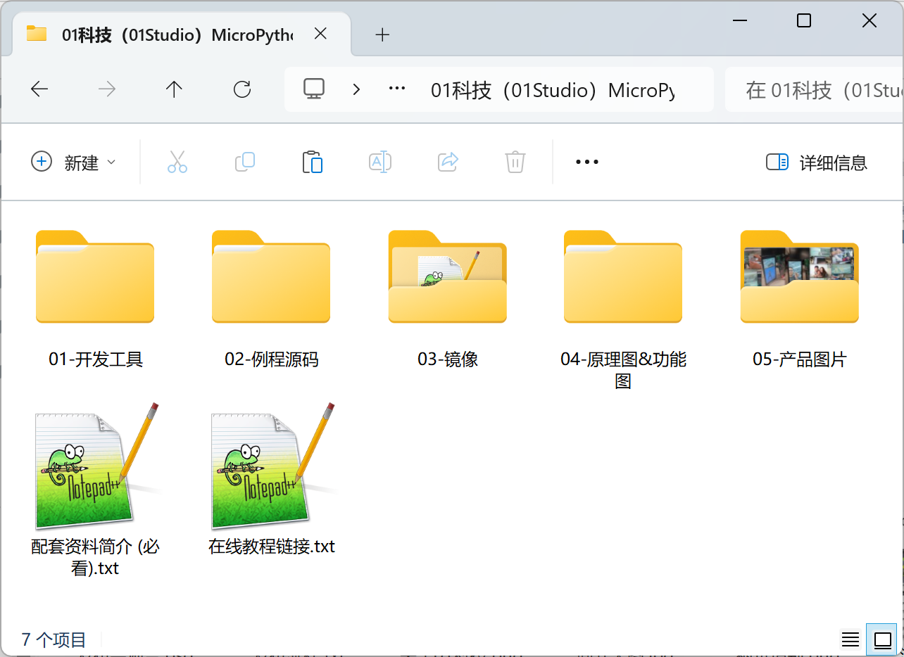
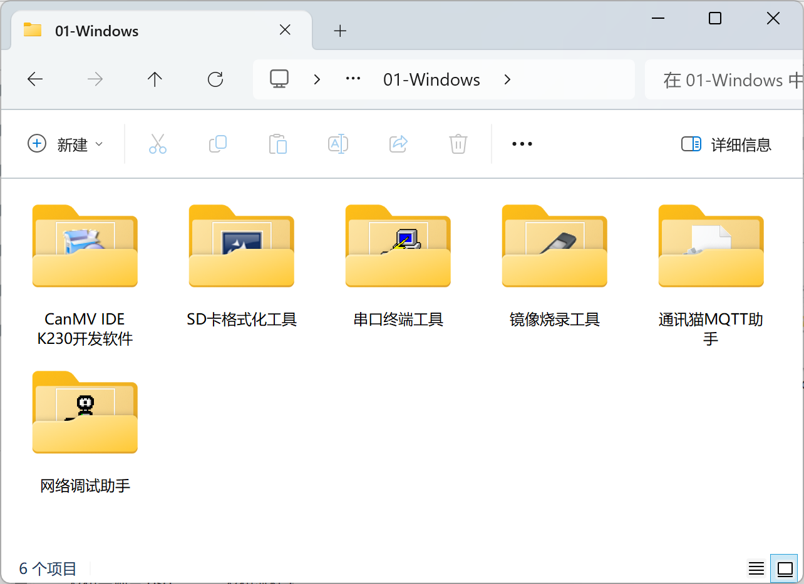
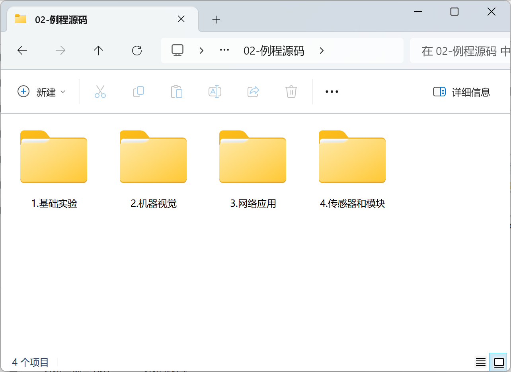
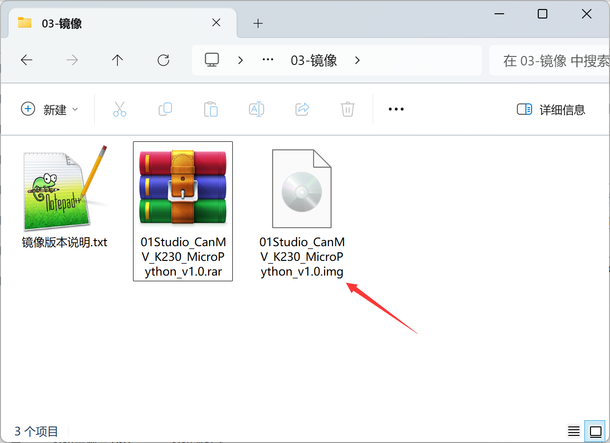
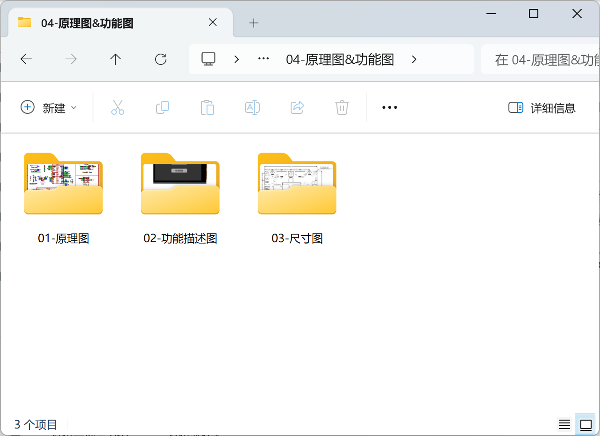
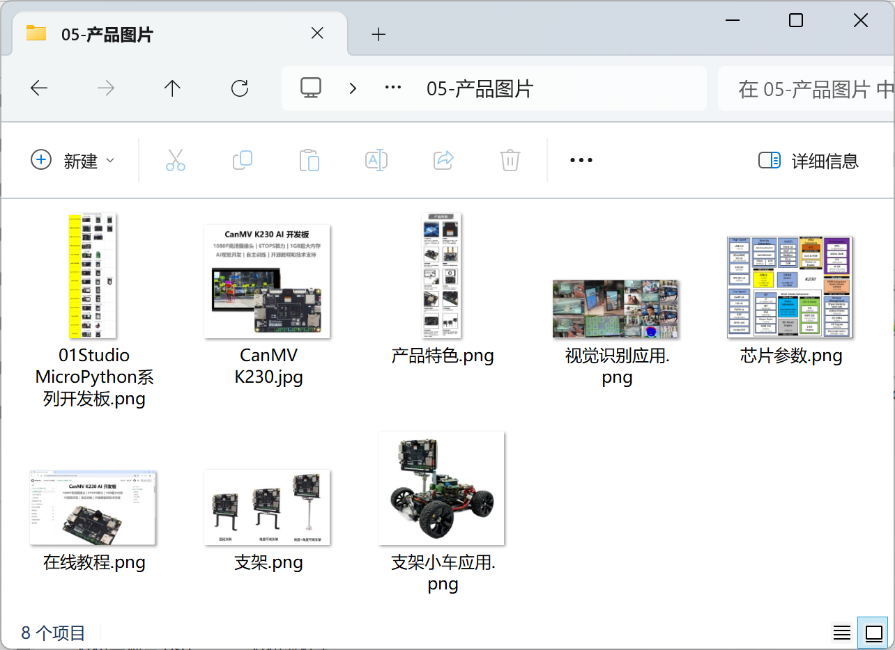

# 开发板资料下载

## 下载方式

### 百度网盘

- 百度网盘链接：https://pan.baidu.com/s/1zVOi2lHbaQhlQEqK-7s-Nw?pwd=01KJ
- 提取码：**01KJ**

### 海外地区下载

- [点击下载](https://en.01studio.cc/micropython/CanMV-K230/CanMV-K230.html)

## 资料介绍：

CanMV K230在线教程配套软件、源代码、原理图、芯片手册等。

### 开发工具

开发软件、相关驱动。

### 例程源码

本在线教程所有源代码。

### 镜像

开发板镜像，烧录到SD卡插入开发板启动。

### 原理图和功能图

开发板原理图和接口说明图片。

### 产品图片

产品的一些拍摄图，纯粹欣赏用。

