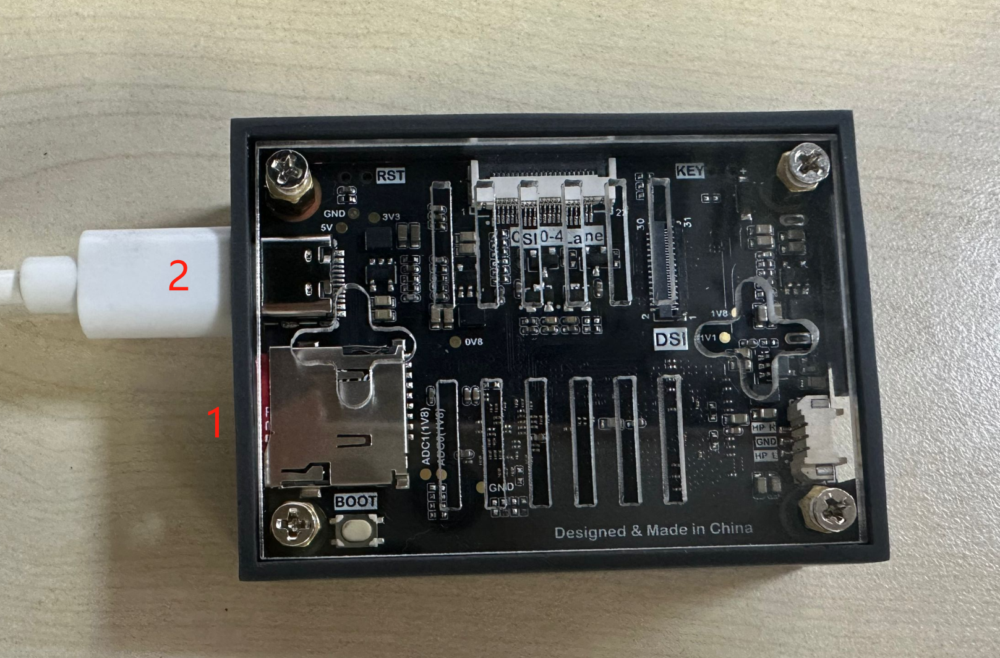

# 第1个代码测试

我们使用CanMV K230 IDE来进行我们的第一个实验，借此来熟悉开发环境。插入带镜像SD卡，将CanMV K230开发板通过type-c线连接到电脑。

- CanMV K230


- CanMV K230 mini



我们用最简单的LED程序来测试，在CanMV K230 IDE中打开 **零一科技（01Studio）MicroPython开发套件（基于CanMV K230平台）配套资料\02-例程源码\1.基础实验\1.点亮第一个LED** 里面的led.py例程（也可以直接拖动过去），如下图所示：

（这里暂时不对代码进行讲解，后面章节会有详细讲解）。


```python
'''
实验名称：点亮LED蓝灯
版本：v1.0
作者：01Studio
实验平台：01科技 CanMV K230
社区：wiki.01studio.cc
'''

from machine import Pin #导入Pin模块
from machine import FPIOA
import time

fpioa = FPIOA()
fpioa.set_function(52,FPIOA.GPIO52)

LED=Pin(52,Pin.OUT) #构建led对象，GPIO52,输出
LED.value(1) #点亮LED，也可以使用led.on()

while True:
    pass
```


接下来我们需要连接开发板，点击左下角连接按钮：


连接成功后，运行按钮变成绿色。


当前的例程是点亮LED蓝灯，我们点击绿色按键“运行”按钮，当看到CanMV K230开发板上的蓝灯亮时，说明代码运行成功:

- CanMV K230


- CanMV K230 mini


- CM-K230核心板套件


点击运行按钮旁边的`串口终端`窗口，这里可以看到代码调试信息。


