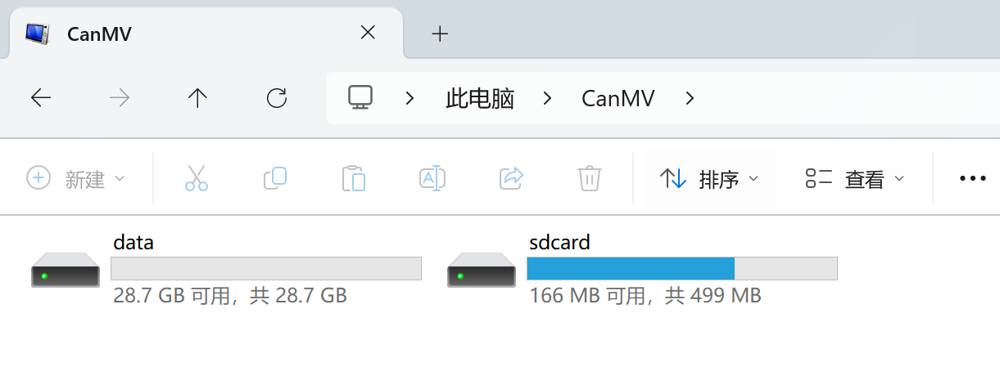
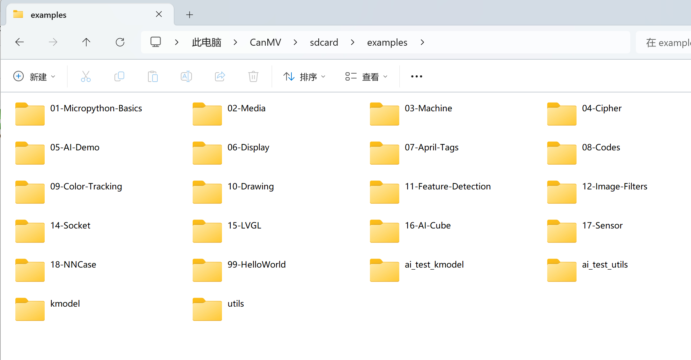

# 文件系统
CanMV K230系统内置了文件系统，上电后出现的CanMV盘符就是。

打开后可以看到里面又有2个盘符，分别是`sdcard`和`data`。

- `sdcard` 里存放在一些MicroPython库文件、官方示例程序文件。其中官方示例代码位于 `CanMV\examples\` 目录下，**由于部分代码存在差异，本在线教程请以01科技资料包配套的代码为准**：

- `data` 为用户SD卡的剩余可使用空间。

文件系统用途广泛，可以存放自己编程的micropython代码文件,以及图片、音频、视频等素材。