# 镜像烧录和开机

## 镜像烧录

01科技 CanMV K230开发板使用带镜像的SD卡启动。用户可以通过烧录新版镜像获取新功能。镜像文件位于 **零一科技（01Studio）MicroPython开发套件（基于CanMV K230平台）配套资料\03-镜像** 文件夹下。（资料包默认是rar压缩包，需要自行解压后使用以 .img 结尾的镜像文件。）

:::tip Tips
01科技CanMV K230在线教程跟镜像配套使用，请使用我们资料包提供的镜像版本。镜像名称中的nncase_2.8.3指当前镜像使用的nncase版本，在一些场合比如在线训练可能会用到。**注意：SD卡和EMMC版本镜像不通用。**
:::

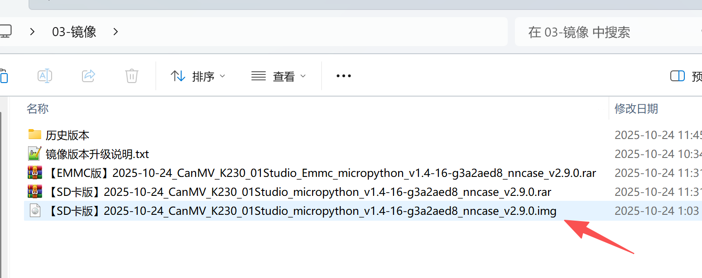

### SD卡烧录

将MicroSD卡通过读卡器连接到电脑：

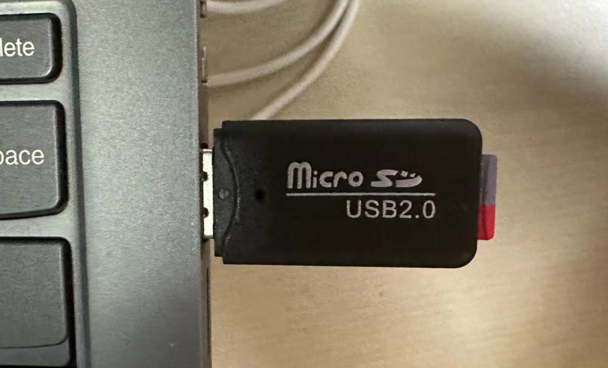

打开资料包镜像烧录工具。rufus烧录工具位于 **零一科技（01Studio）MicroPython开发套件（基于CanMV K230平台）配套资料\01-开发工具\01-Windows\镜像烧录工具** 文件夹内：

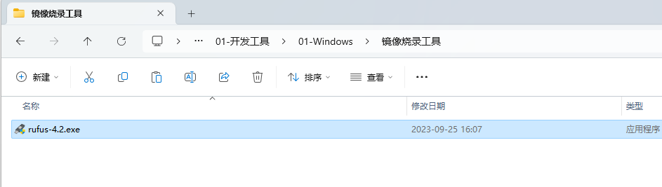

检查对应U盘盘符，然后点击 **`选择`** 按钮，选择前面下载解压的SD卡版本的.img镜像文件，点击开始：

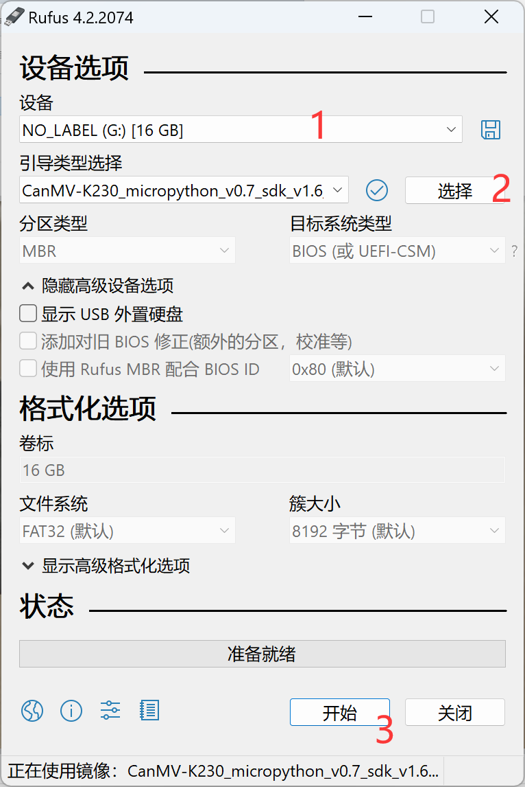

烧写完成后如下图所示：

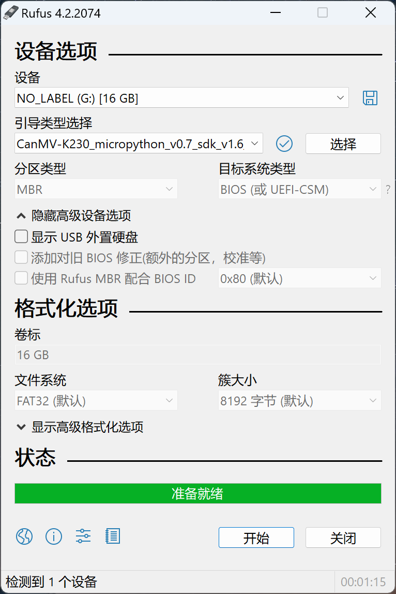

### EMMC烧录

01Studio目前只有 [**CM-K230核心板**](../intro/canmv_k230.md#cm-k230核心板) 提供带EMMC的版本，烧录方式如下：

通电状态下按着BOOT0键不放，然后按一下复位键（也可以按着BOOT0键插入USB上电），让开发板开机进入烧录模式，蓝灯亮表示进入成功。

在[开发板配套资料包](../download.md)找到开发工具-EMMC烧录工具，解压后得到bin文件，绿色版无需安装。

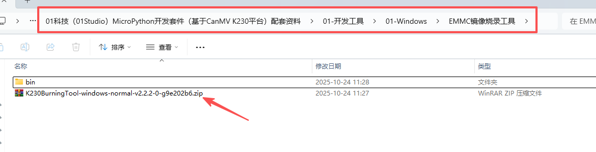

进入bin文件夹，打开烧录软件：

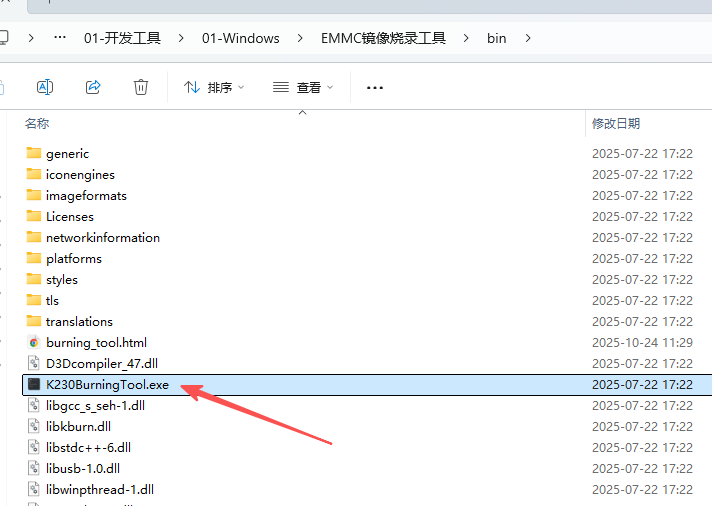

- 目标介质选择`EMMC`
- 打开解压后.img结尾的镜像文件。**注意要选EMMC版的镜像**
- 点击`开始`即可烧录。

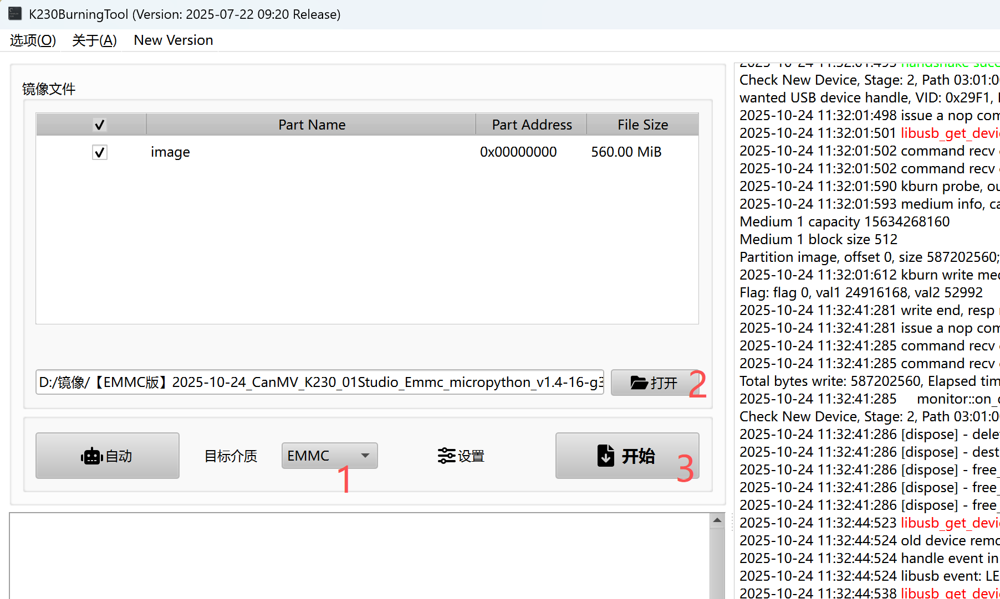

烧录完成后如下图。

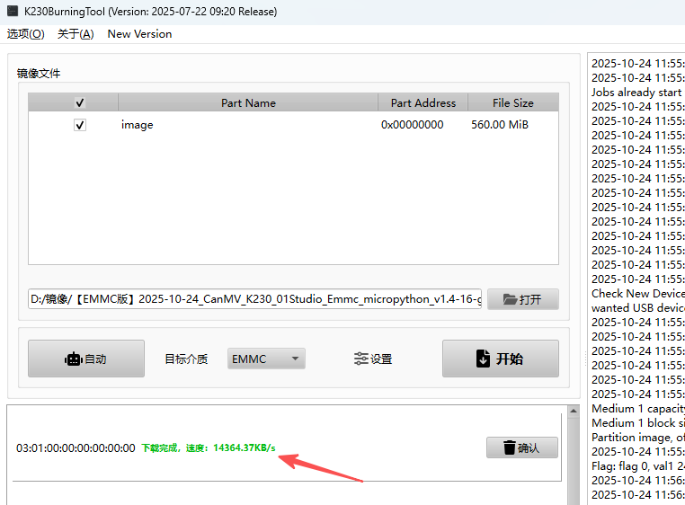

然后按复位或者断电重新上电即可开机，详细看下面内容。

## 开机

将烧录好的SD卡插入01科技 CanMV K230开发板，然后通过type-c线连接到电脑。（注意请勿带电拔插SD卡，有烧坏风险。）

- CanMV K230

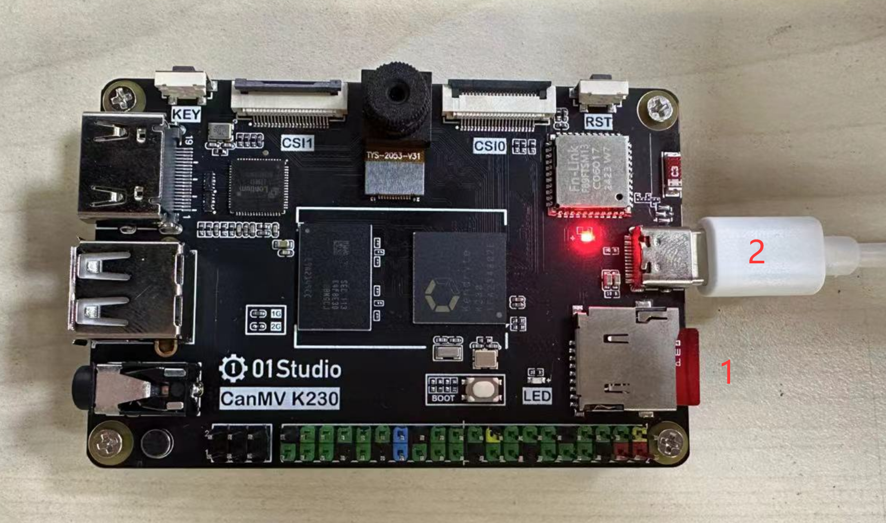

- CanMV K230 mini

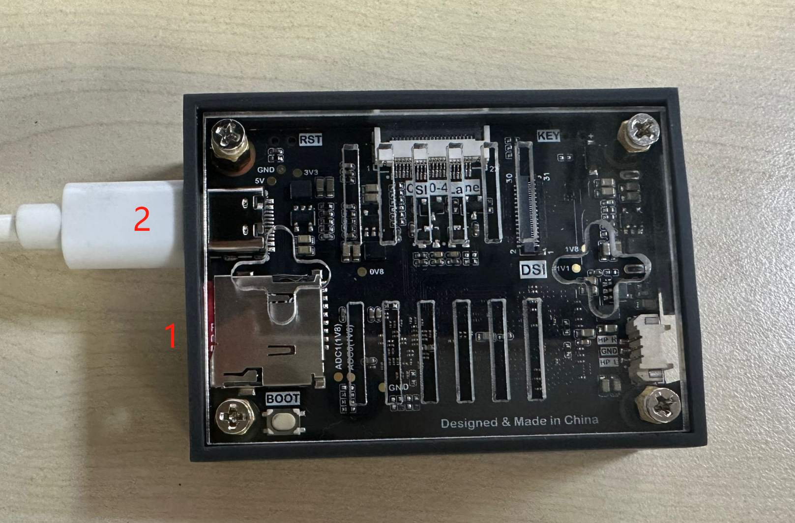

- CM-K230核心板套件

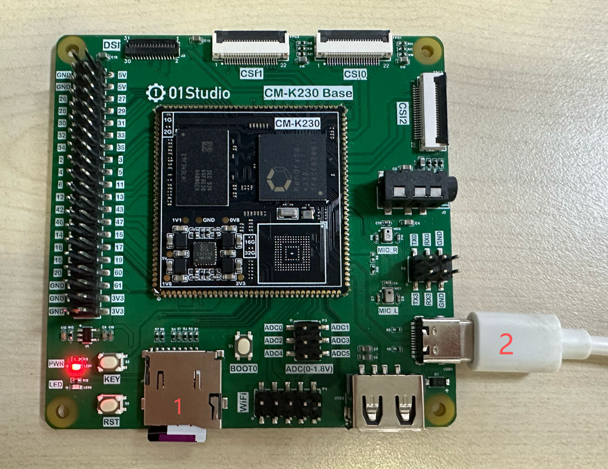

我的电脑里面弹出CanMV盘符以及设备管理器出现COM号说明系统启动正常。（没出现可以按下开发板复位键试试。）

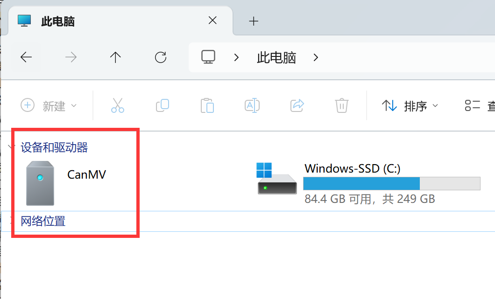

## 查看镜像版本

IDE链接开发板后在下方`串口终端`可以看到镜像版本和日期等信息。

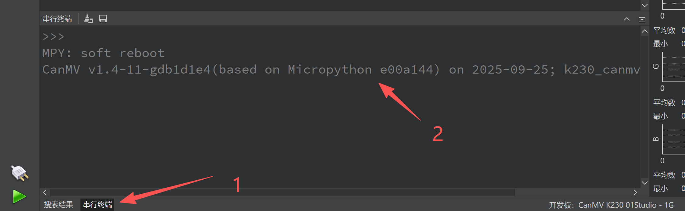

