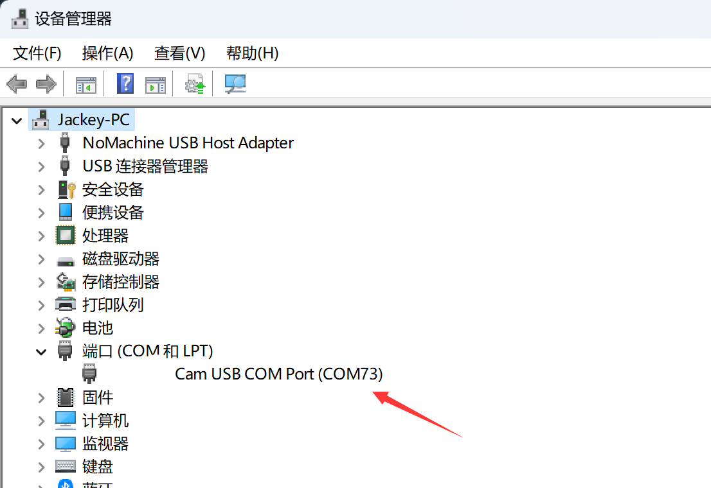

# 镜像烧录和开机

## 镜像烧录

01科技 CanMV K230开发板使用带镜像的SD卡启动。用户可以通过烧录新版镜像获取新功能。镜像文件位于 **零一科技（01Studio）MicroPython开发套件（基于CanMV K230平台）配套资料\03-镜像** 文件夹下。（资料包默认是rar压缩包，需要自行解压后使用以 .img 结尾的镜像文件。）

将MicroSD卡通过读卡器连接到电脑：

打开资料包镜像烧录工具。rufus烧录工具位于 **零一科技（01Studio）MicroPython开发套件（基于CanMV K230平台）配套资料\01-开发工具\01-Windows\镜像烧录工具** 文件夹内：

检查对应U盘盘符，然后选择.img镜像文件，点击开始：

烧写完成后如下图所示：

## 开机

将烧录好的SD卡插入01科技 CanMV K230开发板，然后通过type-c线连接到电脑。（注意请勿带电拔插SD卡，有烧坏风险。）

我的电脑里面弹出CanMV盘符以及设备管理器出现COM号说明系统启动正常。（没出现可以按下开发板复位键试试。）

