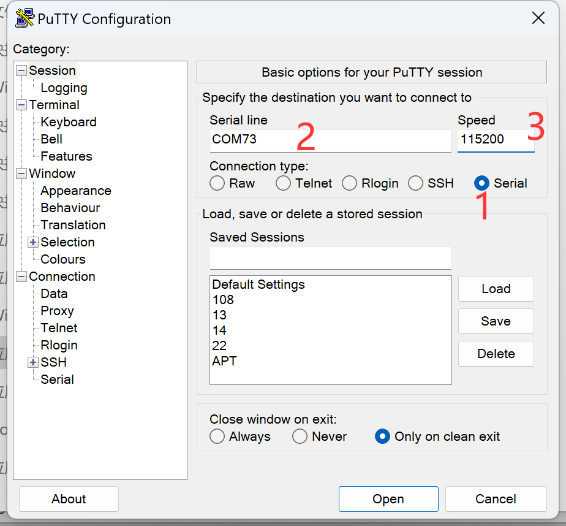
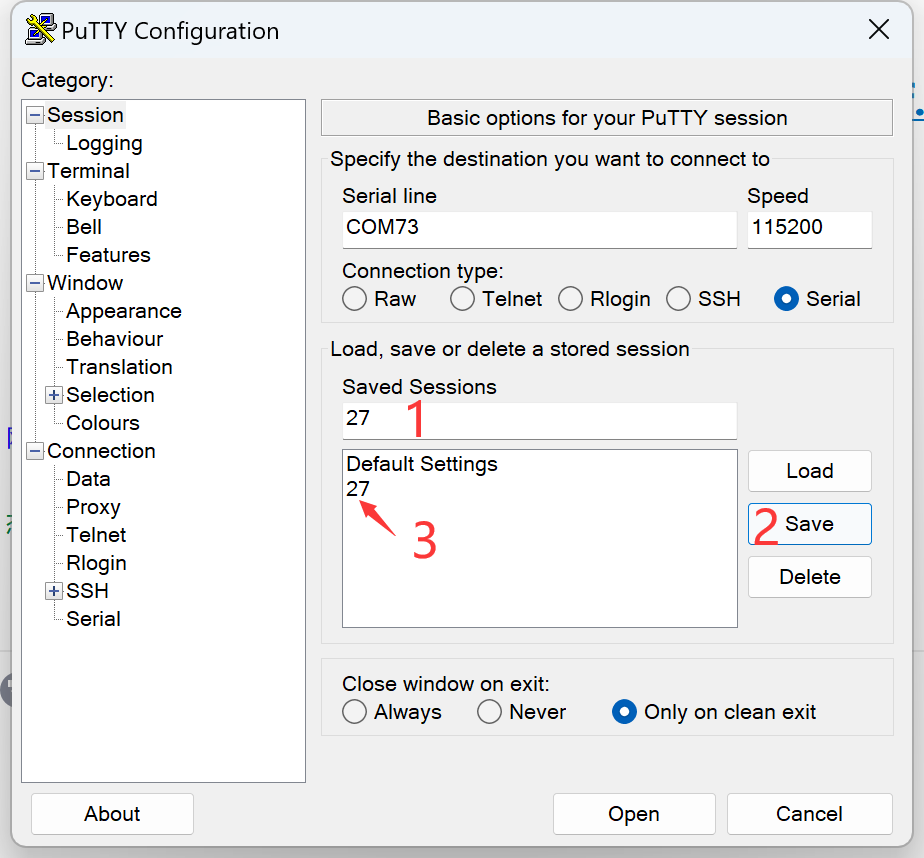
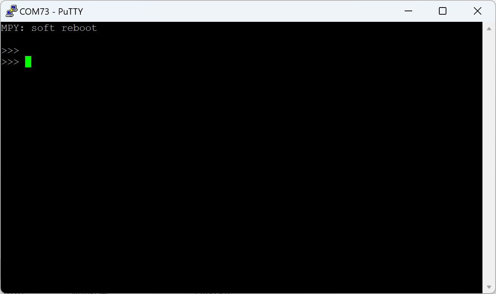
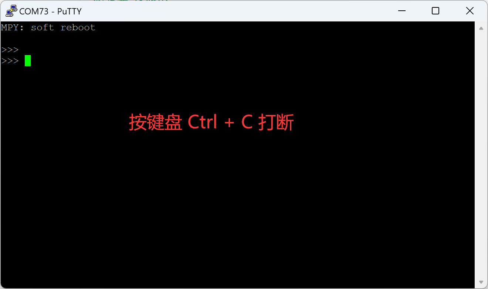
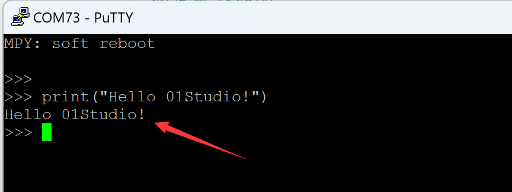
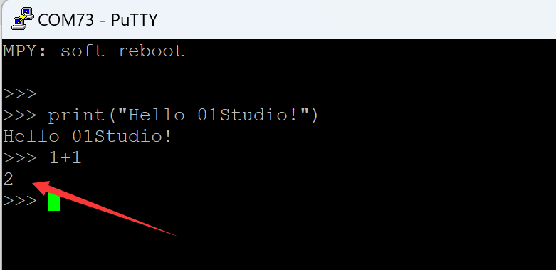

# REPL串口交互调试
:::tip 提示
REPL是MicroPython特有的功能，由于大部分IDE都集成了串口终端信息打印，所以这个功能一般情况下不需要用到。
:::

上一节在IDE中的提及的串口终端打印调试数据，并不能实现交互，CanMV K230 的MicroPython固件集成了交互解释器REPL 【读取(Read)-运算(Eval)-输出(Print)-循环(Loop) 】，开发者可以直接通过串口终端来调试CanMV K230开发板。我们使用的软件是一款免费的串口终端软件putty。

将开发板连接到电脑，从我的电脑—属性—设备管理器中找到当前的串口号，这里是COM73。


打开<u>**CanMV k230开发套件配套资料\01-开发工具\Windows\串口终端工具\Putty.exe**</u> 配置信息如下：

1、右边选择`Serial` ，表示串口模式；

2、填写`COM73` ,根据自己电脑端口填写；

3、波特率填写`115200`。



串口号通常不会变化，我们在Save Session下方输入`27`或者自己喜欢的名称，点右边Save，在空白框里面就出现`27`字样，以后可以直接双击使用。



设置好后我们点击Open打开。按回车可以看到出现`>>>`表示等待输入命令：



如果按回车没有出现`>>>`，说明开发板里面有死循环代码在运行，阻塞了REPL，这时候只需要按下键盘的Ctrl + C键即可打断在运行的程序。



现在对话框相当于连接上了开发板上，由于CanMV K230集成了MicroPython解析器。我们在这里可以进行调试和简单编程，接下来我们测试一下。在对话框输入下面代码，按回车，可以看到代码运行情况。

```python
print("Hello 01Studio!")
```



我们再输入1+1按回车，得到了计算结果2。



