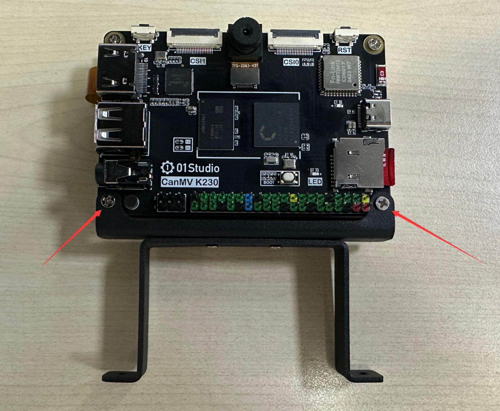

# 支架安装

01Studio CanMV K230和CanMV K230 mini均支持4款支架安装，分别是**固定支架，角度可调节支架，高度+角度可调节支架，三脚架+角度可调支架**，方便用于小车、云台等需要固定或调节高度角度的各类场景。[点击购买>>](https://item.taobao.com/item.htm?id=776972674257)

- CanMV K230

- CanMV K230 mini

- 安装到小车

## 安装方法

CanMV K230和CanMV K230 mini安装方法一样。

由于支架是组装发货，因此只需要将CanMV K230下方的螺丝M2.5x6螺丝拧下：

将支架固定孔对准开发板固定孔，使用螺丝拧紧即可。

## 尺寸图

### CanMV K230 

### CanMV K230 mini

