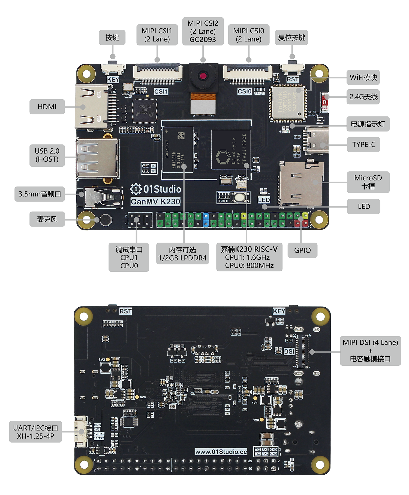
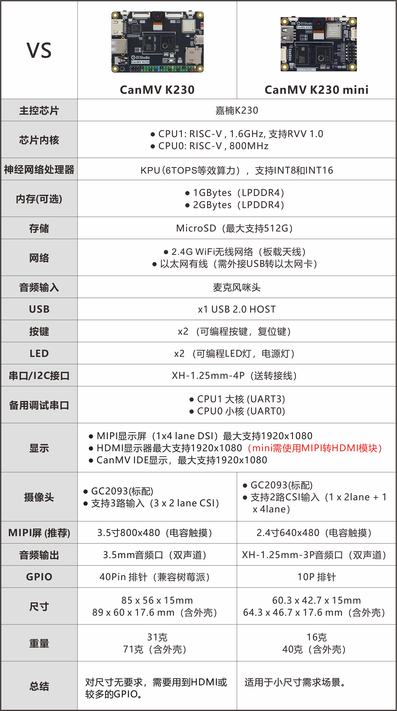
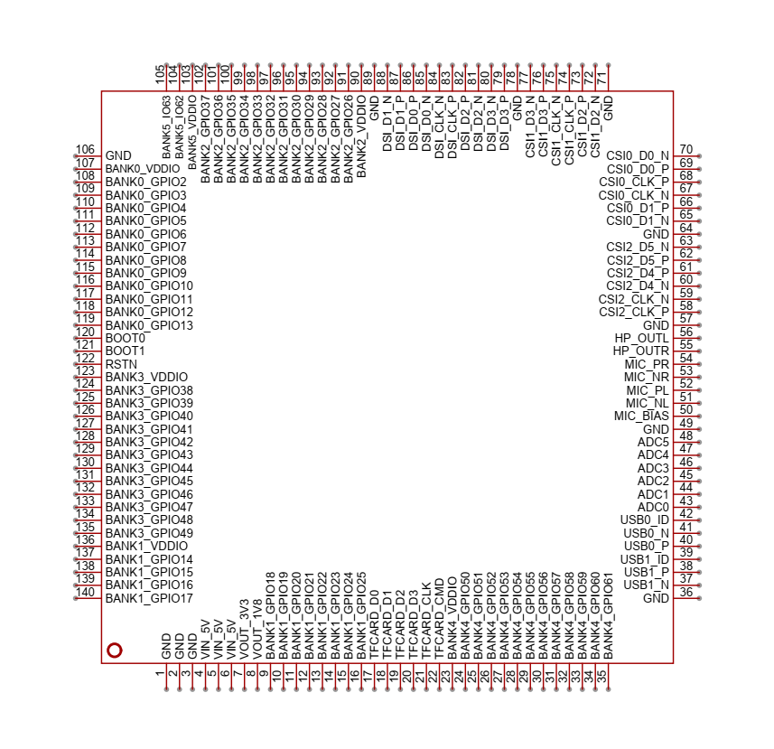

# 产品参数

## CanMV是什么

CanMV开源项目由嘉楠科技（Canaan）官方创建和维护。是将MicroPython移植到嘉楠科技边缘计算AI芯片K210/K230（一款64位双核带硬件FPU和卷积加速器的 RISC-V）的开源项目，该项目旨在创建低成本，可扩展， 使用 Python 驱动的AI人工智能模块。

也就是说如果你熟悉Micropython或Python,那么你可以在非常短的时间内通过CanMV项目完成大量机器视觉、机器听觉和深度学习应用。

## CanMV K230开发板

01Studio CanMV K230 AI开发板基于嘉楠科技边缘计算芯片K230（RSIC-V架构，64位双核心）和CanMV开源项目。

### 硬件资源

### 详细参数

|  产品参数 |
|  :---:  | ---  |
| K230主控  | ● CPU1: RISC-V , 1.6GHz, 支持RVV 1.0   ● CPU0: RISC-V , 800MHz |
| 神经网络处理器  | KPU（6TOPS等效算力），支持INT8和INT16|
| 内存（可选）| ● 1GBytes（LPDDR4）   ● 2GBytes（LPDDR4） | 
| 存储  | MicroSD（最大支持512G） |
| 摄像头  | ● GC2093(标配) / OV5647   ● 支持3路输入（3 x 2 lane CSI） |
| 显示  | ● MIPI显示屏（1x4 lane DSI）最大支持1920x1080   ● HDMI显示器最大支持1920x1080   ● CanMV IDE显示最大支持1920x1080 |
| 网络  | ● 2.4G WiFi无线网络（板载天线）   ● 以太网有线（需外接USB转以太网卡）|
| 音频输出  | 3.5mm音频口（双声道） |
| 音频输入  | 麦克风咪头 |
| USB  | x1 USB 2.0 HOST |
| 按键  | x2 （可编程按键，复位键） |
| LED  | x2 （可编程LED灯，电源灯） |
| GPIO  | 40Pin GPIO排针（兼容树莓派） |
| 串口/I2C接口  | XH-1.25mm-4P（送转接线） |
| 备用调试串口  | ● CPU1（UART3）   ●  CPU0（UART0） |
| TYPE-C  | IDE连接开发、代码调试、文件传输、供电多合一 |
| 供电  | 5V @ 1A |

|  外观规格 |
|  :---:  | ---  |
| 尺寸  | 85 x 56 x 15mm  (长宽为PCB尺寸) |
| 重量  | 31克 |

### GPIO引脚图

### 尺寸图

## CanMV K230 mini开发板

CanMV K230 mini是在CanMV K230硬件基础上进行了精简，具有更小的尺寸，镜像和代码完全通用。

### 硬件资源

### 详细参数

|  产品参数 |
|  :---:  | ---  |
| K230主控  | ● CPU1: RISC-V , 1.6GHz, 支持RVV 1.0   ● CPU0: RISC-V , 800MHz |
| 神经网络处理器  | KPU（6TOPS等效算力），支持INT8和INT16|
| 内存（可选）| ● 1GBytes（LPDDR4）   ● 2GBytes（LPDDR4） | 
| 存储  |  ● MicroSD（最大支持512G）   ● SD NAND（预留焊盘，位于SD卡槽下方，可自行焊接） |
| 摄像头  | ● GC2093(标配) / OV5647   ● 支持2路CSI输入（1 x 2lane + 1 x 4lane） |
| 显示  | ● MIPI显示屏（1x4 lane DSI）最大支持1920x1080   ● HDMI显示器最大支持1920x1080（需搭配转接板）   ● CanMV IDE显示最大支持1920x1080 |
| 网络  | ● 2.4G WiFi无线网络（板载天线）   ● 以太网有线（需外接USB转以太网卡）|
| 音频输出  | 音频口（双声道） |
| 音频输入  | 麦克风咪头 |
| USB  | x1 USB 2.0 HOST |
| 按键  | x2 （可编程按键，复位键） |
| LED  | x2 （可编程LED灯，电源灯） |
| GPIO  | 2.54mm x 10P 排针 |
| 串口/I2C接口  | XH-1.25mm-4P（送转接线） |
| 备用调试串口  | ● CPU1 大核（UART3）   ●  CPU0 小核（UART0） |
| TYPE-C  | IDE连接开发、代码调试、文件传输、供电多合一 |
| 供电  | 5V @ 1A |

|  外观规格 |
|  :---:  | ---  |
| 尺寸  | 60.3 x 42.7 x 17.6mm    64.3 x 46.7 x 17.6 mm（含外壳）|
| 重量  | 16克    40克（含外壳） |

### GPIO引脚图

### 尺寸图

#### 裸板尺寸

#### 含外壳尺寸

## 2款开发板参数对比

## CM-K230核心板

CM-K230是一款邮票孔封装的核心板。[**点击购买>>**](https://item.taobao.com/item.htm?id=988453436248)

  

### 硬件资源

### 引脚说明

|  引脚 | 名称 | 功能 |  引脚 | 名称 | 功能 |
|  :---:  | :---:  | --- |  :---:  | :---:  | --- |
| 1 | GND | 电源地 | 71 | GND  | 电源地 |
| 2 | GND | 电源地 | 72 | CSI1_D2_N  | CSI1/摄像头 |
| 3 | GND | 电源地 | 73 | CSI1_D2_P  | CSI1/摄像头 | 
| 4 | VIN_5V | 电源输入/5V | 74 | CSI1_CLK_P  | CSI1/摄像头 | 
| 5 | VIN_5V | 电源输入/5V | 75 | CSI1_CLK_N  | CSI1/摄像头 | 
| 6 | VIN_5V | 电源输入/5V | 76 | CSI1_D3_P  | CSI1/摄像头 | 
| 7 | VOUT_3V3   | 电源输出/3V3/I(max)=300mA | 77 | CSI1_D3_N  | CSI1/摄像头 | 
| 8 | VOUT_1V8  | 电源输出/1V8/I(max)=100mA | 78 | GND  | 电源地 |
| 9 | GPIO18  | OSPI_D2/QSPI1_CS2/QSPI0_D2 | 79 | DSI_D3_P  | 显示屏 |
| 10 | GPIO19  | OSPI_D3/QSPI1_CS1/QSPI0_D3 | 80 | DSI_D3_N  | 显示屏 |
| 11 | GPIO20  | OSPI_D4/QSPI1_CS0/PULSE_CNTR0 | 81 | DSI_D2_N  | 显示屏 |
| 12 | GPIO21  | OSPI_D5/QSPI1_CLK/PULSE_CNTR1 | 82 | DSI_D2_P  | 显示屏 |
| 13 | GPIO22  | OSPI_D6/QSPI1_D0/PULSE_CNTR2 | 83 | DSI_CLK_P  | 显示屏 |
| 14 | GPIO23  | OSPI_D7/QSPI1_D1/PULSE_CNTR3 | 84 | DSI_CLK_N  | 显示屏 |
| 15 | GPIO24  | OSPI_DQS/QSPI1_D2/PULSE_CNTR4 | 85 | DSI_D0_N  | 显示屏 |
| 16 | GPIO25  | PWM5/QSPI1_D3/PULSE_CNTR5 | 86 | DSI_D0_P  | 显示屏 |
| 17 | TFCARD_D0  | MMC0_D0 | 87 | DSI_D1_P  | 显示屏 |
| 18 | TFCARD_D1  | MMC0_D1 | 88 | DSI_D1_N  | 显示屏 |
| 19 | TFCARD_D2  | MMC0_D2 | 89 | GND  | 电源地 |
| 20 | TFCARD_D3  | MMC0_D3 | 90 | BANK2_VDDIO  | BANK2 IO参考电压 |
| 21 | TFCARD_CLK  | MMC0_CLK | 91 | GPIO26  | MMC1_CLK/PDM_CLK |
| 22 | TFCARD_CMD  | MMC0_CMD | 92 | GPIO27  | MMC1_CMD/PULSE_CNTR5/PDM_IN0 |
| 23 | BANK4_VDDIO  | BANK4 IO参考电压 | 93 | GPIO28  | MMC1_D0/UART3_TXD/PDM_IN1 |
| 24 | GPIO50  | UART3_TXD/IIC2_SCL/QSPI0_CS4 | 94 | GPIO29  | MMC1_D1/UART3_RXD/3D_CTRL_IN |
| 25 | GPIO51  | UART3_RXD/IIC2_SDA/QSPI0_CS3 | 95 | GPIO30  | MMC1_D2/UART3_RTS/3D_CTRL_OUT1 |
| 26 | GPIO52  | UART3_RTS/PWM4/IIC3_SCL | 96 | GPIO31  | MMC1_D3/UART3_CTS/3D_CTRL_OUT2 |
| 27 | GPIO53  | UART3_CTS/PWM5/IIC3_SDA | 97 | GPIO32  | IIC0_SCL/IIS_CLK/UART3_TXD |
| 28 | GPIO54  | QSPI0_CS0/MMC1_CMD/PWM0 | 98 | GPIO33  | IIC0_SDA/IIS_WS/UART3_RXD |
| 29 | GPIO55  | QSPI0_CLK/MMC1_CLK/PWM1 | 99 | GPIO34  | IIC1_SCL/IIS_D_IN0/PDM_IN3/UART3_RTS |
| 30 | GPIO56  | QSPI0_D0/MMC1_D0/PWM2 | 100 | GPIO35  | IIC1_SDA/IIS_D_OUT0/PDM_IN1/UART3_CTS |
| 31 | GPIO57  | QSPI0_D1/MMC1_D1/PWM3 | 101 | GPIO36  | IIC3_SCL/IIS_D_IN1/PDM_IN2/UART4_TXD |
| 32 | GPIO58  | QSPI0_D2/MMC1_D2/PWM4 | 102 | GPIO37  | IIC3_SDA/IIS_D_OUT1/PDM_IN0/UART4_RXD |
| 33 | GPIO59  | QSPI0_D3/MMC1_D3/PWM5 | 103 | BANK5_VDDIO  | BANK5 IO参考电压 |
| 34 | GPIO60  | PWM0/IIC0_SCL/QSPI0_CS2    /HSYNC1 | 104 | GPIO62  | M_CLK2/UART3_DE |
| 35 | GPIO61  | PWM1/IIC0_SDA/QSPI0_CS1   /VSYNC1 | 105 | GPIO63  | M_CLK3/UART3_RE |
| 36 | GND | 电源地 | 106 | GND  | 电源地 |
| 37 | USB1_N | USB1- | 107 | BANK0_VDDIO  | BANK0 IO参考电压 |
| 38 | USB1_P | USB1+ | 108 | GPIO2  | JTAG_TCK/PULSE_CNTR0 |
| 39 | USB1_ID | USB1 ID | 109 | GPIO3  | JTAG_TDI/PULSE_CNTR1/UART1_TXD |
| 40 | USB0_P | USB0+ | 110 | GPIO4 | JTAG_TDO/PULSE_CNTR2/UART1_RXD |
| 41 | USBO_N | USB0- | 111 | GPIO5  | JTAG_TMS/PULSE_CNTR3/UART2_TXD |
| 42 | USBO_ID | USB0 ID | 112 | GPIO6  | JTAG_TMS/PULSE_CNTR3/UART2_TXD |
| 43 | ADC0 | ADC0/量程1.8V | 113 | GPIO7  | JTAG_RST/PULSE_CNTR4/UART2_RXD |
| 44 | ADC1 | ADC1/量程1.8V | 114 | GPIO8  | PWM2/IIC4_SCL |
| 45 | ADC2 | ADC2/量程1.8V | 115 | GPIO9  | PWM3/IIC4_SDA |
| 46 | ADC3 | ADC3/量程1.8V | 116 | GPIO10  | PWM4/UART1_TXD/IIC1_SCL |
| 47 | ADC4 | ADC4/量程1.8V | 117 | GPIO11  | 3D_CTRL_IN/UART1_RXD/IIC1_SDA |
| 48 | ADC5 | ADC5/量程1.8V | 118 | GPIO12  | 3D_CTRL_OUT1/UART2_TXD/IIC2_SCL |
| 49 | GND | 电源地 | 119 | GPIO23  | 3D_CTRL_OUT2/UART2_RXD/IIC2_SDA |
| 50 | MIC_BIAS | 麦克风供电/1.8V | 120 | BOOT0  | 默认MMC0启动 |
| 51 | MIC_NL | 麦克风/左- | 121 | BOOT1  | 默认MMC0启动 |
| 52 | MIC_PL | 麦克风/左+ | 122 | RSTN  | 复位/1.8V电平 |
| 53 | MIC_NR | 麦克风/右- | 123 | BANK3_VDDIO  | BANK3 IO参考电压 |
| 54 | MIC_PR | 麦克风/右+ | 124 | GPIO38  | UART0_TXD/QSPI1_CS0/HSYNC0 |
| 55 | HP_OUTL | 音频输出/左声道 | 125 | GPIO39  | UART0_RXD/QSPI1_CLK/VSYNC0 |
| 56 | HP_OUTR | 音频输出/右声道 | 126 | GPIO40  | UART1_TXD/IIC1_SCL/QSPI1_D0 |
| 57 | GND | 电源地 | 127 | GPIO41  | UART1_RXD/IIC1_SDA/QSPI1_D1 |
| 58 | CSI2_CLK_P | CSI2/摄像头 | 128 | GPIO42  | UART1_RXD/UART1_RTS/PWM0/QSPI1_D2 |
| 59 | CSI2_CLK_N | CSI2/摄像头 | 129 | GPIO43  | UART1_CTS/PWM1/QSPI1_D3 |
| 60 | CSI2_D4_N | CSI2/摄像头 | 130 | GPIO44  | UART2_TXD/IIC3_SCL/SPI2AXI_CLK |
| 61 | CSI2_D4_P | CSI2/摄像头 | 131 | GPIO45  | UART2_RXD/IIC3_SDA/SPI2AXI_CS |
| 62 | CSI2_D5_P | CSI2/摄像头 | 132 | GPIO46  | UART2_RTS/PWM2/IIC4_SCL |
| 63 | CSI2_D5_N | CSI2/摄像头 | 133 | GPIO47  | UART2_CTS/PWM3/IIC4_SDA |
| 64 | GND | 电源地 | 134 | GPIO48  | UART4_TXD/IIC0_SCL/SPI2AXI_DIN |
| 65 | CSI0_D1_N | CSI0/摄像头 | 135 | GPIO49  | UART4_RXD/IIC0_SDA/SPI2AXI_DOUT |
| 66 | CSI2_D1_P | CSI0/摄像头 | 136 | BANK1_VDDIO  | BANK1 IO参考电压 |
| 67 | CSI2_CLK_N | CSI0/摄像头 | 137 | GPIO14  | OSPI_CS/QSPI0_CS0 |
| 68 | CSI2_CLK_P | CSI0/摄像头 | 138 | GPIO15  | OSPI_CLK/QSPI0_CLK |
| 69 | CSI2_D0_P | CSI0/摄像头 | 139 | GPIO16  | OSPI_D0/QSPI1_CS4/QSPI0_D0 |
| 70 | CSI2_D0_N | CSI0/摄像头 | 140 | GPIO17  | OSPI_D1/QSPI1_CS3/QSPI0_D1 |

### 尺寸图

#### 核心板尺寸

#### 推荐封装

### CM-K230底板

底板PCB参考工程：[点击打开>>](https://oshwhub.com/01keji/cm-k230-di-ban)

CM-K230核心板套件LCD和摄像头组装如下图，**所有排线金手指均朝下安装**。

## K230芯片参数

|  K230芯片参数 |
|  :---:  | ---  |
| CPU  | ● CPU1: RISC-V处理器 , 1.6GHz, 32KB I-cache, 32KB D-cache, 256KB L2 Cache, 128bit RVV 1.0扩展   ● CPU0: RISC-V处理器 , 800MHz, 32KB I-cache, 32KB D-cache, 128KB L2 Cache |
| KPU  | 6TOPS等效算力，支持INT8和INT16  典型网络性能：  Resnet50 ≥ 85fps @ INT8；Mobilenet_v2 ≥ 670fps @ INT8；YOLO V5s  ≥ 38fps @ INT8|
| DPU  | 3D结构光深度引擎，最大分辨率支持1920x1080 | 
| VPU  | H.264和H.265视频编解码，最大支持4096x4096  编码器性能：4K@20fps  解码器性能：4K@40fps  JEPG编解码器：最大支持8K(8192x8192)分辨率 |
| 图像输入  | 最大支持3路MIPI CSI输入：1x4 lane+1x2 lane 或 3x2 lane |
| 显示输出  | 1路MIPI DSI (1x4lane或1x2lane), 最大支持1920x1080 |
| 外设接口  | ● 5 x UART   ● 5 x I2C  ● 1 x I2S  ● 6 x PWM  ● 64 x GPIO + 8 x PMU GPIO  ● 2 x USB 2.0 OTG   ● 2 x SDxC: SD3.0, EMMC 5.0   ● 3 x SPI: 1 x OSPI + 2 x QSPI  ● Timer / RTC / WDT  |