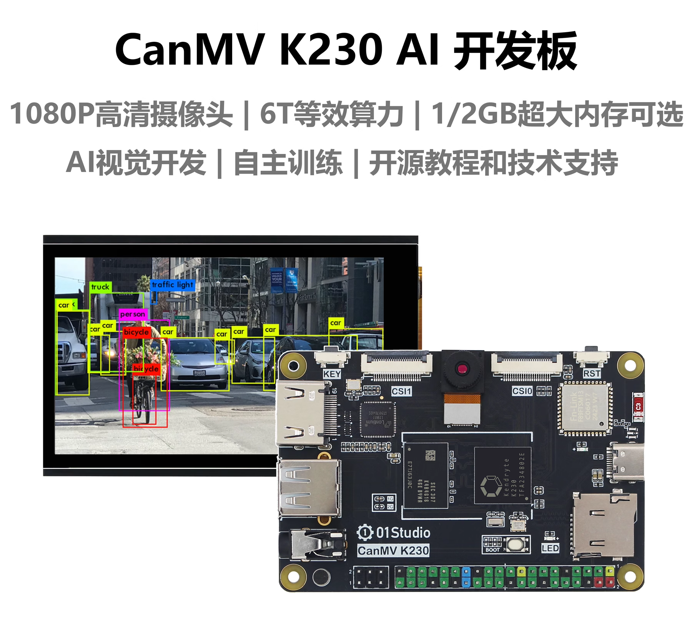

# CanMV K230

## CanMV是什么

CanMV开源项目由嘉楠科技（Canaan）官方创建和维护。是将MicroPython移植到嘉楠科技边缘计算AI芯片K210/K230（一款64位双核带硬件FPU和卷积加速器的 RISC-V）的开源项目，该项目旨在创建低成本，可扩展， 使用 Python 驱动的AI人工智能模块。

也就是说如果你熟悉Micropython或Python,那么你可以在非常短的时间内通过CanMV项目完成大量机器视觉、机器听觉和深度学习应用。

## CanMV K230开发板

01Studio CanMV K230 AI开发板基于嘉楠科技边缘计算芯片K230（RSIC-V架构，64位双核心）和CanMV开源项目。

### 硬件资源

### 详细参数

|  产品参数 |
|  :---:  | ---  |
| K230主控  | ● CPU1: RISC-V , 1.6GHz, 支持RVV 1.0   ● CPU0: RISC-V , 800MHz |
| 神经网络处理器  | KPU（6TOPS等效算力），支持INT8和INT16|
| 内存（可选）| ● 1GBytes（LPDDR4）   ● 2GBytes（LPDDR4） | 
| 存储  | MicroSD（最大支持512G） |
| 摄像头  | ● GC2093(标配) / OV5647   ● 支持3路输入（3 x 2 lane CSI） |
| 显示  | ● MIPI显示屏（1x4 lane DSI）最大支持1920x1080   ● HDMI显示器最大支持1920x1080   ● CanMV IDE显示最大支持1920x1080 |
| 网络  | ● 2.4G WiFi无线网络（板载天线）   ● 以太网有线（需外接USB转以太网卡）|
| 音频输出  | 3.5mm音频口（双声道） |
| 音频输入  | 麦克风咪头 |
| USB  | x1 USB 2.0 HOST |
| 按键  | x2 （可编程按键，复位键） |
| LED  | x2 （可编程LED灯，电源灯） |
| GPIO  | 40Pin GPIO排针（兼容树莓派） |
| 串口/I2C接口  | XH-1.25mm-4P（送转接线） |
| 备用调试串口  | ● CPU1（UART3）   ●  CPU0（UART0） |
| TYPE-C  | IDE连接开发、代码调试、文件传输、供电多合一 |
| 供电  | 5V @ 1A |

|  外观规格 |
|  :---:  | ---  |
| 尺寸  | 85 x 56 x 15mm  (长宽为PCB尺寸) |
| 重量  | 31克 |

### GPIO引脚图

### 尺寸图

## K230芯片参数

|  K230芯片参数 |
|  :---:  | ---  |
| CPU  | ● CPU1: RISC-V处理器 , 1.6GHz, 32KB I-cache, 32KB D-cache, 256KB L2 Cache, 128bit RVV 1.0扩展   ● CPU0: RISC-V处理器 , 800MHz, 32KB I-cache, 32KB D-cache, 128KB L2 Cache |
| KPU  | 6TOPS等效算力，支持INT8和INT16  典型网络性能：  Resnet50 ≥ 85fps @ INT8；Mobilenet_v2 ≥ 670fps @ INT8；YOLO V5s  ≥ 38fps @ INT8|
| DPU  | 3D结构光深度引擎，最大分辨率支持1920x1080 | 
| VPU  | H.264和H.265视频编解码，最大支持4096x4096  编码器性能：4K@20fps  解码器性能：4K@40fps  JEPG编解码器：最大支持8K(8192x8192)分辨率 |
| 图像输入  | 最大支持3路MIPI CSI输入：1x4 lane+1x2 lane 或 3x2 lane |
| 显示输出  | 1路MIPI DSI (1x4lane或1x2lane), 最大支持1920x1080 |
| 外设接口  | ● 5 x UART   ● 5 x I2C  ● 1 x I2S  ● 6 x PWM  ● 64 x GPIO + 8 x PMU GPIO  ● 2 x USB 2.0 OTG   ● 2 x SDxC: SD3.0, EMMC 5.0   ● 3 x SPI: 1 x OSPI + 2 x QSPI  ● Timer / RTC / WDT  |