# 配件安装使用

本节介绍01Studio CanMV K230相关配件模块的安装和使用方法。

## 散热片

散热片能帮助CanMV K230更加有效散热，特别在高温的环境下实现稳定工作。安装也是很简单，将散热片底部的3M胶撕开，对准K230和内存芯片的丝印框贴上即可。由于散热片具有导电性，注意安装过程中不要与电路板其它元件（电容、电阻）接触到，避免发生短路。

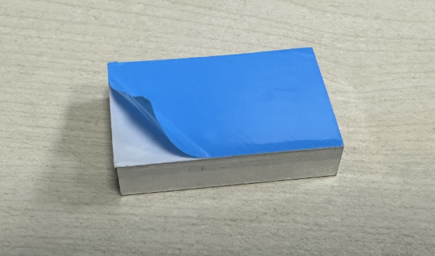

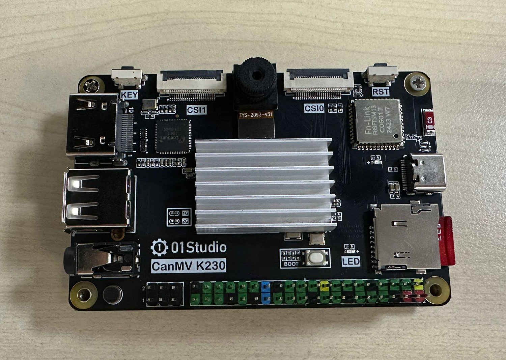

## 亚克力保护板

亚克力的底板的作用是避免PCB底部跟其它金属物体接触短路，避免焊脚刮花桌面，同时底部产生了空间也提升了散热效果。

CanMV K230亚克力底板安装方法非常简单，撕掉亚克力保护膜，中间嵌套铜柱，上下两端分别用M2.5螺丝拧紧即可。

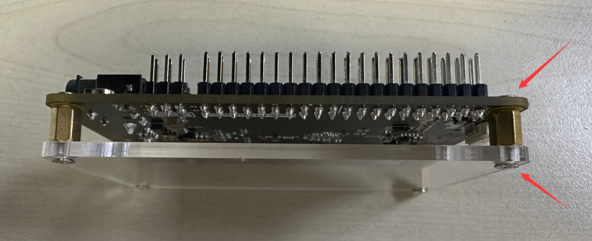

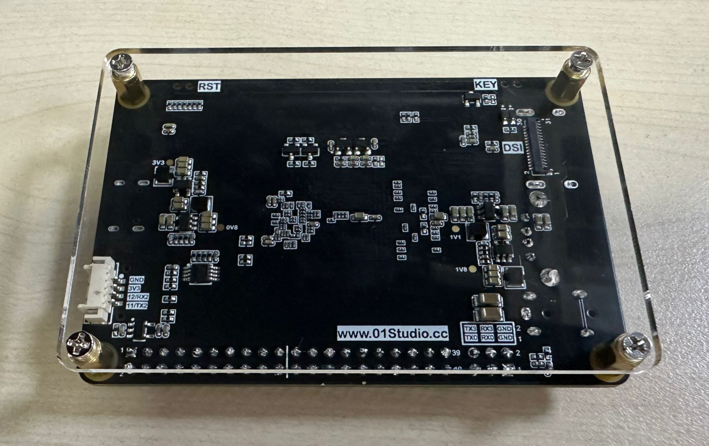

## 3.5寸MIPI显示屏

[点击购买>>](https://item.taobao.com/item.htm?id=822563446455)

:::tip Tips
由于上电后LCD背光默认关闭，所以看起来没有现象。需要烧录镜像后运行LCD相关代码才能看到LCD点亮，可运行画图代码进行测试 [**画图例程>>**](../machine_vision/draw.md#参考代码)
:::

### 功能介绍

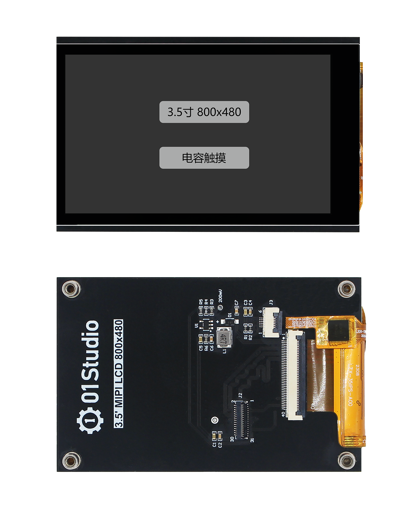

### 产品参数

|  产品参数 |
|  :---:  | ---  |
| 分辨率  | 800 x 480（Pixel） |
| 接口 | MIPI 2lane|
| 显示驱动IC  | ST7701S | 
| 触摸面板  | FT53xx（电容触摸） |
| 工作温度  | -20℃ ~ 70℃ |

|  外观规格 |
|  :---:  | ---  |
| 尺寸  | 87 x 56 mm |
| 重量  | 52克 |

### 组装说明

使用配套的31P排线可将CanMV K230开发板和3.5寸MIPI屏连接起来。**排线金手指触点均朝下插入，如下图所示：**

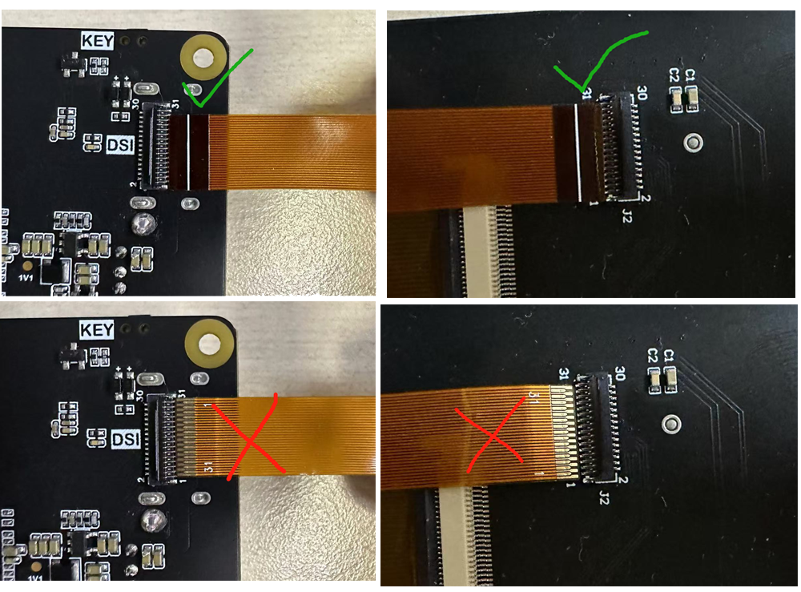

插入后下压锁紧卡扣：

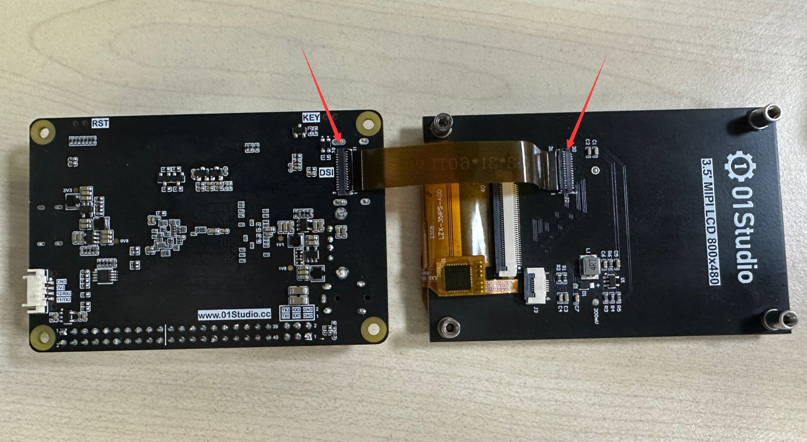

组装后可以同向使用：

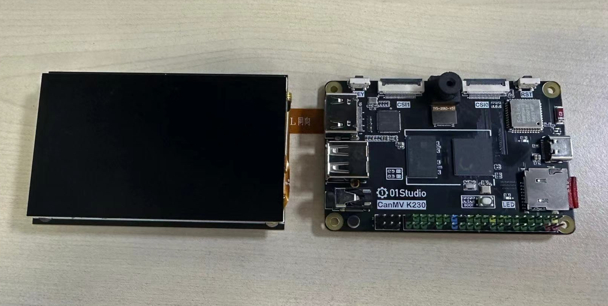

也可以通过螺柱固定在开发板背面使用：

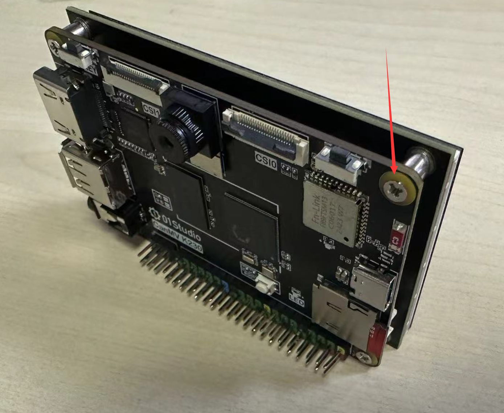

## 摄像头

### GC2093
01科技CanMV K230开发板标配GC2093摄像头（可视角70°），可以额外购买140°广角镜头版本。[**点击购买>>**](https://item.taobao.com/item.htm?id=841926094725)

|  产品参数 |
|  :---:  | ---  |
| 感光芯片  | GC2093 |
| 像素 | 1920X1080（1080P） |
| 视场角  | 70° (140°可选购) | 
| 接口  | 24P接口 |

|  外观规格 |
|  :---:  | ---  |
| 尺寸  | 总长17mm |

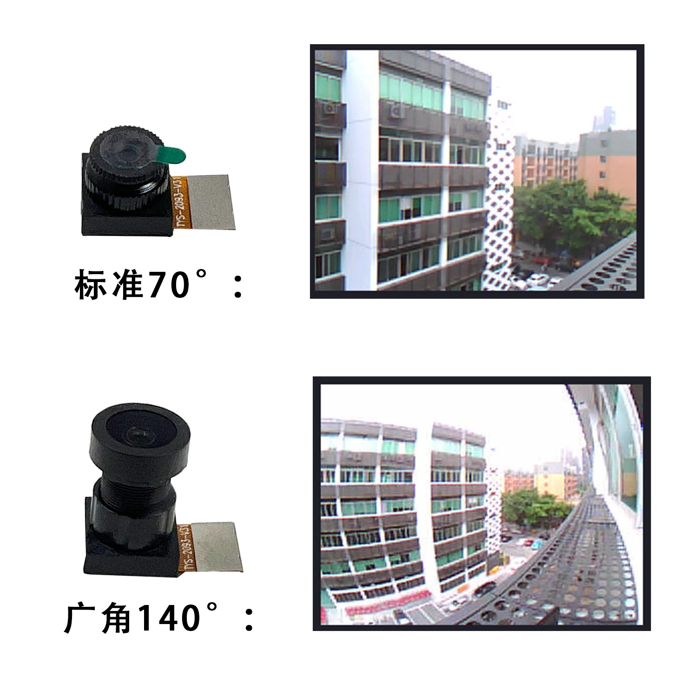

### 摄像头延长线

标配GC2093摄像头可使用FPC延长线延长。24P，长度15cm。[**点击购买>>**](https://item.taobao.com/item.htm?id=843993980296)

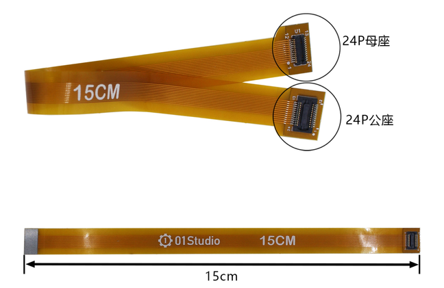

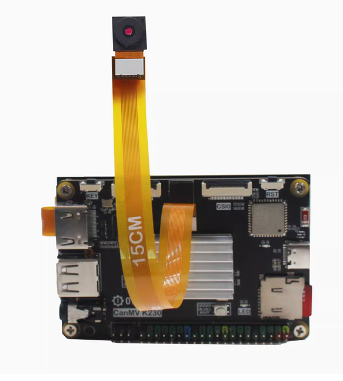

### OV5647

[**点击购买>>**](https://item.taobao.com/item.htm?id=833993249110)

CanMV K230可以通过CSI0、CSI1接口外接此摄像头。[多路摄像头接口使用教程>>](../machine_vision/camera.md#多路摄像头接口使用)

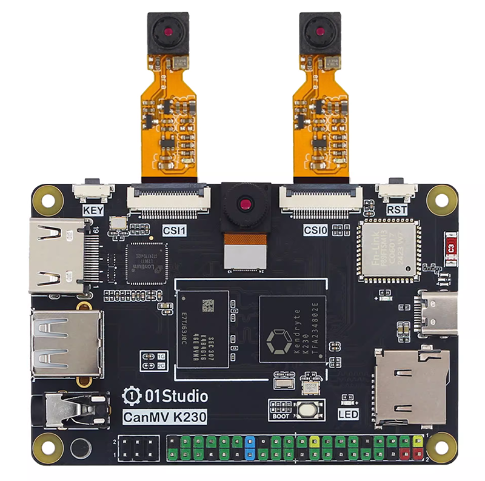

#### 产品参数

|  产品参数 |
|  :---:  | ---  |
| 感光芯片  | OV5647 |
| 像素 | 500万（K230 AI应用最大支持1080P）|
| 视场角  | 72° / 120° | 
| 接口  | 22P-0.5mm FPC |

|  外观规格 |
|  :---:  | ---  |
| 尺寸  | 6cm/15cm/30cm 长度可选 |

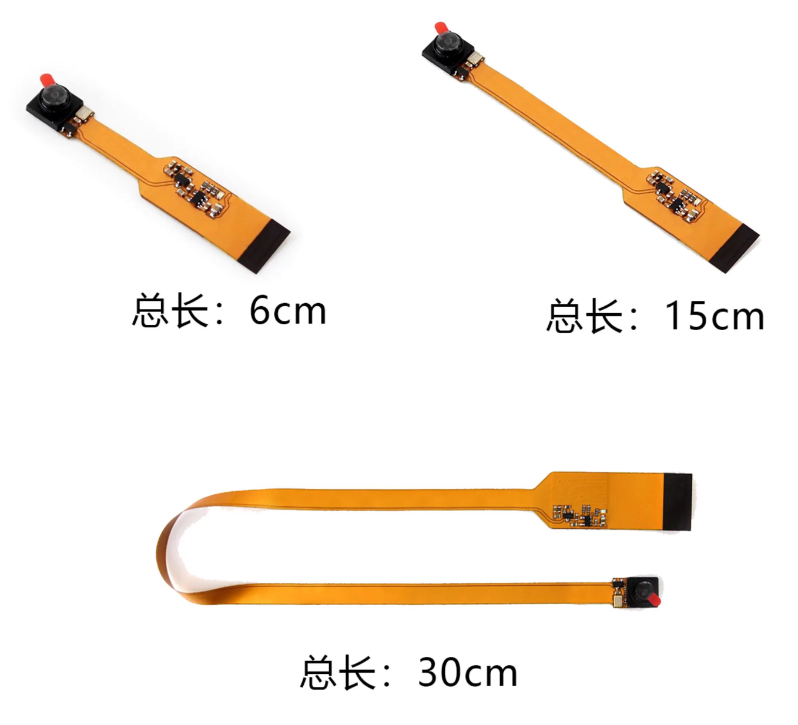

## USB转以太网卡

可选配件，适用于有需要使用以太网连接的场景。[点击购买>>](https://item.taobao.com/item.htm?id=822775353673)

[以太网有线连接使用教程](../network/ethernet.md)

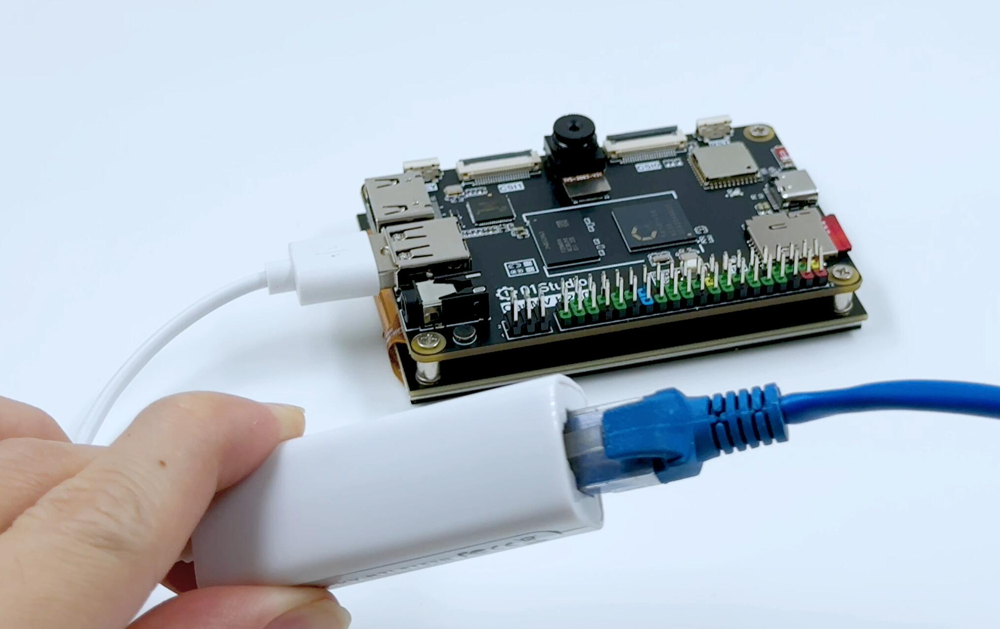