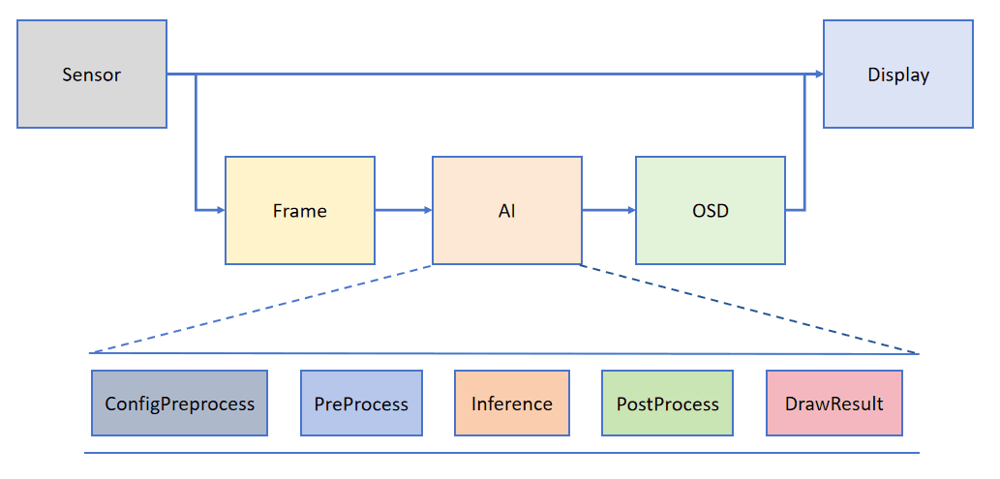

# AI视觉开发框架

前面的颜色识别、二维码识别都是使用了一些简单的图像处理功能，而更高级的机器视觉就需要使用KPU。可以简单类别比计算机的GPU（显卡），本质是实现高速的图像数据运算。

我们来简单介绍一下K230的KPU。KPU是K230内部一个神经网络处理器，它可以在低功耗的情况下实现卷积神经网络计算，实时获取被检测目标的大小、坐标和种类，对人脸或者物体进行检测和分类。**K230 KPU支持INT8和INT16, 典型网络下实测推理能力可达K210的13.7倍，MAC利用率超70%。**

为了帮助用户简化AI部分的开发, CanMV官方基于K230专门搭建了配套的AI视觉开发框架。框架结构如下图所示：

这个框架简单来说就是Sensor(摄像头)默认输出两路图像，一路格式为YUV420，直接给到Display显示；另一路格式为RGB888，给到AI部分进行处理。AI主要实现任务的前处理、推理和后处理流程，得到后处理结果后将其绘制在osd image实例上，并送给Display叠加，最后在HDMI、LCD或IDE缓冲区显示识别结果。

这套框架的优势是用户可以直接基于处理结果编程实现自己的功能，同时AI主要实现任务的前处理、推理和后处理流程也是通过Python代码实现，方便用户深入二次开发。充分满足不同用户和开发者的需求。

AI视觉开发框架主要API接口有：

- `PineLine` : 将sensor、display封装成固定接口，用于采集图像、画图以及结果图片显示。[点击查看详细介绍](https://www.kendryte.com/k230_canmv/main/zh/example/ai/AI_Demo%E8%AF%B4%E6%98%8E%E6%96%87%E6%A1%A3.html#pipeline)

- `Ai2d` : 预处理（Preprocess）相关接口。[点击查看详细介绍](https://www.kendryte.com/k230_canmv/main/zh/example/ai/AI_Demo%E8%AF%B4%E6%98%8E%E6%96%87%E6%A1%A3.html#ai2d)

- `AIBase` : 模型推理主要接口。[点击查看详细介绍](https://www.kendryte.com/k230_canmv/main/zh/example/ai/AI_Demo%E8%AF%B4%E6%98%8E%E6%96%87%E6%A1%A3.html#aibase)

本章AI视觉例程均通过上述接口实现主要功能。