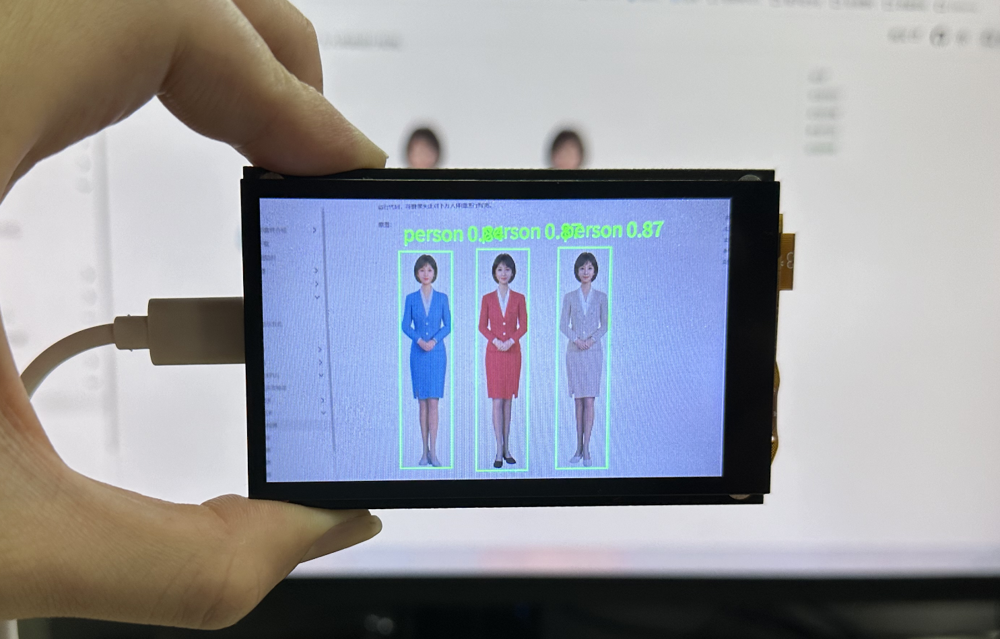

# 人体检测

## 前言

人体检测是判断摄像头画面中有无出现人体，常用于人体数量检测，人流量监控以及安防监控等。本节我们来学习一下如何通过CanMV AI视觉框架和MicroPython编程快速实现人体检测。

## 实验目的
将摄像头拍摄到的画面中的人体检测出来并通过画框提示。

## 实验讲解

本实验通过CanMV K230 AI视觉框架开发，详细说明参考 [AI视觉开发框架](../ai_frame.md) 章节内容，这里不再重复。例程用到的模型已经存放在CanMV K230的文件系统，无需额外拷贝。

具体编程思路如下：

```mermaid
graph TD
    导入AI视觉框架相关模块  --> 加载相关模型 --> 初始化和配置相关模块 --> 获取摄像头图像 --> AI视觉推理查找图像中人体 --> 画矩形指示 --> 获取摄像头图像;
```

## 参考代码

```python
'''
实验名称：人体检测
实验平台：01Studio CanMV K230
教程：wiki.01studio.cc
说明：可以通过display="xxx"参数选择"hdmi"、"lcd3_5"(3.5寸mipi屏)或"lcd2_4"(2.4寸mipi屏)显示方式
'''

from libs.PipeLine import PipeLine, ScopedTiming
from libs.AIBase import AIBase
from libs.AI2D import Ai2d
import os
import ujson
from media.media import *
from media.sensor import *
from time import *
import nncase_runtime as nn
import ulab.numpy as np
import time
import utime
import image
import random
import gc
import sys
import aicube

# 自定义人体检测类
class PersonDetectionApp(AIBase):
    def __init__(self,kmodel_path,model_input_size,labels,anchors,confidence_threshold=0.2,nms_threshold=0.5,nms_option=False,strides=[8,16,32],rgb888p_size=[224,224],display_size=[1920,1080],debug_mode=0):
        super().__init__(kmodel_path,model_input_size,rgb888p_size,debug_mode)
        self.kmodel_path=kmodel_path
        # 模型输入分辨率
        self.model_input_size=model_input_size
        # 标签
        self.labels=labels
        # 检测anchors设置
        self.anchors=anchors
        # 特征图降采样倍数
        self.strides=strides
        # 置信度阈值设置
        self.confidence_threshold=confidence_threshold
        # nms阈值设置
        self.nms_threshold=nms_threshold
        self.nms_option=nms_option
        # sensor给到AI的图像分辨率
        self.rgb888p_size=[ALIGN_UP(rgb888p_size[0],16),rgb888p_size[1]]
        # 显示分辨率
        self.display_size=[ALIGN_UP(display_size[0],16),display_size[1]]
        self.debug_mode=debug_mode
        # Ai2d实例，用于实现模型预处理
        self.ai2d=Ai2d(debug_mode)
        # 设置Ai2d的输入输出格式和类型
        self.ai2d.set_ai2d_dtype(nn.ai2d_format.NCHW_FMT,nn.ai2d_format.NCHW_FMT,np.uint8, np.uint8)

    # 配置预处理操作，这里使用了pad和resize，Ai2d支持crop/shift/pad/resize/affine，具体代码请打开/sdcard/libs/AI2D.py查看
    def config_preprocess(self,input_image_size=None):
        with ScopedTiming("set preprocess config",self.debug_mode > 0):
            # 初始化ai2d预处理配置，默认为sensor给到AI的尺寸，您可以通过设置input_image_size自行修改输入尺寸
            ai2d_input_size=input_image_size if input_image_size else self.rgb888p_size
            top,bottom,left,right=self.get_padding_param()
            self.ai2d.pad([0,0,0,0,top,bottom,left,right], 0, [0,0,0])
            self.ai2d.resize(nn.interp_method.tf_bilinear, nn.interp_mode.half_pixel)
            self.ai2d.build([1,3,ai2d_input_size[1],ai2d_input_size[0]],[1,3,self.model_input_size[1],self.model_input_size[0]])

    # 自定义当前任务的后处理
    def postprocess(self,results):
        with ScopedTiming("postprocess",self.debug_mode > 0):
            # 这里使用了aicube模型的后处理接口anchorbasedet_post_preocess
            dets = aicube.anchorbasedet_post_process(results[0], results[1], results[2], self.model_input_size, self.rgb888p_size, self.strides, len(self.labels), self.confidence_threshold, self.nms_threshold, self.anchors, self.nms_option)
            return dets

    # 绘制结果
    def draw_result(self,pl,dets):
        with ScopedTiming("display_draw",self.debug_mode >0):
            if dets:
                pl.osd_img.clear()
                for det_box in dets:
                    x1, y1, x2, y2 = det_box[2],det_box[3],det_box[4],det_box[5]
                    w = float(x2 - x1) * self.display_size[0] // self.rgb888p_size[0]
                    h = float(y2 - y1) * self.display_size[1] // self.rgb888p_size[1]
                    x1 = int(x1 * self.display_size[0] // self.rgb888p_size[0])
                    y1 = int(y1 * self.display_size[1] // self.rgb888p_size[1])
                    x2 = int(x2 * self.display_size[0] // self.rgb888p_size[0])
                    y2 = int(y2 * self.display_size[1] // self.rgb888p_size[1])
                    if (h<(0.1*self.display_size[0])):
                        continue
                    if (w<(0.25*self.display_size[0]) and ((x1<(0.03*self.display_size[0])) or (x2>(0.97*self.display_size[0])))):
                        continue
                    if (w<(0.15*self.display_size[0]) and ((x1<(0.01*self.display_size[0])) or (x2>(0.99*self.display_size[0])))):
                        continue
                    pl.osd_img.draw_rectangle(x1 , y1 , int(w) , int(h), color=(255, 0, 255, 0), thickness = 2)
                    pl.osd_img.draw_string_advanced( x1 , y1-50,32, " " + self.labels[det_box[0]] + " " + str(round(det_box[1],2)), color=(255,0, 255, 0))
            else:
                pl.osd_img.clear()

    # 计算padding参数
    def get_padding_param(self):
        dst_w = self.model_input_size[0]
        dst_h = self.model_input_size[1]
        input_width = self.rgb888p_size[0]
        input_high = self.rgb888p_size[1]
        ratio_w = dst_w / input_width
        ratio_h = dst_h / input_high
        if ratio_w < ratio_h:
            ratio = ratio_w
        else:
            ratio = ratio_h
        new_w = (int)(ratio * input_width)
        new_h = (int)(ratio * input_high)
        dw = (dst_w - new_w) / 2
        dh = (dst_h - new_h) / 2
        top = int(round(dh - 0.1))
        bottom = int(round(dh + 0.1))
        left = int(round(dw - 0.1))
        right = int(round(dw - 0.1))
        return  top, bottom, left, right

if __name__=="__main__":

    # 显示模式，可以选择"hdmi"、"lcd3_5"(3.5寸mipi屏)和"lcd2_4"(2.4寸mipi屏)

    display="lcd3_5"

    if display=="hdmi":
        display_mode='hdmi'
        display_size=[1920,1080]
        rgb888p_size = [1920, 1080]

    elif display=="lcd3_5":
        display_mode= 'st7701'
        display_size=[800,480]
        rgb888p_size = [1920, 1080]

    elif display=="lcd2_4":
        display_mode= 'st7701'
        display_size=[640,480]
        rgb888p_size = [1280, 960] #2.4寸屏摄像头画面比例为4:3

    # 模型路径
    kmodel_path="/sdcard/examples/kmodel/person_detect_yolov5n.kmodel"
    # 其它参数设置
    confidence_threshold = 0.2
    nms_threshold = 0.6

    labels = ["person"]
    anchors = [10, 13, 16, 30, 33, 23, 30, 61, 62, 45, 59, 119, 116, 90, 156, 198, 373, 326]

    # 初始化PipeLine
    pl=PipeLine(rgb888p_size=rgb888p_size,display_size=display_size,display_mode=display_mode)

    pl.create(Sensor(width=rgb888p_size[0], height=rgb888p_size[1]))  # 创建PipeLine实例

    # 初始化自定义人体检测实例
    person_det=PersonDetectionApp(kmodel_path,model_input_size=[640,640],labels=labels,anchors=anchors,confidence_threshold=confidence_threshold,nms_threshold=nms_threshold,nms_option=False,strides=[8,16,32],rgb888p_size=rgb888p_size,display_size=display_size,debug_mode=0)
    person_det.config_preprocess()

    clock = time.clock()

    while True:

        clock.tick()

        img=pl.get_frame()  # 获取当前帧数据
        res=person_det.run(img)  # 推理当前帧
        person_det.draw_result(pl,res)  # 绘制结果到PipeLine的osd图像
        print(res) # 打印结果
        pl.show_image()  # 显示当前的绘制结果
        gc.collect()

        print(clock.fps()) #打印帧率

```

这里对关键代码进行讲解：

- 设置显示方式：
    通过改变`display`的参数选择 `hdmi` 或 `lcd`（3.5寸mipi显示屏）显示图像。
```python
    ...

    # 显示模式，可以选择"hdmi"、"lcd3_5"(3.5寸mipi屏)和"lcd2_4"(2.4寸mipi屏)

    display="lcd3_5"

    if display=="hdmi":
        display_mode='hdmi'
        display_size=[1920,1080]
        rgb888p_size = [1920, 1080]

    elif display=="lcd3_5":
        display_mode= 'st7701'
        display_size=[800,480]
        rgb888p_size = [1920, 1080]

    elif display=="lcd2_4":
        display_mode= 'st7701'
        display_size=[640,480]
        rgb888p_size = [1280, 960] #2.4寸屏摄像头画面比例为4:3
    ...    
```

- 主函数代码：

可以看到使用默认配置后只使用了4行代码便实现了**获取当前帧图像、AI推理、绘制结果、显示结果** 的识别流程。

代码中`res`变量为识别结果，可以通过终端打印或结合其它章节内容实现跟其它MCU串口通讯、网络传输。

```python
    ...
    while True:

        clock.tick()

        img=pl.get_frame()  # 获取当前帧数据
        res=person_det.run(img)  # 推理当前帧
        person_det.draw_result(pl,res)  # 绘制结果到PipeLine的osd图像
        print(res) # 打印结果
        pl.show_image()  # 显示当前的绘制结果
        gc.collect()

        print(clock.fps()) #打印帧率
    ...
```

## 实验结果

运行代码，将摄像头正对下方人体图进行检测。

原图：


识别结果：



