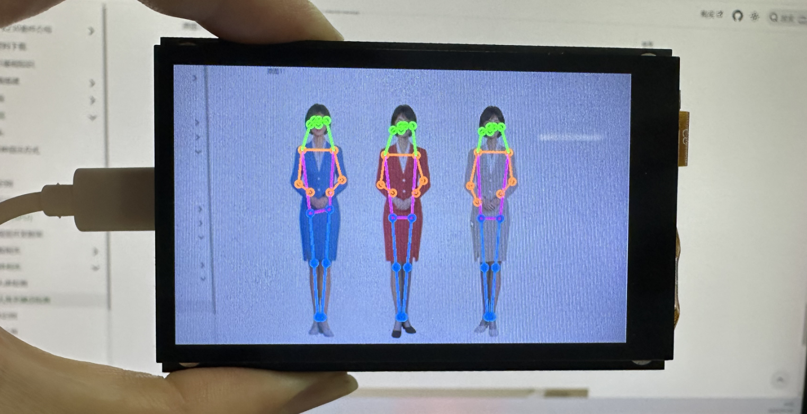

# 人体关键点检测

## 前言

人体关键点检测是指标注出人体关节等关键信息，分析人体姿态、运动轨迹、动作角度等。本节我们来学习一下如何通过CanMV AI视觉框架和MicroPython编程快速实现人体关键点检测。

## 实验目的

检测摄像头拍摄到的画面中的人体关键点并通过画图提示。

## 实验讲解

本实验通过CanMV K230 AI视觉框架开发，详细说明参考 [AI视觉开发框架](../ai_frame.md) 章节内容，这里不再重复。例程用到的模型已经存放在CanMV K230的文件系统，无需额外拷贝。

具体编程思路如下：

```mermaid
graph TD
    导入AI视觉框架相关模块  --> 加载相关模型 --> 初始化和配置相关模块 --> 获取摄像头图像 --> AI视觉推理查找图像中人体并找出关键点 --> 画图指示 --> 获取摄像头图像;
```

## 参考代码

```python
'''
实验名称：人体关键点检测
实验平台：01Studio CanMV K230
教程：wiki.01studio.cc
'''

from libs.PipeLine import PipeLine, ScopedTiming
from libs.AIBase import AIBase
from libs.AI2D import Ai2d
import os
import ujson
from media.media import *
from time import *
import nncase_runtime as nn
import ulab.numpy as np
import time
import utime
import image
import random
import gc
import sys
import aidemo

# 自定义人体关键点检测类
class PersonKeyPointApp(AIBase):
    def __init__(self,kmodel_path,model_input_size,confidence_threshold=0.2,nms_threshold=0.5,rgb888p_size=[1280,720],display_size=[1920,1080],debug_mode=0):
        super().__init__(kmodel_path,model_input_size,rgb888p_size,debug_mode)
        self.kmodel_path=kmodel_path
        # 模型输入分辨率
        self.model_input_size=model_input_size
        # 置信度阈值设置
        self.confidence_threshold=confidence_threshold
        # nms阈值设置
        self.nms_threshold=nms_threshold
        # sensor给到AI的图像分辨率
        self.rgb888p_size=[ALIGN_UP(rgb888p_size[0],16),rgb888p_size[1]]
        # 显示分辨率
        self.display_size=[ALIGN_UP(display_size[0],16),display_size[1]]
        self.debug_mode=debug_mode
        #骨骼信息
        self.SKELETON = [(16, 14),(14, 12),(17, 15),(15, 13),(12, 13),(6,  12),(7,  13),(6,  7),(6,  8),(7,  9),(8,  10),(9,  11),(2,  3),(1,  2),(1,  3),(2,  4),(3,  5),(4,  6),(5,  7)]
        #肢体颜色
        self.LIMB_COLORS = [(255, 51,  153, 255),(255, 51,  153, 255),(255, 51,  153, 255),(255, 51,  153, 255),(255, 255, 51,  255),(255, 255, 51,  255),(255, 255, 51,  255),(255, 255, 128, 0),(255, 255, 128, 0),(255, 255, 128, 0),(255, 255, 128, 0),(255, 255, 128, 0),(255, 0,   255, 0),(255, 0,   255, 0),(255, 0,   255, 0),(255, 0,   255, 0),(255, 0,   255, 0),(255, 0,   255, 0),(255, 0,   255, 0)]
        #关键点颜色，共17个
        self.KPS_COLORS = [(255, 0,   255, 0),(255, 0,   255, 0),(255, 0,   255, 0),(255, 0,   255, 0),(255, 0,   255, 0),(255, 255, 128, 0),(255, 255, 128, 0),(255, 255, 128, 0),(255, 255, 128, 0),(255, 255, 128, 0),(255, 255, 128, 0),(255, 51,  153, 255),(255, 51,  153, 255),(255, 51,  153, 255),(255, 51,  153, 255),(255, 51,  153, 255),(255, 51,  153, 255)]

        # Ai2d实例，用于实现模型预处理
        self.ai2d=Ai2d(debug_mode)
        # 设置Ai2d的输入输出格式和类型
        self.ai2d.set_ai2d_dtype(nn.ai2d_format.NCHW_FMT,nn.ai2d_format.NCHW_FMT,np.uint8, np.uint8)

    # 配置预处理操作，这里使用了pad和resize，Ai2d支持crop/shift/pad/resize/affine，具体代码请打开/sdcard/app/libs/AI2D.py查看
    def config_preprocess(self,input_image_size=None):
        with ScopedTiming("set preprocess config",self.debug_mode > 0):
            # 初始化ai2d预处理配置，默认为sensor给到AI的尺寸，您可以通过设置input_image_size自行修改输入尺寸
            ai2d_input_size=input_image_size if input_image_size else self.rgb888p_size
            top,bottom,left,right=self.get_padding_param()
            self.ai2d.pad([0,0,0,0,top,bottom,left,right], 0, [0,0,0])
            self.ai2d.resize(nn.interp_method.tf_bilinear, nn.interp_mode.half_pixel)
            self.ai2d.build([1,3,ai2d_input_size[1],ai2d_input_size[0]],[1,3,self.model_input_size[1],self.model_input_size[0]])

    # 自定义当前任务的后处理
    def postprocess(self,results):
        with ScopedTiming("postprocess",self.debug_mode > 0):
            # 这里使用了aidemo库的person_kp_postprocess接口
            results = aidemo.person_kp_postprocess(results[0],[self.rgb888p_size[1],self.rgb888p_size[0]],self.model_input_size,self.confidence_threshold,self.nms_threshold)
            return results

    #绘制结果，绘制人体关键点
    def draw_result(self,pl,res):
        with ScopedTiming("display_draw",self.debug_mode >0):
            if res[0]:
                pl.osd_img.clear()
                kpses = res[1]
                for i in range(len(res[0])):
                    for k in range(17+2):
                        if (k < 17):
                            kps_x,kps_y,kps_s = round(kpses[i][k][0]),round(kpses[i][k][1]),kpses[i][k][2]
                            kps_x1 = int(float(kps_x) * self.display_size[0] // self.rgb888p_size[0])
                            kps_y1 = int(float(kps_y) * self.display_size[1] // self.rgb888p_size[1])
                            if (kps_s > 0):
                                pl.osd_img.draw_circle(kps_x1,kps_y1,5,self.KPS_COLORS[k],4)
                        ske = self.SKELETON[k]
                        pos1_x,pos1_y= round(kpses[i][ske[0]-1][0]),round(kpses[i][ske[0]-1][1])
                        pos1_x_ = int(float(pos1_x) * self.display_size[0] // self.rgb888p_size[0])
                        pos1_y_ = int(float(pos1_y) * self.display_size[1] // self.rgb888p_size[1])

                        pos2_x,pos2_y = round(kpses[i][(ske[1] -1)][0]),round(kpses[i][(ske[1] -1)][1])
                        pos2_x_ = int(float(pos2_x) * self.display_size[0] // self.rgb888p_size[0])
                        pos2_y_ = int(float(pos2_y) * self.display_size[1] // self.rgb888p_size[1])

                        pos1_s,pos2_s = kpses[i][(ske[0] -1)][2],kpses[i][(ske[1] -1)][2]
                        if (pos1_s > 0.0 and pos2_s >0.0):
                            pl.osd_img.draw_line(pos1_x_,pos1_y_,pos2_x_,pos2_y_,self.LIMB_COLORS[k],4)
                    gc.collect()
            else:
                pl.osd_img.clear()

    # 计算padding参数
    def get_padding_param(self):
        dst_w = self.model_input_size[0]
        dst_h = self.model_input_size[1]
        input_width = self.rgb888p_size[0]
        input_high = self.rgb888p_size[1]
        ratio_w = dst_w / input_width
        ratio_h = dst_h / input_high
        if ratio_w < ratio_h:
            ratio = ratio_w
        else:
            ratio = ratio_h
        new_w = (int)(ratio * input_width)
        new_h = (int)(ratio * input_high)
        dw = (dst_w - new_w) / 2
        dh = (dst_h - new_h) / 2
        top = int(round(dh - 0.1))
        bottom = int(round(dh + 0.1))
        left = int(round(dw - 0.1))
        right = int(round(dw - 0.1))
        return  top, bottom, left, right

if __name__=="__main__":
    # 显示模式，默认"hdmi",可以选择"hdmi"和"lcd"
    display_mode="lcd"
    if display_mode=="hdmi":
        display_size=[1920,1080]
    else:
        display_size=[800,480]
    # 模型路径
    kmodel_path="/sdcard/app/tests/kmodel/yolov8n-pose.kmodel"
    # 其它参数设置
    confidence_threshold = 0.2
    nms_threshold = 0.5
    rgb888p_size=[1920,1080]
    # 初始化PipeLine
    pl=PipeLine(rgb888p_size=rgb888p_size,display_size=display_size,display_mode=display_mode)
    pl.create()
    # 初始化自定义人体关键点检测实例
    person_kp=PersonKeyPointApp(kmodel_path,model_input_size=[320,320],confidence_threshold=confidence_threshold,nms_threshold=nms_threshold,rgb888p_size=rgb888p_size,display_size=display_size,debug_mode=0)
    person_kp.config_preprocess()

    clock = time.clock()

    try:
        while True:

            os.exitpoint()

            clock.tick()

            img=pl.get_frame()  # 获取当前帧数据
            res=person_kp.run(img)  # 推理当前帧
            person_kp.draw_result(pl,res)  # 绘制结果到PipeLine的osd图像
            print(res)  #打印结果
            pl.show_image()  # 显示当前的绘制结果
            gc.collect()

            print(clock.fps()) #打印帧率

    #IDE中断释放相关资源
    except Exception as e:
        sys.print_exception(e)
    finally:
        person_kp.deinit()
        pl.destroy()
```

这里对关键代码进行讲解：

- 设置显示方式：
    通过改变display_mode的参数选择 `hdmi` 或 `lcd`（3.5寸mipi显示屏）显示图像。
```python
    ...

    # 显示模式，默认"hdmi",可以选择"hdmi"和"lcd"
    display_mode="lcd"
    if display_mode=="hdmi":
        display_size=[1920,1080]
    else:
        display_size=[800,480]

    ...    
```

- 主函数代码：

可以看到使用默认配置后只使用了4行代码便实现了**获取当前帧图像、AI推理、绘制结果、显示结果** 的识别流程。

代码中`res`变量为识别结果，可以通过终端打印或结合其它章节内容实现跟其它MCU串口通讯、网络传输。

```python
        ...
        while True:

            os.exitpoint()

            clock.tick()

            img=pl.get_frame()  # 获取当前帧数据
            res=person_kp.run(img)  # 推理当前帧
            person_kp.draw_result(pl,res)  # 绘制结果到PipeLine的osd图像
            print(res)  #打印结果
            pl.show_image()  # 显示当前的绘制结果
            gc.collect()

            print(clock.fps()) #打印帧率
        ...
```

## 实验结果

运行代码，将摄像头正对下方人体图进行关键点检测。

原图1：


识别结果1：



<br></br>

原图2：


识别结果2：


