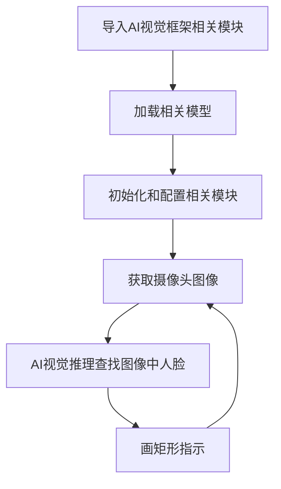
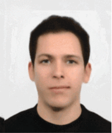
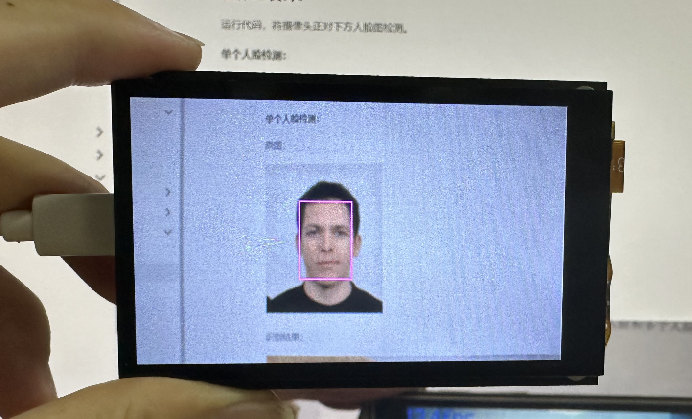
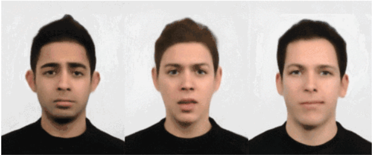
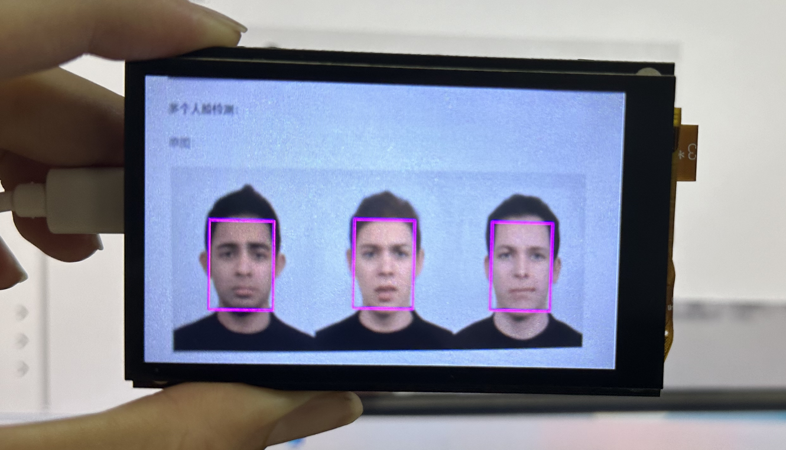
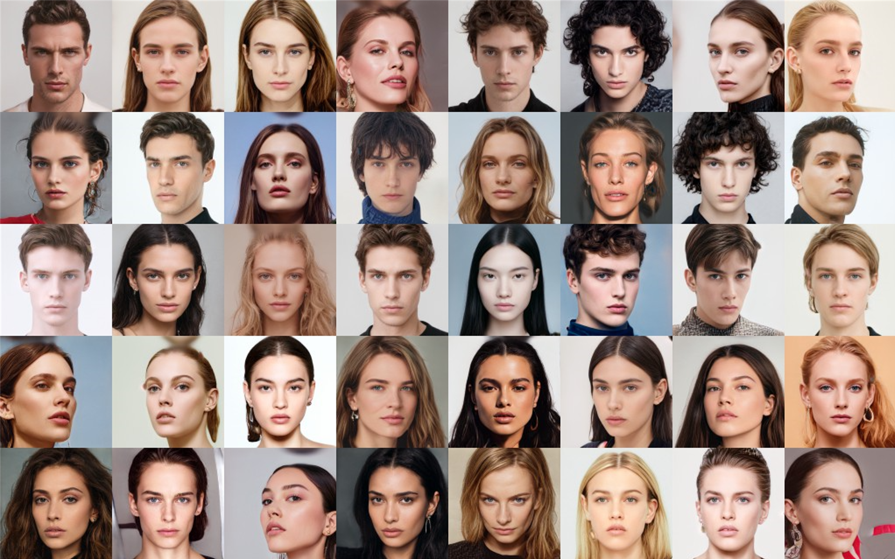
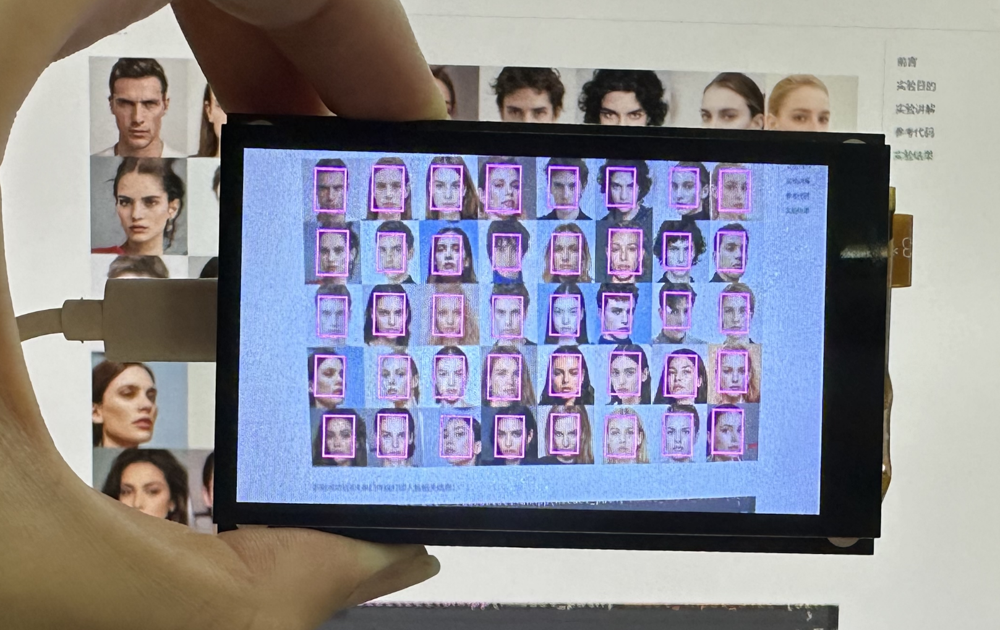
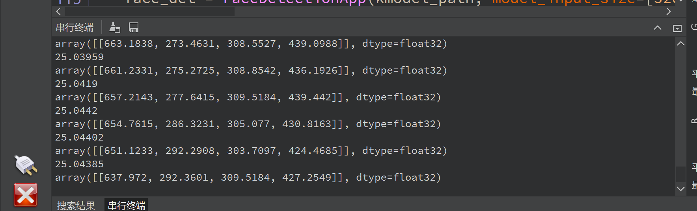

# 人脸检测

## 前言
人脸检测，简单来说就是告诉你将一幅图片中哪些是人脸，支持单个和多个人脸。今天我们来学习一下如何通过CanMV AI视觉框架和MicroPython编程快速实现人脸检测。

## 实验目的
将摄像头拍摄到的画面中的人脸用矩形框标识出来。

## 实验讲解

本实验通过CanMV K230 AI视觉框架开发，详细说明参考 [AI视觉开发框架](../ai_frame.md) 章节内容，这里不再重复。例程用到的模型已经存放在CanMV K230的文件系统，无需额外拷贝。

具体编程思路如下：



## 参考代码

```python
'''
实验名称：人脸检测
实验平台：01Studio CanMV K230
教程：wiki.01studio.cc
'''
from media.sensor import * #导入sensor模块，使用摄像头相关接口
from libs.PipeLine import PipeLine, ScopedTiming
from libs.AIBase import AIBase
from libs.AI2D import Ai2d
import os
import ujson
from media.media import *
from time import *
import nncase_runtime as nn
import ulab.numpy as np
import time
import utime
import image
import random
import gc
import sys
import aidemo

# 自定义人脸检测类，继承自AIBase基类
class FaceDetectionApp(AIBase):
    def __init__(self, kmodel_path, model_input_size, anchors, confidence_threshold=0.5, nms_threshold=0.2, rgb888p_size=[224,224], display_size=[1920,1080], debug_mode=0):
        super().__init__(kmodel_path, model_input_size, rgb888p_size, debug_mode)  # 调用基类的构造函数
        self.kmodel_path = kmodel_path  # 模型文件路径
        self.model_input_size = model_input_size  # 模型输入分辨率
        self.confidence_threshold = confidence_threshold  # 置信度阈值
        self.nms_threshold = nms_threshold  # NMS（非极大值抑制）阈值
        self.anchors = anchors  # 锚点数据，用于目标检测
        self.rgb888p_size = [ALIGN_UP(rgb888p_size[0], 16), rgb888p_size[1]]  # sensor给到AI的图像分辨率，并对宽度进行16的对齐
        self.display_size = [ALIGN_UP(display_size[0], 16), display_size[1]]  # 显示分辨率，并对宽度进行16的对齐
        self.debug_mode = debug_mode  # 是否开启调试模式
        self.ai2d = Ai2d(debug_mode)  # 实例化Ai2d，用于实现模型预处理
        self.ai2d.set_ai2d_dtype(nn.ai2d_format.NCHW_FMT, nn.ai2d_format.NCHW_FMT, np.uint8, np.uint8)  # 设置Ai2d的输入输出格式和类型

    # 配置预处理操作，这里使用了pad和resize，Ai2d支持crop/shift/pad/resize/affine，具体代码请打开/sdcard/app/libs/AI2D.py查看
    def config_preprocess(self, input_image_size=None):
        with ScopedTiming("set preprocess config", self.debug_mode > 0):  # 计时器，如果debug_mode大于0则开启
            ai2d_input_size = input_image_size if input_image_size else self.rgb888p_size  # 初始化ai2d预处理配置，默认为sensor给到AI的尺寸，可以通过设置input_image_size自行修改输入尺寸
            top, bottom, left, right = self.get_padding_param()  # 获取padding参数
            self.ai2d.pad([0, 0, 0, 0, top, bottom, left, right], 0, [104, 117, 123])  # 填充边缘
            self.ai2d.resize(nn.interp_method.tf_bilinear, nn.interp_mode.half_pixel)  # 缩放图像
            self.ai2d.build([1,3,ai2d_input_size[1],ai2d_input_size[0]],[1,3,self.model_input_size[1],self.model_input_size[0]])  # 构建预处理流程

    # 自定义当前任务的后处理，results是模型输出array列表，这里使用了aidemo库的face_det_post_process接口
    def postprocess(self, results):
        with ScopedTiming("postprocess", self.debug_mode > 0):
            post_ret = aidemo.face_det_post_process(self.confidence_threshold, self.nms_threshold, self.model_input_size[1], self.anchors, self.rgb888p_size, results)
            if len(post_ret) == 0:
                return post_ret
            else:
                return post_ret[0]

    # 绘制检测结果到画面上
    def draw_result(self, pl, dets):
        with ScopedTiming("display_draw", self.debug_mode > 0):
            if dets:
                pl.osd_img.clear()  # 清除OSD图像
                for det in dets:
                    # 将检测框的坐标转换为显示分辨率下的坐标
                    x, y, w, h = map(lambda x: int(round(x, 0)), det[:4])
                    x = x * self.display_size[0] // self.rgb888p_size[0]
                    y = y * self.display_size[1] // self.rgb888p_size[1]
                    w = w * self.display_size[0] // self.rgb888p_size[0]
                    h = h * self.display_size[1] // self.rgb888p_size[1]
                    pl.osd_img.draw_rectangle(x, y, w, h, color=(255, 255, 0, 255), thickness=2)  # 绘制矩形框
            else:
                pl.osd_img.clear()

    # 获取padding参数
    def get_padding_param(self):
        dst_w = self.model_input_size[0]  # 模型输入宽度
        dst_h = self.model_input_size[1]  # 模型输入高度
        ratio_w = dst_w / self.rgb888p_size[0]  # 宽度缩放比例
        ratio_h = dst_h / self.rgb888p_size[1]  # 高度缩放比例
        ratio = min(ratio_w, ratio_h)  # 取较小的缩放比例
        new_w = int(ratio * self.rgb888p_size[0])  # 新宽度
        new_h = int(ratio * self.rgb888p_size[1])  # 新高度
        dw = (dst_w - new_w) / 2  # 宽度差
        dh = (dst_h - new_h) / 2  # 高度差
        top = int(round(0))
        bottom = int(round(dh * 2 + 0.1))
        left = int(round(0))
        right = int(round(dw * 2 - 0.1))
        return top, bottom, left, right

if __name__ == "__main__":
    # 显示模式，默认"hdmi",可以选择"hdmi"和"lcd"
    display_mode="lcd"
    if display_mode=="hdmi":
        display_size=[1920,1080]
    else:
        display_size=[800,480]
    # 设置模型路径和其他参数
    kmodel_path = "/sdcard/examples/kmodel/face_detection_320.kmodel"
    # 其它参数
    confidence_threshold = 0.5
    nms_threshold = 0.2
    anchor_len = 4200
    det_dim = 4
    anchors_path = "/sdcard/examples/utils/prior_data_320.bin"
    anchors = np.fromfile(anchors_path, dtype=np.float)
    anchors = anchors.reshape((anchor_len, det_dim))
    rgb888p_size = [1920, 1080]

    # 初始化PipeLine，用于图像处理流程
    pl = PipeLine(rgb888p_size=rgb888p_size, display_size=display_size, display_mode=display_mode)
    pl.create()  # 创建PipeLine实例
    # 初始化自定义人脸检测实例
    face_det = FaceDetectionApp(kmodel_path, model_input_size=[320, 320], anchors=anchors, confidence_threshold=confidence_threshold, nms_threshold=nms_threshold, rgb888p_size=rgb888p_size, display_size=display_size, debug_mode=0)
    face_det.config_preprocess()  # 配置预处理

    clock = time.clock()

    ###############
    ## 这里编写代码
    ###############
    while True:

        clock.tick()

        img = pl.get_frame()            # 获取当前帧数据
        res = face_det.run(img)         # 推理当前帧

        # 当检测到人脸时，打印结果
        if res:
            print(res)

        face_det.draw_result(pl, res)   # 绘制结果

        pl.show_image()                 # 显示结果
        gc.collect()                    # 垃圾回收

        print(clock.fps()) #打印帧率

```

这里对关键代码进行讲解：

- 设置显示方式：
    通过改变display_mode的参数选择 `hdmi` 或 `lcd`（3.5寸mipi显示屏）显示图像。
```python
    ...

    # 显示模式，默认"hdmi",可以选择"hdmi"和"lcd"
    display_mode="lcd"
    if display_mode=="hdmi":
        display_size=[1920,1080]
    else:
        display_size=[800,480]

    ...    
```

- 主函数代码：

可以看到使用默认配置后只使用了4行代码便实现了**获取当前帧图像、AI推理、绘制结果、显示结果** 的识别流程。

代码中`res`变量为识别结果，可以通过终端打印或结合其它章节内容实现跟其它MCU串口通讯、网络传输。

```python
    ...
    ###############
    ## 这里编写代码
    ###############
    while True:

        clock.tick()

        img = pl.get_frame()            # 获取当前帧数据
        res = face_det.run(img)         # 推理当前帧

        # 当检测到人脸时，打印结果
        if res:
            print(res)

        face_det.draw_result(pl, res)   # 绘制结果
        pl.show_image()                 # 显示结果
        gc.collect()                    # 垃圾回收

        print(clock.fps()) #打印帧率
    ...
```

## 实验结果

运行代码，将摄像头正对下方人脸图检测。

**单个人脸检测：**

原图：



识别结果：



**多个人脸检测：**

原图1：



识别结果1：




原图2：



识别结果2：




识别成功后IDE串口终端打印人脸相关信息：



本节学习了人脸检测，可以看到CanMV K230通过自研AI视觉框架开发轻松实现人脸检测，而且检测的准确率非常高，用户无需关注过程即可直接调用结果，也就是结合MicroPython编程我们轻松完成了实验。而且本实验支持单个和多个人脸同时检测，是机器视觉中非常有代表性的实验。