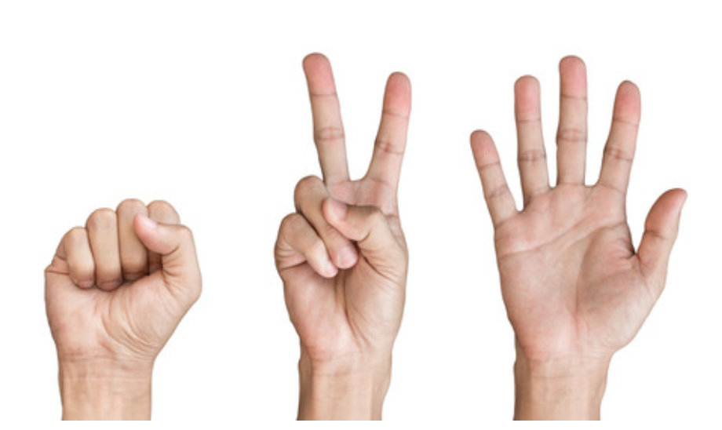
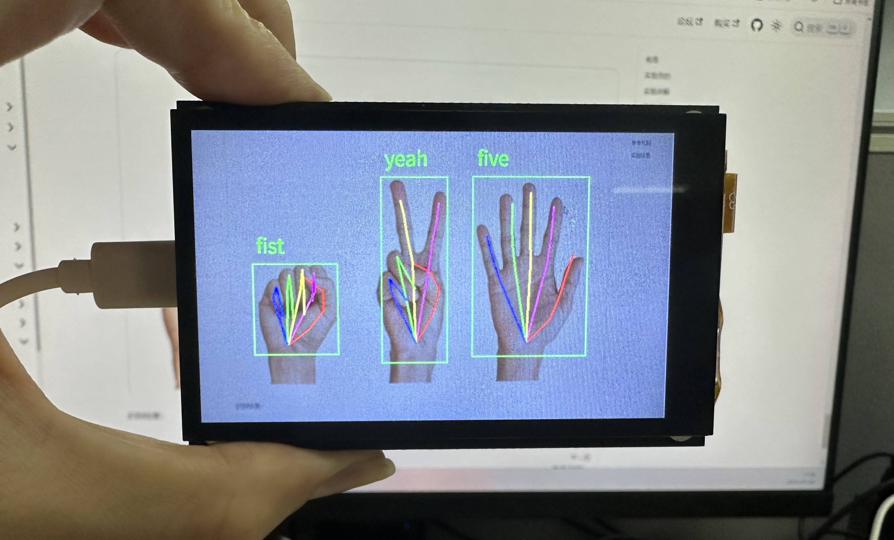

# 手掌关键点分类

## 前言

上一节我们学习过手掌关键点指的是5个手指的关节位置检测，本节进一步通过对关键点检测判断当前手势。

## 实验目的

检测摄像头拍摄到的画面中的手掌关键点实现手势分类并画图指示。

## 实验讲解

本实验通过CanMV K230 AI视觉框架开发，详细说明参考 [AI视觉开发框架](../ai_frame.md) 章节内容，这里不再重复。例程用到的模型已经存放在CanMV K230的文件系统，无需额外拷贝。

具体编程思路如下：

```mermaid
graph TD
    导入AI视觉框架相关模块  --> 加载相关模型 --> 初始化和配置相关模块 --> 获取摄像头图像 --> AI视觉推理查找图像中手掌关键点数据 --> 判读手势 --> 画图描绘 --> 获取摄像头图像;
```

## 参考代码

```python
'''
实验名称：手掌关键点分类
实验平台：01Studio CanMV K230
教程：wiki.01studio.cc
说明：可以通过display="xxx"参数选择"hdmi"、"lcd3_5"(3.5寸mipi屏)或"lcd2_4"(2.4寸mipi屏)显示方式
'''

from libs.PipeLine import PipeLine, ScopedTiming
from libs.AIBase import AIBase
from libs.AI2D import Ai2d
import os
import ujson
from media.media import *
from media.sensor import *
from time import *
import nncase_runtime as nn
import ulab.numpy as np
import time
import image
import aicube
import random
import gc
import sys

# 自定义手掌检测任务类
class HandDetApp(AIBase):
    def __init__(self,kmodel_path,labels,model_input_size,anchors,confidence_threshold=0.2,nms_threshold=0.5,nms_option=False, strides=[8,16,32],rgb888p_size=[1920,1080],display_size=[1920,1080],debug_mode=0):
        super().__init__(kmodel_path,model_input_size,rgb888p_size,debug_mode)
        # kmodel路径
        self.kmodel_path=kmodel_path
        self.labels=labels
        # 检测模型输入分辨率
        self.model_input_size=model_input_size
        # 置信度阈值
        self.confidence_threshold=confidence_threshold
        # nms阈值
        self.nms_threshold=nms_threshold
        # 锚框,目标检测任务使用
        self.anchors=anchors
        # 特征下采样倍数
        self.strides = strides
        # NMS选项，如果为True做类间NMS,如果为False做类内NMS
        self.nms_option = nms_option
        # sensor给到AI的图像分辨率，宽16字节对齐
        self.rgb888p_size=[ALIGN_UP(rgb888p_size[0],16),rgb888p_size[1]]
        # 视频输出VO分辨率，宽16字节对齐
        self.display_size=[ALIGN_UP(display_size[0],16),display_size[1]]
        # debug模式
        self.debug_mode=debug_mode
        # Ai2d实例用于实现预处理
        self.ai2d=Ai2d(debug_mode)
        # 设置ai2d的输入输出的格式和数据类型
        self.ai2d.set_ai2d_dtype(nn.ai2d_format.NCHW_FMT,nn.ai2d_format.NCHW_FMT,np.uint8, np.uint8)

    # 配置预处理操作，这里使用了pad和resize，Ai2d支持crop/shift/pad/resize/affine，具体代码请打开/sdcard/libs/AI2D.py查看
    def config_preprocess(self,input_image_size=None):
        with ScopedTiming("set preprocess config",self.debug_mode > 0):
            # 初始化ai2d预处理配置，默认为sensor给到AI的尺寸，可以通过设置input_image_size自行修改输入尺寸
            ai2d_input_size = input_image_size if input_image_size else self.rgb888p_size
            # 计算padding参数并应用pad操作，以确保输入图像尺寸与模型输入尺寸匹配
            top, bottom, left, right = self.get_padding_param()
            self.ai2d.pad([0, 0, 0, 0, top, bottom, left, right], 0, [114, 114, 114])
            # 使用双线性插值进行resize操作，调整图像尺寸以符合模型输入要求
            self.ai2d.resize(nn.interp_method.tf_bilinear, nn.interp_mode.half_pixel)
            # 构建预处理流程,参数为预处理输入tensor的shape和预处理输出的tensor的shape
            self.ai2d.build([1,3,ai2d_input_size[1],ai2d_input_size[0]],[1,3,self.model_input_size[1],self.model_input_size[0]])

    # 自定义当前任务的后处理，用于处理模型输出结果，这里使用了aicube库的anchorbasedet_post_process接口
    def postprocess(self,results):
        with ScopedTiming("postprocess",self.debug_mode > 0):
            dets = aicube.anchorbasedet_post_process(results[0], results[1], results[2], self.model_input_size, self.rgb888p_size, self.strides, len(self.labels), self.confidence_threshold, self.nms_threshold, self.anchors, self.nms_option)
            # 返回手掌检测结果
            return dets

    # 计算padding参数，确保输入图像尺寸与模型输入尺寸匹配
    def get_padding_param(self):
        # 根据目标宽度和高度计算比例因子
        dst_w = self.model_input_size[0]
        dst_h = self.model_input_size[1]
        input_width = self.rgb888p_size[0]
        input_high = self.rgb888p_size[1]
        ratio_w = dst_w / input_width
        ratio_h = dst_h / input_high
        # 选择较小的比例因子，以确保图像内容完整
        if ratio_w < ratio_h:
            ratio = ratio_w
        else:
            ratio = ratio_h
        # 计算新的宽度和高度
        new_w = int(ratio * input_width)
        new_h = int(ratio * input_high)
        # 计算宽度和高度的差值，并确定padding的位置
        dw = (dst_w - new_w) / 2
        dh = (dst_h - new_h) / 2
        top = int(round(dh - 0.1))
        bottom = int(round(dh + 0.1))
        left = int(round(dw - 0.1))
        right = int(round(dw + 0.1))
        return top, bottom, left, right

# 自定义手势关键点分类任务类
class HandKPClassApp(AIBase):
    def __init__(self,kmodel_path,model_input_size,rgb888p_size=[1920,1080],display_size=[1920,1080],debug_mode=0):
        super().__init__(kmodel_path,model_input_size,rgb888p_size,debug_mode)
        # kmodel路径
        self.kmodel_path=kmodel_path
        # 检测模型输入分辨率
        self.model_input_size=model_input_size
        # sensor给到AI的图像分辨率，宽16字节对齐
        self.rgb888p_size=[ALIGN_UP(rgb888p_size[0],16),rgb888p_size[1]]
        # 视频输出VO分辨率，宽16字节对齐
        self.display_size=[ALIGN_UP(display_size[0],16),display_size[1]]
        self.crop_params=[]
        # debug模式
        self.debug_mode=debug_mode
        # Ai2d实例用于实现预处理
        self.ai2d=Ai2d(debug_mode)
        # 设置ai2d的输入输出的格式和数据类型
        self.ai2d.set_ai2d_dtype(nn.ai2d_format.NCHW_FMT,nn.ai2d_format.NCHW_FMT,np.uint8, np.uint8)

    # 配置预处理操作，这里使用了crop和resize，Ai2d支持crop/shift/pad/resize/affine，具体代码请打开/sdcard/libs/AI2D.py查看
    def config_preprocess(self,det,input_image_size=None):
        with ScopedTiming("set preprocess config",self.debug_mode > 0):
            ai2d_input_size=input_image_size if input_image_size else self.rgb888p_size
            self.crop_params = self.get_crop_param(det)
            self.ai2d.crop(self.crop_params[0],self.crop_params[1],self.crop_params[2],self.crop_params[3])
            self.ai2d.resize(nn.interp_method.tf_bilinear, nn.interp_mode.half_pixel)
            self.ai2d.build([1,3,ai2d_input_size[1],ai2d_input_size[0]],[1,3,self.model_input_size[1],self.model_input_size[0]])

    # 自定义后处理，得到手掌手势结果和手掌关键点数据
    def postprocess(self,results):
        with ScopedTiming("postprocess",self.debug_mode > 0):
            results=results[0].reshape(results[0].shape[0]*results[0].shape[1])
            results_show = np.zeros(results.shape,dtype=np.int16)
            results_show[0::2] = results[0::2] * self.crop_params[3] + self.crop_params[0]
            results_show[1::2] = results[1::2] * self.crop_params[2] + self.crop_params[1]
            gesture=self.hk_gesture(results_show)
            results_show[0::2] = results_show[0::2] * (self.display_size[0] / self.rgb888p_size[0])
            results_show[1::2] = results_show[1::2] * (self.display_size[1] / self.rgb888p_size[1])
            return results_show,gesture

    # 计算crop参数
    def get_crop_param(self,det_box):
        x1, y1, x2, y2 = det_box[2],det_box[3],det_box[4],det_box[5]
        w,h= int(x2 - x1),int(y2 - y1)
        w_det = int(float(x2 - x1) * self.display_size[0] // self.rgb888p_size[0])
        h_det = int(float(y2 - y1) * self.display_size[1] // self.rgb888p_size[1])
        x_det = int(x1*self.display_size[0] // self.rgb888p_size[0])
        y_det = int(y1*self.display_size[1] // self.rgb888p_size[1])
        length = max(w, h)/2
        cx = (x1+x2)/2
        cy = (y1+y2)/2
        ratio_num = 1.26*length
        x1_kp = int(max(0,cx-ratio_num))
        y1_kp = int(max(0,cy-ratio_num))
        x2_kp = int(min(self.rgb888p_size[0]-1, cx+ratio_num))
        y2_kp = int(min(self.rgb888p_size[1]-1, cy+ratio_num))
        w_kp = int(x2_kp - x1_kp + 1)
        h_kp = int(y2_kp - y1_kp + 1)
        return [x1_kp, y1_kp, w_kp, h_kp]

    # 求两个vector之间的夹角
    def hk_vector_2d_angle(self,v1,v2):
        with ScopedTiming("hk_vector_2d_angle",self.debug_mode > 0):
            v1_x,v1_y,v2_x,v2_y = v1[0],v1[1],v2[0],v2[1]
            v1_norm = np.sqrt(v1_x * v1_x+ v1_y * v1_y)
            v2_norm = np.sqrt(v2_x * v2_x + v2_y * v2_y)
            dot_product = v1_x * v2_x + v1_y * v2_y
            cos_angle = dot_product/(v1_norm*v2_norm)
            angle = np.acos(cos_angle)*180/np.pi
            return angle

    # 根据手掌关键点检测结果判断手势类别
    def hk_gesture(self,results):
        with ScopedTiming("hk_gesture",self.debug_mode > 0):
            angle_list = []
            for i in range(5):
                angle = self.hk_vector_2d_angle([(results[0]-results[i*8+4]), (results[1]-results[i*8+5])],[(results[i*8+6]-results[i*8+8]),(results[i*8+7]-results[i*8+9])])
                angle_list.append(angle)
            thr_angle,thr_angle_thumb,thr_angle_s,gesture_str = 65.,53.,49.,None
            if 65535. not in angle_list:
                if (angle_list[0]>thr_angle_thumb)  and (angle_list[1]>thr_angle) and (angle_list[2]>thr_angle) and (angle_list[3]>thr_angle) and (angle_list[4]>thr_angle):
                    gesture_str = "fist"
                elif (angle_list[0]<thr_angle_s)  and (angle_list[1]<thr_angle_s) and (angle_list[2]<thr_angle_s) and (angle_list[3]<thr_angle_s) and (angle_list[4]<thr_angle_s):
                    gesture_str = "five"
                elif (angle_list[0]<thr_angle_s)  and (angle_list[1]<thr_angle_s) and (angle_list[2]>thr_angle) and (angle_list[3]>thr_angle) and (angle_list[4]>thr_angle):
                    gesture_str = "gun"
                elif (angle_list[0]<thr_angle_s)  and (angle_list[1]<thr_angle_s) and (angle_list[2]>thr_angle) and (angle_list[3]>thr_angle) and (angle_list[4]<thr_angle_s):
                    gesture_str = "love"
                elif (angle_list[0]>5)  and (angle_list[1]<thr_angle_s) and (angle_list[2]>thr_angle) and (angle_list[3]>thr_angle) and (angle_list[4]>thr_angle):
                    gesture_str = "one"
                elif (angle_list[0]<thr_angle_s)  and (angle_list[1]>thr_angle) and (angle_list[2]>thr_angle) and (angle_list[3]>thr_angle) and (angle_list[4]<thr_angle_s):
                    gesture_str = "six"
                elif (angle_list[0]>thr_angle_thumb)  and (angle_list[1]<thr_angle_s) and (angle_list[2]<thr_angle_s) and (angle_list[3]<thr_angle_s) and (angle_list[4]>thr_angle):
                    gesture_str = "three"
                elif (angle_list[0]<thr_angle_s)  and (angle_list[1]>thr_angle) and (angle_list[2]>thr_angle) and (angle_list[3]>thr_angle) and (angle_list[4]>thr_angle):
                    gesture_str = "thumbUp"
                elif (angle_list[0]>thr_angle_thumb)  and (angle_list[1]<thr_angle_s) and (angle_list[2]<thr_angle_s) and (angle_list[3]>thr_angle) and (angle_list[4]>thr_angle):
                    gesture_str = "yeah"
            return gesture_str

# 手掌关键点分类任务
class HandKeyPointClass:
    def __init__(self,hand_det_kmodel,hand_kp_kmodel,det_input_size,kp_input_size,labels,anchors,confidence_threshold=0.25,nms_threshold=0.3,nms_option=False,strides=[8,16,32],rgb888p_size=[1280,720],display_size=[1920,1080],debug_mode=0):
        # 手掌检测模型路径
        self.hand_det_kmodel=hand_det_kmodel
        # 手掌关键点模型路径
        self.hand_kp_kmodel=hand_kp_kmodel
        # 手掌检测模型输入分辨率
        self.det_input_size=det_input_size
        # 手掌关键点模型输入分辨率
        self.kp_input_size=kp_input_size
        self.labels=labels
        # anchors
        self.anchors=anchors
        # 置信度阈值
        self.confidence_threshold=confidence_threshold
        # nms阈值
        self.nms_threshold=nms_threshold
        self.nms_option=nms_option
        self.strides=strides
        # sensor给到AI的图像分辨率，宽16字节对齐
        self.rgb888p_size=[ALIGN_UP(rgb888p_size[0],16),rgb888p_size[1]]
        # 视频输出VO分辨率，宽16字节对齐
        self.display_size=[ALIGN_UP(display_size[0],16),display_size[1]]
        # debug_mode模式
        self.debug_mode=debug_mode
        self.hand_det=HandDetApp(self.hand_det_kmodel,self.labels,model_input_size=self.det_input_size,anchors=self.anchors,confidence_threshold=self.confidence_threshold,nms_threshold=self.nms_threshold,nms_option=self.nms_option,strides=self.strides,rgb888p_size=self.rgb888p_size,display_size=self.display_size,debug_mode=0)
        self.hand_kp=HandKPClassApp(self.hand_kp_kmodel,model_input_size=self.kp_input_size,rgb888p_size=self.rgb888p_size,display_size=self.display_size)
        self.hand_det.config_preprocess()

    # run函数
    def run(self,input_np):
        # 执行手掌检测
        det_boxes=self.hand_det.run(input_np)
        boxes=[]
        gesture_res=[]
        for det_box in det_boxes:
            # 对于检测到的每一个手掌执行关键点识别
            x1, y1, x2, y2 = det_box[2],det_box[3],det_box[4],det_box[5]
            w,h= int(x2 - x1),int(y2 - y1)
            if (h<(0.1*self.rgb888p_size[1])):
                continue
            if (w<(0.25*self.rgb888p_size[0]) and ((x1<(0.03*self.rgb888p_size[0])) or (x2>(0.97*self.rgb888p_size[0])))):
                continue
            if (w<(0.15*self.rgb888p_size[0]) and ((x1<(0.01*self.rgb888p_size[0])) or (x2>(0.99*self.rgb888p_size[0])))):
                continue
            self.hand_kp.config_preprocess(det_box)
            results_show,gesture=self.hand_kp.run(input_np)
            gesture_res.append((results_show,gesture))
            boxes.append(det_box)
        return boxes,gesture_res

    # 绘制效果，绘制关键点、手掌检测框和识别结果
    def draw_result(self,pl,dets,gesture_res):
        pl.osd_img.clear()
        if len(dets)>0:
            for k in range(len(dets)):
                det_box=dets[k]
                x1, y1, x2, y2 = det_box[2],det_box[3],det_box[4],det_box[5]
                w,h= int(x2 - x1),int(y2 - y1)
                if (h<(0.1*self.rgb888p_size[1])):
                    continue
                if (w<(0.25*self.rgb888p_size[0]) and ((x1<(0.03*self.rgb888p_size[0])) or (x2>(0.97*self.rgb888p_size[0])))):
                    continue
                if (w<(0.15*self.rgb888p_size[0]) and ((x1<(0.01*self.rgb888p_size[0])) or (x2>(0.99*self.rgb888p_size[0])))):
                    continue
                w_det = int(float(x2 - x1) * self.display_size[0] // self.rgb888p_size[0])
                h_det = int(float(y2 - y1) * self.display_size[1] // self.rgb888p_size[1])
                x_det = int(x1*self.display_size[0] // self.rgb888p_size[0])
                y_det = int(y1*self.display_size[1] // self.rgb888p_size[1])
                pl.osd_img.draw_rectangle(x_det, y_det, w_det, h_det, color=(255, 0, 255, 0), thickness = 2)

                results_show=gesture_res[k][0]
                for i in range(len(results_show)/2):
                    pl.osd_img.draw_circle(results_show[i*2], results_show[i*2+1], 1, color=(255, 0, 255, 0),fill=False)
                for i in range(5):
                    j = i*8
                    if i==0:
                        R = 255; G = 0; B = 0
                    if i==1:
                        R = 255; G = 0; B = 255
                    if i==2:
                        R = 255; G = 255; B = 0
                    if i==3:
                        R = 0; G = 255; B = 0
                    if i==4:
                        R = 0; G = 0; B = 255
                    pl.osd_img.draw_line(results_show[0], results_show[1], results_show[j+2], results_show[j+3], color=(255,R,G,B), thickness = 3)
                    pl.osd_img.draw_line(results_show[j+2], results_show[j+3], results_show[j+4], results_show[j+5], color=(255,R,G,B), thickness = 3)
                    pl.osd_img.draw_line(results_show[j+4], results_show[j+5], results_show[j+6], results_show[j+7], color=(255,R,G,B), thickness = 3)
                    pl.osd_img.draw_line(results_show[j+6], results_show[j+7], results_show[j+8], results_show[j+9], color=(255,R,G,B), thickness = 3)

                gesture_str=gesture_res[k][1]
                pl.osd_img.draw_string_advanced( x_det , y_det-50,32, " " + str(gesture_str), color=(255,0, 255, 0))


if __name__=="__main__":

    # 显示模式，可以选择"hdmi"、"lcd3_5"(3.5寸mipi屏)和"lcd2_4"(2.4寸mipi屏)

    display="lcd3_5"

    if display=="hdmi":
        display_mode='hdmi'
        display_size=[1920,1080]
        rgb888p_size = [1920, 1080]

    elif display=="lcd3_5":
        display_mode= 'st7701'
        display_size=[800,480]
        rgb888p_size = [1920, 1080]

    elif display=="lcd2_4":
        display_mode= 'st7701'
        display_size=[640,480]
        rgb888p_size = [1280, 960] #2.4寸屏摄像头画面比例为4:3

    # 手掌检测模型路径
    hand_det_kmodel_path="/sdcard/examples/kmodel/hand_det.kmodel"
    # 手掌关键点模型路径
    hand_kp_kmodel_path="/sdcard/examples/kmodel/handkp_det.kmodel"
    # 其他参数
    anchors_path="/sdcard/examples/utils/prior_data_320.bin"

    hand_det_input_size=[512,512]
    hand_kp_input_size=[256,256]
    confidence_threshold=0.2
    nms_threshold=0.5
    labels=["hand"]
    anchors = [26,27, 53,52, 75,71, 80,99, 106,82, 99,134, 140,113, 161,172, 245,276]

    # 初始化PipeLine，只关注传给AI的图像分辨率，显示的分辨率
    pl=PipeLine(rgb888p_size=rgb888p_size,display_size=display_size,display_mode=display_mode)

    pl.create(Sensor(width=rgb888p_size[0], height=rgb888p_size[1]))  # 创建PipeLine实例

    hkc=HandKeyPointClass(hand_det_kmodel_path,hand_kp_kmodel_path,det_input_size=hand_det_input_size,kp_input_size=hand_kp_input_size,labels=labels,anchors=anchors,confidence_threshold=confidence_threshold,nms_threshold=nms_threshold,nms_option=False,strides=[8,16,32],rgb888p_size=rgb888p_size,display_size=display_size)

    clock = time.clock()

    while True:

        clock.tick()

        img=pl.get_frame()                          # 获取当前帧
        det_boxes,gesture_res=hkc.run(img)          # 推理当前帧
        hkc.draw_result(pl,det_boxes,gesture_res)   # 绘制当前帧推理结果
        print(det_boxes,gesture_res)
        pl.show_image()                             # 展示推理结果
        gc.collect()

        print(clock.fps()) #打印帧率

```

这里对关键代码进行讲解：

- 设置显示方式：
    通过改变`display`的参数选择 `hdmi` 或 `lcd`（3.5寸mipi显示屏）显示图像。
```python
    ...

    # 显示模式，可以选择"hdmi"、"lcd3_5"(3.5寸mipi屏)和"lcd2_4"(2.4寸mipi屏)

    display="lcd3_5"

    if display=="hdmi":
        display_mode='hdmi'
        display_size=[1920,1080]
        rgb888p_size = [1920, 1080]

    elif display=="lcd3_5":
        display_mode= 'st7701'
        display_size=[800,480]
        rgb888p_size = [1920, 1080]

    elif display=="lcd2_4":
        display_mode= 'st7701'
        display_size=[640,480]
        rgb888p_size = [1280, 960] #2.4寸屏摄像头画面比例为4:3
    ...    
```

- 主函数代码：

可以看到使用默认配置后只使用了4行代码便实现了**获取当前帧图像、AI推理、绘制结果、显示结果** 的识别流程。

代码中`det_boxes`变量为手掌结果， `gesture_res`为识别手势判断结果。

```python
    ...
    while True:

        clock.tick()

        img=pl.get_frame()                          # 获取当前帧
        det_boxes,gesture_res=hkc.run(img)          # 推理当前帧
        hkc.draw_result(pl,det_boxes,gesture_res)   # 绘制当前帧推理结果
        print(det_boxes,gesture_res)
        pl.show_image()                             # 展示推理结果
        gc.collect()

        print(clock.fps()) #打印帧率
    ...
```

## 实验结果

运行代码，将摄像头正对下图手掌，可以看到判断出不同的手势结果。

原图：



识别结果：




