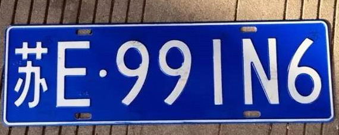

# 车牌识别

## 前言

上一节我们学习了将图像中的车牌找出来，并使用矩形框画图指示，这节我们来对找出的车牌进行车牌内容识别。

## 实验目的

识别摄像头拍摄到的画面中的车牌内容并通过写字符和画图指示。

## 实验讲解

本实验通过CanMV K230 AI视觉框架开发，详细说明参考 [AI视觉开发框架](../ai_frame.md) 章节内容，这里不再重复。例程用到的模型已经存放在CanMV K230的文件系统，无需额外拷贝。

具体编程思路如下：

```mermaid
graph TD
    导入AI视觉框架相关模块  --> 加载相关模型 --> 初始化和配置相关模块 --> 获取摄像头图像 --> AI视觉推理查找图像中车牌 --> 识别车牌内容 --> 画图描绘 --> 获取摄像头图像;
```

## 参考代码

```python
'''
实验名称：车牌识别
实验平台：01Studio CanMV K230
教程：wiki.01studio.cc
'''

from libs.PipeLine import PipeLine, ScopedTiming
from libs.AIBase import AIBase
from libs.AI2D import Ai2d
import os
import ujson
from media.media import *
from time import *
import nncase_runtime as nn
import ulab.numpy as np
import time
import image
import aidemo
import random
import gc
import sys

# 自定义车牌检测类
class LicenceDetectionApp(AIBase):
    # 初始化函数，设置车牌检测应用的参数
    def __init__(self, kmodel_path, model_input_size, confidence_threshold=0.5, nms_threshold=0.2, rgb888p_size=[224,224], display_size=[1920,1080], debug_mode=0):
        super().__init__(kmodel_path, model_input_size, rgb888p_size, debug_mode)  # 调用基类的初始化函数
        self.kmodel_path = kmodel_path  # 模型路径
        # 模型输入分辨率
        self.model_input_size = model_input_size
        # 分类阈值
        self.confidence_threshold = confidence_threshold
        self.nms_threshold = nms_threshold
        # sensor给到AI的图像分辨率
        self.rgb888p_size = [ALIGN_UP(rgb888p_size[0], 16), rgb888p_size[1]]
        # 显示分辨率
        self.display_size = [ALIGN_UP(display_size[0], 16), display_size[1]]
        self.debug_mode = debug_mode
        # Ai2d实例，用于实现模型预处理
        self.ai2d = Ai2d(debug_mode)
        # 设置Ai2d的输入输出格式和类型
        self.ai2d.set_ai2d_dtype(nn.ai2d_format.NCHW_FMT, nn.ai2d_format.NCHW_FMT, np.uint8, np.uint8)

    # 配置预处理操作，这里使用了pad和resize，Ai2d支持crop/shift/pad/resize/affine
    def config_preprocess(self, input_image_size=None):
        with ScopedTiming("set preprocess config", self.debug_mode > 0):
            # 初始化ai2d预处理配置，默认为sensor给到AI的尺寸，可以通过设置input_image_size自行修改输入尺寸
            ai2d_input_size = input_image_size if input_image_size else self.rgb888p_size
            self.ai2d.resize(nn.interp_method.tf_bilinear, nn.interp_mode.half_pixel)
            self.ai2d.build([1,3,ai2d_input_size[1],ai2d_input_size[0]],[1,3,self.model_input_size[1],self.model_input_size[0]])

    # 自定义当前任务的后处理
    def postprocess(self, results):
        with ScopedTiming("postprocess", self.debug_mode > 0):
            # 对检测结果进行后处理
            det_res = aidemo.licence_det_postprocess(results, [self.rgb888p_size[1], self.rgb888p_size[0]], self.model_input_size, self.confidence_threshold, self.nms_threshold)
            return det_res

# 自定义车牌识别任务类
class LicenceRecognitionApp(AIBase):
    def __init__(self,kmodel_path,model_input_size,rgb888p_size=[1920,1080],display_size=[1920,1080],debug_mode=0):
        super().__init__(kmodel_path,model_input_size,rgb888p_size,debug_mode)
        # kmodel路径
        self.kmodel_path=kmodel_path
        # 检测模型输入分辨率
        self.model_input_size=model_input_size
        # sensor给到AI的图像分辨率，宽16字节对齐
        self.rgb888p_size=[ALIGN_UP(rgb888p_size[0],16),rgb888p_size[1]]
        # 视频输出VO分辨率，宽16字节对齐
        self.display_size=[ALIGN_UP(display_size[0],16),display_size[1]]
        # debug模式
        self.debug_mode=debug_mode
        # 车牌字符字典
        self.dict_rec = ["挂", "使", "领", "澳", "港", "皖", "沪", "津", "渝", "冀", "晋", "蒙", "辽", "吉", "黑", "苏", "浙", "京", "闽", "赣", "鲁", "豫", "鄂", "湘", "粤", "桂", "琼", "川", "贵", "云", "藏", "陕", "甘", "青", "宁", "新", "警", "学", "0", "1", "2", "3", "4", "5", "6", "7", "8", "9", "A", "B", "C", "D", "E", "F", "G", "H", "J", "K", "L", "M", "N", "P", "Q", "R", "S", "T", "U", "V", "W", "X", "Y", "Z", "_", "-"]
        self.dict_size = len(self.dict_rec)
        self.ai2d=Ai2d(debug_mode)
        self.ai2d.set_ai2d_dtype(nn.ai2d_format.NCHW_FMT,nn.ai2d_format.NCHW_FMT,np.uint8, np.uint8)

    # 配置预处理操作，这里使用了resize，Ai2d支持crop/shift/pad/resize/affine
    def config_preprocess(self,input_image_size=None):
        with ScopedTiming("set preprocess config",self.debug_mode > 0):
            ai2d_input_size=input_image_size if input_image_size else self.rgb888p_size
            self.ai2d.resize(nn.interp_method.tf_bilinear, nn.interp_mode.half_pixel)
            self.ai2d.build([1,3,ai2d_input_size[1],ai2d_input_size[0]],[1,3,self.model_input_size[1],self.model_input_size[0]])

    # 自定义后处理，results是模型输出的array列表
    def postprocess(self,results):
        with ScopedTiming("postprocess",self.debug_mode > 0):
            output_data=results[0].reshape((-1,self.dict_size))
            max_indices = np.argmax(output_data, axis=1)
            result_str = ""
            for i in range(max_indices.shape[0]):
                index = max_indices[i]
                if index > 0 and (i == 0 or index != max_indices[i - 1]):
                    result_str += self.dict_rec[index - 1]
            return result_str

# 车牌识别任务类
class LicenceRec:
    def __init__(self,licence_det_kmodel,licence_rec_kmodel,det_input_size,rec_input_size,confidence_threshold=0.25,nms_threshold=0.3,rgb888p_size=[1920,1080],display_size=[1920,1080],debug_mode=0):
        # 车牌检测模型路径
        self.licence_det_kmodel=licence_det_kmodel
        # 车牌识别模型路径
        self.licence_rec_kmodel=licence_rec_kmodel
        # 人脸检测模型输入分辨率
        self.det_input_size=det_input_size
        # 人脸姿态模型输入分辨率
        self.rec_input_size=rec_input_size
        # 置信度阈值
        self.confidence_threshold=confidence_threshold
        # nms阈值
        self.nms_threshold=nms_threshold
        # sensor给到AI的图像分辨率，宽16字节对齐
        self.rgb888p_size=[ALIGN_UP(rgb888p_size[0],16),rgb888p_size[1]]
        # 视频输出VO分辨率，宽16字节对齐
        self.display_size=[ALIGN_UP(display_size[0],16),display_size[1]]
        # debug_mode模式
        self.debug_mode=debug_mode
        self.licence_det=LicenceDetectionApp(self.licence_det_kmodel,model_input_size=self.det_input_size,confidence_threshold=self.confidence_threshold,nms_threshold=self.nms_threshold,rgb888p_size=self.rgb888p_size,display_size=self.display_size,debug_mode=0)
        self.licence_rec=LicenceRecognitionApp(self.licence_rec_kmodel,model_input_size=self.rec_input_size,rgb888p_size=self.rgb888p_size)
        self.licence_det.config_preprocess()

    # run函数
    def run(self,input_np):
        # 执行车牌检测
        det_boxes=self.licence_det.run(input_np)
        # 将车牌部分抠出来
        imgs_array_boxes = aidemo.ocr_rec_preprocess(input_np,[self.rgb888p_size[1],self.rgb888p_size[0]],det_boxes)
        imgs_array = imgs_array_boxes[0]
        boxes = imgs_array_boxes[1]
        rec_res = []
        for img_array in imgs_array:
            # 对每一个检测到的车牌进行识别
            self.licence_rec.config_preprocess(input_image_size=[img_array.shape[3],img_array.shape[2]])
            licence_str=self.licence_rec.run(img_array)
            rec_res.append(licence_str)
            gc.collect()
        return det_boxes,rec_res

    # 绘制车牌检测识别效果
    def draw_result(self,pl,det_res,rec_res):
        pl.osd_img.clear()
        if det_res:
            point_8 = np.zeros((8),dtype=np.int16)
            for det_index in range(len(det_res)):
                for i in range(4):
                    x = det_res[det_index][i * 2 + 0]/self.rgb888p_size[0]*self.display_size[0]
                    y = det_res[det_index][i * 2 + 1]/self.rgb888p_size[1]*self.display_size[1]
                    point_8[i * 2 + 0] = int(x)
                    point_8[i * 2 + 1] = int(y)
                for i in range(4):
                    pl.osd_img.draw_line(point_8[i * 2 + 0],point_8[i * 2 + 1],point_8[(i+1) % 4 * 2 + 0],point_8[(i+1) % 4 * 2 + 1],color=(255, 0, 255, 0),thickness=4)
                pl.osd_img.draw_string_advanced( point_8[6], point_8[7] + 20, 40,rec_res[det_index] , color=(255,255,153,18))


if __name__=="__main__":
    # 显示模式，默认"hdmi",可以选择"hdmi"和"lcd"
    display_mode="lcd"
    if display_mode=="hdmi":
        display_size=[1920,1080]
    else:
        display_size=[800,480]
    # 车牌检测模型路径
    licence_det_kmodel_path="/sdcard/examples/kmodel/LPD_640.kmodel"
    # 车牌识别模型路径
    licence_rec_kmodel_path="/sdcard/examples/kmodel/licence_reco.kmodel"
    # 其它参数
    rgb888p_size=[640,360]
    licence_det_input_size=[640,640]
    licence_rec_input_size=[220,32]
    confidence_threshold=0.2
    nms_threshold=0.2

    # 初始化PipeLine，只关注传给AI的图像分辨率，显示的分辨率
    pl=PipeLine(rgb888p_size=rgb888p_size,display_size=display_size,display_mode=display_mode)
    pl.create()
    lr=LicenceRec(licence_det_kmodel_path,licence_rec_kmodel_path,det_input_size=licence_det_input_size,rec_input_size=licence_rec_input_size,confidence_threshold=confidence_threshold,nms_threshold=nms_threshold,rgb888p_size=rgb888p_size,display_size=display_size)

    clock = time.clock()

    while True:

        clock.tick()
        img=pl.get_frame()                  # 获取当前帧
        det_res,rec_res=lr.run(img)         # 推理当前帧
        lr.draw_result(pl,det_res,rec_res)  # 绘制当前帧推理结果
        print(det_res,rec_res)              # 打印结果
        pl.show_image()                     # 展示推理结果
        gc.collect()

        print(clock.fps()) #打印帧率
```

这里对关键代码进行讲解：

- 主函数代码：

可以看到使用默认配置后只使用了4行代码便实现了**获取当前帧图像、AI推理、绘制结果、显示结果** 的识别流程。

代码中 `det_res`为车牌检测结果， `rec_res`为车牌识别内容结果。

```python
    ...
    while True:

        clock.tick()
        img=pl.get_frame()                  # 获取当前帧
        det_res,rec_res=lr.run(img)         # 推理当前帧
        lr.draw_result(pl,det_res,rec_res)  # 绘制当前帧推理结果
        print(det_res,rec_res)
        pl.show_image()                     # 展示推理结果
        gc.collect()

        print(clock.fps()) #打印帧率
    ...
```

## 实验结果

运行代码，将摄像头正对下图车牌。

原图：



识别结果：


