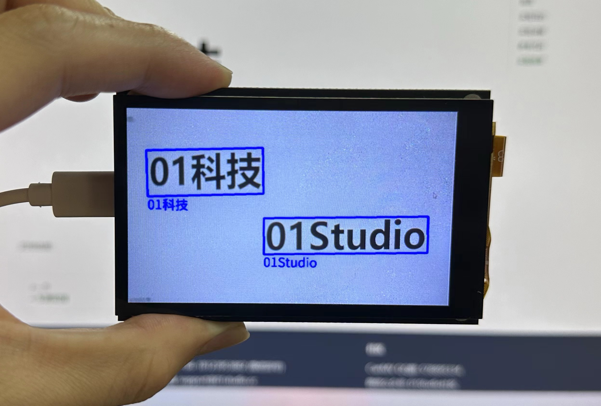

# 字符识别（OCR）

## 前言

OCR （Optical Character Recognition，光学字符识别）是指电子设备（例如扫描仪或数码相机）检查纸上打印的字符，通过检测暗、亮的模式确定其形状，然后用字符识别方法将形状翻译成计算机文字的过程。

## 实验目的

编程实现图片中的字符识别（支持中文和英文）。

## 实验讲解

本实验通过CanMV K230 AI视觉框架开发，详细说明参考 [AI视觉开发框架](./ai_frame.md) 章节内容，这里不再重复。例程用到的模型已经存放在CanMV K230的文件系统，无需额外拷贝。

具体编程思路如下：

```mermaid
graph TD
    导入AI视觉框架相关模块  --> 加载相关模型 --> 初始化和配置相关模块 --> 获取摄像头图像 --> 进行字符识别并将结果画图指示 --> 获取摄像头图像;
```

## 参考代码

```python
'''
实验名称：字符识别（OCR）
实验平台：01Studio CanMV K230
教程：wiki.01studio.cc
'''

from libs.PipeLine import PipeLine, ScopedTiming
from libs.AIBase import AIBase
from libs.AI2D import Ai2d
import os
import ujson
from media.media import *
from time import *
import nncase_runtime as nn
import ulab.numpy as np
import time
import image
import aicube
import random
import gc
import sys

# 自定义OCR检测类
class OCRDetectionApp(AIBase):
    def __init__(self,kmodel_path,model_input_size,mask_threshold=0.5,box_threshold=0.2,rgb888p_size=[224,224],display_size=[1920,1080],debug_mode=0):
        super().__init__(kmodel_path,model_input_size,rgb888p_size,debug_mode)
        self.kmodel_path=kmodel_path
        # 模型输入分辨率
        self.model_input_size=model_input_size
        # 分类阈值
        self.mask_threshold=mask_threshold
        self.box_threshold=box_threshold
        # sensor给到AI的图像分辨率
        self.rgb888p_size=[ALIGN_UP(rgb888p_size[0],16),rgb888p_size[1]]
        # 显示分辨率
        self.display_size=[ALIGN_UP(display_size[0],16),display_size[1]]
        self.debug_mode=debug_mode
        # Ai2d实例，用于实现模型预处理
        self.ai2d=Ai2d(debug_mode)
        # 设置Ai2d的输入输出格式和类型
        self.ai2d.set_ai2d_dtype(nn.ai2d_format.NCHW_FMT,nn.ai2d_format.NCHW_FMT,np.uint8, np.uint8)

    # 配置预处理操作，这里使用了pad和resize，Ai2d支持crop/shift/pad/resize/affine，具体代码请打开/sdcard/app/libs/AI2D.py查看
    def config_preprocess(self,input_image_size=None):
        with ScopedTiming("set preprocess config",self.debug_mode > 0):
            # 初始化ai2d预处理配置，默认为sensor给到AI的尺寸，您可以通过设置input_image_size自行修改输入尺寸
            ai2d_input_size=input_image_size if input_image_size else self.rgb888p_size
            top,bottom,left,right=self.get_padding_param()
            self.ai2d.pad([0,0,0,0,top,bottom,left,right], 0, [0,0,0])
            self.ai2d.resize(nn.interp_method.tf_bilinear, nn.interp_mode.half_pixel)
            self.ai2d.build([1,3,ai2d_input_size[1],ai2d_input_size[0]],[1,3,self.model_input_size[1],self.model_input_size[0]])

    # 自定义当前任务的后处理
    def postprocess(self,results):
        with ScopedTiming("postprocess",self.debug_mode > 0):
            # chw2hwc
            hwc_array=self.chw2hwc(self.cur_img)
            # 这里使用了aicube封装的接口ocr_post_process做后处理,返回的det_boxes结构为[[crop_array_nhwc,[p1_x,p1_y,p2_x,p2_y,p3_x,p3_y,p4_x,p4_y]],...]
            det_boxes = aicube.ocr_post_process(results[0][:,:,:,0].reshape(-1), hwc_array.reshape(-1),self.model_input_size,self.rgb888p_size, self.mask_threshold, self.box_threshold)
            return det_boxes

    # 计算padding参数
    def get_padding_param(self):
        # 右padding或下padding
        dst_w = self.model_input_size[0]
        dst_h = self.model_input_size[1]
        input_width = self.rgb888p_size[0]
        input_high = self.rgb888p_size[1]
        ratio_w = dst_w / input_width
        ratio_h = dst_h / input_high
        if ratio_w < ratio_h:
            ratio = ratio_w
        else:
            ratio = ratio_h
        new_w = (int)(ratio * input_width)
        new_h = (int)(ratio * input_high)
        dw = (dst_w - new_w) / 2
        dh = (dst_h - new_h) / 2
        top = (int)(round(0))
        bottom = (int)(round(dh * 2 + 0.1))
        left = (int)(round(0))
        right = (int)(round(dw * 2 - 0.1))
        return  top, bottom, left, right

    # chw2hwc
    def chw2hwc(self,features):
        ori_shape = (features.shape[0], features.shape[1], features.shape[2])
        c_hw_ = features.reshape((ori_shape[0], ori_shape[1] * ori_shape[2]))
        hw_c_ = c_hw_.transpose()
        new_array = hw_c_.copy()
        hwc_array = new_array.reshape((ori_shape[1], ori_shape[2], ori_shape[0]))
        del c_hw_
        del hw_c_
        del new_array
        return hwc_array

# 自定义OCR识别任务类
class OCRRecognitionApp(AIBase):
    def __init__(self,kmodel_path,model_input_size,dict_path,rgb888p_size=[1920,1080],display_size=[1920,1080],debug_mode=0):
        super().__init__(kmodel_path,model_input_size,rgb888p_size,debug_mode)
        # kmodel路径
        self.kmodel_path=kmodel_path
        # 识别模型输入分辨率
        self.model_input_size=model_input_size
        self.dict_path=dict_path
        # sensor给到AI的图像分辨率，宽16字节对齐
        self.rgb888p_size=[ALIGN_UP(rgb888p_size[0],16),rgb888p_size[1]]
        # 视频输出VO分辨率，宽16字节对齐
        self.display_size=[ALIGN_UP(display_size[0],16),display_size[1]]
        # debug模式
        self.debug_mode=debug_mode
        self.dict_word=None
        # 读取OCR的字典
        self.read_dict()
        self.ai2d=Ai2d(debug_mode)
        self.ai2d.set_ai2d_dtype(nn.ai2d_format.RGB_packed,nn.ai2d_format.NCHW_FMT,np.uint8, np.uint8)

    # 配置预处理操作，这里使用了pad和resize，Ai2d支持crop/shift/pad/resize/affine，具体代码请打开/sdcard/app/libs/AI2D.py查看
    def config_preprocess(self,input_image_size=None,input_np=None):
        with ScopedTiming("set preprocess config",self.debug_mode > 0):
            ai2d_input_size=input_image_size if input_image_size else self.rgb888p_size
            top,bottom,left,right=self.get_padding_param(ai2d_input_size,self.model_input_size)
            self.ai2d.pad([0,0,0,0,top,bottom,left,right], 0, [0,0,0])
            self.ai2d.resize(nn.interp_method.tf_bilinear, nn.interp_mode.half_pixel)
            # 如果传入input_np，输入shape为input_np的shape,如果不传入，输入shape为[1,3,ai2d_input_size[1],ai2d_input_size[0]]
            self.ai2d.build([input_np.shape[0],input_np.shape[1],input_np.shape[2],input_np.shape[3]],[1,3,self.model_input_size[1],self.model_input_size[0]])

    # 自定义后处理，results是模型输出的array列表
    def postprocess(self,results):
        with ScopedTiming("postprocess",self.debug_mode > 0):
            preds = np.argmax(results[0], axis=2).reshape((-1))
            output_txt = ""
            for i in range(len(preds)):
                # 当前识别字符不是字典的最后一个字符并且和前一个字符不重复（去重），加入识别结果字符串
                if preds[i] != (len(self.dict_word) - 1) and (not (i > 0 and preds[i - 1] == preds[i])):
                    output_txt = output_txt + self.dict_word[preds[i]]
            return output_txt

    # 计算padding参数
    def get_padding_param(self,src_size,dst_size):
        # 右padding或下padding
        dst_w = dst_size[0]
        dst_h = dst_size[1]
        input_width = src_size[0]
        input_high = src_size[1]
        ratio_w = dst_w / input_width
        ratio_h = dst_h / input_high
        if ratio_w < ratio_h:
            ratio = ratio_w
        else:
            ratio = ratio_h
        new_w = (int)(ratio * input_width)
        new_h = (int)(ratio * input_high)
        dw = (dst_w - new_w) / 2
        dh = (dst_h - new_h) / 2
        top = (int)(round(0))
        bottom = (int)(round(dh * 2 + 0.1))
        left = (int)(round(0))
        right = (int)(round(dw * 2 - 0.1))
        return  top, bottom, left, right

    def read_dict(self):
        if self.dict_path!="":
            with open(dict_path, 'r') as file:
                line_one = file.read(100000)
                line_list = line_one.split("\r\n")
            self.dict_word = {num: char.replace("\r", "").replace("\n", "") for num, char in enumerate(line_list)}


class OCRDetRec:
    def __init__(self,ocr_det_kmodel,ocr_rec_kmodel,det_input_size,rec_input_size,dict_path,mask_threshold=0.25,box_threshold=0.3,rgb888p_size=[1920,1080],display_size=[1920,1080],debug_mode=0):
        # OCR检测模型路径
        self.ocr_det_kmodel=ocr_det_kmodel
        # OCR识别模型路径
        self.ocr_rec_kmodel=ocr_rec_kmodel
        # OCR检测模型输入分辨率
        self.det_input_size=det_input_size
        # OCR识别模型输入分辨率
        self.rec_input_size=rec_input_size
        # 字典路径
        self.dict_path=dict_path
        # 置信度阈值
        self.mask_threshold=mask_threshold
        # nms阈值
        self.box_threshold=box_threshold
        # sensor给到AI的图像分辨率，宽16字节对齐
        self.rgb888p_size=[ALIGN_UP(rgb888p_size[0],16),rgb888p_size[1]]
        # 视频输出VO分辨率，宽16字节对齐
        self.display_size=[ALIGN_UP(display_size[0],16),display_size[1]]
        # debug_mode模式
        self.debug_mode=debug_mode
        self.ocr_det=OCRDetectionApp(self.ocr_det_kmodel,model_input_size=self.det_input_size,mask_threshold=self.mask_threshold,box_threshold=self.box_threshold,rgb888p_size=self.rgb888p_size,display_size=self.display_size,debug_mode=0)
        self.ocr_rec=OCRRecognitionApp(self.ocr_rec_kmodel,model_input_size=self.rec_input_size,dict_path=self.dict_path,rgb888p_size=self.rgb888p_size,display_size=self.display_size)
        self.ocr_det.config_preprocess()

    # run函数
    def run(self,input_np):
        # 先进行OCR检测
        det_res=self.ocr_det.run(input_np)
        boxes=[]
        ocr_res=[]
        for det in det_res:
            # 对得到的每个检测框执行OCR识别
            self.ocr_rec.config_preprocess(input_image_size=[det[0].shape[2],det[0].shape[1]],input_np=det[0])
            ocr_str=self.ocr_rec.run(det[0])
            ocr_res.append(ocr_str)
            boxes.append(det[1])
            gc.collect()
        return boxes,ocr_res

    # 绘制OCR检测识别效果
    def draw_result(self,pl,det_res,rec_res):
        pl.osd_img.clear()
        if det_res:
            # 循环绘制所有检测到的框
            for j in range(len(det_res)):
                # 将原图的坐标点转换成显示的坐标点，循环绘制四条直线，得到一个矩形框
                for i in range(4):
                    x1 = det_res[j][(i * 2)] / self.rgb888p_size[0] * self.display_size[0]
                    y1 = det_res[j][(i * 2 + 1)] / self.rgb888p_size[1] * self.display_size[1]
                    x2 = det_res[j][((i + 1) * 2) % 8] / self.rgb888p_size[0] * self.display_size[0]
                    y2 = det_res[j][((i + 1) * 2 + 1) % 8] / self.rgb888p_size[1] * self.display_size[1]
                    pl.osd_img.draw_line((int(x1), int(y1), int(x2), int(y2)), color=(255, 0, 0, 255),thickness=5)
                pl.osd_img.draw_string_advanced(int(x1),int(y1),32,rec_res[j],color=(0,0,255))


if __name__=="__main__":
    # 显示模式，默认"hdmi",可以选择"hdmi"和"lcd"
    display_mode="lcd"
    if display_mode=="hdmi":
        display_size=[1920,1080]
    else:
        display_size=[800,480]
    # OCR检测模型路径
    ocr_det_kmodel_path="/sdcard/app/tests/kmodel/ocr_det_int16.kmodel"
    # OCR识别模型路径
    ocr_rec_kmodel_path="/sdcard/app/tests/kmodel/ocr_rec_int16.kmodel"
    # 其他参数
    dict_path="/sdcard/app/tests/utils/dict.txt"
    rgb888p_size=[640,360]
    ocr_det_input_size=[640,640]
    ocr_rec_input_size=[512,32]
    mask_threshold=0.25
    box_threshold=0.3

    # 初始化PipeLine，只关注传给AI的图像分辨率，显示的分辨率
    pl=PipeLine(rgb888p_size=rgb888p_size,display_size=display_size,display_mode=display_mode)
    pl.create()
    ocr=OCRDetRec(ocr_det_kmodel_path,ocr_rec_kmodel_path,det_input_size=ocr_det_input_size,rec_input_size=ocr_rec_input_size,dict_path=dict_path,mask_threshold=mask_threshold,box_threshold=box_threshold,rgb888p_size=rgb888p_size,display_size=display_size)

    clock = time.clock()

    try:
        while True:

            os.exitpoint()

            clock.tick()

            img=pl.get_frame()                  # 获取当前帧
            det_res,rec_res=ocr.run(img)        # 推理当前帧
            ocr.draw_result(pl,det_res,rec_res) # 绘制当前帧推理结果
            print(det_res,rec_res)              # 打印结果
            pl.show_image()                     # 展示当前帧推理结果
            gc.collect()

            print(clock.fps()) #打印帧率

    except Exception as e:
        sys.print_exception(e)
    finally:
        ocr.ocr_det.deinit()
        ocr.ocr_rec.deinit()
        pl.destroy()
```

这里对关键代码进行讲解：

- 主函数代码：

可以看到使用默认配置后只使用了4行代码便实现了**获取当前帧图像、AI推理、绘制结果、显示结果** 的识别流程。

代码中 `det_res`为字符位置检测结果， `rec_res`为字符识别内容结果。

```python
        ...
        while True:

            os.exitpoint()

            clock.tick()

            img=pl.get_frame()                  # 获取当前帧
            det_res,rec_res=ocr.run(img)        # 推理当前帧
            ocr.draw_result(pl,det_res,rec_res) # 绘制当前帧推理结果
            print(det_res,rec_res)              # 打印结果
            pl.show_image()                     # 展示当前帧推理结果
            gc.collect()

            print(clock.fps()) #打印帧率
        ...
```

## 实验结果

在CanMV IDE中运行上述代码，将摄像头正对下方字符。

原图：


识别结果：


